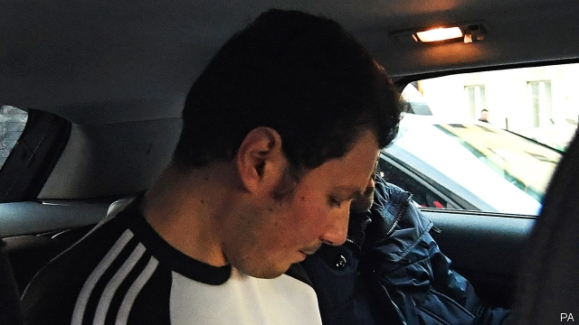

###### Ghost of the Camorra

# Italy arrests a fugitive “Gomorrah” gangster 

##### Carabinieri nab “Il Fantasma”, the country’s second-most-wanted mafioso 

 

> Mar 7th 2019 

MARCO DI LAURO, otherwise known as “F4” or Il Fantasma (“The Ghost”), was sitting eating pasta when police broke into the cramped apartment he shared with his partner. Around 150 operatives from all three Italian national police forces had been assigned to the raid on March 2nd—a measure of the importance given to ensuring The Ghost did not vanish yet again. 

Mr Di Lauro had been in hiding for 15 years. That made him one of Italy’s four most-wanted mobsters and the longest-standing fugitive of the Camorra, the Neapolitan mafia. His elusiveness was an affront to the state, made all the more humiliating by the celebrity status he and his family had acquired. 

The boyish-looking Mr Di Lauro was the fourth son (figlio in Italian, hence “F4”) of Paolo Di Lauro, whose family’s bloody history inspired “Gomorrah”, an internationally successful television series. The Di Lauro clan supplied the narcotics that turned its territory, centred on a vast housing project in the suburb of Scampia, into perhaps the biggest drugs outlet in Europe. At its height, turnover was estimated at €300m ($339m) a month. Such riches prompted a split in the clan and the first of two mafia feuds, in which scores of people have since died—some unconnected with either warring faction. According to a hit man who turned state’s evidence in 2017, the head of one of the victims was cut off to be used as a football by the boss who had ordered his killing. 

Legends enveloped the missing Mr Di Lauro. Some fancied they had seen him disguised as a woman; others said he was in Dubai. Yet he turned out to be living just outside his family’s turf, near an underground station on a line that ends at Scampia. Such brazenness suggests that, although the Di Lauro clan has lost its grip on the city’s drugs trade (switching to counterfeiting and more legitimate activities), it wields considerable powers of intimidation. 

The Ghost’s arrest did not result from a tip-off by neighbours. It appeared to have been linked to a completely different crime several hours earlier. A man believed to have been helping Mr Di Lauro to hide shot dead his own wife, then turned himself in. That coincided with what the police chief of Naples, Antonio De Iesu, called a “flurry of technical activity”. Perhaps the killer was under surveillance, and made a call or sent a message that unwittingly disclosed Mr Di Lauro’s whereabouts. 

The fugitive was unarmed when captured. General Ubaldo del Monaco of the Carabinieri, a semi-military police force, said he seemed most concerned about his two cats. Mr Di Lauro’s partner was also led away. A neighbour said that on the way out she apologised for having used a false name in her dealings with the other people in the block. 

-- 

 单词注释:

1.camorra[kə'mɔ:rə]:n. （克莫拉式的）秘密组织；克莫拉（1820年前后在意大利那不勒斯组成的一个秘密团体） 

2.fugitive['fju:dʒitiv]:a. 逃亡的, 短暂的, 难捉摸的 n. 逃亡者, 亡命者, 难捕捉之物 

3.Gomorrah[^ә'mɔrә]:n. 罪恶的城市, 罪恶的地方 

4.gangster['gæŋstә]:n. 流氓, 歹徒 [法] 暴徒, 恶棍, 打手 

5.carabinieri[]:n. 宪兵 

6.nab[næb]:vt. 捉住, 逮捕, 抢夺 [电] 国际广播协会的简写 

7.IL[]:[计] 指令表, 中间语言, 解释语言 [医] 钷(61号元素) 

8.fantasma[]:[网络] 范塔斯玛；范塔兹玛；鬼魂 

9.Mafioso[.mɑ:fi'әusәu]:n. 黑手党成员, 秘密政党成员 

10.marco[]:n. 马尔科（人名）；显示地图；展现地图 

11.DI[]:[计] 数据输入, 数据项, 设备独立性, 双整数 

12.lauro[]: [人名] 劳罗; [地名] [意大利] 劳罗 

13.pasta['pæstә]:n. 意大利面食 [医] 糊剂, 泥膏剂 

14.cramp[kræmp]:n. 痉挛, 腹部绞痛, 铁夹钳 a. 狭窄的, 难认的 vt. 使抽筋, 以铁箍扣紧, 束缚 

15.operative['ɒpәrәtiv]:a. 动作的, 运转的, 有效的, 关键的, 手术的 n. 技工, 侦探 

16.DI[]:[计] 数据输入, 数据项, 设备独立性, 双整数 

17.lauro[]: [人名] 劳罗; [地名] [意大利] 劳罗 

18.mobster['mɒbstә]:n. 犯罪集团成员 [法] 暴徒, 盗匪 

19.Neapolitan[niә'pɔlitәn]:a. 那不勒斯的,那不勒斯人的 n. 那不勒斯人 

20.mafia['mæfiә]:n. 黑手党, 秘密政党 

21.elusiveness[]: 狡诈 

22.affront[ә'frʌnt]:n. 公开侮辱, 轻蔑 vt. 公开侮辱, 冒犯, 面对 

23.humiliate[hju:'milieit]:vt. 使丢脸, 使蒙羞, 屈辱 

24.celebrity[si'lebrti]:n. 名声, 名人 

25.statu[]:[网络] 状态查看；雕像；特级雪花白 

26.figlio[]:[网络] 利奥 

27.Paolo['pɑ:ɔ:lɔ:]:n. 保罗（男子名） 

28.bloody['blʌdi]:a. 血腥的, 嗜杀的, 有血的 

29.internationally[.intә'næʃәnәli]:adv. 国际性地, 在国际间 

30.sery[]:n. (Sery)人名；(俄)谢雷；(科特)塞里 

31.clan[klæn]:n. 氏族, 宗族, 集团 [医] 支 

32.narcotic[nɑ:'kɒtik]:n. 麻醉药, 镇静剂 a. 麻醉的, 催眠的 

33.turnover['tә:n.әuvә]:n. 翻倒, 翻转, 半圆酥饼, 营业额, 流通, 周转 a. 可翻转的 

34.riche[]:n. 暴发户 

35.feud[fju:d]:n. 不和, 封地, 争执 vi. 长期不和, 擦亮 

36.unconnected['ʌnkә'nektid]:a. 不连接的, 分离的, 不连贯的, 无亲属关系的 [计] 非连通的 

37.warring['wɔ:riŋ]:a. 交战的, 敌对的, 冲突的 [法] 战争, 敌对行为 

38.faction['fækʃәn]:n. 小派系, 内讧 [法] 宗派, 派别, 小集团 

39.envelop[in'velәp]:vt. 包封, 遮盖, 包围 n. 信封 

40.dubai['dju:bai]:n. 迪拜（阿拉伯联合酋长国的酋长国之一）；迪拜港（阿拉伯联合酋长国港市） 

41.turf[tә:f]:n. 草皮, 泥炭, 跑马场 vt. 覆草皮于 

42.brazenness[]:n. 厚颜无耻, (喻)猖狂 

43.counterfeit['kauntәfit]:n. 赝品, 伪造品 a. 假冒的, 假装的 v. 仿造, 伪装, 假装 

44.legitimate[li'dʒitimәt]:a. 合法的, 正当的, 婚生的 vt. 认为正当, 立为嫡嗣, 使合法 

45.wield[wi:ld]:vt. 挥舞, 运用 

46.intimidation[in,timi'deiʃәn]:n. 恐吓, 威胁 [法] 恐吓, 威胁 

47.coincide[.kәuin'said]:vi. 一致, 符合 [化] 重合 

48.Naples['neiplz]:n. 那不勒斯 

49.antonio[æn'tәuniәu]:n. 安东尼奥（男名） 

50.de[di:]:[化] 非对映体过量 [医] 铥(69号元素铥的别名,1916年Eder离得的假想元素) 

51.iesu[]:[网络] International Environmental Systems Update; 意绪 

52.flurry['flә:ri]:n. 疾风, 飓风, 慌张 vt. 使恐慌, 使激动 vi. 慌张 

53.killer['kilә]:n. (非正式)杀人者, 屠杀者, 猛兽, 致死(疾病), 杀手, 止痛药, 限制器, 瞄准器 [计] 删除程序; 断路器 

54.surveillance[sә:'veilәns]:n. 监视, 监督 [电] 侦测 

55.unwittingly[]:adv. 不知情地；不知不觉地；不经意地 

56.whereabout['hwεәrә.baut]:n. 行踪；下落 

57.unarm[.ʌn'ɑ:m]:vt. 缴械 vi. 放下武器 

58.ubaldo[]:[网络] 乌巴尔多 

59.DEL[del]:[计] 数据输入语言, 作废; DOS内部命令:从磁盘上删除一个或多个文件 

60.Monaco['mɒnәkәu]:n. 摩纳哥 

61.apologise[ә'pɔlәdʒaiz]:vi. 道歉（等于apologize） 

62.dealing['di:liŋ]:n. 经营行为, 行为, 交易 [法] 待遇, 处置, 行为 

