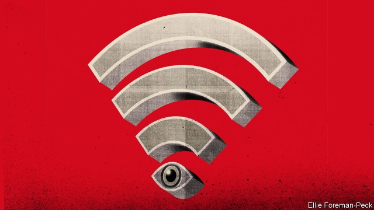
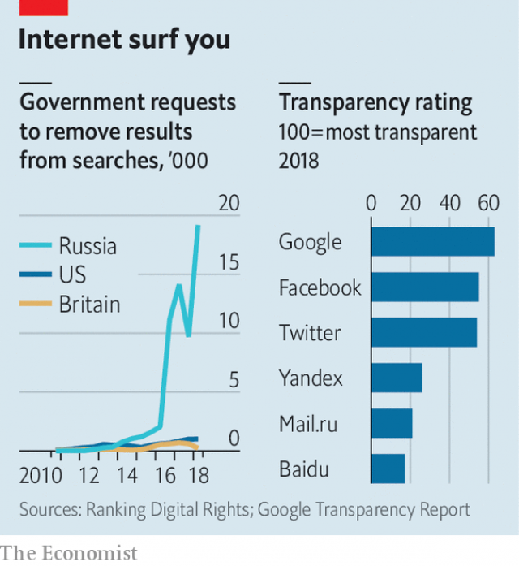

###### Internet v internyet

# Russians are shunning state-controlled TV for YouTube 

##### A worried Vladimir Putin is trying to regain control of Russia’s web 

 

> Mar 7th 2019 

WHEN THE Soviet people turned on their television sets on August 19th 1991, they knew there was an emergency. Every channel was playing classical music or showing “Swan Lake” on a loop. A few hours earlier Mikhail Gorbachev had been detained during an attempted coup. As the Soviet Union crumbled, the fiercest street battles unfolded over television towers. “To take the Kremlin, you must take television,” said one of Mr Gorbachev’s aides. 

Vladimir Putin took note. He began his rule in 2000 by establishing a monopoly over television, the country’s main source of news. It has helped him create an illusion of stability—and whip up enthusiasm for his foreign wars. But the Kremlin’s most reliable propaganda tool is losing its power. Russian pundits have long described politics as a battle between the television and the refrigerator (that is, between propaganda and economics). Now, the internet is weighing in. 

According to the Levada Centre, an independent pollster, Russians’ trust in television has fallen by 30 percentage points since 2009, to below 50%. The number of people who trust internet-based information sources has tripled to nearly a quarter of the population. Older people still get most of their news from television, but most of those aged 18-24 rely on the internet, which remains relatively free. 

YouTube in particular is eroding the state-television monopoly. It is now viewed by 82% of the Russian population aged 18-44. Channel One, Russia’s main television channel, reaches 83% of the same age group. Vloggers have overtaken some television anchors. Yuri Dud, a YouTube journalist who interviews politicians and celebrities such as Alexei Navalny, the opposition leader, gets 10m-20m views per video, much more than any television news programme. Even Dmitry Kiselev, the state television propagandist-in-chief, felt compelled to appear on Mr Dud’s show. 

News is the fourth-most-popular YouTube category among Russians, after “do it yourself”, music and drama. Mr Navalny, who has become a dominant political voice on the internet, has two YouTube channels, one of which has daily news programmes. In the past year his audience has doubled. He has 2.5m subscribers and 4.5m unique viewers a month. His weekly YouTube webcast is watched live by nearly 1m people. By comparison, Channel One’s main evening news show is watched by 3m-4m people. 

The Kremlin is desperately looking for ways to control the internet. “The government is trying to work out how to turn the internet into a television,” says Gregory Asmolov, an expert on the Russian internet at King’s College London. This, he argues, would require not only strict regulation, but control over physical infrastructure and dominance in providing content. 

Last month the Duma preliminarily approved a law on “digital sovereignty” which tries to separate Russia’s internet from the global one. It wants to criminalise anti-government messages online, in effect reviving laws on “anti-Soviet propaganda”. 

Yet controlling the internet will take more than a few laws. Unlike in China, where the ruling party built its “Great Firewall” by the early 2000s, in Russia the internet was a free zone both in terms of content and infrastructure, with hundreds of private service providers. In the early 2000s it became an alternative to state-dominated television. The Kremlin did not spot the threat. Indeed, Mr Putin argued against regulating the internet. 

By the end of the 2000s, however, online activity spilled into the real world. During a rash of wildfires in 2010, thousands of volunteers used crowdsourcing sites to respond to the crisis. Mr Asmolov argues that this self-mobilisation instilled a sense of agency in ordinary citizens while exposing the government’s shortcomings. 

A year later, when the Kremlin tried to rig parliamentary elections, sites such as Golos (“Voice”) activated thousands of volunteer election monitors who recorded widespread violations. In the wake of street protests, Mr Putin unleashed repression both online and offline, including denial-of-service attacks on websites, new regulations and prosecution of activists. In 2014 he declared the internet a CIA project and demanded that national internet firms move their servers to Russia. The Kremlin launched groups of “cyber guards” to search for prohibited content, and tried to hollow out the volunteer movement by replicating independent crowdsourcing sites with its own. It even equipped polling stations with webcams, not to increase transparency, says Mr Asmolov, but to create a semblance of it. It also deployed an army of trolls to flood social media with derisive and inflammatory messages. 

The government pressed Pavel Durov, the co-founder of VKontakte, a home-grown social network, to divulge user information to the FSB, the state security service. When he refused, it made him sell the firm to Alisher Usmanov, a loyal oligarch who owns Mail.ru, a big Russian internet business. VKontakte remains Russia’s top social network, partly because it offers pornography and pirated content. Last year Mr Usmanov signed a $2bn joint venture with Alibaba, a Chinese e-commerce giant. 

Unlike Mr Durov, Mr Usmanov had no qualms about giving users’ data to the security services, which has led to a series of arrests. According to Agora, a human-rights watchdog, Russian prosecutors have initiated 1,295 criminal proceedings for online offences and handed out 143 sentences since 2015. The vast majority originated from VKontakte pages. 

 

This heavy-handed approach has alienated young internet users. More recently, the government has changed tactics. Instead of persecuting users, it is establishing greater control over internet providers. New legislation on “digital sovereignty” will oblige them to install surveillance equipment that can be operated from a single control centre. This will allow the state to filter internet traffic, isolate regions or even cut off the worldwide web throughout the country in case of emergency. The government showed it can cordon off individual regions from the internet during recent protests in Ingushetia. 

But replicating China’s “great firewall” may be difficult, says Andrei Soldatov, the author of “The Red Web” and an expert on Russian internet surveillance. Russia is more integrated into the internet’s global architecture; its biggest firms, like Yandex, have servers abroad, while global giants such as Google have servers in Russia. More importantly, Russians have grown used to sites like YouTube, which is a big provider of children’s entertainment. 

Banning established platforms like YouTube or Google may be technically possible, but could be politically explosive. Last year the state regulator tried to block Telegram, a messaging service developed by Mr Durov, for refusing the Russian security services access to encrypted messages. This inadvertently crashed lots of services, including hotel- and airline-booking systems which (like Telegram) relied on Amazon and Google servers. It also sparked some of the largest street protests in years. 

Telegram is fighting the effort to block it, and for now it seems to be winning, not least because many government officials use it. But Mr Soldatov argues that the exercise served to intimidate big platforms into co-operating: “It showed firms such as Google and Facebook that people in the Kremlin…are mad enough to bring down the entire internet if necessary.” 

Last year the Russian regulator fined Google 500,000 roubles ($7,600) for failing to remove banned websites from search results. The number of requests from the Russian government to remove or block content has exploded in the past two years. The repressive “digital sovereignty” law, already endorsed by Yandex and Mail.ru, two of Russia’s largest firms, aims to increase the Kremlin’s power to cajole. And the tactic of “persuasion” is partially working. Google’s latest transparency report shows that it satisfied 78% of Russian government take-down requests in the first half of 2018. Mr Navalny complains that YouTube wrongly removed a paid advertisement for his protest rally last September at the request of the electoral commission, and says it turns a blind eye to the Kremlin’s use of bots to drive down his videos’ ratings and stop them from trending. 

Applying the new law fully, however, might be like smashing a computer screen with a hammer. The Kremlin will have a switch to bring down the internet if a political crisis erupts, but few ways to prevent it from erupting. Pulling the plug to block the protesters’ message from spreading would be the most powerful message of all. In 1991 almost no one had internet access. But everyone knew the country was in turmoil when they turned on the television and saw nothing but “Swan Lake”. 

-- 

 单词注释:

1.V[vi:]:[计] 溢出, 变量, 向量, 检验, 虚拟, 垂直 [医] 钒(23号元素) 

2.shun[ʃʌn]:vt. 避开, 规避, 避免 

3.youtube[]:n. 视频网站（可以让用户免费上传、观赏、分享视频短片的热门视频共享网站） 

4.Vladimir[vlɑ'dimɪr]:n. 弗拉基米尔（古罗斯弗拉基米尔-苏兹达里公国的古都） 

5.putin['putin]:n. 普京（人名） 

6.regain[ri'gein]:vt. 取回, 恢复, 重回, 复得 [化] 回潮 

7.Mikhail[]:米哈伊尔（人名） 

8.Gorbachev[]:[经] 戈尔巴乔夫 

9.detain[di'tein]:vt. 扣留, 扣押, 耽搁 [法] 拘留, 扣押, 留住 

10.coup['ku:]:n. 砰然的一击, 妙计, 出乎意料的行动, 政变 [医] 发作, 中, 击 

11.crumble['krʌmbl]:v. (使)粉碎, (使)成为碎屑, 瓦解, 崩溃, 败落 

12.Kremlin['kremlin]:n. 克里姆林宫 [经] 克里姆林宫 

13.aide[eid]:n. 助手, 副官 [计] 数据输入的可说明性 

14.monopoly[mә'nɒpәli]:n. 垄断, 专卖权, 独占事业 [经] 垄断, 专利品, 垄断(权)独占 

15.propaganda[.prɒpә'gændә]:n. 宣传, 宣传活动 [医] 宣传 

16.pundit['pʌndit]:n. 学者, 梵文学者, 博学的印度人, 权威 

17.politic['pɒlitik]:a. 精明的, 明智的, 策略的 

18.levada[]:n. (Levada)人名；(俄)列瓦达；(意、葡)莱瓦达 

19.pollster['pәulstә]:n. 民意调查人, 民意测验经办人 

20.triple['tripl]:n. 三倍数, 三个一组 a. 三倍的 vt. 使增至三倍 vi. 增至三倍 

21.erode[i'rәud]:vt. 腐蚀, 侵蚀 vi. 受腐蚀 

22.vloggers[]:[网络] vlogger 

23.yuri[]:n. 尤里（男子名）；坂崎由莉（游戏拳皇中的女性角色） 

24.dud[dʌd]:n. 衣服, 哑弹, 无用物 a. 无用的 

25.celebrity[si'lebrti]:n. 名声, 名人 

26.Alexei[]:n. (Alexei)人名；(捷、罗、俄)阿列克谢 

27.Navalny[]:[网络] 纳瓦尔内；瓦尔尼 

28.opposition[.ɒpә'ziʃәn]:n. 反对, 敌对, 相反, 在野党 [医] 对生, 对向, 反抗, 反对症 

29.Dmitry[]:n. 德米特里（俄罗斯钢琴家） 

30.kiselev[]:[网络] 基西略夫；奇西里夫；吉塞列夫 

31.dominant['dɒminәnt]:a. 占优势的, 支配的 [医] 优性的, 显性的 

32.subscriber[sʌbs'kraibә]:n. 签署者, 捐献者, 订户 [经] 定户 

33.webcast[]:n. 网路广播；网络广播；网络直播 

34.desperately['despәrәtli]:adv. 拼命地；绝望地；极度地 

35.gregory['^re^әri]:n. 格雷戈里（男子名, 古代罗马教皇之名） 

36.Asmolov[]:阿斯莫洛夫 

37.infrastructure['infrәstrʌktʃә]:n. 基础结构, 基础设施 [经] 基础设施 

38.dominance['dɔminәns]:n. 优势, 显性, 统治, 控制, 支配 [计] 控制, 扰势 

39.Duma['du:mɒ]:n. 杜马(俄国会) 

40.preliminarily[prɪ'lɪməˌnerelɪ]: 初步地 

41.sovereignty['sɒvrәnti]:n. 主权, 独立国 [法] 主权, 主权国家, 统治权 

42.criminalise['krimənəlaiz]:vt. [主英国英语] =criminalize 

43.online[]:[计] 联机 

44.revive[ri'vaiv]:vt. 使苏醒, 使复兴, 使振奋, 回想起, 重播 vi. 苏醒, 复活, 复兴, 恢复精神 

45.firewall[]:[计] 放火墙, 隔离 

46.provider[prә'vaidә]:n. 供应者, 供养人, 伙食承办人 [计] 提供器 

47.rash[ræʃ]:a. 轻率的, 匆忙的, 鲁莽的 n. 皮疹 

48.wildfire['waildfaiә]:n. (古时战争时所用的)燃料剂, 磷火, 鬼火, 野火 

49.crowdsourcing[]:[网络] 众包；群众外包；众包模式 

50.instil[in'stil]:vt. 滴注, 逐渐灌输, 不断灌输 [医] 滴注 

51.rig[rig]:n. 装备, 帆装 vt. 装配, 装扮, 给船装帆, 垄断, 操纵 

52.parliamentary[.pɑ:lә'mentәri]:a. 国会的, 议会的, 议会制度的 

53.activate['æktiveit]:vt. 使活动, 使激活, 正式建成 vi. 有活力 

54.violation[.vaiә'leiʃәn]:n. 违反, 违背, 妨碍 [法] 违犯, 违背, 违反 

55.unleash[.ʌn'li:ʃ]:vt. 解开...的皮带, 发出, 发动 

56.repression[ri'preʃәn]:n. 抑制, 压抑, 制止 [医] 压抑, 抑制 

57.offline[]:[计] 挂线, 脱机 

58.prosecution[.prɒsi'kju:ʃәn]:n. 执行, 经营, 起诉 

59.activist['æktivist]:n. 激进主义分子 

60.CIA[]:中央情报局 [计] 中国互联网络协会 

61.server['sә:vә]:n. 服伺者, 上菜用具, 发球员 n. 服务器 [计] 服务器, 服务器启动程序, 服务台程序 

62.cyber['saibә]:a. 网络的, 计算机的 

63.replicate['replikeit]:vt. 折叠, 折转, 复制 n. 复现试验, 复制品, 高八度音 a. 复现的, 复制的, 折转的, 弯回的 

64.webcam['webkæm]:n. 网络摄像头 

65.transparency[træns'pærәnsi]:n. 透明, 透明度, 透过性, 透明物, 清晰 [计] 透明性; 透明 

66.semblance['semblәns]:n. 外表, 伪装, 假象, 少量 

67.deploy[di'plɒi]:v. 展开, 配置 

68.troll[trɒl]:vi. 滚动, 参加轮唱, 曳绳钓鱼 vt. 使转动, 轮唱, 高唱, 用曳绳钓(鱼) n. 转动, 轮唱, 钓绳 

69.derisive[di'raisiv]:a. 嘲笑的, 可笑的 

70.inflammatory[in'flæmәtәri]:a. 激动的, 煽动的, 炎症性的 [医] 炎的, 炎性的 

71.Pavel[]:n. 帕维尔（人名） 

72.Durov[]:[网络] 杜罗夫；杜若夫 

73.VKontakte[]:[网络] 罗盘追缉令；社交；共享网络 

74.divulge[di'vʌldʒ]:vt. 泄露, 透露 

75.FSB[]:[医] 甲醛磺胺苯胺 

76.Alisher[]:[网络] 阿廖沙；阿里谢尔 

77.usmanov[]:[网络] 乌斯曼诺夫；乌斯文诺夫 

78.oligarch['ɒligɑ:k]:n. 寡头政治执政者 

79.pornography[pɔ:'nɔ^rәfi]:n. 色情描写, 黄色书刊, 色情画, 色情照片, 色情文学 [法] 色情画, 色情文学, 黄色读物 

80.pirate['paiәrәt]:n. 海盗, 盗印者, 侵犯专利权者 vt. 盗印, 掠夺, 翻印 vi. 做海盗, 从事劫掠 

81.alibaba[]:n. 阿里巴巴（公司名） 

82.qualm[kwɒ:m]:n. 晕眩, 不安, 疑虑 [法] 疑虑, 不安, 内疚 

83.datum['deitәm]:n. 论据, 材料, 资料, 已知数 [医] 材料, 资料, 论据 

84.sery[]:n. (Sery)人名；(俄)谢雷；(科特)塞里 

85.agora['ægәrә]:n. 集会, 市场 

86.watchdog['wɒtʃdɒg]:n. 看门狗, 监察人 [化] 监控设备; 监视器 

87.prosecutor['prɒsikju:tә]:n. 实行者, 告发者, 公诉人 [法] 原告, 起诉人, 检举人 

88.initiate[i'niʃieit]:n. 入会, 开始 a. 新加入的 vt. 开始, 传授基本知识给 

89.proceeding[prәu'si:diŋ]:n. 进行, 程序, 行动, 诉讼程序, 事项 [化] 会议论文集 

90.alienate['eiljәneit]:vt. 使疏远, 离间, 转让 [法] 转让, 让与, 疏远 

91.tactic['tæktik]:n. 一项战术, 一条策略 a. 战术的, 顺序的, 排列的 

92.persecute['pә:sikju:t]:vt. 迫害, 虐待, 困扰, 同...捣乱 [法] 迫害, 虐待, 烦扰 

93.surveillance[sә:'veilәns]:n. 监视, 监督 [电] 侦测 

94.cordon['kɒ:dәn]:n. 哨兵线, 非常警戒线, 饰带 vt. 用警戒线围住 

95.Ingushetia[]:n. 印古什共和国 

96.firewall[]:[计] 放火墙, 隔离 

97.Andrei[]:安德烈（人名） 

98.Yandex[]:[网络] 俄罗斯综合搜索；搜索引擎；搜索引擎公司 

99.google[]:谷歌；搜索引擎技术；谷歌公司 

100.importantly[]:adv. 重要地；大量地；有名望地；自命不凡地 

101.technically['teknikli]:adv. 技术上, 学术上, 专门地 

102.politically[]:adv. 政治上 

103.regulator['regjuleitә]:n. 调整者, 校准者, 校准器, 调整器, 标准钟 [化] 调节剂; 调节器 

104.encrypt[in'kript]:[计] 加密 

105.inadvertently[ˌɪnədˈvɜ:təntli]:adv. 漫不经心地, 疏忽地; 非故意地 

106.amazon['æmәzɒn]:n. 亚马孙河 [医] 无乳腺者 

107.facebook[]:n. 脸谱网 

108.rouble['ru:bl]:n. 卢布 

109.repressive[ri'presiv]:a. 压抑的, 抑制的, 镇压的 

110.endorse[in'dɒ:s]:vt. 支持, 赞同, 背书于, 签署 [经] 赞成, 背书 

111.cajole[kә'dʒәul]:vt. 以甜言蜜语哄骗, 勾引 

112.persuasion[pә'sweiʒәn]:n. 说服, 信念, 派别, 说服力 

113.wrongly[]:adv. 错误地, 不恰当地, 不正确地, 不正直地, 不公正地 

114.rally['ræli]:n. 重振旗鼓, 集合, 群众集会, 跌停回升 v. 重整旗鼓, 集合, 恢复精神, 团结, 挖苦, 嘲笑 

115.electoral[i'lektәrәl]:a. 选举人的, 选举的, (有关)选举的 [法] 选举的, 选举人的, 由选举人组成的 

116.BOT[bɔt]:[计] 磁带开始标志, 计算机角色 [医] 肤蝇[类]幼虫 

117.rating['reitiŋ]:n. 等级, 额定功率, 责骂 [经] 等级评定 

118.fully['fuli]:adv. 十分地, 完全地, 充分地 

119.turmoil['tә:mɒil]:n. 骚动, 混乱 

