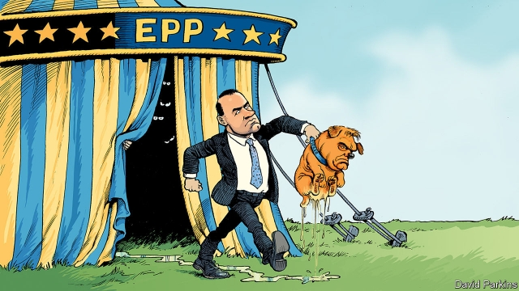

###### Charlemagne

# Time for Europe’s centre-right group to kick out Viktor Orban 

##### The European People’s Party has tolerated the Hungarian leader’s authoritarianism for too long 

 

> Mar 7th 2019 

ON JUNE 16TH 1989 Hungarians gathered to rebury Imre Nagy. The liberalising prime minister’s overthrow had prompted the uprising against Soviet rule 33 years before. In Heroes’ Square in Budapest they placed flowers and wreaths around his coffin as Viktor Orban, a 26-year-old leader of the Young Democrats (known as Fidesz), proclaimed that the Soviet Union had forced Hungary into a “dead-end Asian street” and that communism and democracy were incompatible. Fidesz would later become a political party and help lead Hungary’s post-communist modernisation. So impressed was the European People’s Party (EPP), the grouping of European centre-right parties, that it wooed Mr Orban away from the liberal bloc—sending representatives to Budapest to persuade him to switch, which he did in 2000. 

That feels like a long time ago. In his second spell as prime minister, since 2010, Mr Orban has battered Hungary’s young democracy: changing the constitution to cow judges, taking over the press, clamping down on civil society, manipulating elections and propagating anti-Semitic conspiracy theories about George Soros, a Hungarian-born billionaire whom he accuses of plotting to flood the country with migrants. He has routinely trampled over red lines laid down by the EPP, yet still the group has coddled him, cheering his election victories and dismissing calls to expel Fidesz. The EPP warned Mr Orban not to pass a law curbing NGOs’ independence and not to force the Budapest-based Central European University (CEU), founded by Mr Soros, out of the country. He did both last year. No sanction followed. 

Why not? The EPP, the largest European party group, sees itself as the ultimate big tent, a family spanning the continent in all its diversity. And the bigger the tent, the more the EPP can get its way in Brussels. Its affection for the sunny Fidesz of 1989 clouds its judgment of the dark Fidesz of 2019. Better to keep the party on the inside, where its authoritarianism can be curbed, argue leaders like Manfred Weber, the EPP’s candidate for the presidency of the European Commission at the European elections in May. Some point to corruption-tainted outfits in other alliances, like Slovakia’s Smer, which sits in the social-democratic group. Expelling them all would, the argument goes, reduce the mainstream party groups to western and northern European rumps, and further fracture the EU. Thus, even when he voted for Article 7 disciplinary procedures against Hungary in September, Mr Weber insisted that he was voting “not against Fidesz, not against Viktor Orban”. 

Now, however, Mr Orban may finally have gone too far. Last month he launched a publicly funded poster campaign showing a cackling Jean-Claude Juncker, the commission president and an EPP veteran, next to George Soros, with the slogan “You have a right to know what Brussels is planning to do” (force migrants on Hungary, apparently). The vitriol and scale of the campaign shocked the EPP. It heightened concerns that Mr Weber’s association with Mr Orban might deny him the votes of social democrats and liberals in the European Parliament, which he would need to secure the commission’s presidency. So far 12 member parties of the EPP, mostly from the Benelux and Scandinavian countries, have called for Fidesz’s expulsion. The EPP’s assembly will settle the matter on March 20th. It will probably be decided by German parties, Angela Merkel’s Christian Democratic Union (CDU) and the Christian Social Union, its Bavarian sister party and Mr Weber’s political home. 

At a meeting between Mr Orban’s representatives and Annegret Kramp-Karrenbauer, the CDU’s new general secretary, old Fidesz excuses (leftists are trying to divide the EPP, the attacks on Mr Soros are merely domestic politics) did not fly. Mr Weber has sharpened his language, on March 5th threatening Fidesz with expulsion unless it stops the posters, apologises and lets the CEU remain in Budapest. None of these is likely to happen. Meanwhile the CSU, traditionally sympathetic to Mr Orban, is turning against him and is unwilling to split from the CDU amid today’s climate of reconciliation between the two parties. As a compromise, the two might back the temporary suspension of Fidesz. 

That would be grossly inadequate. The case for expelling Fidesz is overwhelming. Far from restraining him, cosseting Mr Orban in the EPP has legitimised his illiberal abuses. Andras Lederer of the Hungarian Helsinki Committee, a human-rights campaign in Budapest, is withering about the EPP’s “utter failure”. Letting Mr Orban go unscathed, he says, “encouraged him to continue dismantling the rule of law and checks and balances.” For Mr Weber to back a mere suspension, leaving the door open to readmission after the European elections, would confirm a pattern of spinelessness that worries even colleagues sympathetic to his bid for the commission presidency. Ponders one EPP insider: “Where’s his backbone?” 

Expulsion, it is true, might prompt Fidesz to set up a new group of hard-right European parties, or more probably to join one of the two existing ones. But it would pay a price in influence and domestic credibility. Moreover, the EPP could then admit a more moderate Hungarian party in its place: the liberal-conservative Modern Hungary Movement, for example. 

The case against expelling Fidesz rests on the claim that the EPP encompasses different sorts of European parties: from liberal western ones to more conservative post-communist ones, including those in countries where democratic and pluralist norms are not as firmly rooted. This is a worthy ambition. But Hungary is not Fidesz. And just as the bright modernity of the party in 1989 obscured some of the darker traits of Hungarian society (which Mr Orban has since harnessed and indulged), so the party today obscures the better traits. The job of a big-tent, supposedly moderate party family is to nurture those better traits, not to give up on them in the name of inclusivity. History did not end in 1989. 

-- 

 单词注释:

1.Charlemagne['ʃɑ:lә'mein]:查理曼大帝(742-814, 世称 Charles the Great或Charles I, 768-814为法兰克王, 800-814为西罗马帝国皇帝) 

2.Viktor[]:维克托（人名） 

3.orban[]: [人名] 奥尔班 

4.Hungarian[hʌŋ'gєәriәn]:a. 匈牙利的, 匈牙利人的, 匈牙利语的 n. 匈牙利人, 匈牙利语 

5.authoritarianism[ə,θɔrə'tɛrɪənɪzəm]:n. 独裁主义；权力主义 

6.Hungarian[hʌŋ'gєәriәn]:a. 匈牙利的, 匈牙利人的, 匈牙利语的 n. 匈牙利人, 匈牙利语 

7.rebury[ri'beri]:v. 再埋葬, 重新埋葬 

8.Imre[]:n. (Imre)人名；(土)伊姆蕾；(丹)伊姆勒；(罗、塞、意、挪)伊姆雷 

9.Nagy[]:纳吉（人名） 

10.liberalise['lɪbərəlaɪz]:vt. 使自由化 

11.overthrow[.әuvә'θrәu]:n. 推翻, 瓦解, 倾覆 vt. 打倒, 推翻, 倾覆 

12.uprise[ʌp'raiz]:n. 升起, 起立, 上山坡, 出现 vi. 上升, 起义, 出现 

13.Budapest[bju:dә'pest]:n. 布达佩斯(匈牙利首都) 

14.coffin['kɒfin]:n. 棺材, 灵柩 vt. 把...装进棺材 

15.democrat['demәkræt]:n. 民主人士, 民主主义者, 民主党党员 [经] 民主党 

16.fidesz[]:[网络] 青年民主党；匈牙利执政党青民盟；匈牙利执政党青年民主党 

17.Hungary['hʌŋgәri]:n. 匈牙利 

18.incompatible[.inkәm'pætәbl]:a. 不相容的, 不能并存的, 矛盾的 [化] 不协调 

19.modernisation[,mɔdәnai'zeiʃәn;-ni'z-]:n. <主英>=modernization 

20.epp[]:abbr. epistles 书信; end plate potential 平面势能终端; edepuolenp iven (Finnish—before noon) （芬兰语）中午之前; excess personal property 过多的个人资产 

21.grouping['gru:piŋ]:n. 分组 [计] 组 

22.batter['bætә]:v. 连续猛打（尤其指妇女），猛击 n. 面糊（食物），击球员，打击手 

23.clamp[klæmp]:n. 夹钳 vt. 夹紧, 强加 

24.manipulate[mә'nipjuleit]:vt. 操纵, 利用, 操作, 巧妙地处理, 假造 

25.propagate['prɒpәgeit]:vt. 繁殖, 传播, 传送 vi. 繁殖, 蔓延 

26.conspiracy[kәn'spirәsi]:n. 同谋, 阴谋, 阴谋集团 [法] 阴谋, 通谋, 共谋 

27.george[dʒɔ:dʒ]:n. 乔治（男子名）；自动操纵装置；英国最高勋爵勋章上的圣乔治诛龙图 

28.Soros[]:n. 索罗斯（投资专家）；索罗斯基金 

29.billionaire[.biljә'nєә]:n. 亿万富翁 

30.migrant['maigrәnt]:n. 候鸟, 移居者 [法] 移居者 

31.routinely[]:adv. 日常, 乏味, 常规, 例行 

32.trample['træmpl]:n. 践踏(声), 蹂躏 v. 践踏, 无视 

33.coddle['kɒdl]:vt. 娇养, 溺爱, 用文火煮(蛋) 

34.curb[kә:b]:n. 抑制, 勒马绳, 边石 vt. 抑制, 束缚, 勒住 

35.CEU[]:abbr. 继续教育单位（congenital ectropion uveae） 

36.sanction['sæŋkʃәn]:n. 核准, 制裁, 处罚, 约束力 vt. 制定制裁规则, 认可, 核准, 同意 

37.diversity[dai'vә:siti]:n. 差异, 多样性 [化] 多样性 

38.Brussel[]:n. 布鲁塞尔（比利时首都） 

39.judgment['dʒʌdʒmәnt]:n. 裁判, 宣告, 判决书 [医] 判断 

40.Manfred['mænfred]:曼弗雷德(男子名) 

41.Weber['wi:bә]:[计] 韦伯 [医] 韦伯, 库仑 

42.presidency['prezidәnsi]:n. 总统职权, 总裁职位 

43.outfit['autfit]:n. 用具, 配备, 机构 vt. 配备, 供应 vi. 得到装备 

44.alliance[ә'laiәns]:n. 联盟, 联合 [法] 同盟, 联盟, 联姻 

45.mainstream['meinstri:m]:n. 主流 

46.rump[rʌmp]:n. 尾部, 臀部 [医] 臀部, 臀 

47.fracture['fræktʃә]:n. 破碎, 骨折 v. (使)破碎, (使)破裂 

48.EU[]:[化] 富集铀; 浓缩铀 [医] 铕(63号元素) 

49.disciplinary['disiplinәri]:a. 训练的, 纪律的, 训诫的 [法] 纪律的, 惩戒性的 

50.cackle['kækl]:n. 咯咯声, 高笑声, 饶舌, 闲谈 vi. 咯咯地叫, 咯咯地笑, 喋喋不休 

51.juncker[]:[网络] 容克；欧元集团现任主席容克；欧元区主席容克 

52.apparently[ә'pærәntli]:adv. 表面上, 清楚地, 显然地 

53.vitriol['vitriәl]:n. 硫酸盐, 矾油, 矾, 语言尖刻 vt. 用硫酸处理 

54.heighten['haitn]:vt. 增高, 提高, 加强 vi. 升高, 变大 

55.Benelux['benilʌks]:n. 比荷卢经济联盟 [经] 比, 嗬, 卢经济联盟 

56.Scandinavian[,skændi'neivjәn]:n. 斯堪的纳维亚人, 斯堪的纳维亚语, 北欧日耳曼语系 a. 斯堪的纳维亚人的, 斯堪的纳维亚语的, 北欧日耳曼语系的 

57.expulsion[ik'spʌlʃәn]:n. 逐出, 开除, 驱逐, 排气 [医] 逼出 

58.angela['ændʒilә]:n. 安吉拉（女子名） 

59.CDU[]:abbr. 中央显示器（Central Display Unit）；海防搜索潜艇雷达（Coast Defense radar for detecting U-boats） 

60.Bavarian[bә'vєәriәn]:a. 巴伐利亚的, 巴伐利亚人的 n. 巴伐利亚人, 巴伐利亚方言 

61.leftist['leftist]:n. 左翼的人, 左派 a. 左派的 

62.politic['pɒlitik]:a. 精明的, 明智的, 策略的 

63.apologise[ә'pɔlәdʒaiz]:vi. 道歉（等于apologize） 

64.CSU[]:[计] 信道服务设备 

65.traditionally[]:adv. 传统上；传说上；习惯上 

66.amid[ә'mid]:prep. 在其间, 在其中 [经] 在...中 

67.reconciliation[,rekәnsili'eiʃәn]:n. 和解, 和好, 复交, 调解, 调停, 和谐, 一致, 甘愿, 顺从 [经] (银行往来)调节, 调和, 一致 

68.grossly['grәusli]:adv. 非常, 很, 粗 

69.inadequate[in'ædikwәt]:a. 不充分的, 不适当的 [法] 不充分的, 不适当的 

70.overwhelm[.әuvә'hwelm]:vt. 淹没, 受打击, 制服, 压倒, 使不知所措 [法] 打翻, 倾覆, 覆盖 

71.cosset['kɒsit]:n. 供玩赏的小动物, 爱畜 vt. 宠爱, 珍爱, 溺爱 

72.legitimise[li'dʒitimaiz]:vt.<主英> = legitimize 

73.illiberal[i'libәrәl]:a. 狭隘的, 无教养的, 吝啬的 

74.Andra[]:安德拉（人名） 

75.Lederer[]:n. (Lederer)人名；(匈、捷、德)莱德雷尔；(法)勒德雷尔；(英)莱德勒 

76.Helsinki['helsiŋki]:n. 赫尔辛基 

77.wither['wiðә]:vt. 使凋谢, 使消亡, 使畏缩 vi. 枯萎, 衰退 

78.unscathed[.ʌn'skeiðd]:a. 没有受伤的, 未受损伤的 

79.dismantle[dis'mæntl]:vt. 拆除...的设备, 分解, 去除覆盖物 

80.readmission[,ri:әd'miʃәn]:n. 重新接纳 

81.spinelessness[]:无脊椎 没有骨气 

82.ponder['pɒndә]:v. 沉思, 考虑 

83.expulsion[ik'spʌlʃәn]:n. 逐出, 开除, 驱逐, 排气 [医] 逼出 

84.credibility[.kredi'biliti]:n. 可信用, 确实性, 可靠 [法] 证据能力, 可信程度, 确实性 

85.encompass[in'kʌmpәs]:vt. 围绕, 完成, 包括, 包含, 环绕, 包围 

86.pluralist['pluәrәlist]:n. 兼职者, 多元论者 

87.norm[nɒ:m]:n. 基准, 模范, 标准, 准则, 平均数 [化] 定额 

88.modernity[mɒ'dә:nәti]:n. 现代性, 现代状态, 现代东西 

89.trait[treit]:n. 特征, 特性, 一笔, 少许 

90.indulge[in'dʌldʒ]:vt. 纵情于, 使高兴, 放任, 迁就 vi. 沉溺 

91.supposedly[sә'pәuzidli]:adv. 想象上, 看上去像, 被认为是, 恐怕, 按照推测 

92.nurture['nә:tʃә]:n. 养育, 营养物, 培育 vt. 养育, 供给营养物, 教养 

93.inclusivity[]:n. 包容性 

