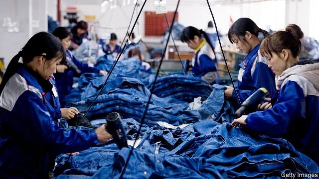
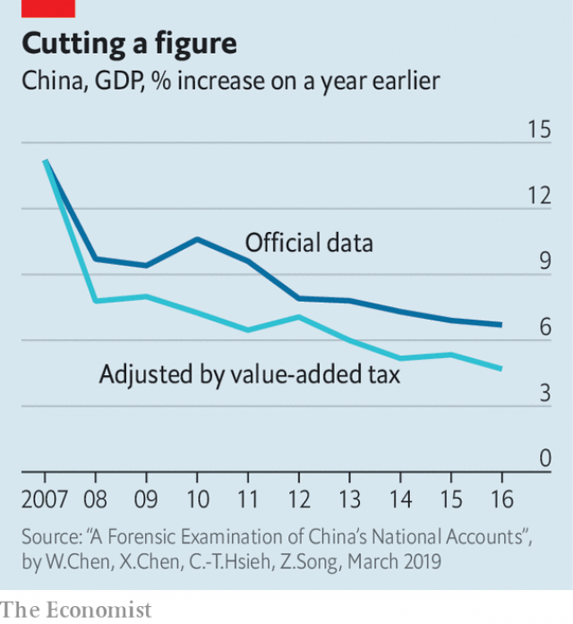

###### Slower but steadier?

# China’s economy might be nearly a seventh smaller than reported 

##### A new study examines tax revenues to revise down growth estimates 

 

> Mar 7th 2019 

FOR A COUNTRY that is regularly accused of manipulating its statistics, China is remarkably diligent about collecting them. The government has dispatched two million boffins to visit companies, stores and even street stalls in the first few months of this year, as part of a new national economic census. Ads plastered on billboards implore people to co-operate. In a flashy promotional video on its website, the national statistics bureau warns that any fabrication of data is against the law. 

But these laudable efforts do not appear to be solving the basic problems with Chinese statistics. A new paper, by Chang-Tai Hsieh of the University of Chicago and three co-authors from the Chinese University of Hong Kong, finds that industrial output and investment have been consistently embellished. As a result, they argue that China overstated real GDP growth by two percentage points on average every year from 2008 to 2016 (see chart). Over time that adds up: official figures for 2016 would have exaggerated the size of the economy by 16%, or more than $1.5trn. 

 

These economists are certainly not the first to question Chinese numbers. But their paper, published by the Brookings Institution in Washington on March 7th, deserves attention because they had better access to the statistics bureau than most. Though they worked only with public data, they knew where to shine a light. They looked at how revenues from value-added tax on industrial firms compared with reported growth of industrial output. Until 2007 the two lined up well. But after 2008 gaps opened up, although they have narrowed a bit in recent years. The authors also built an alternative model for measuring growth using indicators that cannot be easily manipulated, including satellite imagery of night lights, railway cargo and imports, and came to the same conclusion. 

Those sceptical of China’s data sometimes assert that its statisticians have the power to fiddle with numbers to present their desired outcome. The authors argue that the problem is the opposite: that at the central level they lack the power to correct for the misdeeds of other officials. It has long been noted that provincial GDP totals, when added up, exceed national GDP. The national bureau is alert to this and so adjusts provincial figures by, for example, collecting data through separate channels. 

Yet from 2008, when the global financial crisis struck, the adjustments failed to keep up with the distortions, the paper says. For provincial leaders the incentives are clear: their chances of promotion depend on reported economic performance, which they can embellish. Since they rank above the statistics bureau politically, only the bravest beancounter would dare stand in their way. Tellingly, only after crackdowns on corruption in provinces such as Liaoning and Inner Mongolia did authorities admit that their data had been inflated. If the authors are right, these cases are a small sample of a wider epidemic. 

There is, however, a silver lining. Local and national figures for consumption are closely aligned. It is mainly industrial output and investment that are exaggerated. The downward revisions therefore result in a substantially different picture of the shape of China’s economy. The authors find that investment, properly measured, was 36% of GDP in 2016, not 43%, as the government says. Debt as a share of GDP is higher than officially reported, but the return to capital is not as low as feared and consumption is more prominent as an engine of growth. Looked at this way, the Chinese economy is smaller but better balanced and thus, perhaps, more resilient. 

-- 

 单词注释:

1.manipulate[mә'nipjuleit]:vt. 操纵, 利用, 操作, 巧妙地处理, 假造 

2.statistic[stә'tistik]:n. 统计量 a. 统计的, 统计学的 

3.remarkably[ri'mɑ:kәbli]:adv. 显著地, 引人注目地, 非常地 

4.dispatch[dis'pætʃ]:vt. 派遣 n. 派遣, 急件 [计] 调度 

5.boffin['bɒfin]:n. 研究员, 科学工作者 

6.stall[stɒ:l]:n. 厩, 停车处, 牧师职位, 货摊, 托辞, 拖延 vt. 关入厩, 停顿, 推托, 支吾, 使陷于泥中 vi. 被关在厩内, 陷于泥中, 停止, 支吾 

7.census['sensәs]:n. 户口普查 vt. 实施统计调查 

8.billboard['bilbɒ:d]:n. 广告牌, 布告板 vt. 宣传 

9.implore[im'plɒ:]:vt. 恳求, 哀求 

10.flashy['flæʃi]:a. 闪光的, 一瞬间的, 浮华的 

11.promotional[prәu'mәuʃәnl]:a. 增进的 

12.fabrication[.fæbri'keiʃәn]:n. 制造, 建造, 虚构的谎言 [医] 虚谈症 

13.datum['deitәm]:n. 论据, 材料, 资料, 已知数 [医] 材料, 资料, 论据 

14.laudable['lɒ:dәbl]:a. 值得赞赏的, 值得佩服的 [医] 健康的 

15.hsieh[]:[网络] 谢明浚；谢医师；谢谓君 

16.Chicago[ʃi'kɑ:gәu]:n. 芝加哥 

17.hong[hɔŋ]:n. （中国、日本的）行, 商行 

18.kong[kɔŋ]:n. 含锡砾石下的无矿基岩；钢 

19.consistently[]:adv. 坚固, 坚实, 一致, 始终如一, 连贯 [计] 相容地 

20.embellish[im'beliʃ]:vt. 修饰, 装饰, 润色 

21.overstate[.әuvә'steit]:vt. 夸大的叙述, 夸张, 过分强调 [经] 多计, 高估 

22.economist[i:'kɒnәmist]:n. 经济学者, 经济家 [经] 经济学家 

23.Brooking[]:n. (Brooking)人名；(英、西)布鲁金 忍受（brook的现在分词形式） 容忍 

24.Washington['wɒʃiŋtn]:n. 华盛顿 

25.indicator['indikeitә]:n. 指示器, 指示剂, 指标 [计] 指示器 

26.cannot['kænɒt]:aux. 无法, 不能 

27.imagery['imidʒәri]:n. 肖像, 比喻, 雕刻 [化] 成像 

28.assert[ә'sә:t]:vt. 主张, 坚称, 断言 [法] 宣称, 断言, 维护 

29.statistician[.stæti'stiʃәn]:n. 统计员, 统计学家 [经] 统计家 

30.fiddle['fidl]:n. 小提琴, 提琴类乐器 vt. 虚度时光, 拉小提琴 vi. 拉小提琴, (无目的地)拨弄, 瞎搞 

31.misdeed['mis'di:d]:n. 罪行, 犯罪 [法] 不端行为, 犯罪, 恶性 

32.provincial[prә'vinʃәl]:n. 外地人, 粗野的人 a. 省的, 外地的, 偏狭的 

33.distortion[dis'tɒ:ʃәn]:n. 扭曲, 变形, 曲解 [计] 畸变; 失真 

34.incentive[in'sentiv]:n. 动机 a. 激励的 

35.promotion[prәu'mәuʃәn]:n. 晋级, 创建, 增进 [经] 推广, 推销, 促进 

36.politically[]:adv. 政治上 

37.beancounter[]:na. 〈美俚〉统计专家 [网络] 拍卖交易；精打细算的人；数豆子的人 

38.tellingly['teliŋli]:adv. 有效地；显著地 

39.crackdown['krækdaun]:n. 制裁, 镇压, 痛击 

40.corruption[kә'rʌpʃәn]:n. 腐败, 堕落, 贪污 [计] 论误 

41.Liaoning['ljaj'niŋ]:辽宁(位于中国东北地区南部) 

42.Mongolia[mɒŋ'gәuljә]:n. 蒙古 

43.inflate[in'fleit]:vt. 使膨胀, 使得意, 使通货膨胀, 使充气 vi. 充气, 膨胀 

44.epidemic[.epi'demik]:n. 传染病, 流行病 a. 流行的, 传染性的 

45.align[ә'lain]:vi. 排列, 排成一行, 结盟 vt. 使结盟, 使成一行, 校正 

46.substantially[sәb'stænʃәli]:adv. 实质上, 本质上, 大体上 

47.officially[ә'fiʃәli]:adv. 作为公务员, 职务上, 官方地 

48.resilient[ri'ziliәnt]:a. 弹回的, 有弹力的 [医] 回弹的, 回能的 

