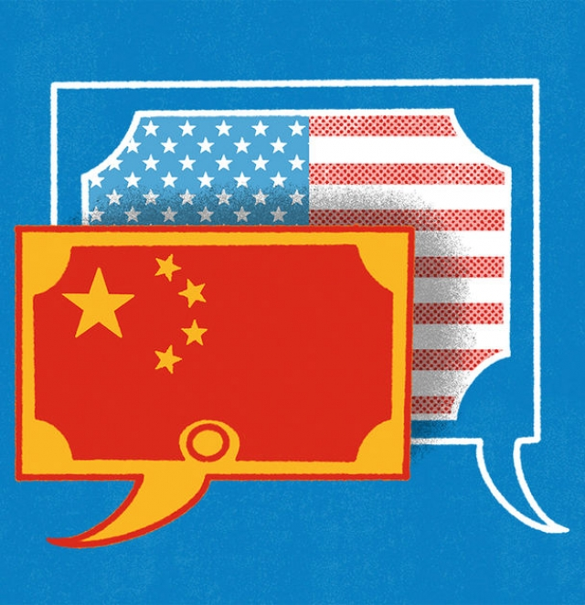

###### Buttonwood

# China’s trading day is starting to influence global markets 

##### The importance of opening time in Shanghai 

 

> Mar 7th 2019 

IN HIS BOOK “The Death of Gentlemanly Capitalism”, Philip Augar described a shift in the culture of London’s financial industry during the 1980s and 1990s. The old City of public-school amateurism, late starts, early finishes and long, boozy lunches disappeared. In its place, a new City emerged under the sway of American investment banks. The morning meeting started two hours earlier. Lunch was a sandwich at your desk. And instead of port and cigars, try mineral water. 

It was time to sober up, too, because America’s influence on the London market went well beyond the acquisition by its banks of a few old-school stockbrokers. America was home to much of the world’s capital. As more buying and selling of assets took place across borders and time zones, the New York trading day set the tone for markets everywhere else. A City broker had to be at his desk, and with his wits about him, when the New York market opened just after lunchtime in London. 

The global trading day still only truly begins when New York clears its throat. Markets in the rest of the world then take note of what has been said. But listen closely, and you hear the beginnings of a dialogue. China has barely opened its capital markets to foreign investors and the yuan is still a managed currency. Yet its say in how global markets rise and fall is already apparent. And China’s influence will only increase as more foreign capital flows into the financial markets on its mainland. 

China’s voice is most audible in currency markets. For a long time, the yuan hugged the dollar closely, taking its cue from America. But since August 2015 it has been allowed to fluctuate more in response to market forces. In theory, its value is set by reference to a basket of currencies. In practice, this means a wider trading range against the dollar—not so weak as to spark capital flight, but not so strong as to hurt exports. Within this range, the yuan exerts a sizeable pull. Other important currencies, notably the euro, have tracked its ups and downs against the dollar. 

Stockmarkets are next. China has led this year’s sharp bounce-back in share prices worldwide. True, the change in mood is not only about China. The Federal Reserve no longer seems hellbent on tighter monetary policy. General Electric, one of the largest issuers of corporate bonds, has so far averted a downgrade to junk. Italy’s clash with the European Union over fiscal policy has fizzled. But the anxieties about China that troubled investors in the final months of 2018 have also faded. There is now a real prospect of a truce with America over trade. And a host of tax cuts and other measures are in train to pep up China’s slowing economy. 

That is, in part, why buying A-shares (yuan-denominated stocks listed in Shanghai and Shenzhen) is a favoured trade of bulls. After falling hard last year stocks in China had headroom. Although America’s economy looks fairly robust, its stockmarket is expensive. Foreigners looking at China’s stockmarket felt it was awfully cheap by comparison. And it is telling that the way to play renewed optimism is to buy stocks on the mainland. In the past, investors might have turned to Hong Kong-listed shares or proxies for China’s economy, such as the Australian dollar. 

There is more to foreign buying of Chinese stocks than a revival in risk appetite. Global investors own just 2-3% of Chinese stocks and bonds, well below the country’s weight in world GDP. For foreigners to buy financial assets on the mainland is far from frictionless, but it has become a lot easier. The compilers of the stock and bond indices, benchmarks for trillions of dollars of investments, have taken note. MSCI is speeding up the inclusion of A-shares in its emerging-market index and will quadruple their weighting this year. Next month Bloomberg Barclays is adding China to its main bond index. Other providers of bond indices are likely to follow suit. Analysts at Morgan Stanley expect a marked acceleration of foreign capital flows into Chinese shares and government bonds this year in response. 

It is not too fanciful to imagine a time in the future when the start of the trading day in Shanghai is an important moment for global capital markets. Would London, eight hours west of Shanghai and five east of New York, then regain some of its lost relevance? Maybe not. Perhaps Los Angeles would be a better bridge. An early riser could be up before New York opens and still awake when Shanghai closes. What would the rheumy brokers of the old City make of that? 

-- 

 单词注释:

1.buttonwood['bʌtnwʊd]: 美洲悬铃木 

2.gentlemanly['dʒentlmәnli]:a. 绅士的, 绅士派头的 

3.capitalism['kæpitәlizәm]:n. 资本主义 [经] 资本主义 

4.philip['filip]:n. 菲利普（男子名） 

5.amateurism['æmәtә:rizm]:n. 外行做法, 业余身份 

6.boozy['bu:zi]:a. 酩酊的, 嗜酒的 

7.stockbroker['stɒk.brәukә]:n. 股票经纪人 

8.asset['æset]:n. 资产, 有益的东西 

9.york[jɔ:k]:n. 约克郡；约克王朝 

10.broker['brәukә]:n. 掮客, 经纪人 [经] 经纪人, 掮客 

11.lunchtime['lʌntʃtaim]:n. 午餐时间 

12.investor[in'vestә]:n. 投资者 [经] 投资者 

13.audible['ɒ:dәbl]:a. 听得见的 [电] 可闻的 

14.fluctuate['flʌktʃueit]:vi. 变动, 起伏, 动摇 vt. 使波动, 使动摇 

15.sizeable['saizәbl]:a. 相当大的, 可观的 

16.notably['nәjtbәli]:adv. 显著地, 著名地, 尤其, 特别 

17.euro['juәrәu]:n. 欧元（欧盟的统一货币单位） 

18.stockmarket[s'tɒkmɑ:kɪt]: 证券市场; 证券交易所; 证券行情 

19.hellbent['helbent]:a. 疾驰的, 坚决的 

20.monetary['mʌnitәri]:a. 货币的, 金钱的 [经] 货币的, 金融的 

21.issuer['iʃjuә]:n. 发行者 [法] 发行人, 发布人 

22.corporate['kɒ:pәrit]:a. 社团的, 合伙的, 公司的 [经] 团体的, 法人的, 社团的 

23.avert[ә'vә:t]:vt. 转开, 避免, 防止 

24.downgrade['dajn^reid]:vt. 降低, 贬低 n. 下坡 a. 下坡 adv. 下坡 

25.clash[klæʃ]:n. 冲突, 撞击声, 抵触 vi. 冲突, 抵触 vt. 使发出撞击声 [计] 对撞 

26.fiscal['fiskәl]:a. 财政的, 国库的 [经] 财政上的, 会计的, 国库的 

27.fizzle['fizl]:n. 嘶嘶声, 失败 vi. 发嘶嘶声, 失败 

28.truce[tru:s]:n. 停战, 休战 vi. 停战, 休止 vt. 以休战结束 

29.pep[pep]:n. 活力, 气力, 劲头, 锐气 vt. 鼓起精神, 激励, 使充满活力 

30.shenzhen['ʃʌn'dʒʌŋ]:n. 深圳 

31.headroom['hedru:m]:n. 净空, 车身内部高度 

32.robust[rәu'bʌst]:a. 健康的, 强健的, 要用力气的, 坚定的, 粗野的 [计] 健壮性 

33.optimism['ɒptimizm]:n. 乐观主义, 乐观, 乐天 [医] 乐观主义, 乐观 

34.hong[hɔŋ]:n. （中国、日本的）行, 商行 

35.proxy['prɒksi]:n. 代理, 代理人, 委托书 [经] 代理人, 代表权, 授权书 

36.revival[ri'vaivl]:n. 复兴, 复活, 恢复精神, 苏醒 [医] 复苏, 回生, 精神重振 

37.frictionless[f'rɪkʃnles]: 无摩擦的 

38.compiler[kәm'pailә]:n. 编辑者 [计] 编译程序 

39.benchmark[]:[计] 基准程序; 基准 

40.trillion['triljәn]:n. 大量 [经] 兆 

41.msci[]:abbr. medium scale compound integration 中规模混合集成; multi-protocol serial communications interface 多协议串行通信接口 

42.inclusion[in'kluʒәn]:n. 包含, 内含物 [计] 蕴含 

43.quadruple['kwɒdrupl]:a. 四倍的, 四重的, 四部分组成的 n. 四倍 vt. 使成四倍 vi. 成为四倍 

44.bloomberg[]: [人名] 布隆伯格 

45.barclay['bɑ:kli]:n. 巴克利（姓氏, 男子名） 

46.provider[prә'vaidә]:n. 供应者, 供养人, 伙食承办人 [计] 提供器 

47.analyst['ænәlist]:n. 分析者, 精神分析学家 [化] 分析员; 化验员 

48.Morgan['mɒ:gәn]:n. 摩根马 

49.stanley['stænli]:n. 斯坦利（男子名） 

50.fanciful['fænsiful]:a. 奇怪的, 稀奇的, 想像的 

51.regain[ri'gein]:vt. 取回, 恢复, 重回, 复得 [化] 回潮 

52.los[lɔ:s]:abbr. 月球轨道航天器（Lunar Orbiter Spacecraft）；视线（Line of Sight） 

53.angeles[]:n. 安杰利斯（姓氏）；天使城（菲律宾地名） 

54.riser['raizә]:n. 起床者, 叛徒, 起义者, 竖板 [化] 上升管 

55.rheumy['ru:mi]:a. 稀粘液的, 潮湿阴冷的 

