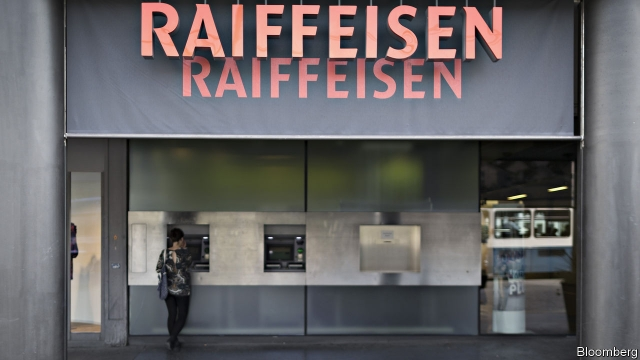
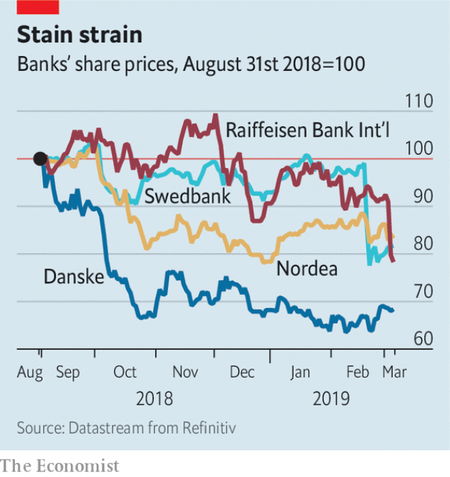

###### Europe awash

# More banks are caught up in money-laundering scandals 

##### The aftershocks of the Danske affair 

 

> Mar 7th 2019 

THE MONEY-LAUNDERING scandal that struck Danske Bank last year was staggering. The Danish lender’s Estonian branch is suspected of handling up to $230bn of iffy funds from former Soviet states. Aftershocks are rumbling under other European banks. Shares in Austria’s Raiffeisen Bank International tumbled by more than 12% on March 5th after a complaint was filed accusing it (and, to a lesser extent, other Austrian banks) of “gross negligence or acquiescence” in connection with suspicious flows from Danske. Raiffeisen says it is investigating. 

Raiffeisen is just the latest bank to be suspected of channelling dirty money from Europe’s eastern fringes. Helsinki-based Nordea and Sweden’s Swedbank are among those embroiled in the Danske affair. Swedbank’s share price has shed 18% since it was linked to Danske last month (see chart). Some banks have been stained by a separate scheme, the “Troika Laundromat”. European banks caught up in such allegations have lost €20bn ($22.6bn) or so in stockmarket value in the past six months. 

 

The sums that may have flowed through other banks are small change by Danske’s impressive standards. Nordea allegedly handled some €700m, while $5.8bn is reported to have moved between Swedbank and Danske. 

But investors have good reasons to be jittery. More suspicious transactions are likely to be unearthed. Probes are under way in Denmark, Estonia, Britain, France and America. It is the last of these that turns shareholders’ stomachs. America does not take money-laundering lightly. In 2012 it fined HSBC $1.9bn for handling Mexican drug money and installed a monitor for five years. 

Europe may get tougher too. Calls are growing for the European Central Bank or the European Banking Authority, an EU agency, to be given more powers over national watchdogs. Investors might also worry about businesses being closed. Estonia’s banking regulator has ordered Danske to shut its branch and return deposits to customers later this year. 

Then there is the interruption that such scandals bring. It is anyone’s guess how much time Danske’s interim boss, Jesper Nielsen, and his team have had to devote to cleaning up the mess. Such distractions are rarely good for business. 

-- 

 单词注释:

1.awash[ә'wɒʃ]:a. 与水面齐平的, 被浪冲打的 

2.aftershock['ɑ:ftәʃɒk]:n. 余震 

3.danske[]:[网络] 银行丹斯克；丹麦丹克斯银行；丹麦文 

4.stagger['stægә]:n. 蹒跚, 踌躇 vi. 蹒跚, 犹豫 vt. 使摇摆, 使踌躇, 交错, 错开 a. 交错的, 错开的 

5.Danish['deiniʃ]:n. 丹麦文 a. 丹麦的, 丹麦人的, 丹麦文的 

6.Estonian[es'tәuniәn]:a. 爱沙尼亚的 n. 爱沙尼亚人, 爱沙尼亚语 

7.iffy['ifi]:a. 富于偶然性的, 可怀疑的, 未确定的 

8.rumble['rʌmbl]:n. 隆隆声, 辘辘声 vi. 发隆隆声, 辘辘响 vt. 使隆隆响, 低沉地说 

9.lesser['lesә]:a. 较少的, 较小的, 次要的 

10.Austrian['ɒstriәn]:n. 奥地利人 a. 奥地利的, 奥地利人的 

11.negligence['neglidʒәns]:n. 疏忽, 粗心大意, 忽视 [经] 疏忽, 过失 

12.acquiescence[.ækwi'esәns]:n. 默许, 默认 [法] 默许, 默认 

13.fringe[frindʒ]:n. 边缘, 端, 流苏, 穗, 初步 vt. 加穗于, 加饰边于 a. 边缘的, 附加的 

14.Nordea[]:[网络] 北欧联合银行；北欧银行；瑞典北欧联合银行 

15.embroil[im'brɒil]:vt. 使卷入, 牵连 

16.troika['trɒikә]:n. 三头马车 

17.laundromat['lɑ:ndrә,mæt, lɔ:n-]:n. 自助洗衣店, 自动洗衣店 

18.allegation[.æli'geiʃәn]:n. 断言, 主张, 申辩 [法] 声明, 事实陈述, 断言 

19.stockmarket[s'tɒkmɑ:kɪt]: 证券市场; 证券交易所; 证券行情 

20.allegedly[ә'ledʒidli]:adv. 依其申述 

21.investor[in'vestә]:n. 投资者 [经] 投资者 

22.jittery['dʒitәri]:a. 极度紧张不安的 

23.transaction[træn'sækʃәn]:n. 交易, 办理, 学报, 和解协议 [计] 事务处理 

24.unearth[.ʌn'ә:θ]:vt. 发掘, 掘出, 从洞中赶出, 揭露, 发现 

25.probe[prәub]:n. 探索, 调查, 探针, 探测器 v. 用探针探测, 调查, 探索 

26.Denmark['denmɑ:k]:n. 丹麦 

27.Estonia[es'tәuniә]:n. 爱沙尼亚 

28.hsbc[]:abbr. 汇丰银行（Hong Kong and Shang Hai Banking Corporation） 

29.EU[]:[化] 富集铀; 浓缩铀 [医] 铕(63号元素) 

30.watchdog['wɒtʃdɒg]:n. 看门狗, 监察人 [化] 监控设备; 监视器 

31.regulator['regjuleitә]:n. 调整者, 校准者, 校准器, 调整器, 标准钟 [化] 调节剂; 调节器 

32.interim['intәrim]:a. 暂时的, 临时的, 间歇的 n. 过渡时期 

33.jesper[]:n. (Jesper)人名；(丹)耶斯佩尔；(俄)叶斯佩尔；(英)杰斯珀 

34.nielsen[]:n. 尼耳森（人名） 

35.distraction[dis'trækʃәn]:n. 娱乐, 分心的事物, 分心 [医] 注意力分散, 内脱位, 牙弓过宽 

