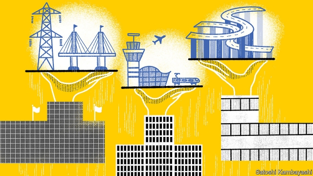

###### Reality cheque

# National development banks are back in vogue 

##### They want to be profitable, but are ill-equipped for the job 

 

> Mar 7th 2019 

TONY OKPANACHI could be a dealmaker in the City of London or on Wall Street. Smart tie, winning smile, he recounts his 28-year career as a high-flying financier, from his MBA to his last private-sector job as an executive at Ecobank, a pan-African lender. He says profits are important and dismisses handouts to small businesses as “government largesse”. Yet appearances can deceive. “I’m an economist by training, and a commercial banker by profession,” he says. “Now I’m a development banker.” 

Mr Okpanachi is the boss of Development Bank of Nigeria (DBN), a wholesale lender to small firms that started operating in 2017. His institution is part of a proliferation of national development banks (NDBs) worldwide. Kevin Gallagher, of Boston University, and Rogerio Studart, of the Federal University of Rio de Janeiro, believe there are more than 250, with total assets of $4.9trn, four times those of multilateral peers. Poor countries account for over three-quarters of the tally, but NDBs are also popular in the rich world. France and Canada have recently opened three between them. Myanmar and Ghana are rolling out new ones. Britain unusually, has no NDB—but some politicians want one. 

NDBs are a unique species. Generally state-owned, they lend in pursuit of missions set out by the government. They cater to those often neglected by commercial bankers, lending to small firms, farmers or exporters, or funding infrastructure projects. Many banks, such as Mr Okpanachi’s, seek to marry purpose with profitability. But achieving this in practice is not easy. 

The revival of NDBs follows decades of decline. After the second world war, states enlisted them to fund reconstruction (eg, Germany’s KfW) or to aid industrialisation (Brazil’s BNDES). But they soon found themselves at the centre of ideological battles. Proponents of state intervention saw them as plugging financing gaps. Opponents thought they distorted markets. As the free-market “Washington Consensus” gained ground in the 1980s, many banks shrank or were privatised. 

It took a global financial crisis in 2007-08 for the pendulum to swing back—and stop in the middle. “We’ve moved on from the cold war discourse of states v markets,” says Mr Studart. Policymakers now favour NDBs for their counter-cyclical role. In 2007-09 their combined loan portfolio increased by 36%, over three times faster than private peers. Their resilience reflects stable funding. Few rely on deposits, and state guarantees allow many to access markets cheaply. 

Even more popular is their role in funding infrastructure, which promises productivity gains. Colombia used one to spend billions on a 8,000km road programme. France’s Banque Publique d’Investissement channelled $12bn in equity and debt to 4,000 startups in 2017. 

The revamped model is winning support from both statist types, who enjoy regaining control over industrial policy, and liberals, who like funding entrepreneurs without pulling fiscal levers. It helps that NDBS form a broad church. A few are huge: China Development Bank manages $2.4trn—half the global total. Some are big fish in small ponds: Bhutan Development Bank runs a quarter of the Himalayan kingdom’s banking system. Half of NDBS target certain sectors; the rest have wider mandates. Their tastes for direct or wholesale lending also vary. 

What unites modern NDBS is a desire to solve market failures—in a market-friendly way. To do so they strive to adopt the best habits of their commercial peers. Many have become more professionally run. They try to keep teams lean and be profitable. They seek financial independence from their political patrons. Just a quarter receive regular budget transfers. Instead many rely on cheap loans from multilateral institutions and rich countries. Most also tap international debt markets. 

But few NDBS manage to escape gravity. Lending where others fear to tread is tricky. Assessing the riskiness of tiny firms, lengthy projects or new technologies requires skilled staff and sophisticated systems. Many NDBS lack these. They also seek to lend at affordable rates, so often underprice risk. Despite their cheap funding most have low profitability. Many have non-performing loan ratios above the national average. Some, like El Salvador’s Bandesal or Uganda Development Bank, see borrowers default on over a third of loans. 

Government funding guarantees are therefore key to their viability. That makes it essential that their operational independence is enshrined in strong governance. But that is not often so. Government appointees dominate boards. Mandates are loosely defined, leaving the allocation of funds vulnerable to influence by officials or private interests. Brazil offers a cautionary tale. BNDES used state subsidies to turbocharge lending, and its loan portfolio reached 10% of GDP in 2011. Much of it went into either “the pockets of shareholders” of recipient companies or “bad projects”, says Vinicius Carrasco, a former director. Inflation soared and a punitive rise in interest rates followed. Mr Carrasco was part of the team that oversaw a U-turn in 2016. 

A final compromise is the idea that NDBS’ jobs ought to be temporary. “The best success of a KfW programme is when it’s not necessary any more,” says Jörg Zeuner of the German development bank. The hope is that, as sectors and countries develop, NDBS use less direct forms of finance, such as guarantees, to “crowd in” commercial lenders—and then quietly move on. KfW has done this since 1948. But many NDBS lack the data or the framework to assess genuine progress. And some struggle to find relevant employment once their first job is done. If too many become solutions in search of a problem, the truce underpinning their revival could fray. 

-- 

 单词注释:

1.vogue[vәug]:n. 时尚, 时髦, 流行 a. 流行的, 时髦的 

2.tony['tәuni]:a. 高贵的, 时髦的 

3.dealmaker[]:n. 交易人 

4.recount[ri'kaunt]:vt. 详述, 叙述, 重新计算 n. 重新计算 

5.financier[fai'nænsiә]:n. 财政家, 金融家 vi. 从事欺骗性金融活动, 欺骗 

6.mba[]:abbr. 工商管理学硕士（Master of Business Administration）；海洋生物协会（Marine Biological Association）；主要战区（Main Battle Area） 

7.lender['lendә]:n. 出借人, 贷方 [经] 出借者, 贷方, 贷款人 

8.handout['hændaut]:n. 施舍物, 救济品, 分发的印刷品资料, 广告物品 

9.largesse[lɑ:'dʒes]:n. 慷慨的赠与, 慷慨赠与物, 慷慨的赏钱 

10.economist[i:'kɒnәmist]:n. 经济学者, 经济家 [经] 经济学家 

11.banker['bæŋkә]:n. 银行家, 庄家 [经] 银行业者, 银行家 

12.Nigeria[nai'dʒiriә]:n. 尼日利亚 

13.dbn[]:decibel (referred to 1 volt)分贝(以1伏特为零电平) 

14.wholesale['hәulseil]:n. 批发 a. 批发的, 大规模的 adv. 大规模, 照批发方式 vi. 经营批发业, 批发 vt. 批发 

15.proliferation[.prәulifә'reiʃәn]:n. 增殖, 激增 [医] 增生, 增殖 

16.ndbs[]:abbr. National Data Buoy System 国家数据浮标系统; network database subsystem 网络数据库子系统; networked database services 网络化数据库业务 

17.kevin['kenin]:n. 凯文（男子名） 

18.Gallagher[]:加拉格尔（人名） 

19.Boston['bɒstәn]:n. 波士顿 

20.rogerio[]:[网络] 罗杰里奥；罗格里奥；罗热里奥 

21.rio[]:n. 里约（巴西共和国的旧首都） 

22.de[di:]:[化] 非对映体过量 [医] 铥(69号元素铥的别名,1916年Eder离得的假想元素) 

23.Janeiro[]:n. （葡）一月 

24.asset['æset]:n. 资产, 有益的东西 

25.multilateral[.mʌlti'lætәrәl]:a. 多边的, 多国的 [经] 多边的, 涉及多方的 

26.peer[piә]:n. 同等的人, 匹敌, 贵族 vi. 凝视, 窥视, 费力地看, 隐现 vt. 与...同等, 封为贵族 

27.tally['tæli]:n. 符木, 记账, 得分, 比分, 计数器, 标签, 符合, 对应物 vt. 记录, 点数, 计算, 加标签于, 使符合 vi. 记帐, 符合, 吻合, 记分 [计] 计数 

28.Myanmar['mjænmɑ:(r)]:缅甸[东南亚国家](即Burma) 

29.Ghana['gɑ:nә]:n. 加纳 

30.specie['spi:ʃi]:n. 硬币 [经] 硬币 

31.exporter[ik'spɒ:tә]:n. 出口商, 输出者, 出口公司 [经] 出口商, 输出者 

32.infrastructure['infrәstrʌktʃә]:n. 基础结构, 基础设施 [经] 基础设施 

33.profitability[.prɒfitә'biliti]:n. 收益性, 利益率 [经] 可获利润率 

34.revival[ri'vaivl]:n. 复兴, 复活, 恢复精神, 苏醒 [医] 复苏, 回生, 精神重振 

35.enlist[in'list]:vt. 征募, 参与, 谋取 vi. 从军, 应募, 赞助 

36.reconstruction[.ri:kәn'strʌkʃәn]:n. 改造, 再建 [医] 改建, 改造, 翻造 

37.eg[]:abbr. [拉]例如（exempli gratia）；[网络用语]邪恶的笑（Evil Grin） 

38.kfw[]:abbr. Kreditanstalt fur Wiederaufbau （德语）复兴信贷银行 

39.industrialisation[ɪndʌstrɪəlaɪzeɪ'ʃən]:n. 工业化 

40.bndes[]:[网络] 发展银行；巴西国家发展银行；国家社会经济发展银行 

41.ideological[.aidiә'lɒdʒikәl]:a. 意识形态的, 空想的 [法] 思想的, 思想上的, 意识形态的 

42.proponent[prә'pәunәnt]:n. 建议者, 支持者 [法] 提议者, 辩护者, 支持者 

43.intervention[.intә'venʃәn]:n. 插入, 介入, 调停 [经] 干预 

44.distort[dis'tɒ:t]:vt. 扭曲, 歪曲 [法] 歪区, 曲解, 纂改 

45.Washington['wɒʃiŋtn]:n. 华盛顿 

46.privatise[p'rɪvətɪs]:vt. 使私有化 

47.pendulum['pendʒәlәm]:n. 钟摆, 摇锤, 摇摆不定的事态(或局面) [化] 摆 

48.discourse['diskɒ:s]:n. 谈话, 演讲 vi. 谈话, 讲述 

49.V[vi:]:[计] 溢出, 变量, 向量, 检验, 虚拟, 垂直 [医] 钒(23号元素) 

50.policymaker['pɔlisi.meikә]:n. 政策制定者；决策人 

51.portfolio[pɒ:t'fәuliәu]:n. 皮包, 公文包, 部长职务, 有价证券财产目录, 艺术代表作选辑 [法] 公文包, 文件夹, 阁员职务 

52.resilience[ri'ziliәns]:n. 弹回, 有弹力, 恢复力 [化] 回弹; 弹性; 弹回性; 回能; 弹能 

53.cheaply['tʃipli]:adv. 便宜地 

54.productivity[.prәudʌk'tiviti]:n. 生产力 [经] 生产率, 生产能力 

55.Colombia[kә'læmbiә]:n. 哥伦比亚 

56.banque[]:n. 麻醉药；宴会; (Banque)人名；(英)班克 

57.publique[]:[网络] 大众医学；公共；公有 

58.equity['ekwiti]:n. 公平, 公正 [经] 权益, 产权 

59.startup[]:[计] 启动 

60.revamp[ri:'væmp]:vt. 换新鞋面, 修理, 修补, 修改 [经] 整修, 补, 修改 

61.statist['steitist]:n. 统计学者, 中央集权论者 

62.regain[ri'gein]:vt. 取回, 恢复, 重回, 复得 [化] 回潮 

63.entrepreneur[.ɒntrәprә'nә:]:n. 企业家, 主办人 [经] 承包商, 企业家 

64.fiscal['fiskәl]:a. 财政的, 国库的 [经] 财政上的, 会计的, 国库的 

65.ndbs[]:abbr. National Data Buoy System 国家数据浮标系统; network database subsystem 网络数据库子系统; networked database services 网络化数据库业务 

66.Bhutan[bu:'tæn]:n. 不丹 

67.Himalayan[hi'mɒlәjәn]:a. 喜玛拉雅山的 

68.sector['sektә]:n. 扇形, 部门, 部分, 函数尺, 象限仪, 段, 区段 vt. 把...分成扇形 [计] 扇面; 扇区; 段; 区段 

69.mandate['mændeit]:n. 命令, 指令, 要求 vt. 委任统治 

70.strive[straiv]:vi. 努力, 奋斗, 斗争 

71.professionally[]:adv. 专业地；内行地 

72.patron['peitrәn]:n. 赞助人, 顾客, 保护人 [法] 保护人, 庇护人, 赞助人 

73.tread[tred]:n. 踏, 步态, 梯级, 交尾, 鞋底 vi. 踏, 行走, 交尾 vt. 踩, 踏, 践踏, 跳(舞) 

74.tricky['triki]:a. 狡猾的, 机敏的 

75.riskiness['riskinis]:n. 富有冒险性的事, 危险 

76.lengthy['leŋθi]:a. 冗长的, 漫长的 

77.sophisticate[sә'fistikeit]:n. 久经世故的人, 精于...之道的人 vt. 篡改, 曲解, 使变得世故, 掺合, 弄复杂 vi. 诡辩 

78.affordable[]:[计] 普及型 

79.underprice[ˌʌndə'praɪs]:vt. 使定价太低； 以低价与…竞争 

80.el[el]:abbr. 预期损失（Expected Loss） 

81.Uganda[ju(:)'^ændә, u:'^ændә]:n. 乌干达 

82.borrower['bɒrәuә]:n. 借用人, 剽窃者 [经] 借款人, 借用人 

83.default[di'fɒ:lt]:n. 违约, 不履行责任, 缺席, 默认值 v. 疏怠职责, 缺席, 拖欠, 默认 [计] 默认; 默认值; 缺省值 

84.viability[.vaiә'biliti]:n. 生存能力, 发育能力 [医] [生]活[能]力, 生机 

85.enshrine[in'ʃrain]:vt. 入庙祀奉, 铭记 

86.governance['gʌvәnәns]:n. 统治, 统辖, 管理 [法] 统治, 管理, 支配 

87.appointee[ә.pɒin'ti:]:n. 被任命者 [法] 被指定的人, 被任命者 

88.loosely['lu:sli]:adv. 松弛地, 宽松地, 不紧 

89.allocation[.ælәu'keiʃәn]:n. 配置, 分配, 拨给 [经] 分配, 拨款, 分摊 

90.vulnerable['vʌlnәrәbl]:a. 易受伤害的, 有弱点的, 易受影响的, 脆弱的, 成局的 [医] 易损的 

91.Brazil[brә'zil]:n. 巴西 

92.cautionary['kɒ:ʃәnәri]:a. 警告的 

93.turbocharge['t\\:bәjtʃɑ:dʒ]:vt.用涡轮给(发动机)增压 

94.shareholder['ʃєә.hәuldә]:n. 股东 [法] 股东, 股票持有人 

95.recipient[ri'sipiәnt]:a. 领受的, 容易接受的, 感受性强的 n. 领受者, 容纳者, 容器 

96.vinicius[]:[网络] 诗人莫拉埃斯；维尼休斯；维尼修斯 

97.carrasco[]:n. (Carrasco)人名；(捷、英、法、西、葡)卡拉斯科 

98.inflation[in'fleiʃәn]:n. 胀大, 夸张, 通货膨胀 [化] 充气吹胀; 膨胀 

99.soar[sɒ:]:n. 高扬, 翱翔 vi. 往上飞舞, 高耸, 翱翔 

100.punitive['pju:nitiv]:a. 刑罚的, 惩罚性的 [法] 刑罚的, 惩罚性的, 结予惩处的 

101.oversee[.әuvә'si:]:vt. 向下看, 了望, 监督, 偷看到 [法] 监察, 监督, 俯瞰 

102.zeuner[]: [人名] 佐伊纳 

103.les[lei]:abbr. 发射脱离系统（Launch Escape System） 

104.quietly['kwaiәtli]:adv. 安静地, 沉着地, 秘密地 

105.datum['deitәm]:n. 论据, 材料, 资料, 已知数 [医] 材料, 资料, 论据 

106.truce[tru:s]:n. 停战, 休战 vi. 停战, 休止 vt. 以休战结束 

107.underpin[.ʌndә'pin]:vt. 从下面支承, 支撑, 支持 [经] 支撑 

108.fray[frei]:n. 磨损, 打架, 争论 vt. 使磨损 vi. 被磨损 

