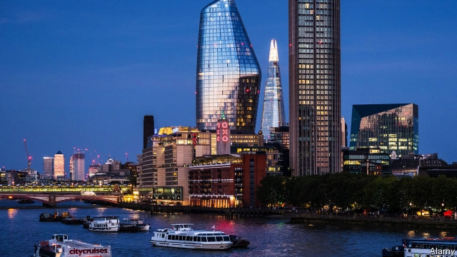
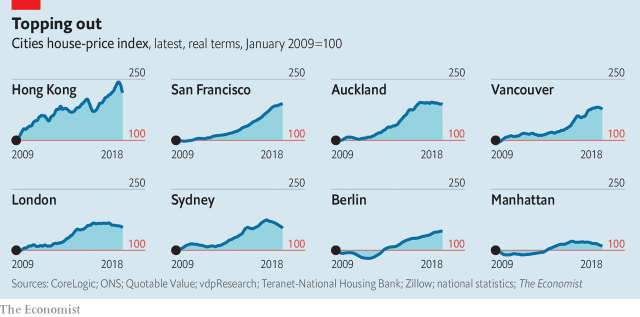

###### Prime cuts

# Prices of prime properties around the world are falling 

##### Swanky homes are now a global asset class 

 

> Mar 7th 2019 

ONE BLACKFRIARS soars into the sky from the south bank of the River Thames, announcing its presence to central London. The new 50-storey tower contains 274 luxury flats that range in value from a merely expensive £1m ($1.3m) to an eye-watering £15m. Thanks to its distinctive midriff the building has been nicknamed “The Tummy” by Robert Shiller, who won a Nobel economics prize for his work on spotting asset bubbles. The name might also apply to London’s bloated housing market. Prices have nearly doubled since 2009. 

It is not only in London that property values bulged in the decade after a housing bust that nearly took down the world’s financial system: prices are near new highs in many places, according to The Economist’s latest roundup of global housing markets (see chart). In five of the world’s most desirable cities—Hong Kong, London, New York, Sydney and Vancouver—home prices climbed steadily for several years after 2009. 

 

Now, though, particularly in the priciest, “prime” areas of such cities, excess is being shed. In Vancouver, where prime prices have fallen by 12% in the past year, agents bemoan hefty discounts on swanky properties. Michael Bublé, a chart-topping crooner, recently sold his West Vancouver pad for 28% less than the assessed value. Prices started falling in August in Hong Kong and have dropped by 9% since. Developers there were spooked when their bids for a vacant parcel of land in the world’s most expensive neighbourhood—aptly called “The Peak”—failed to meet the government’s reserve price in October. In Manhattan prices fell by 4.3% last year; StreetEasy, an online-listings firm, calculates that 60% of homes offered for $1m or more in 2018 failed to sell. In Sydney, prime prices have slipped by 16% since 2017. 

In London Savills, a consultancy, estimates that prime-property prices have fallen by 20% from their 2014 peak. Sales of homes worth over £1m are 20% lower than in 2016. Although Brexit has not helped, there are broader reasons for the slowdown, says Lucian Cook, head of research at Savills: falling cross-border capital flows; government policy; the cost of money; and increased supply. 

These factors are common to other global cities, too. Indeed, the IMF observes that house-price movements have become increasingly correlated across the world, and that the link is greater between big cities than between countries. That is because housing is becoming a more global asset class rather than a purely local one. The prevailing winds of the international marketplace affect prime residential property much as they do shares and bonds. The IMF notes that international correlation increases at the time of severe recessions and can help predict the risk of a downturn. 

One factor underlying that correlation is wealth creation. Thanks to a tech boom and a rapidly rising China, the world has minted new millionaires at a rate of 250 per hour for the past eight years. According to Credit Suisse, millionaires held 45% of the world’s household wealth in 2018, up from 36% in 2010. A good dollop of their money finds its way into posh properties, at home and abroad. But the Swiss bank reckons that the pace has been slowing: it forecasts that the rate of increase in the number of new millionaires will slow by a fifth in the five years to 2023. 

In China, home to one-sixth of the world’s new millionaires, it has become increasingly difficult to sneak money out of the country. In 2015-16, $1.3trn flowed out of China (excluding foreign direct investment). But the authorities have since cracked down on corruption among the elite and tightened enforcement of a limit of $50,000 per person on access to dollars and other foreign currencies. That has affected residential markets far and wide. America’s National Association of Realtors estimates that Chinese buyers spent $30bn on homes in America in the year to March 2018, down by 4% from a year earlier. In Australia, where international buyers are restricted to new-builds, Chinese investment in new development fell by 36% to A$1.3bn ($970m) in 2018. Yet the Chinese still account for a quarter of international buyers, as they do in London. 

Politicians have played their part, too. Egged on by disgruntled citizens who have found themselves priced out of urban markets, city and national governments have sought to cool market excesses. Vancouver raised its transaction tax on property purchases by non-residents from 15% to 20% in 2018. Britain’s government has increased transaction taxes. It levies as much as £288,000 on a £2.5m home purchase, up from £100,000 in 2010. It has also imposed extra taxes on non-citizens. New Zealand has gone furthest, introducing a blanket ban on foreign purchases of existing homes last October. 

The cost of money is also having a slimming effect. Monetary policy, loose for so long, is tightening. Liam Bailey of Knight Frank, another consultancy, notes that it now costs 65% more to service the mortgage on a $1m home in America than it did three years ago. Granted, luxury-property buyers often pay cash; but their appetite may be dulled by falling yields. According to MSCI IPD, a research firm, the gross rental yield on investible residential property fell below 5% for the first time in 2016. 

Yields have been forced down in part by the weight of supply. During the three years to 2016 investors would “throw money at anyone with personality, a pulse and a reasonable idea” for a new development in London, says Jonathan Vandermolen, a property consultant. Manhattan is similarly awash with luxury, largely thanks to the new fad for “super skinny” apartments that rise from tiny footprints in Midtown. Some 8,600 luxury units are for sale—six years’ inventory at current selling rates. 

Taken together, these factors reflect a world in which “slowbalisation”—the unwinding of two decades of global economic integration—has taken hold. Although less well-heeled residents of those cities will be glad of a fall in prices, a cooling of foreign interest may have unwelcome consequences for the wider market. A report in 2017 by the London School of Economics, commissioned by London’s mayor, found that, on balance, international investment in the city’s residential property helped to create housing supply that would otherwise not have materialised. 

Meanwhile, estate agents, whose duty it is to be eternally optimistic, contend that these markets cannot lie low for long. The theory goes that these cities are desirable for a reason and that land is limited; so prices will recover. This argument has a kernel of truth. Demand for property chronically outstrips supply in Hong Kong, for example, and investors from mainland China feel safer there. Yet any rebound is unlikely to be as strong as the last one: Savills reckons London’s prime-property prices will be more measured in future. 

Fortunately for estate agents, there will always be some who do not read the memo. Ken Griffin, a hedge-fund titan, recently bought 3 Carlton Gardens, near Pall Mall, for close to £100m, the most paid for a London home in over a decade. He went on to pay a record $238m for a Manhattan pad. When a determined plutocrat is in the mood, it can be hard to stop him. 

-- 

 单词注释:

1.swanky['swæŋki]:a. 爱出风头的, 炫耀的 

2.asset['æset]:n. 资产, 有益的东西 

3.blackfriar[]:n. (多明我教会)的修道士 [网络] 黑衣修士；黑修士；道明会的修道士 

4.soar[sɒ:]:n. 高扬, 翱翔 vi. 往上飞舞, 高耸, 翱翔 

5.Thame[]:泰姆（人名） 泰姆市（地名） 

6.distinctive[di'stiŋktiv]:a. 有特色的, 出众的 

7.midriff['midrif]:n. 膈, 上腹部 [医] 膈 

8.nickname['nikneim]:n. 绰号, 昵称 vt. 给...取绰号, 叫错名字 [计] 绰号 

9.tummy['tʌmi]:n. 胃, 肚子 

10.Robert['rɔbәt]:[法] 警察 

11.shiller[]:[网络] 希勒；经济学家；非理性繁荣 

12.Nobel['nәubel]:n. 诺贝尔 

13.bloat[blәut]:vt. 使膨胀, 腌制, 使自大 vi. 膨胀, 肿起 n. 肿胀病人 

14.bulge[bʌldʒ]:n. 胀, 膨胀 vi. 凸出 vt. 使膨胀 

15.bust[bʌst]:n. 半身像, 胸部, 失败, 殴打 vt. 使爆裂, 使破产 vi. 爆裂, 破产 [计] 操作错 

16.roundup['raundʌp]:n. 驱集, 集拢, 综述 

17.kong[kɔŋ]:n. 含锡砾石下的无矿基岩；钢 

18.york[jɔ:k]:n. 约克郡；约克王朝 

19.sydney['sidni]:n. 悉尼（澳大利亚港市） 

20.pricy['praisi]:a. 昂贵的, 价格高的 

21.vancouver[væn'ku:vә]:n. 温哥华（加拿大主要港市） 

22.bemoan[bi'mәun]:vt. 哀悼, 惋惜, 认为遗憾, 哀叹 

23.hefty['hefti]:a. 重的, 肌肉发达的 

24.swanky['swæŋki]:a. 爱出风头的, 炫耀的 

25.michael['maikl]:n. 迈克尔（男子名） 

26.crooner['kru:nә(r)]:n. 低声哼唱伤感歌曲的歌手 

27.les[lei]:abbr. 发射脱离系统（Launch Escape System） 

28.hong[hɔŋ]:n. （中国、日本的）行, 商行 

29.developer[di'velәpә]:n. 开发者 [计] 显影器 

30.spook[spu:k]:n. 幽灵, 鬼 vt. 惊吓, 鬼怪般地出没 vi. 惊吓而逃窜, 受惊 

31.Manhattan[mæn'hætәn]:n. 曼哈顿 

32.savill[]: [人名] [英格兰人姓氏] 萨维尔 Saville的变体 

33.consultancy[]:n. 商量, 协商, 磋商, 会诊, 与...商量, 咨询, 请教, 找(医生)看病, 查阅, 考虑 [经] 咨询业务, 咨询服务 

34.Brexit[]:[网络] 英国退出欧盟 

35.slowdown['slәudaun]:n. 降低速度, 减速 

36.lucian['lu:sjәn]:n. 琉善（腊修辞学家和讽刺诗人）；卢西恩（男子名） 

37.IMF[]:国际货币基金组织 [经] 国际货币基金 

38.correlate['kɒrәleit]:n. 有相互关系的东西, 相关物 vt. 使有相互关系 vi. 相关 

39.marketplace['mɑ:kit'pleis]:n. 市场 

40.residential[.rezi'denʃәl]:a. 住宅的, 与居住有关的 [法] 有关居住的, 房产的:居所的, 适于居住的 

41.correlation[.kɒrә'leiʃәn]:n. 相互关系, 相关, 关联 [医] 相关, 联系 

42.recession[ri'seʃәn]:n. 后退, 凹处, 衰退, 归还 [医] 退缩 

43.downturn['dauntә:n]:n. (尤指经济方面的)衰退, 下降趋势 [电] 低迷时期 

44.underlie[.ʌndә'lai]:vt. 位于...之下, 成为...的基础 

45.creation[kri:'eiʃәn]:n. 创造, 创作物, 发明 [化] 产生 

46.tech[tek]:n. 技术学院或学校 

47.mint[mint]:n. 薄荷, 造币厂, 巨额 vt. 铸造, 铸币, 制造 

48.Suisse[swi:s]:<法> = Switzerland 

49.dollop['dɒlәp]:n. 块, 团 

50.posh[pɒʃ]:a. 豪华的, 漂亮的, 优雅的, 极好的 interj. 呸 

51.reckon['rekәn]:vt. 计算, 总计, 估计, 认为, 猜想 vi. 数, 计算, 估计, 依赖, 料想 

52.sneak[sni:k]:vi. 鬼鬼祟祟做事 vt. 偷偷地做 n. 鬼鬼祟祟的人, 偷偷摸摸的行为, 帆布胶底运动鞋 a. 暗中进行的 

53.corruption[kә'rʌpʃәn]:n. 腐败, 堕落, 贪污 [计] 论误 

54.elite[ei'li:t]:n. 精华, 精锐, 中坚分子 

55.tighten['taitn]:vt. 勒紧, 使变紧 vi. 变紧, 绷紧 

56.enforcement[in'fɒ:smәnt]:n. 执行, 强制 [法] 实施, 加强, 厉行 

57.realtor['riәltә]:n. 房地产经纪人 [法] 房地产经纪人 

58.buyer['baiә]:n. 买主, 买方 [经] 买主, 买方, 买手 

59.disgruntle[dis'grʌntl]:vt. 使不高兴 

60.transaction[træn'sækʃәn]:n. 交易, 办理, 学报, 和解协议 [计] 事务处理 

61.levy['levi]:n. 税款, 所征的人数, 征收 vi. 征税, 课税 vt. 征收, 强求, 召集 

62.zealand['zi:lәnd]:n. 西兰岛（丹麦最大的岛） 

63.monetary['mʌnitәri]:a. 货币的, 金钱的 [经] 货币的, 金融的 

64.Liam[liæm]:n. 利亚姆（男子名） 

65.bailey['beili]:n. 城郭, 外栅 

66.knight[nait]:n. 骑士, 爵士 vt. 授以爵位 

67.mortgage['mɒ:gidʒ]:n. 抵押, 约束性义务, 抵押借款 vt. 抵押, 以...作担保, 把...许给 

68.msci[]:abbr. medium scale compound integration 中规模混合集成; multi-protocol serial communications interface 多协议串行通信接口 

69.ipd[]:abbr. insertion phase delay 插入相位延迟 

70.rental['rentl]:n. 租费, 租金收入 a. 租赁的, 收取租金的 

71.investible[]: 可供投资的 

72.investor[in'vestә]:n. 投资者 [经] 投资者 

73.jonathan['dʒɔnәθәn]:n. 乔纳森（男子名） 

74.awash[ә'wɒʃ]:a. 与水面齐平的, 被浪冲打的 

75.fad[fæd]:n. 时尚 [化] 黄素腺嘌呤二核苷酸 

76.skinny['skini]:a. 似皮的, 极瘦的, 少的, 小气的 [医] 皮的; 消瘦的 

77.footprint['futprint]:n. 足迹 [计] 印迹 

78.midtown['midtajn]:n. 商业区与住宅区之间的地区 

79.inventory['invәntәri]:n. 详细目录, 存货清单 vt. 列入详细目录, 清点存货 [计] 存货清单 

80.unwind[.ʌn'waind]:vt. 展开 [化] 拆卷; 开卷 

81.unwelcome[ʌn'welkәm]:a. 不受欢迎的, 讨厌的 n. 冷淡 vt. 冷淡地对待, 冷淡地接受 

82.materialise[mә'tiәriәlaiz]:vi.vt. (使)物质化, (使)具体化, (使)追求物质利益, (使)显形, 成为事实, 实现 vi. 突然出现 

83.eternally[i't\\:nәli]:adv. 永恒地, 常常 

84.contend[kәn'tend]:vi. 奋斗, 斗争, 竞争 vt. 为...斗争 

85.cannot['kænɒt]:aux. 无法, 不能 

86.kernel['kә:nl]:n. 核心, 中心, 精髓, 内核 [计] 内核 

87.chronically['krɒnikli]:adv. 慢性地, 长期地, 习惯性地 

88.outstrip[.aut'strip]:vt. 追过, 胜过, 凌驾 

89.rebound[ri'baund]:vi. 弹回, 返回, 产生事与愿违的结果 vt. 使弹回, 使返回 n. 反弹, 返回, 篮板球, 振作 rebind的过去式和过去分词 

90.alway['ɔ:lwei]:adv. 永远；总是（等于always） 

91.memo['memәu]:n. 备忘录 [经] 备忘录 

92.ken[ken]:n. 视野范围, 知识范围, 见地 

93.griffin['^rifin]:n. 新手, 未经世故的人 

94.Titan['taitn]:n. 提坦, 太阳神, 巨人 

95.carlton['kɑ:ltәn]:n. 卡尔顿（男子名, 姓氏） 

96.pall[pɒ:l]:n. 棺罩, 柩衣, 遮盖物 vi. 失去吸引力, 乏味 vt. 覆盖, 使笼罩阴影, 使乏味 

97.mall[mɔ:l]:n. 林荫路 

98.plutocrat['plu:tәkræt]:n. 富豪, 财阀 

