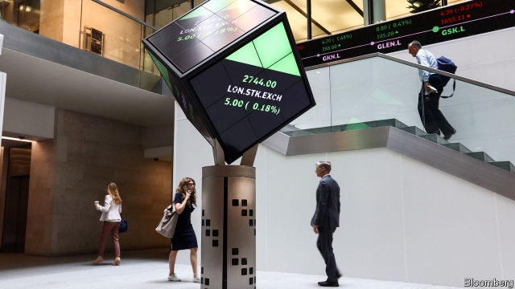
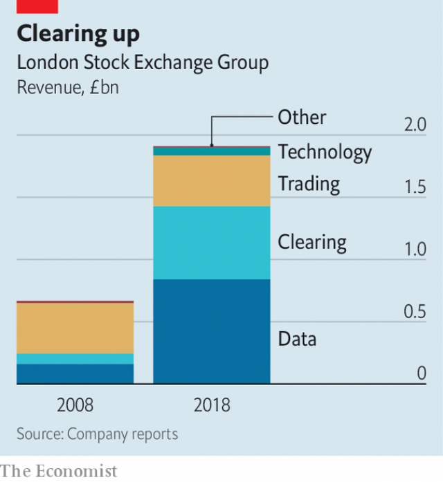

###### Having its cake

# The London Stock Exchange is thriving despite Brexit 

##### Europe’s largest trading venue has become a data business 

 

> Mar 7th 2019 

WHEN LSE Group, the parent company of the London Stock Exchange, Europe’s largest, released its 2018 annual results on March 1st, there was an elephant on the trading floor. During the hour-long earnings call, LSE’s boss, David Schwimmer, mentioned Brexit just eight times. Six of those occasions came after slide 28. 

Mr Schwimmer need not have been so cautious. Britain may be in political turmoil and banks may be shifting jobs and assets out of London, but Brexit is doing little to perturb LSE. Last year the group’s revenue grew by 8% and its operating profit by 15%. Its share price is up by 22% since December. LSE did announce 250 job cuts, 5% of its staff, but after 27 acquisitions and investments in the past decade, it has some tidying to do. It retains five different offices in New York, for example. 

In theory, Brexit chaos could harm the exchange, either because investors shun British companies or because they are too nervous to trade at all. Yet last year they traded more, as they swapped racier holdings for more defensive stocks. Opportunistic buyers also jumped in. Because the LSE collects a fee on every transaction, volatility has meant more money coming in. 

More important, it has diversified away from cyclical activities since the financial crisis of 2007-08. Trading now accounts for a mere fifth of revenue (see chart). Twice as much comes from selling data feeds, a steady business. The rise of quantitative funds and passive investing has increased demand for data products, for which clients pay an annual fee. In 2014 LSE paid $2.7bn for Frank Russell, an index compiler, which it combined with FTSE, its own index business. The joint unit now ranks among the world’s top three index providers to exchange-traded funds, a market that has lured $3.3trn over the past decade. 

 

Some 31% of revenue comes from clearing trades. Regulators have pushed for derivatives contracts—which investors use to hedge borrowing costs, currencies or commodity prices—to be settled in clearing houses, arguing it makes the system safer. These middlemen sit between buyers and sellers, holding collateral lest either side default. LSE owns LCH, a platform that clears over $3trn daily and boasts 90% of the interest-rate swap market. 

The EU has long hinted it could seek to repatriate euro-denominated clearing after Brexit. But last month the bloc’s market regulator granted one-year licences to British clearing houses, permitting EU-based traders to continue using them even if a hard Brexit prevails. America has since said its traders would be allowed to do the same. So LCH’s business looks safe for now. European rivals such as Deutsche Börse, which are trying hard to lure clearing away from London, have so far had little success. 

LSE is an attractive takeover candidate. It is a scarce asset: other big exchanges are politically impossible to buy. That doesn’t make it an easy win, though. Since 2001 it has seen off four hostile bids. An agreed merger with Deutsche Börse collapsed in acrimony in 2017. Still, some firms may fancy their chances. ICE, which owns the New York and Paris stock exchanges, is in pole position to try, says Chris Turner of Berenberg, a broker. TCI, a hedge fund, predicts a £15bn ($20bn) bid. Exchanges may be shy of discussing politics, yet they could end up building bridges across both the Channel and the Atlantic. 

-- 

 单词注释:

1.Brexit[]:[网络] 英国退出欧盟 

2.venue['venju:]:n. 犯罪地点, 审判地, 发生地点 

3.datum['deitәm]:n. 论据, 材料, 资料, 已知数 [医] 材料, 资料, 论据 

4.lse[]:abbr. 伦敦证券交易所（London Stock Exchange）；伦敦大学经济政治学系（ 	London School of Economics and Political Science）；伦敦政经学院（London School of Economics） 

5.earning['ә:niŋ]:n. 收入（earn的现在分词） 

6.david['deivid]:n. 大卫；戴维（男子名） 

7.schwimmer[]: [人名] 施维默 

8.turmoil['tә:mɒil]:n. 骚动, 混乱 

9.asset['æset]:n. 资产, 有益的东西 

10.perturb[pә'tә:b]:vt. 扰乱, 使混乱, 使心绪不宁 

11.york[jɔ:k]:n. 约克郡；约克王朝 

12.chao[]:n. 钞（货币） 

13.investor[in'vestә]:n. 投资者 [经] 投资者 

14.shun[ʃʌn]:vt. 避开, 规避, 避免 

15.racy['reisi]:a. 保持原味的, 活泼的, 生动的, 为竞赛设计的 

16.holding['hәuldiŋ]:n. 把持, 支持, 保持 [法] 租借地, 占有物, 拥有的财产 

17.defensive[di'fensiv]:a. 防卫的, 防备用的, 自卫的 n. 守势, 防卫姿势, 防卫物 

18.opportunistic[.ɒpәtju:'nistik]:a. 机会主义的, 投机取巧的 

19.buyer['baiә]:n. 买主, 买方 [经] 买主, 买方, 买手 

20.transaction[træn'sækʃәn]:n. 交易, 办理, 学报, 和解协议 [计] 事务处理 

21.volatility[.vɒlә'tiliti]:n. 挥发性, 挥发度, 轻快, 易变, 短暂 [计] 变更率 

22.diversify[dai'vә:sifai]:vt. 使多样化, 使变化 

23.cyclical['siklik(e)l]:a. 周期的, 轮转的, 循环的, 轮列的, 轮卷的, 环状的, 环的, 组诗的, 始末的 [计] 循环的 

24.quantitative['kwɒntitәtiv]:a. 数量的, 定量的 [医] 定量的, 数量的 

25.client['klaiәnt]:n. 客户, 顾客, 委托人 [计] 客户, 客户机, 客户机程序 

26.russell['rʌsәl]:n. 拉塞尔（英国工程师, 整流器发明人） 

27.compiler[kәm'pailә]:n. 编辑者 [计] 编译程序 

28.ftse[]:abbr. failed to sustain engraftment 支撑移植物植入失败 

29.provider[prә'vaidә]:n. 供应者, 供养人, 伙食承办人 [计] 提供器 

30.lure[luә]:n. 饵, 诱惑 vt. 引诱, 诱惑 

31.regulator['regjuleitә]:n. 调整者, 校准者, 校准器, 调整器, 标准钟 [化] 调节剂; 调节器 

32.derivative[di'rivәtiv]:a. 引出的, 派生的 n. 引出之物, 派生物, 衍生字 

33.commodity[kә'mɒditi]:n. 农产品, 商品, 有用的物品 [经] 商品, 货物, 日用品 

34.middleman['midlmæn]:n. 中间人 [法] 调解人, 中间人, 中人 

35.collateral[kә'lætәrәl]:a. 并行的, 附随的, 旁系的 n. 旁系亲属, 担保品 

36.default[di'fɒ:lt]:n. 违约, 不履行责任, 缺席, 默认值 v. 疏怠职责, 缺席, 拖欠, 默认 [计] 默认; 默认值; 缺省值 

37.LCH[]:abbr. 小扁豆血凝素（lens culinaris hemagglutinin） 

38.EU[]:[化] 富集铀; 浓缩铀 [医] 铕(63号元素) 

39.repatriate[ri:'pætrieit]:vt. 把...遣返 vi. 回国 n. 被遣返回国者 

40.trader['treidә]:n. 商人, 商船 [经] 交易者, 商船 

41.deutsche[]:n. 德意志联邦共和国马克 

42.takeover[]:n. 接管, 接收 [经] 接收 

43.politically[]:adv. 政治上 

44.merger['mә:dʒә]:n. 合并, 归并 [经] 购并 

45.acrimony['ækrimәni]:n. 严厉, 尖刻 [医] 辛辣 

46.chris[kris]:n. 克里斯（男子名）；克莉丝（女子名） 

47.turner['tә:nә]:n. 车工, 体育协会会员 

48.Berenberg[]:贝伦贝格 

49.broker['brәukә]:n. 掮客, 经纪人 [经] 经纪人, 掮客 

50.tci[]:abbr. trip-cancellation insurance 取消旅行保险 

51.politic['pɒlitik]:a. 精明的, 明智的, 策略的 

