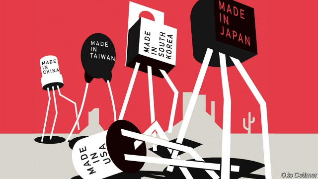

###### Free exchange

# Why did the China shock hurt so much? 

##### For the same reason that earlier ones hurt less 

 

> Mar 7th 2019 

THE PEOPLE of Des Moines, Iowa, are no strangers to economic upheaval. When a wave of Japanese imports arrived in America in the 1980s, their city was one of the places most vulnerable to the new competition. In 1974, 4,500 of them worked at making farm machinery and equipment. As many again made tyres and inner tubes. By 1990 only a little over half of those jobs were left. Yet in the intervening 16 years thousands of new jobs had sprouted, in life insurance, building materials and the restaurant trade. In 1990 Des Moines’ unemployment rate was below 4%, less than the national average of 5.6%. 

Not everyone fared as well. Mary Kate Batistich and Timothy Bond, of Purdue University, have recently estimated that the “Japan shock” explains about one-fifth of the fall in African-Americans’ labour-force participation between 1970 and 1990. But Des Moines’ experience was typical. Kerwin Kofi Charles, Erik Hurst and Mariel Schwartz, of the University of Chicago, found that local declines in manufacturing employment in the 1980s were not associated with increases in local unemployment rates. 

That may surprise someone familiar with research on the impact on America of trade with China in the 1990s and 2000s. Mr Charles and his colleagues also concluded that in the 2000s jobless rates tended to rise when manufacturing employment fell. In a well-known paper in 2016, David Autor, David Dorn and Gordon Hanson found that a wave of Chinese imports kicked exposed workers out of their jobs and left some on the disability rolls. Even their marriage prospects suffered. 

Why did competition from China hurt so much more than that from Japan a generation before? In another new study Katherine Eriksson, Katheryn Russ and Minfei Xu, of the University of California, Davis, and Jay Shambaugh, of George Washington University, sift the evidence and conclude that vulnerability to trade shocks depends on when and where they strike. Whereas earlier shocks—first from Japan, then from the “tiger” economies of East Asia—affected areas that were at that time relatively resilient to change, the China shock hit places that were less able to adapt. 

The thesis rests on the idea of production cycles, and the journey from the frontiers of innovation to the backwaters of standardisation. Whizzy gadgets are at the cutting edge when they first appear, but eventually become humdrum. As processes settle down and become standardised, and once-novel gizmos become commodities, the location of production shifts too, away from innovation hotspots with better-educated populations towards communities that might not cope so well if jobs disappear. 

Manufacturing employment blossomed at the beginning of the 20th century in places where people tended to be better educated and which produced more patents per person than the average. But as the decades passed and manufacturing employment spread, the correlation with patenting and education weakened. Ms Eriksson and her co-authors find that the import shocks from Japan and East Asia of the 1970s and 1980s hit products that were relatively early in their innovation cycles, such as video and audio equipment. They were made in places that boasted above average numbers of patents per person. Places making products exposed to Japan seemed to have been doing particularly well. They enjoyed above-average levels of income and education levels and below-average rates of unemployment. 

The China shock was different. Production in affected industries—this time, for example, toys and shoes—had indeed started out in places with relatively well-off, well-educated workers where patenting was relatively concentrated. Had the shock hit in 1960, 40-50 years before it did, it would have landed on fairly rosy-looking towns. But by 1990 production had already shifted to districts with above-average unemployment, below-average education and no greater propensity for patenting than the country as a whole. 

The authors argue that the China shock hurt so much because it whacked people who were already struggling. Areas with fewer college-educated workers suffered bigger dents in labour-force participation. And workers in places where industries were already moving out proved the least nimble. Employment fell by more in places where jobs in exposed industries had declined between 1960 and 1980. 

Other studies have delved into why the China shock hurt so much. Messrs Autor, Dorn and Hanson describe how the places hit hardest took their suppliers down with them, hurting whole communities. Nicholas Bloom of Stanford University and three co-authors found that, although imports from China did support some new jobs (eg, by providing cheaper inputs), they did not grow in the areas where vulnerable jobs were lost. While places like Des Moines dodged the China shock and some towns gained from the cheaper inputs, others were left to flounder. 

As negotiators try to rewrite the terms of Sino-American trade, it may be tempting to conclude that America has paid too high a price for China’s entry into the global trading system. Japan was much richer in the 1980s than China was in the early 2000s; America should have protected its exposed industries. A more helpful conclusion is that politicians should take more care to equip workers labouring far from the innovation frontier to adapt to shocks to their industries—from import competition or anywhere else. 

Politicians might learn another lesson, too. Their response to shocks can usually only speed up or slow down broader structural trends. Even without the China shock, toymaking would have moved somewhere else, some time. Cranking tariffs up or down may offer politicians the temporary sense that they can control foreign competition, but the costs of protection will be borne elsewhere in the economy, largely unseen. And the world will meanwhile move on regardless. 

-- 

 单词注释:

1.les[lei]:abbr. 发射脱离系统（Launch Escape System） 

2.de[di:]:[化] 非对映体过量 [医] 铥(69号元素铥的别名,1916年Eder离得的假想元素) 

3.moines[]:[网络] 雷神 

4.Iowa['aiәwә]:n. 衣阿华州 

5.upheaval[ʌp'hi:vl]:n. 举起, 隆起, 大变动, 剧变 

6.vulnerable['vʌlnәrәbl]:a. 易受伤害的, 有弱点的, 易受影响的, 脆弱的, 成局的 [医] 易损的 

7.machinery[mә'ʃi:nәri]:n. 机器, 机械装置, 机构 [化] 机械 

8.intervene[.intә'vi:n]:vi. 插入, 调停, 干涉 [经] 进场干预 

9.sprout[spraut]:n. 芽, 萌芽 vt. 使发芽, 摘去芽 vi. 长芽, 抽条 

10.mary['meәri]:n. 玛丽（女子名） 

11.kate[keit]:n. 凯特（女子名, 等于Catherine） 

12.timothy['timәθi]:n. 梯牧草 [医] 梯牧草, 牛草 

13.purdue[]:n. 普杜大学（美国一所大学） 

14.participation[.pɑ:tisi'peiʃәn]:n. 参与, 分享 [经] 参与, 参股 

15.kerwin[]: [男子名] 克尔温来源于日耳曼语，含义是“爱+朋友”(love+friend) 

16.kofi[]:n. (Kofi)人名；(法、加纳)科菲 

17.charle[]:n. 查理（男子名）；查理（姓氏） 

18.erik[]:n. 埃里克（姓氏） 

19.hurst[hә:st]:n. 小丘, 小树林, 沙洲 

20.mariel[mɑ:'riəl]:n. 马里埃尔（古巴西部港市） 

21.schwartz[ʃwɑ:ts]:n. 施瓦兹（姓氏）；史华兹（姓氏） 

22.Chicago[ʃi'kɑ:gәu]:n. 芝加哥 

23.manufacturing[.mænju'fæktʃәriŋ]:n. 制造业 a. 制造业的 

24.jobless['dʒɔblis]:a. 失职的, 无职业的 [经] 失业的 

25.david['deivid]:n. 大卫；戴维（男子名） 

26.autor[]:n. 奥特尔（姓氏） 

27.Dorn[]:n. 多恩（男子名） 

28.Gordon['^ɔ:dn]:[计] 哥尔丹 

29.hanson[]:n. 韩氏兄弟合唱团（美国乐队组合）；汉森（姓氏） 

30.katherine[]:n. 凯瑟琳（女子名） 

31.Eriksson[]:埃里克松（人名） 

32.katheryn[]:n. 【女名】女子名 [网络] 凯瑟琳；凯萨琳；凯西 

33.russ[rʌs, ru:s, rjs]:a. 俄国的；俄国人的；俄国语的 

34.xu[su:]:n. 北越货币单位；许（姓氏） 

35.California[.kæli'fɒ:njә]:n. 加利福尼亚 

36.davis['deivis]:n. 戴维斯（男子名） 

37.jay[dʒei]:n. 鸟, 喋喋不休的人, 傻瓜 

38.shambaugh[]: [人名] 香博 

39.george[dʒɔ:dʒ]:n. 乔治（男子名）；自动操纵装置；英国最高勋爵勋章上的圣乔治诛龙图 

40.Washington['wɒʃiŋtn]:n. 华盛顿 

41.sift[sift]:vt. 筛, 过滤, 撒, 详查 vi. 筛, 被筛下, 精选 

42.vulnerability[.vʌlnәrә'biliti]:n. 易受伤, 易受责难, 易受伤部位 [医] 易损性 

43.resilient[ri'ziliәnt]:a. 弹回的, 有弹力的 [医] 回弹的, 回能的 

44.thesis['θi:sis]:n. 论题, 论文 

45.innovation[.inәu'veiʃәn]:n. 改革, 创新 [法] 创新, 改革, 刷新 

46.backwater['bæk.wɒ:tә]:n. 死水, 滞水, 停滞, 回水 

47.standardisation[,stændədai'zeiʃən, -di'z-]:n. 标准化 

48.whizzy[ˈwɪzi]:a. 采用最新技术的 

49.gadget['gædʒit]:n. 小配件, 小玩意, 诡计 

50.humdrum['hʌmdrʌm]:a. 平凡的, 单调的, 令人厌烦的 n. 平凡, 单调, 无聊 vi. 单调令味地进行 

51.standardise[]:vt. 使与标准比较, 用标准校验, 使符合标准, 使统一, 使标准化 

52.gizmo['gizmәu]:n. 小发明, 小玩意儿 

53.commodity[kә'mɒditi]:n. 农产品, 商品, 有用的物品 [经] 商品, 货物, 日用品 

54.hotspot[]:n. 热区；热点 

55.manufacturing[.mænju'fæktʃәriŋ]:n. 制造业 a. 制造业的 

56.correlation[.kɒrә'leiʃәn]:n. 相互关系, 相关, 关联 [医] 相关, 联系 

57.propensity[prә'pensәti]:n. 倾向, 爱好, 习性 

58.whack[hwæk]:vt. 猛击, 重打, 削减 vi. 重击 n. 重击, 重打 

59.dent[dent]:n. 凹痕 vt. 使凹下, 削弱 vi. 塌陷 

60.nimble['nimbl]:a. 敏捷的, 伶俐的, 聪明的 

61.delve[delv]:v. 探究, 查考 n. 坑, 穴 

62.Messrs['mesәz]:[法][pl. ](=Messieurs)各位(先生) 

63.supplier[sә'plaiә]:n. 供应者, 供给国, 供应商 [化] 承制厂; 供应厂商 

64.nicholas['nikәlәs]:n. 尼古拉斯（男子名） 

65.stanford['stænfәd]:n. 斯坦福（姓氏, 男子名）；斯坦福大学（美国一所大学） 

66.eg[]:abbr. [拉]例如（exempli gratia）；[网络用语]邪恶的笑（Evil Grin） 

67.dodge[dɒdʒ]:v. 避开, 躲避 n. 诡计, 躲藏 

68.flounder['flaundә]:vi. 挣扎, 折腾；错乱地做事或说话 

69.negotiator[ni'gәuʃieitә]:n. 磋商者, 交涉者, 议定者 [经] 谈判者, 交易者, 协商者 

70.toymaking[]:adj. 制造玩具的 [网络] 玩具制造；玩具是；玩具制作 

71.crank[kræŋk]:a. 不稳的, 脾气暴燥的, 易怒的 n. 曲柄, 奇想 vt. 装曲柄 vi. 转动曲柄 

72.tariff['tærif]:n. 关税, 关税表, 价格表, 收费表 vt. 课以关税 [计] 价目表 

73.unseen[.ʌn'si:n]:a. 未被看见的, 看不见的 

