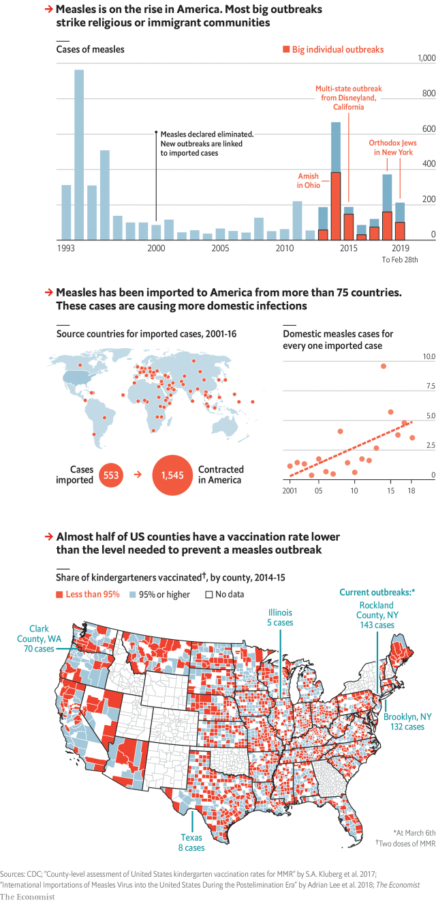

###### Fever pitch

# Measles outbreaks in America are getting harder to contain 

##### The biggest have occurred among insular religious or immigrant groups 

 

> Mar 9th 2019 

IN 2000 AMERICA declared measles “eliminated”, meaning that the virus was no longer indigenous and any new infections were linked to strains brought in from abroad. In the following decade measles in America remained rare. Now cases are on the rise again. There were 372 in 2018, the second highest number since 1996. Over 200 were reported in the first two months of this year. Though the disease is rarely deadly, it often requires hospitalisation. 

Most recent large outbreaks have been in insular religious or immigrant groups, such as the Amish, Orthodox Jews and Somali-Americans. Some had been lectured or leafleted by crackpots who claim that vaccines are harmful. They are easy prey for such conspiracy theories because language and cultural barriers keep them at a distance from mainstream health care. Low vaccination rates have made them hotspots for outbreaks, often ignited by measles picked up on visits to relatives in countries where the disease is widespread. 

Imported cases have arrived from more than 75 countries, sparking outbreaks across America. Rapid action by public-health SWAT-like teams keeps the virus from spreading. The teams trace everyone who has been near the measles patient in the eight-day contagious period—and make sure that each contact is quarantined or immunised. Nine in ten people who are not immune would contract measles if exposed to it. The virus can linger in the air for hours. 

Containing outbreaks is becoming harder. The number of measles cases contracted in America for each imported case is increasing. A tally in 43 states in 2014-15 found that in nearly half of counties the rate of measles vaccination of children entering kindergarten was below the 95% needed to prevent an outbreak. Things may have got worse since. Almost all states allow parents to exempt their children from jabs by declaring a religious objection to vaccines; 17 states allow “philosophical” objections, too. In 2017-18 such non-medical exemptions were used for 2.2% of schoolchildren, double the rate in 2010-11. 

As long as parents’ choice is put before public health, stopping measles from spreading in America will be a laborious, costly task. Washington, one of the states battling an outbreak now, has spent more than $1m to curb contagion since an imported measles case arrived in January. 

-- 

 单词注释:

1.measles['mi:zlz]:n. 麻疹, 风疹, 家畜囊尾蚴病, 米珠 [医] 麻疹, 囊尾蚴病(家畜) 

2.outbreak['autbreik]:n. 爆发, 暴动 [医] 暴发 

3.insular['insjulә]:a. 岛的, 岛民的, 与世隔绝的, 孤立的, 保守的 [医] 岛的, 胰岛的, 脑岛的 

4.measles['mi:zlz]:n. 麻疹, 风疹, 家畜囊尾蚴病, 米珠 [医] 麻疹, 囊尾蚴病(家畜) 

5.indigenous[in'didʒinәs]:a. 本土的, 国产的, 固有的 [医] 原产的, 本土的 

6.infection[in'fekʃәn]:n. 传染, 影响, 传染病 [医] 传染, 感染 

7.hospitalisation[,hɔspitәlai'zeiʃәn;-li'z-]:n. <主英>=hospitalization 

8.amish['ɑ:miʃ]:n. 孟诺教派；孟诺教派之教徒 

9.orthodox['ɒ:θәdɒks]:a. 正统的, 传统的, 惯常的 

10.Jew[dʒu:]:n. 犹太人, 守财奴, 犹太教信徒 vt. 欺骗, 杀价 

11.crackpot['krækpɒt]:a. 想入非非的, 不切实的 n. 疯子, 怪人, 狂想家 

12.vaccine['væksi:n]:n. 牛痘苗, 疫苗 a. 疫苗的, 牛痘的 

13.prey[prei]:n. 被掠食者, 牺牲者 vi. 捕食 

14.conspiracy[kәn'spirәsi]:n. 同谋, 阴谋, 阴谋集团 [法] 阴谋, 通谋, 共谋 

15.cultural['kʌltʃәrәl]:a. 文化的, 教养的, 修养的 [医] 培养的 

16.mainstream['meinstri:m]:n. 主流 

17.vaccination[.væksi'neiʃәn]:n. 接种疫苗, 种痘 [医] 接种; 种痘 

18.hotspot[]:n. 热区；热点 

19.ignite[ig'nait]:vt. 点燃, 使灼热, 使兴奋 

20.contagious[kәn'teidʒәs]:a. 触染性的, 会蔓延的 [医] (接)触(传)染的 

21.quarantine['kwɒrәnti:n]:n. 隔离, 封锁交通, 检疫期 vt. 隔离, 排斥 

22.immunise['imju:naiz]:vt. 使免除, 使免疫 

23.immune[i'mju:n]:a. 免疫的, 免除的, 不受影响的 n. 免疫者 

24.linger['liŋgә]:vi. 逗留, 消磨, 徘徊 vt. 消磨 

25.tally['tæli]:n. 符木, 记账, 得分, 比分, 计数器, 标签, 符合, 对应物 vt. 记录, 点数, 计算, 加标签于, 使符合 vi. 记帐, 符合, 吻合, 记分 [计] 计数 

26.exempt[ig'zempt]:n. 免税者, 被免除义务者 a. 免除的 vt. 使免除, 豁免 

27.jab[dʒæb]:v. 刺, 戳, 猛击 n. 刺, 戳, 猛击 

28.philosophical[.filә'sɒfikl]:a. 哲学的, 冷静的, 达观的, 哲学上的, 哲学家似的 

29.exemption[ig'zempʃәn]:n. 解除, 免除, 免税 [化] 免检 

30.schoolchild['sku:ltʃaild]:n. 学童 

31.laborious[lә'bɒ:riәs]:a. 艰苦的, 费劲的, 勤劳的 

32.Washington['wɒʃiŋtn]:n. 华盛顿 

33.curb[kә:b]:n. 抑制, 勒马绳, 边石 vt. 抑制, 束缚, 勒住 

34.contagion[kәn'teidʒәn]:n. 触染, 触染病, 蔓延, 歪风 [医] 接触传染; 接触染物 

