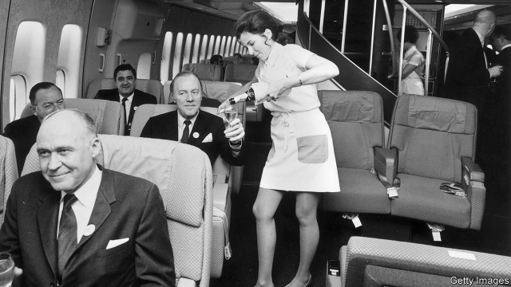
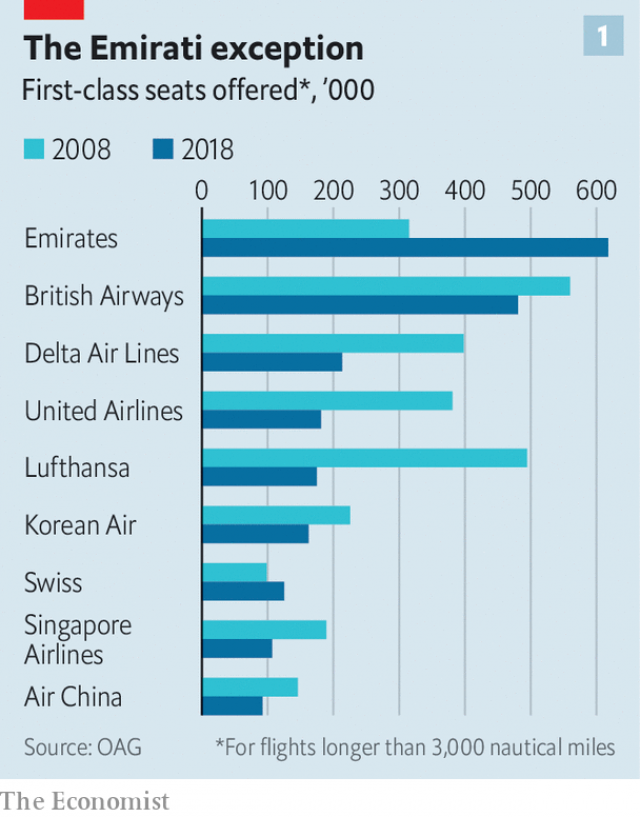
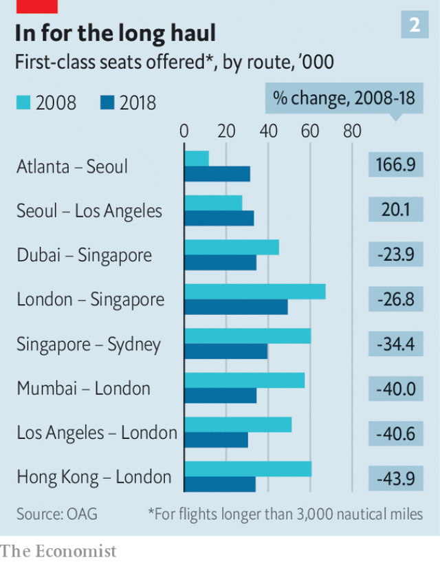

###### Turning right

# First-class air travel is in decline 

##### Executives are flying business class; plutocrats are taking private jets 

 

> Mar 9th 2019 

DUBAI IS OFTEN called a “Disneyland for the rich”. At the city’s airport the three first-class lounges of Emirates, the United Arab Emirates’ flag-carrier, do not disappoint. Each one is as big as the terminal’s concourse, built to accommodate thousands of passengers. But every day only a hundred or so enter each first-class lounge. Instead of the overpriced fast-food on offer in the public concourse, a maze of restaurants and bars serve free caviar and champagne. In their duty-free sections no knock-off cigarettes or booze are in sight. Think instead Bulgari necklaces and whisky at $25,000 a bottle. The facility is so large, its manager admits, that the most common reaction heard from new arrivals is, “Oh my God, where is the lounge?” 

Yet the rows of hundreds of empty armchairs suggest that something is not quite right. Airlines are falling out of love with first class. And that is true even of Emirates, which sells far more first-class tickets than any other carrier (see chart 1). The time to launch new first-class offerings is at ITB Berlin, the world’s largest trade show for the travel industry, which opened on March 6th. At this event in 2017 Emirates unveiled a new onboard bar and lounge for its highest-paying passengers. The same year its big rival in the Gulf, Qatar Airways, launched the world’s first skyborne double-beds. But the mood has changed. Last year Emirates stopped attending the show at all. 

 

The decline of first-class air travel seems at first glance surprising. Facilities onboard have never been so good. On its A380 superjumbos, Emirates first class provides in-flight showers. Moreover, the number of very rich people has risen sharply. Forbes, a magazine, estimates that the stock of billionaires has doubled to more than 2,100 over the past two decades. And the rest of the luxury-travel business is booming. Richard Clarke of Bernstein, a research firm, estimates that the number of luxury hotels in Asia could increase by as much as 168% over the next decade. 

Even so, many analysts predict that first class will soon disappear. In America it is already almost extinct. Ten or so years ago almost all the many hundreds of long-haul aircraft based there offered first-class seating; now only about 20 do. Elsewhere in the world an increasing number of airlines, including Turkish Airlines and Air New Zealand, have already scrapped it completely. On the majority of the most-travelled long-haul routes the number of first-class seats available has fallen sharply in the past decade (see chart 2). Even the airlines that sell the most first-class fares are curbing their enthusiasm. The number of first-class seats has been slashed from 14 to 11 on Emirates’ superjumbos and from 12 to six on those flown by Singapore Airlines. 

 

When commercial aviation got going after the second world war there was only one class: first. Economy appeared in the 1950s. It was followed in the 1970s by business class and in the 1990s by premium economy, to fill the gap between business and cattle class. 

Despite the proliferation of cheaper seats, airlines still make a lot of their money from the more expensive ones. Emirates claims that first- and business-class passengers are 12% of the total but generate about 40% of its turnover. High demand for flat beds on transatlantic flights is what has saved European flag-carriers such as British Airways (BA), Air France and Lufthansa from going out of business. Ross Harvey of Davy, a stockbroker, points out that transatlantic low-cost airlines that have tried to offer just economy or premium-economy seats, such as Norwegian and WOW, have struggled to make money. 

Airline bosses are acutely worried about the decline in demand for first class. But they have themselves partly to blame. The industry has disrupted itself, points out Geoffrey Weston of Bain & Company, a consultancy. On short-haul flights, the low-cost model has won. Most “first-class” passengers on these routes now sit in seats with the same legroom as economy passengers, albeit with an empty middle seat, and make do with extras such as lounge access, and food and drink. 

On longer routes, new seats that turned into fully flat beds were a game-changer. These were originally introduced by BA in first class in 1995, and much sought after. If travellers can sleep comfortably in the sky, they can save the cost of a hotel or, more importantly for time-pressed corporate warriors, a day’s working time. However, in 2000BA launched a similar seat in business, and most carriers have followed suit. That has weakened the case for flying first class. Most companies think a flat bed in business class is good enough for their employees. Only a few honchos are allowed to enjoy first class on the company dime, says Greeley Koch of the Association of Corporate Travel Executives, a trade group. 

Changing attitudes among the very rich are also sapping demand. Over the past decade the number of billionaires has grown fastest in China, India and the tech hubs of America. But many self-made tycoons want their children to have the “normal” middle-class upbringings they themselves had, says Charlotte Vangsgaard of ReD Associates, a consultancy. So they book themselves and their families into business, or sometimes economy, rather than first. 

Airlines that offer first class say they still do so for two main reasons. The first is to use upgrades from business class as an incentive for loyalty from both corporate and individual customers. But as the gap between business and first has narrowed, frequent flyers have begun to respond better to other incentives, such as access to lounges or to special hotlines. 

The second reason for maintaining first class is also weakening. That is what Samuel Engel of ICF, another consultancy, calls the “halo effect” an airline creates by advertising first-class facilities. In other words, flyers begin to think economy on Emirates, say, is fancier than on other airlines by association with features in its first class, such as in-flight showers. This can be an effective marketing tool. For instance, Etihad, a rival to Emirates in the Gulf, has probably had more press coverage for its onboard first-class apartments called “The Residence”, of which it has only ten, than all its 30,000 other seats combined. 

Many airlines, however, are no longer convinced by this argument and have slimmed down their first-class offerings. One such is Air France-KLM, whose chief executive in 2014, Alexandre de Juniac, claimed that first class was “little more than a costly marketing gimmick” and that “no one makes money out of it”. 

Yet some still do, particularly Emirates. One advantage it has is that it can combine traffic from various destinations using its hub in Dubai. This helps it make first class viable on routes where it might otherwise struggle to attract first-class passengers. As a result, over 90% of its first-class bookings are paid for, rather than free upgrades. 

Why do some passengers still want to fly first rather than business? Privacy is one reason, says Sir Tim Clark, the airline’s president. Smaller cabins and walled-off seats make it easier for a celebrity to fly unnoticed by fellow passengers who might otherwise tweet unflattering pictures of them drooling in their sleep. Another is flexibility. First-class passengers want to sleep and eat when they choose, not on a timetable set by cabin crew, as often happens in business class, says Joost Heymeijer, head of Emirates Inflight Catering. 

But even Emirates’ first- and business-class sales are threatened by private jets. These let executives avoid the wait for a scheduled flight. It is also much quicker to pass through security in a private-jet terminal than an airport. And in America ten times as many airports are open to private jets as are available for the bigger aircraft airlines use. Moreover, executive jets are becoming cheaper in relative terms, says Adam Twidell of PrivateFly, a private-jet booking service. New shared-ownership and ride-hailing services allow the cost of a private jet to be spread over many users. 

The rise of the private jet may be good news for bigwigs rushing to meetings. But it is bad news for the environment. The World Bank estimates that first- and business-class passengers on a narrow-body jet already generate between 2.5 and six times more carbon emissions per person than the poor saps crammed into the cheap seats. Private jets, obviously, are worse. A half-filled private jet is roughly five times dirtier than business class and 12 times dirtier than economy on short-haul routes. 

A new breed of supersonic executive jets will be even more polluting. The International Council on Clean Transportation, a think-tank, estimates that their emissions will be five to seven times greater than for standard jets. Boom, one of the startups hoping to produce these jets, has forecast that up to 2,000 such supersonic aircraft will be built by 2035. 

Another trend that could hasten the end of the arms race in first-class facilities is the shift towards smaller passenger jets. On February 14th Airbus, maker of the A380 superjumbo, announced that it will stop production of new ones from 2021. This aircraft’s bulbous fuselage left space that could be devoted to fancy first-class features such as Emirates’ showers and Etihad’s apartment suites. The smaller and more efficient jets that have consigned the A380 to an early grave lack this extra space. It would be hard to fit showers, for instance, in the new long-haul narrow-body jets now available. 

So Emirates will need another way to get its passengers to pay extra—perhaps by further upgrading those cavernous lounges. Its lounge manager in Dubai sounds perplexed: “You need to do something different to make first class worth it.” 

-- 

 单词注释:

1.plutocrat['plu:tәkræt]:n. 富豪, 财阀 

2.dubai['dju:bai]:n. 迪拜（阿拉伯联合酋长国的酋长国之一）；迪拜港（阿拉伯联合酋长国港市） 

3.disneyland['diznilænd]:n. 迪斯尼乐园 

4.emirate[e'miәrit]:n. 埃米尔的地位, 酋长国 

5.concourse['kɒŋkɒ:s]:n. 集合, 总汇, 群集 

6.overprice[,әuvә'prais]:vt. 对...定价过高, 对...估价过高 [经] 对...定价过高 

7.maze[meiz]:n. 迷宫, 迷惘 vt. 使迷惘, 使混乱, 迷失 

8.caviar['kæviɑ:]:n. 鱼子酱 [医] 鱼子酱 

9.champagne[ʃæm'pein]:n. 香槟酒, 香槟酒色 [化] 香槟酒 

10.booze[bu:z]:vi. 豪饮 n. 酒, 酒宴 

11.bulgari[]:n. 宝格丽（意大利著名手表和珠宝品牌） 

12.offering['ɒfәriŋ]:n. 提供, 奉献物, 牲礼, 上市的股票(或证券等) [经] 出售物 

13.ITB[]:[计] 中间文本块符 

14.Berlin[bә:'lin]:n. 柏林, (软质)柏林毛线 

15.unveil[.ʌn'veil]:vt. 揭开, 揭幕, 除去...的面纱 vi. 显露, 除去面纱 

16.onboard['ɒn'bɒ:d]:adv. 在板上, 在船上, 在车上, 在飞机上 

17.Qatar['kɑ:tәr]:n. 卡塔尔 

18.airway['єәwei]:n. 空中航线, 风道 [医] 导气管 

19.skyborne['skaibɒ:n]:a. 空运的 

20.superjumbos['sju:pə,dʒʌmbəu]:superjumbos n. superjumbo的变形 superjumbo ['sju:pə,dʒʌmbəu] n. 超巨型飞机 变形： n. superjumbos 

21.forbes['fɔ:bz, 'fɔ:bis]:n. 福布斯（美国出版及媒体集团）；福布斯（美国著名财经杂志）；福布斯（姓氏） 

22.billionaire[.biljә'nєә]:n. 亿万富翁 

23.richard['ritʃәd]:n. 理查德（男子名） 

24.clarke[]:n. 克拉克（姓氏） 

25.Bernstein[bә:n'stein]:[德]琥珀, 伯恩斯坦(姓氏) 

26.analyst['ænәlist]:n. 分析者, 精神分析学家 [化] 分析员; 化验员 

27.Turkish['tә:kiʃ]:n. 土耳其语 a. 土耳其的, 土耳其人的, 土耳其语的 

28.zealand['zi:lәnd]:n. 西兰岛（丹麦最大的岛） 

29.scrap[skræp]:n. 碎片, 残余物, 些微, 片断, 铁屑, 吵架 vt. 扔弃, 敲碎, 拆毁 vi. 互相殴打 a. 零碎拼凑成的, 废弃的 

30.curb[kә:b]:n. 抑制, 勒马绳, 边石 vt. 抑制, 束缚, 勒住 

31.slash[slæʃ]:v. 猛砍, 乱砍 n. 猛砍, 乱砍, 删减 [计] 斜线 

32.Singapore[.siŋgә'pɒ:]:n. 新加坡 

33.premium['pri:miәm]:n. 额外补贴, 奖金, 奖赏, 保险费 [医] 保险费 

34.proliferation[.prәulifә'reiʃәn]:n. 增殖, 激增 [医] 增生, 增殖 

35.turnover['tә:n.әuvә]:n. 翻倒, 翻转, 半圆酥饼, 营业额, 流通, 周转 a. 可翻转的 

36.transatlantic[.trænsәt'læntik]:a. 横渡大西洋的, 大西洋彼岸的, 美国的 

37.BA[bɑ:]:文学士 [计] 基本汇编程序, 布尔代数, 总线可用 

38.Lufthansa['ljft,hænsә]:n. (联邦德国)汉莎航空公司 

39.ros[]:abbr. 只读存储器（Read-Only-Storage）；活性氧（Reactive oxygen species） 

40.harvey['hɑ:vi]:n. 哈维（男子名） 

41.davy['deivi]:n. 宣誓书 

42.stockbroker['stɒk.brәukә]:n. 股票经纪人 

43.Norwegian[nɒ:'wi:dʒәn]:n. 挪威人, 挪威语 a. 挪威的, 挪威人的, 挪威语的 

44.wow[wau]:interj. (非正式)哇 n. 巨大的成功, 轰动一时的成功, 十分有趣的事物 [计] WIn32上的Windows 

45.acutely[ә'kju:tli]:adv. 尖锐地, 剧烈地 

46.disrupt[dis'rʌpt]:a. 分裂的, 中断的 vt. 使分裂, 使瓦解 

47.geoffrey[]:n. 杰弗里（男子名） 

48.weston['westәn]:n. [电]韦斯顿标准电池；韦斯顿（姓氏） 

49.bain[]:n. 贝恩（公司名称） 

50.consultancy[]:n. 商量, 协商, 磋商, 会诊, 与...商量, 咨询, 请教, 找(医生)看病, 查阅, 考虑 [经] 咨询业务, 咨询服务 

51.legroom['le^ru:m]:n. 放脚空间, 踏脚处 

52.albeit[ɔ:l'bi:it]:conj. 尽管, 虽然 

53.fully['fuli]:adv. 十分地, 完全地, 充分地 

54.originally[ә'ridʒәnli]:adv. 本来, 原来, 最初, 就起源而论, 独创地 

55.traveller['trævlә]:n. 旅行者 [经] 旅行商 

56.comfortably['kʌmfәtәbli]:adv. 安乐地, 舒服地, 宽裕地 

57.importantly[]:adv. 重要地；大量地；有名望地；自命不凡地 

58.corporate['kɒ:pәrit]:a. 社团的, 合伙的, 公司的 [经] 团体的, 法人的, 社团的 

59.warrior['wɒ:riә]:n. 战士, 勇士, 武士, 鼓吹战争的人, 战斗, 尚武 

60.honcho['hɒntʃәu]:n. 老板 

61.dime[daim]:n. 10分硬币(美、加) 

62.greeley['ɡri:li]:n. 格里利市（美国科罗拉多州中北部一城市） 

63.koch[kɔx]:n. 科赫（人名） 

64.corporate['kɒ:pәrit]:a. 社团的, 合伙的, 公司的 [经] 团体的, 法人的, 社团的 

65.sap[sæp]:n. 树液, 体液, 活力, 坑道, 消弱, 警棍 vt. 使排出体液, 使伤元气, 使衰竭, 挖坑道逼近, 逐渐侵蚀 vi. 挖坑道, 消弱 [计] 共享汇编程序, 结构分析程序, 符号汇编程序, 服务器广告协议 

66.tech[tek]:n. 技术学院或学校 

67.hub[hʌb]:n. 毂, 木片, 中心 [计] 插座; 插孔; 集线器, 集中器, 连接器, 中继站 

68.tycoon[tai'ku:n]:n. 企业界大亨, 将军 [经] 企业界巨头, 企业家 

69.upbringing['ʌp.briŋiŋ]:n. 教养 

70.charlotte['ʃɑ:lәt]:n. 水果奶油布丁 

71.upgrade['ʌpgreid]:n. 上坡, 升级, 上升 adv. 往上 vt. 使升级, 提升, 改良品种 vi. 升级 [计] 升级 

72.incentive[in'sentiv]:n. 动机 a. 激励的 

73.flyer['flaiә]:n. 飞鸟, 飞行物, 飞行员, 快车, 传单, 飞跳 [经] 投机买卖, 孤注一掷, (广告)传单 

74.hotline['hɔtlain]:n. 热线电话, 咨询电话；热线 

75.samuel['sæmjuәl]:n. 撒母耳（希伯来先知）；塞缪尔（男子名） 

76.engel[]:n. 恩格尔（恩格尔   	德国的统计学家）；英杰尔（日本品牌） 

77.icf[]:abbr. 内部通信触发器（Inter-Communication Flip-Flop） 

78.halo['heilәu]:n. 晕轮, 光圈, 晕状物, 荣光 vt. 使有晕轮, 围以光环 vi. 成晕轮 

79.advertising['ædvәtaiziŋ]:n. 广告业, 广告 a. 广告的 [计] 发广告 

80.marketing['mɑ:kitiŋ]:n. 行销, 买卖 [经] 推销, 在市场买卖, 销售 

81.Etihad[]:[网络] 阿提哈德航空；阿提哈德航空公司；阿联酋联合航空 

82.coverage['kʌvәridʒ]:n. 覆盖的范围, 保险总额, 新闻报导 [化] 可达范围; 覆盖度 

83.Alexandre[]:n. 亚历山大（马其顿国王） 

84.de[di:]:[化] 非对映体过量 [医] 铥(69号元素铥的别名,1916年Eder离得的假想元素) 

85.gimmick['gimik]:n. 暗机关 vt. 耍花招改变, 使暗机关 

86.dubai['dju:bai]:n. 迪拜（阿拉伯联合酋长国的酋长国之一）；迪拜港（阿拉伯联合酋长国港市） 

87.viable['vaiәbl]:a. 能养活的, 能生长发育的 [医] 有活力的, 有生机的 

88.booking['bukiŋ]:n. 预约演出合同 [机] 书型模法 

89.privacy['praivәsi]:n. 隐私, 隐居, 秘密 [计] 个人保密权 

90.tim[tim]:n. 蒂姆（男子名） 

91.clark[]:n. 克拉克（男子名） 

92.celebrity[si'lebrti]:n. 名声, 名人 

93.unnotice[]:[网络] 未被注意的 

94.tweet[twi:t]:vi. 啁啾 n. 小鸟叫声 

95.unflattering['ʌn'flætәriŋ]:a. 不奉承的, 不恭维的, 指出缺点的, 耿直的, 坦率的, 准确无误的 

96.drool[dru:l]:vi. 流口水, 淌, 胡说八道 vt. 从嘴淌下, 过分动感情地表示 n. 口水, 胡说 

97.flexibility[.fleksi'biliti]:n. 弹性, 适应性 [计] 灵活性; 适应性 

98.joost[]:[网络] 斯特；乔斯特；约斯特 

99.inflight['ɪnflaɪt]:a. 飞行中发生的, 飞行中进行的 

100.Adam['ædәm]:n. 亚当 [计] 自动直接存取管理 

101.bigwig['bigwig]:n. 要人, 大亨 

102.emission[i'miʃәn]:n. 发射, 射出, 发行 [医] 发射, 遗精 

103.cram[kræm]:vt. 塞满, 填满, 猛吃 vi. 贪吃 n. 极度拥挤, 死记硬背 

104.supersonic[.sju:pә'sɒnik]:a. 超声波的 [医] 超声[波]的 

105.startup[]:[计] 启动 

106.airbus['eәbʌs]:空中客车 

107.maker['meikә]:n. 制造者, 上帝 [经] 制造者, 出票人 

108.superjumbo[]:n. 超级巨型飞机 [网络] 巨无霸；巨无霸客机；巨型喷气式飞机 

109.bulbous['bʌlbәs]:a. 球茎的, 球茎状的, 由球茎生长的 [医] 球状的, 球的 

110.fuselage['fju:zilɑ:dʒ]:n. 机身 

111.consign[kәn'sain]:vt. 交付, 储蓄, 委托, 寄存 [经] 托卖, 寄存, 寄销 

112.cavernous['kævәnәs]:a. 似巨穴的 [医] 空洞的 

