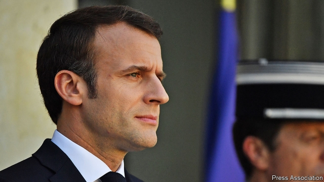

###### European governments are intervening in business again

# A French habit is spreading 

##### Its lure should be resisted 

 

> Mar 7th 2019 

IF YOU CAN’T beat them, adopt their worst economic policies. Worried about the “aggressive strategies” of America and China, France’s president, Emmanuel Macron, issued a Europe-wide proclamation on March 4th that, among other things, proposed a new revolutionary era of government intervention in European Union businesses (see article). “We cannot suffer in silence,” he declared, while other global powers flout the principles of “fair competition”. 

Mr Macron is not alone. Across the continent, politicians are seeking to influence business using a range of tactics including regulation, nudging managers to do deals and boosting state ownership. At Renault-Nissan, the downfall of Carlos Ghosn has become intertwined with a struggle for control between the French and Japanese governments (see Banyan). Last month Peter Altmaier, Germany’s economy minister, called for champions such as Siemens and Deutsche Bank to be protected. Last week it emerged that the Dutch government has built up a 14% stake in Air France-KLM to help its former flag-carrier “perform better”. And Italy is poised to increase to 10% its stake in Telecom Italia, which it began privatising 21 years ago. 

This resurgence of state intervention is intended to make European industries stronger. Instead it is more likely to hurt consumers and dim the prospects of business. 

Granted, Europe has never been a haven of unfettered free markets. The European Coal and Steel Community, the precursor to the EU, was created in 1951 to co-ordinate industrial activity. France has long adopted a dirigiste policy of strategic planning by enlightened technocrats. Nonetheless, by the 1990s, the state was in retreat. The launch of the single market in 1993 promised a continent-sized playing field for European firms, which could at last exploit economies of scale and compete unfettered by national subsidies and politics. 

The lurch back towards intervention partly reflects the desire of Mr Macron and other politicians to show grumpy voters that they are making capitalism fairer. But it also reflects the fear that Europe is falling behind America and China. Bosses worry that European firms are too puny. If you take the top 500 firms in both Europe and America, the median European one is 52% smaller by market value. Europe has no giants to rival Amazon or Alphabet and hosts few of the world’s dynamic startups. China’s plan to dominate various strategic technologies, such as new materials and AI, and its pursuit of state-backed takeovers in Europe, seem threatening and unfair. And the White House’s me-first habit of telling firms where to build factories has legitimised the kind of overt meddling that had become taboo in the West. 

Yet Mr Macron’s solution is self-defeating. Germany and France have urged on the merger of the rail divisions of Siemens and Alstom, which would have resulted in a firm with a 50% market share in Europe. But that would have pushed up the price of rail travel (the European Commission has sensibly blocked the deal). Intervention often incites national rivalries, too. The Dutch bought into Air France-KLM in order to offset French influence. It can be a recipe for cronyism. Does Deutsche Bank, which paid 1,098 staff more than €1m a year in 2017, despite paltry profits, really warrant special treatment? And intervention is unlikely to achieve its aim of creating champions. Of Europe’s five most valuable firms, three (Nestlé, Novartis and Roche) are based in Switzerland, which spends heavily on education and research and development but does not engage in central planning. One (Royal Dutch Shell) is transnational and the other is a French luxury-goods firm, LVMH, that has thrived because it answers to China’s consumers, not the strategic plans of French bureaucrats. Europe’s one corporate success with dirigiste roots, Airbus, has soared since 2012, when its shareholding pact was revised to reduce political influence. 

Instead of pursuing an activist industrial policy, Europe should put consumers first. That means enforcing competition. German and French attempts to stymie EU antitrust rules are misguided. Allowing oligopolies to form, as America has, creates big companies that overcharge their customers and, sooner or later, exert more effort controlling markets than innovating. In tech, Europe ought to satisfy itself with rules, such as its GDPR regulation, that protect consumers’ rights over their data and privacy. Europe can also continue to deepen the single market. The main reason some industries, such as banking and telecoms, are struggling and fragmented is because they still operate in national silos that hinder firms from achieving economies of scale. And Europe should be proportionate in the way it screens foreign investment, for example from state firms based in authoritarian countries, notably China. The aim would be to block investment in only the most sensitive industries, such as defence, police it rigorously in important ones, such as technology, and otherwise step back. 

Mr Macron is right that trade and markets are being distorted by the actions of China and, increasingly, America. That does not mean Europe should copy their mistakes. 

-- 

 单词注释:

1.intervene[.intә'vi:n]:vi. 插入, 调停, 干涉 [经] 进场干预 

2.lure[luә]:n. 饵, 诱惑 vt. 引诱, 诱惑 

3.emmanuel[i'mænjuәl]:n. 以马内利（耶稣基督的别称）；伊曼纽尔（男子名, 等于Immanuel） 

4.macron['mækrәn]:n. 长音符号 

5.proclamation[.prɒklә'meiʃәn]:n. 宣言, 公布, 布告, 公告 [法] 宣告, 宣布, 布告 

6.intervention[.intә'venʃәn]:n. 插入, 介入, 调停 [经] 干预 

7.cannot['kænɒt]:aux. 无法, 不能 

8.flout[flaut]:vt. 嘲笑, 愚弄 vi. 表示轻蔑 n. 嘲笑, 愚弄, 轻视 

9.tactic['tæktik]:n. 一项战术, 一条策略 a. 战术的, 顺序的, 排列的 

10.nudge[nʌdʒ]:n. 用肘轻推, 推动, 讨厌家伙 

11.downfall['daunfɒ:l]:n. 衰败, 大雨 

12.carlo[]:n. 卡洛（男子名） 

13.ghosn[]:[网络] 戈森 

14.intertwine[.intә'twain]:v. (使)纠缠, (使)缠绕 

15.banyan['bænjәn]:n. 印度榕树 [医] 榕树, 孟加拉榕 

16.peter['pi:tә]:vi. 逐渐消失, 逐渐减少 

17.altmaier[]:[网络] 环境部长奥特梅尔 

18.siemen[]:[网络] 西门子贝得 

19.deutsche[]:n. 德意志联邦共和国马克 

20.Dutch[dʌtʃ]:n. 荷兰人, 荷兰语 a. 荷兰的 

21.poise[pɒiz]:n. 平衡, 均衡, 姿势, 镇静, 安静, 砝码 vt. 使平衡, 使悬着, 保持...姿势 vi. 平衡, 悬着, 准备好 

22.telecom['telәkɔm]:telecommunication 电信 

23.italia[i'tɑ:ljɑ:]:n. 意大利 

24.privatise[p'rɪvətɪs]:vt. 使私有化 

25.resurgence[ri'sә:dʒәns]:n. 再起, 复活, 再现 

26.haven['heivn]:n. 港, 避难所, 安息所 vt. 安置...于港中, 庇护, 入港 

27.unfetter[.ʌn'fetә]:vt. 给...解开脚链, 释放, 使自由 [法] 除去...脚镣, 释放 

28.precursor[.pri:'kә:sә]:n. 先驱者, 前导, 前兆 [化] 前体; 前身; 产物母体 

29.EU[]:[化] 富集铀; 浓缩铀 [医] 铕(63号元素) 

30.dirigiste[,diːriː'ʒɪʒst]:国家干预或统制经济的 

31.enlightened[in'laitnd]:a. 有知识的, 进步的, 文明的 

32.technocrat['teknәukræt]:n. 技术专家治国论者, 技术专家统治论者 

33.nonetheless[,nʌnðә'les]:conj. 然而, 尽管, 不过 adv. 不过, 仍然, 尽管如此, 然而 

34.politic['pɒlitik]:a. 精明的, 明智的, 策略的 

35.lurch[lә:tʃ]:n. 惨败, 倾斜, 挫折, 举步蹒跚, 徘徊 vi. 惨败, 倾斜, 徘徊 vt. 击败 

36.grumpy['grʌmpi]:a. 性情乖戾的, 脾气暴躁的, 生气的 

37.voter['vәutә]:n. 选民, 投票人 [法] 选民, 选举人, 投票人 

38.capitalism['kæpitәlizәm]:n. 资本主义 [经] 资本主义 

39.puny['pju:ni]:a. 微小的, 弱小的, 微不足道的 

40.median['mi:diәn]:a. 中央的, 中间的, 正中的 n. 正中动脉, 中位数, 中线 

41.amazon['æmәzɒn]:n. 亚马孙河 [医] 无乳腺者 

42.startup[]:[计] 启动 

43.AI[ai]:[计] 附加信息, 人工智能 [化] 人工智能 

44.takeover[]:n. 接管, 接收 [经] 接收 

45.legitimise[li'dʒitimaiz]:vt.<主英> = legitimize 

46.overt['әuvә:t]:a. 明显的, 公然的, 蓄意的 [法] 明显的, 公开的 

47.meddle['medl]:vi. 干涉, 干预, 擅自摸弄 [法] 干预, 插手, 弄乱 

48.taboo[tә'bu:]:n. 禁忌, 禁止接近, 禁止使用 a. 禁忌的, 忌讳的 vt. 禁忌, 忌讳, 禁止 

49.merger['mә:dʒә]:n. 合并, 归并 [经] 购并 

50.alstom[]:n. 阿尔斯通（法国公司） 

51.sensibly['sensәbli]:adv. 容易感知地；聪明地；明显地 

52.intervention[.intә'venʃәn]:n. 插入, 介入, 调停 [经] 干预 

53.incite[in'sait]:vt. 刺激, 激励, 引诱 [法] 鼓动, 煽动 

54.rivalry['raivlri]:n. 竞争, 对抗 [医] 拮抗 

55.offset['ɒ:fset]:n. 抵消, 把...并列, 旁系, 支管, 用胶印法印 vt. 弥补, 抵消, 胶印 vi. 装支管 n. 偏移量 [计] 偏移量 

56.cronyism['krәjniizəm]:n. 任人唯亲 

57.paltry['pɒ:ltri]:a. 不足取的, 琐碎的, 可鄙的 

58.warrant['wɒ:rәnt]:n. 授权, 正当理由, 根据, 证明, 批准, 凭证, 令状, 委任状 vt. 授权给, 保证, 担保, 批准, 使有正当理由 

59.novartis[]: 诺华公司总部所在地：瑞士主要业务：制药 

60.roche[]:n. 瑞士罗氏（制药企业） 

61.transnational[træns'næʃәnl]:a. 超越国界的, 跨国的 [法] 超越国界的, 超国家的, 跨国的 

62.LVMH[]:abbr. 路易威登（法国知名奢侈品集团, Louis Vuitton Moet Hennessy） 

63.bureaucrat['bjuәrәukræt]:n. 官僚作风的人, 官僚, 官僚主义者 [法] 官僚, 官僚作风的人 

64.corporate['kɒ:pәrit]:a. 社团的, 合伙的, 公司的 [经] 团体的, 法人的, 社团的 

65.airbus['eәbʌs]:空中客车 

66.soar[sɒ:]:n. 高扬, 翱翔 vi. 往上飞舞, 高耸, 翱翔 

67.shareholding['ʃεә.hәuldiŋ]:n. 股权 

68.pact[pækt]:n. 契约, 协定, 条约 [化] 合同 

69.activist['æktivist]:n. 激进主义分子 

70.stymie['staimi]:n. (喻)困难的境地 vt. 使(球)处于困难的位置, 使为难, 使处困境, 妨碍, 阻挠, 阻碍 

71.antitrust[.ænti'trʌst]:a. 反托拉斯的 [法] 反托拉斯的 

72.misguide[mis'gaid]:vt. 误导 

73.oligopoly[.ɒli'gɒpәli]:n. 求过于供的市场情况, 寡头买主垄断 

74.overcharge[.әuvә'tʃɑ:dʒ]:v. 讨价过高, 装载过多, 过度充电, 渲染 n. 超载, 装药过多, 过度充电 

75.innovate['inәuveit]:vi. 改革, 创新 

76.tech[tek]:n. 技术学院或学校 

77.datum['deitәm]:n. 论据, 材料, 资料, 已知数 [医] 材料, 资料, 论据 

78.privacy['praivәsi]:n. 隐私, 隐居, 秘密 [计] 个人保密权 

79.telecom['telәkɔm]:telecommunication 电信 

80.silo['sailәu]:n. 筒仓, 青贮窖 [机] 储仓 

81.hinder['hindә]:a. 后面的 v. 阻碍, 打扰 

82.proportionate[prә'pɒ:ʃәnit]:a. 相称的, 成比例的, 适当的 vt. 使相称, 使成比例 

83.authoritarian[ɒ:.θɒri'tєәriәn]:a. 独裁的, 独裁主义的 

84.notably['nәjtbәli]:adv. 显著地, 著名地, 尤其, 特别 

85.rigorously[]:adv. 严厉地；残酷地 

86.distort[dis'tɒ:t]:vt. 扭曲, 歪曲 [法] 歪区, 曲解, 纂改 

