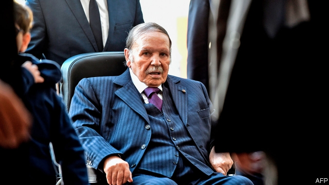

###### Out with the old

# How to revive Algeria 

##### Decrepit rulers are holding back a country with enormous potential 

 

> Mar 7th 2019 

IN MOST COUNTRIES candidates for president must prove that they are in command of their senses. In Algeria, for example, they are required to register in person. But that rule apparently does not apply to Abdelaziz Bouteflika, the ailing president, who was lying in a Swiss hospital bed when his campaign manager filed papers this month for him to run for re-election. Mr Bouteflika—or his coterie—is hoping he will win a fifth five-year term on April 18th. 

He probably does not remember his fourth. The 82-year-old suffered a stroke in 2013 and has rarely been seen since. Occasionally the government releases video of Mr Bouteflika looking confused, as aides fawn over him. The old man can hardly speak or walk. Yet he still ran away with the last election. The secretive cabal known as le pouvoir (the power) that really rules Algeria, and grows rich from it, is planning another stitch-up. 

Algerians have had enough of this farce. Tens of thousands of them have taken to the streets in cities across the country, demanding one thing: that Mr Bouteflika not run again (see article). Algeria is in desperate need of renewal. But the ruling clique of generals, businessmen and politicians has proved incapable of reform, unable even to pick a successor to the cadaverous Mr Bouteflika. It is time it handed power to a new generation, which might unlock Algeria’s vast potential. 

What critics call stagnation, le pouvoir calls stability. The last time the country held a free and fair parliamentary election, in 1991, Islamists won the first round and the generals cancelled the rest. That led to civil war, which raged for most of the 1990s and killed 200,000 people. Mr Bouteflika guided the country out of the “dark decade”. Algeria has avoided the unrest that shook many of its neighbours since 2011. Today it is one of the safest countries in the Arab world. 

But the price has been high. The elite evokes the civil war, and the threat of jihadism, to justify a ruthless regime. A 19-year-old state of emergency was lifted in 2011, but political speech is still restricted, the media are muzzled and critics of the government are harassed. The authorities lock up people using vaguely worded bans on “inciting an unarmed gathering” and “insulting a government body”. State institutions, such as the parliament and judiciary, are rubber stamps. 

Following the old rules, the army chief of staff, General Ahmed Gaid Salah, claims: “There are parties who wish to bring Algeria back to the years of violence.” Perhaps, but not the protesters. They shout “silmiya, silmiya” (peaceful, peaceful) and even clean up after themselves. Many feel disconnected from the likes of General Salah, who fought in the country’s war of independence from France. Most Algerians were born three or more decades after that conflict ended in 1962. While officials communicate by fax, protesters are organising on social media. 

Le pouvoir worries that it can no longer afford to buy the public’s obedience with government jobs and subsidies. The state’s budget relies on oil and gas revenues. Since 2014, when the price of hydrocarbons tumbled, it has burned through cash. The unemployment rate hovers above 11%. Nearly a third of young people are looking for a job. Rampant corruption completes the dismal picture. Rich in natural resources, teeming with cheap labour and just across the sea from Europe, Algeria should be doing much better. 

Le pouvoir does not have la solution. Mr Bouteflika, or whoever is using his pen, recently promised that, if he wins in April, he will organise an “inclusive national conference” and hold another election, which he would not contest. But playing for time will not resolve Algeria’s underlying problems. 

The regime treats Mr Bouteflika like El Cid, an 11th-century Spanish nobleman whose dead body was supposedly strapped on a horse and sent into battle to inspire his troops. To most Algerians, however, he is an object of derision or pity. Algeria cannot say what will happen when the strongman dies. Far from preventing another civil war, the regime risks stoking one. 

Sending Mr Bouteflika to a care home should be just the start of reform. A temporary government could then oversee a transition to a more open system, creating that national conference to come up with reforms; presidential and parliamentary elections would be held after the opposition, which is weak and divided, had been able to organise. The country’s next leader could improve things by encouraging entrepreneurs, rather than standing in their way, breaking up the government’s business empire and inviting in foreigners. Like Mr Bouteflika, Algeria has been ailing for some time. Unlike him, it can still be saved. 

-- 

 单词注释:

1.revive[ri'vaiv]:vt. 使苏醒, 使复兴, 使振奋, 回想起, 重播 vi. 苏醒, 复活, 复兴, 恢复精神 

2.Algeria[æl'dʒiәriә]:n. 阿尔及利亚 

3.decrepit[di'krepit]:a. 衰老的 

4.apparently[ә'pærәntli]:adv. 表面上, 清楚地, 显然地 

5.abdelaziz[]:n. (Abdelaziz)人名；(阿拉伯)阿卜杜勒-阿齐兹 

6.bouteflika[]:[网络] 布特弗利卡；阿尔及利亚总统布特弗利卡；布特佛里卡 

7.ailing['eiliŋ]:a. 生病的 [医] 患病的, 病痛的 

8.aide[eid]:n. 助手, 副官 [计] 数据输入的可说明性 

9.fawn[fɒ:n]:n. 小鹿 vi. 摇尾乞怜, 奉承 

10.secretive[si'kri:tiv]:a. 秘密的, 偷偷摸摸的, 分泌的, 促进分泌的 

11.cabal[kә'bæl]:n. 秘密结社, (尤指政治上的)阴谋 vi. 策划阴谋 

12.LE[]:[计] 小于或等于 

13.Pouvoir[]:[网络] 权力；能；政权 

14.Algerian[æl'dʒiәriәn]:a. 阿尔及利亚的 n. 阿尔及利亚人 

15.farce[fɑ:s]:n. 闹剧, 滑稽剧, 胡闹 

16.tens[]:十位 

17.renewal[ri'nju:әl]:n. 更新, 革新, 复兴, 恢复, 修补, 补充, 继续, 重订, 重申, 续借 [经] 更新, 换新, 重申 

18.clique[kli:k]:n. 派系, 集团 vi. 结党 [计] 集团型 

19.incapable[in'keipәbl]:a. 无能力的, 不能的 [机] 不能行的, 耐不住的 

20.successor[sәk'sesә]:n. 继承者, 接任者 [计] 后继 

21.cadaverous[kә'dævәrәs]:a. 象尸体的, 惨白的 [医] 似尸体的, 尸体样的 

22.unlock[.ʌn'lɒk]:vt. 开...的锁, 开启, 表露, 放出 vi. 被开启, 揭开, 解放 [计] 解出锁定 

23.stagnation[stæg'neiʃәn]:n. 淤塞, 停滞 [医] 停滞, 滞留, 郁积 

24.parliamentary[.pɑ:lә'mentәri]:a. 国会的, 议会的, 议会制度的 

25.Islamist[iz'lɑ:mist]:n. 伊斯兰教主义者；回教教徒 

26.elite[ei'li:t]:n. 精华, 精锐, 中坚分子 

27.evoke[i'vәuk]:vt. 唤起, 引起, 召(魂) [法] 提审, 移送 

28.jihadism[]:[网络] 圣战主义；吉哈德主义；杰哈德主义 

29.ruthless['ru:θlis]:a. 无情的, 残忍的, 毫不留情的, 彻底的 [法] 无情的, 残忍的 

30.regime[rei'ʒi:m]:n. 政权, 当权期间, 政体, 社会制度, 体制, 情态 [医] 制度, 生活制度 

31.muzzle['mʌzl]:n. 动物之鼻口, 口套, 枪口 vt. 戴口套于, 使缄默 

32.harass['hærәs]:vt. 使困扰, 使烦恼, 折磨 

33.vaguely['veigli]:adv. 含糊地, 暧昧地 

34.incite[in'sait]:vt. 刺激, 激励, 引诱 [法] 鼓动, 煽动 

35.unarm[.ʌn'ɑ:m]:vt. 缴械 vi. 放下武器 

36.judiciary[dʒu:'diʃiәri]:a. 司法的, 法院的, 法官的 n. 司法部, 司法系统, 法官 

37.ahmed[]:n. 艾哈迈德（男子名） 

38.gaid[]:[网络] 通信技术促进发展全球联盟；通信技术与发展联盟；发展联盟 

39.Salah[sә'lɑ:]:n. = salat [变体] 

40.protester[]:n. 抗议者, 持异议者, 拒付者 [经] 反对者 

41.disconnect[.diskә'nekt]:vt. 使分离, 使不相连, 拆开 vi. 断开 [计] 断开 

42.LE[]:[计] 小于或等于 

43.obedience[ә'bi:djәns]:n. 服从, 顺从, 忠实 [法] 服从, 顺从, 遵从 

44.hydrocarbon[.haidrәu'kɑ:bәn]:n. 碳氢化合物 [化] 烃; 碳氢化合物 

45.hover['hʌvә]:vi. 盘旋, 翱翔, 徘徊 vt. 孵 n. 翱翔 

46.rampant['ræmpәnt]:a. 猖獗的, 蔓生的, 猛烈的, 跃立作扑击状的 

47.corruption[kә'rʌpʃәn]:n. 腐败, 堕落, 贪污 [计] 论误 

48.dismal['dizmәl]:a. 阴沉的, 凄凉的, 令人忧郁的 n. 低落的情绪, 沼泽 

49.teem[ti:m]:vi. 充满, 充足, 倾注 vt. 倒出 

50.La[lɔ:, lɑ:]:[医] 镧(57号元素) 

51.inclusive[in'klu:siv]:a. 包含的, 包括的 

52.underlie[.ʌndә'lai]:vt. 位于...之下, 成为...的基础 

53.el[el]:abbr. 预期损失（Expected Loss） 

54.CID[sid]:n. 首领, 英国刑事调查局 

55.nobleman['nәublmәn]:n. 贵族 

56.supposedly[sә'pәuzidli]:adv. 想象上, 看上去像, 被认为是, 恐怕, 按照推测 

57.derision[di'riʒәn]:n. 嘲笑 

58.cannot['kænɒt]:aux. 无法, 不能 

59.strongman[ˈstrɒŋmæn]:n. 大力士 

60.stoke[stәuk]:v. 司炉, (使)大吃 

61.oversee[.әuvә'si:]:vt. 向下看, 了望, 监督, 偷看到 [法] 监察, 监督, 俯瞰 

62.transition[træn'ziʃәn]:n. 转变, 转换, 变迁, 过渡时期, 临时转调 [化] 跃迁 

63.presidential[.prezi'denʃәl]:a. 总统制的, 总统的, 首长的, 统辖的 [法] 总统的, 议长的, 总经理的 

64.opposition[.ɒpә'ziʃәn]:n. 反对, 敌对, 相反, 在野党 [医] 对生, 对向, 反抗, 反对症 

65.entrepreneur[.ɒntrәprә'nә:]:n. 企业家, 主办人 [经] 承包商, 企业家 

