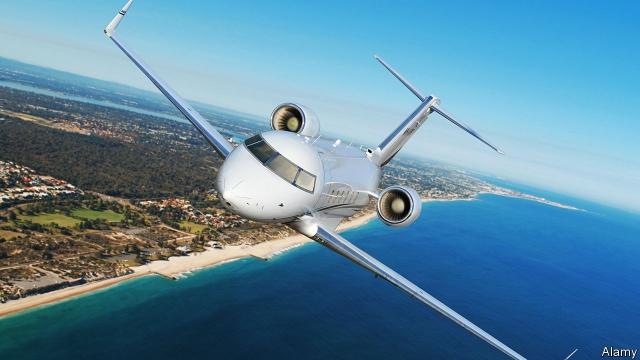

###### Plane stupid

# Private jets receive ludicrous tax breaks that hurt the environment 

##### Scrap them 

 

> Mar 7th 2019 

THE BLUE jeans and T-shirts of the global elite are no more comfortable than those worn by the middle class. They drink the same coffee, watch the same films and carry the same smartphones. But a gulf yawns between the rich and the rest when they fly. Ordinary folk squeeze agonisingly and sleeplessly into cheap seats. The elite stretch out flat and slumber. And the truly wealthy avoid the hassles and indignities of crowded airports entirely, by taking private jets. This would be no one else’s business but for two things. First, private jets are horribly polluting. Second, they are often—and outrageously—subsidised. 

Private aviation was hit hard by the global financial crisis, when both companies and individuals sought to pare expenses. But now private jets are booming again. This is partly because new booking services and shared-ownership schemes are cutting the cost of going private and luring busy executives away from first- and business-class seats on scheduled flights (see article). But the boom is also a result of tax breaks, which are even more generous than those lavished on ordinary airlines. In Europe firms and individuals can avoid paying value-added tax on imported private jets by routing purchases through the Isle of Man. This scheme has cut tax bills by £790m ($1bn) for imports of at least 200 aircraft into the European Union since 2011. America’s rules are loopier still. Donald Trump’s tax reform allowed individuals and companies to write off 100% of the cost of a new or used private jet against their federal taxes. For some plutocrats this has wiped out an entire year’s tax bill. For others, it has made buying a jet extraordinarily cheap. 

The case for flying on a private jet is that it can save time for someone, such as a chief executive, whose time is extraordinarily valuable. Hence companies can offset the cost of these flights against their corporate-tax bills. In some countries the use of a private jet is a tax-free perk for executives. But a growing volume of research suggests that flying the boss privately is often a waste of money for shareholders. One analysis, by ICF, a consultancy, found that the jets are often used to fly to places where corporate titans are more likely to have holiday homes than business meetings, such as fancy ski resorts. A study by David Yermack of NYU Stern School of Business found that returns to investors in firms that allow such flights are 4% lower per year than in other companies. Users of such planes are also more likely to commit fraud: a careless attitude to other people’s money sometimes shades into outright criminality, it seems. 

The environmental effects of corporate jets are dire. A flight from London to Paris on a half-full jet produces ten times as much in carbon emissions per passenger as a scheduled flight, according to Terrapass, a carbon-offset firm. New supersonic business jets under development will make that a lot worse. On one estimate, their emissions will be five to seven times higher than for today’s models. Amazingly, these emissions are largely unregulated. Aviation is not covered by the Paris agreement to limit climate change, and most private jets are excluded from CORSIA, a carbon-offsetting scheme involving most airlines. All in all, private planes could produce 4% of American emissions by 2050 compared with 0.9% today. 

All air travel is bad for the environment. Business class is worse than economy class, because it burns more jet fuel per passenger. Private jets are more damaging by an order of magnitude. The tax breaks for cooking the planet in this way cannot be justified. They should all be scrapped. Carbon emissions should be taxed, not subsidised by the sleepless masses in steerage and the even less fortunate souls who never fly. 

-- 

 单词注释:

1.ludicrous['lu:dikrәs]:a. 可笑的, 滑稽的, 荒唐的 

2.scrap[skræp]:n. 碎片, 残余物, 些微, 片断, 铁屑, 吵架 vt. 扔弃, 敲碎, 拆毁 vi. 互相殴打 a. 零碎拼凑成的, 废弃的 

3.jean[dʒi:n]:n. 牛仔裤, 牛仔布, 斜纹棉布 

4.elite[ei'li:t]:n. 精华, 精锐, 中坚分子 

5.smartphones[]: 智能手机（smartphone的复数） 

6.agonisingly['ægənaiziŋli]:adv. 烦恼地；苦闷地 

7.sleeplessly[]:adv. 失眠地 

8.slumber['slʌmbә]:n. 睡眠, 麻木状态 vi. 微睡, 静止, 麻木 vt. 睡着度过(时间) 

9.hassle['hæsl]:n. 激烈而持久的争论 vi. 争论 vt. 与...争辩, 使烦恼 

10.indignity[in'digniti]:n. 侮辱 [法] 侮辱的言行, 无礼, 有伤尊严 

11.entirely[in'taiәli]:adv. 完全, 全然, 一概 

12.horribly['hɒrәbli]:adv. 可怕地, 非常地 

13.pare[pєә]:vt. 剥, 削, 消减 

14.lure[luә]:n. 饵, 诱惑 vt. 引诱, 诱惑 

15.lavish['læviʃ]:a. 大方的, 丰富的, 浪费的 vt. 浪费, 滥用, 慷慨给予 

16.rout[raut]:n. 溃败, 大败, 乌合之众, 盛大晚会 vt. 使溃败, 使败逃, 打垮, 用鼻拱, 挖起, 搜, 唤起 vi. 用鼻拱地, 搜 

17.isle[ail]:n. 小岛, 群岛 vt. 使成为岛状 vi. 住在岛屿上 

18.loopy['lu:pi]:a. 多圈的, 呆头呆脑的, 糊涂的 

19.donald['dɔnәld]:n. 唐纳德（男子名） 

20.plutocrat['plu:tәkræt]:n. 富豪, 财阀 

21.extraordinarily[ik'strɔ:dθnәrili]:adv. 非凡, 破例, 特别, 非常, 离奇, 使人惊奇, 惊人, 特命, 特派 

22.offset['ɒ:fset]:n. 抵消, 把...并列, 旁系, 支管, 用胶印法印 vt. 弥补, 抵消, 胶印 vi. 装支管 n. 偏移量 [计] 偏移量 

23.perk[pә:k]:vi. 昂首, 振作, 举止高傲, 神气活现, 滤煮 vt. 竖起, 打扮, 使振作, 滤煮 n. 小费 

24.privately[]:adv. 秘密地；私下地 

25.shareholder['ʃєә.hәuldә]:n. 股东 [法] 股东, 股票持有人 

26.icf[]:abbr. 内部通信触发器（Inter-Communication Flip-Flop） 

27.consultancy[]:n. 商量, 协商, 磋商, 会诊, 与...商量, 咨询, 请教, 找(医生)看病, 查阅, 考虑 [经] 咨询业务, 咨询服务 

28.corporate['kɒ:pәrit]:a. 社团的, 合伙的, 公司的 [经] 团体的, 法人的, 社团的 

29.Titan['taitn]:n. 提坦, 太阳神, 巨人 

30.david['deivid]:n. 大卫；戴维（男子名） 

31.nyu[]:abbr. 纽约大学（New York University） 

32.investor[in'vestә]:n. 投资者 [经] 投资者 

33.outright['autrait]:a. 率直的, 完全的, 总共的, 直率的 adv. 完全地, 率直地, 立刻地, 一直向前 

34.criminality[.krimi'næliti]:n. 犯罪, 有罪, 犯罪行为 [法] 有罪, 犯罪行为, 犯罪性 

35.environmental[in.vaiәrәn'mentәl]:a. 周围的, 环境的 [经] 环境的, 环保的 

36.dire[daiә]:a. 可怕的, 悲惨的, 阴沉的, 极端的 

37.emission[i'miʃәn]:n. 发射, 射出, 发行 [医] 发射, 遗精 

38.supersonic[.sju:pә'sɒnik]:a. 超声波的 [医] 超声[波]的 

39.amazingly[]:adv. 令人惊讶地；惊奇地 

40.unregulated[]:a. 未经调节的；未校准的 

41.magnitude['mægnitju:d]:n. 巨大, 重大, 重要, 大小, 数量, 星等(指星的亮度) [计] 大小; 值 

42.cannot['kænɒt]:aux. 无法, 不能 

43.scrap[skræp]:n. 碎片, 残余物, 些微, 片断, 铁屑, 吵架 vt. 扔弃, 敲碎, 拆毁 vi. 互相殴打 a. 零碎拼凑成的, 废弃的 

44.subsidise[]:vt. 给...补助金, 津贴, 资助 

45.sleepless['sli:plis]:a. 不睡眠的, 睡不着的, 不休息的 

46.steerage['stiәridʒ]:n. 统舱, 掌舵, 操纵, 管理 

47.les[lei]:abbr. 发射脱离系统（Launch Escape System） 

