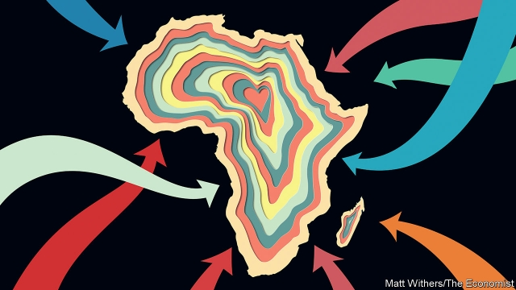

###### Geopolitics

# The new scramble for Africa 

##### This time, the winners could be Africans themselves 

 

> Mar 7th 2019 

THE FIRST great surge of foreign interest in Africa, dubbed the “scramble”, was when 19th-century European colonists carved up the continent and seized Africans’ land. The second was during the cold war, when East and West vied for the allegiance of newly independent African states; the Soviet Union backed Marxist tyrants while America propped up despots who claimed to believe in capitalism. A third surge, now under way, is more benign. Outsiders have noticed that the continent is important and becoming more so, not least because of its growing share of the global population (by 2025 the UN predicts that there will be more Africans than Chinese people). Governments and businesses from all around the world are rushing to strengthen diplomatic, strategic and commercial ties. This creates vast opportunities. If Africa handles the new scramble wisely, the main winners will be Africans themselves. 

The extent of foreign engagement is unprecedented (see Briefing). Start with diplomacy. From 2010 to 2016 more than 320 embassies were opened in Africa, probably the biggest embassy-building boom anywhere, ever. Turkey alone opened 26. Last year India announced it would open 18. Military ties are deepening, too. America and France are lending muscle and technology to the struggle against jihadism in the Sahel. China is now the biggest arms seller to sub-Saharan Africa and has defence-technology ties with 45 countries. Russia has signed 19 military deals with African states since 2014. Oil-rich Arab states are building bases on the Horn of Africa and hiring African mercenaries. 

Commercial ties are being upended. As recently as 2006 Africa’s three biggest trading partners were America, China and France, in that order. By 2018 it was China first, India second and America third (France was seventh). Over the same period Africa’s trade has more than trebled with Turkey and Indonesia, and more than quadrupled with Russia. Trade with the European Union has grown by a more modest 41%. The biggest sources of foreign direct investment are still firms from America, Britain and France, but Chinese ones, including state-backed outfits, are catching up, and investors from India and Singapore are eager to join the fray. 

The stereotype of foreigners in Africa is of neocolonial exploiters, interested only in the continent’s natural resources, not its people, and ready to bribe local bigwigs in shady deals that do nothing for ordinary Africans. The stereotype is sometimes true. Far too many oil and mineral ventures are dirty. Corrupt African leaders, of whom there is still an abundance, can always find foreign enablers to launder the loot. And contracts with firms from countries that care little for transparency, such as China and Russia, are often murky. Three Russian journalists were murdered last year while investigating a Kremlin-linked mercenary outfit that reportedly protects the president of the war-torn Central African Republic and enables diamond-mining there. Understandably, many saw a whiff of old-fashioned imperialism. 

However, engagement with the outside world has mostly been positive for Africans. Foreigners build ports, sell insurance and bring mobile-phone technology. Chinese factories hum in Ethiopia and Rwanda. Turkish Airlines flies to more than 50 African cities. Greater openness to trade and investment is one reason why GDP per head south of the Sahara is two-fifths higher than it was in 2000. (Sounder macroeconomic policies and fewer wars also helped.) Africans can benefit when foreigners buy everything from textiles to holidays and digital services. 

Even so, Africans can do more to increase their share of the benefits. First, voters and activists can insist on transparency. It is heartening that South Africa is investigating the allegedly crooked deals struck under the previous president, Jacob Zuma, but alarming that even worse behaviour in the Democratic Republic of Congo has gone unprobed, and that the terms of Chinese loans to some dangerously indebted African governments are secret. To be sure that a public deal is good for ordinary folk as well as big men, voters have to know what is in it. Journalists, such as the Kenyans who exposed scandals over a Chinese railway project, have a big role to play. 

Second, Africa’s leaders need to think more strategically. Africa may be nearly as populous as China, but it comprises 54 countries, not one. African governments could strike better deals if they showed more unity. No one expects a heterogeneous continent that includes both anarchic battle zones and prosperous democracies to be as integrated as Europe. But it can surely do better than letting China negotiate with each country individually, behind closed doors. The power imbalance between, say, China and Uganda is huge. It could be reduced somewhat with a free-trade area or if African regional blocs clubbed together. After all, the benefits of infrastructure projects spill across borders. 

Third, African leaders do not have to choose sides, as they did during the cold war. They can do business with Western democracies and also with China and Russia—and anyone else with something to offer. Because they have more choice now than ever before, Africans should be able to drive harder bargains. And outsiders should not see this as a zero-sum contest (as the Trump administration, when it pays attention to Africa, apparently does). If China builds a bridge in Ghana, an American car can drive over it. If a British firm invests in a mobile-data network in Kenya, a Kenyan entrepreneur can use it to set up a cross-border startup. 

Last, Africans should take what some of their new friends tell them with a pinch of salt. China argues that democracy is a Western idea; development requires a firm hand. This message no doubt appeals to African strongmen, but it is bunk. A study by Takaaki Masaki of the World Bank and Nicolas van de Walle of Cornell University found that African countries grow faster if they are more democratic. The good news is that, as education improves and Africans move rapidly to the cities, they are growing more critical of their rulers, and less frightened to say so. In 1997, 70% of African ruling parties won more than 60% of the vote, partly by getting rural chiefs to cow villagers into backing them. By 2015 only 50% did. As politics grows more competitive, voters’ clout will grow. And they will be able to insist on a form of globalisation that works for Africans and foreigners alike. 

-- 

 单词注释:

1.geopolitic[,dʒi:әjpә'litik]:a. 地理政治学的 

2.scramble['skræmbl]:n. 攀缘, 爬行, 抢夺, 混乱, 紧急起飞 vi. 攀缘, 杂乱蔓延, 争夺, 拼凑, 匆忙 vt. 攀登, 扰乱, 使混杂 

3.surge[sә:dʒ]:n. 巨涌, 汹涌, 澎湃 vi. 汹涌, 澎湃, 颠簸, 猛冲, 突然放松 vt. 使汹涌奔腾, 急放 [计] 电压尖峰 

4.dub[dʌb]:vt. 配音, 轻点, 授予称号, 击 n. 一下击鼓声, 笨蛋 

5.colonist['kɒlәnist]:n. 殖民地居民, 移民 

6.vie[vai]:vi. 争, 竞争, 争胜 vt. 提出...来竞争, 以...作较量 

7.allegiance[ә'li:dʒәns]:n. 忠贞, 效忠 

8.tyrant['taiәrәnt]:n. 暴君 [法] 专制君主, 暴君, 压制他人者 

9.prop[prɒp]:n. 支柱, 支持者, 倚靠人, 道具, 螺旋桨 vt. 支撑, 维持 

10.despot['despɒt]:n. 专制君主, 暴君 [法] 暴君, 专制君主 

11.capitalism['kæpitәlizәm]:n. 资本主义 [经] 资本主义 

12.benign[bi'nain]:a. 善良的, 良性的 [医] 良性的 

13.outsider[' aut'saidә]:n. 外人, 局外人, 非会员, 外行, 门外汉, 比赛中获胜可能性不大的选手 [经] 外船公司 

14.UN[ʌn]:pron. 家伙, 东西 [经] 联合国 

15.diplomatic[.diplә'mætik]:a. 外交的, 老练的 [法] 外交的, 外交上的, 文献上的 

16.wisely['waizli]:adv. 聪明地, 精明地 

17.engagement[in'geidʒdmәnt]:n. 诺言, 约会, 婚约, 交战 [医] 衔接 

18.unprecedented[.ʌn'presidentid]:a. 空前的 [经] 空前的, 无前例的 

19.diplomacy[di'plәumәsi]:n. 外交, 外交手腕, 交际手段 [法] 外交, 外交手腕, 权谋 

20.jihadism[]:[网络] 圣战主义；吉哈德主义；杰哈德主义 

21.Sahel['sɑ:hel]:荒漠草原(西非) 

22.mercenary['mә:sinәri]:n. 唯利是图者, 雇佣兵 a. 为钱而工作的, 被雇的, 图利的 

23.upend[ʌp'end]:v. 颠倒, 倒放 

24.treble['trebl]:n. 最高声部, 三倍 a. 三倍的, 最高声部的 vt. 使增为三倍 vi. 成为三倍 

25.Indonesia[.indәu'ni:ʒә]:n. 印尼 

26.quadruple['kwɒdrupl]:a. 四倍的, 四重的, 四部分组成的 n. 四倍 vt. 使成四倍 vi. 成为四倍 

27.outfit['autfit]:n. 用具, 配备, 机构 vt. 配备, 供应 vi. 得到装备 

28.investor[in'vestә]:n. 投资者 [经] 投资者 

29.Singapore[.siŋgә'pɒ:]:n. 新加坡 

30.fray[frei]:n. 磨损, 打架, 争论 vt. 使磨损 vi. 被磨损 

31.stereotype['stiәriәtaip]:n. 铅版, 陈规, 老套 vt. 使用铅版, 把...印制成盲文, 套用老套, 使一成不变 

32.neocolonial[,ni:әjkә'lәjniәl]:a. 新殖民主义的 

33.exploiter[]:n. 剥削者 [经] 剥削者 

34.bribe[braib]:n. 贿赂 vt. 贿赂, 收买 vi. 行贿 

35.bigwig['bigwig]:n. 要人, 大亨 

36.abundance[ә'bʌndәns]:n. 丰富, 充足, 大量 [经] 丰富, 充裕 

37.alway['ɔ:lwei]:adv. 永远；总是（等于always） 

38.enabler[]:n. 使能器, 使能者；促成者, 赋能者 

39.launder['lɒ:ndә]:n. 流水槽 v. 洗衣, 烫衣 

40.loot[lu:t]:n. 赃物, 洗劫, 抢夺 v. 洗劫, 抢夺 

41.transparency[træns'pærәnsi]:n. 透明, 透明度, 透过性, 透明物, 清晰 [计] 透明性; 透明 

42.murky['mә:ki]:a. 黝暗的, 阴沉的, 朦胧的 

43.reportedly[ri'pɒ:tidli]:adv. 根据传说, 根据传闻, 据报道 

44.understandably[]:adv. 可懂, 可了解, 可理解 

45.whiff[hwif]:n. 一吹, 一吸, 一阵, 一点点, 一口烟 vi. 轻轻地吹, 喷气, 三击不中出局, 垂钓 vt. 吹送, 喷出, 吸, 使三击不中出局 

46.imperialism[im'piәriәlizm]:n. 帝国主义, 帝制 [法] 帝国主义 

47.hum[hʌm]:n. 嗡嗡声, 哼声, 杂声 vi. 发低哼声 vt. 哼, 用哼声表示 interj. 哼, 嗯 

48.Ethiopia[.i:θi'әupiә]:n. 埃塞俄比亚 

49.rwanda[rj'ændә]:n. 卢旺达（东非国家）；卢旺达语 

50.Turkish['tә:kiʃ]:n. 土耳其语 a. 土耳其的, 土耳其人的, 土耳其语的 

51.openness['әupәnnis]:n. 公开；宽阔；率真 

52.Sahara[sә'hɑ:rә]:n. 撒哈拉沙漠 

53.macroeconomic[-mik]:n. 整体经济 

54.voter['vәutә]:n. 选民, 投票人 [法] 选民, 选举人, 投票人 

55.activist['æktivist]:n. 激进主义分子 

56.hearten['hɑ:tn]:vt. 使振作, 激励 vi. 振作 

57.allegedly[ә'ledʒidli]:adv. 依其申述 

58.crook[kruk]:n. 钩, 弯曲部分, 坏蛋 vt. 使弯曲, 诈骗 vi. 弯曲 

59.jacob['dʒeikәb]:n. [圣经]雅各（以色列人的祖先）；雅各布（男子名） 

60.zuma[]: 祖玛 

61.Congo['kɔŋ^әu]:n. 刚果, 刚果河, 工夫茶 [建] 刚果, 直接刚果红 

62.unprobed[]:[网络] 未申报 

63.dangerously[]:adv. 危险, 不安全 

64.indebted[in'detid]:a. 负债的, 受惠的 [法] 负债的, 法律上有义务偿还的 

65.kenyan['kenjәn]:n. 肯尼亚人 

66.strategically[strә'ti:dʒikәli]:adv. 在战略上, 颇策略地 

67.populous['pɒpjulәs]:a. 人口多的, 人口稠密的 

68.heterogeneous[.hetәrәu'dʒi:njәs]:a. 异种的, 异质的, 由不同成分形成的 [医] 不均匀的, 多相的, 异质的 

69.anarchic[æ'nɑ:kik]:a. 无政府的, 无政府主义的, 无规律的 [医] 反常的 

70.individually[.indi'vidʒuәli]:adv. 以个人身分, 各个地, 独特地 

71.imbalance[im'bælәns]:n. 不平衡, 不均衡 [医] 不平衡, 失调 

72.Uganda[ju(:)'^ændә, u:'^ændә]:n. 乌干达 

73.regional['ri:dʒәnәl]:a. 地方的, 地域性的 [医] 区的, 部位的 

74.bloc[blɒk]:n. 集团 

75.infrastructure['infrәstrʌktʃә]:n. 基础结构, 基础设施 [经] 基础设施 

76.trump[trʌmp]:n. 王牌, 法宝, 喇叭 vt. 打出王牌赢, 胜过 vi. 出王牌, 吹喇叭 

77.apparently[ә'pærәntli]:adv. 表面上, 清楚地, 显然地 

78.Ghana['gɑ:nә]:n. 加纳 

79.Kenya['kenjә]:n. 肯尼亚 

80.kenyan['kenjәn]:n. 肯尼亚人 

81.entrepreneur[.ɒntrәprә'nә:]:n. 企业家, 主办人 [经] 承包商, 企业家 

82.startup[]:[计] 启动 

83.strongman[ˈstrɒŋmæn]:n. 大力士 

84.bunk[bʌŋk]:n. 铺位, 废话, 逃走 vi. 逃跑, 睡在铺上 vt. 提供铺位 

85.Takaaki[]:[网络] 安倍氏的灭亡与高星丸 

86.masaki[]: [地名] [日本] 松前; [地名] [坦桑尼亚] 马萨基 

87.Nicolas['nɪkələs]:n. 尼古拉斯（男子名） 

88.de[di:]:[化] 非对映体过量 [医] 铥(69号元素铥的别名,1916年Eder离得的假想元素) 

89.walle[]: [人名] 沃尔; [地名] [德国] 瓦勒 

90.cornell[kɔ:'nel]:n. 康奈尔（姓氏） 

91.les[lei]:abbr. 发射脱离系统（Launch Escape System） 

92.politic['pɒlitik]:a. 精明的, 明智的, 策略的 

93.clout[klaut]:n. 敲击, 破布 vt. 打补钉 

94.globalisation[,gləubəlai'zeiʃən]:n. 全球化, =globalization 

