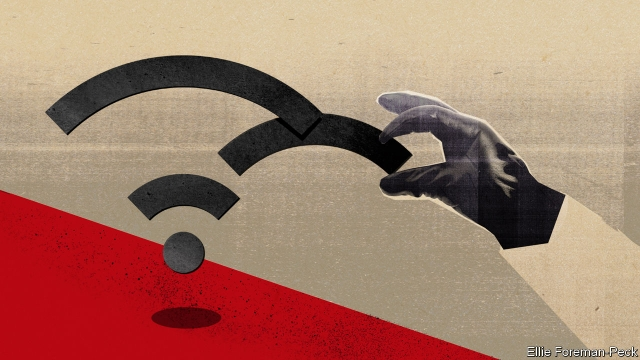

###### Don’t be evil

# Vladimir Putin wants to stifle the internet 

##### Google should not help him 

 

> Mar 7th 2019 

SOMETIMES IT SEEMS as if Vladimir Putin’s presidency has been made for television. His bare-chested exploits on horseback, microlight flights with cranes and the fighting in Ukraine and Syria were planned with the cameras in mind. Having helped turn a little-known KGB officer into a patriotic icon, television has sustained him in power. But recently, there are signs that the spell of Russia’s gogglebox is weakening. Meanwhile, ever more Russians look to the internet for their news. 

Russia’s state-controlled broadcast channels must now compete with social-media stars, YouTubers and online activists (see article). Over the past decade trust in television has fallen from 80% to below 50%; 82% of 18- to 44-year-olds use YouTube and news is its fourth-most-watched category. Some vloggers have audiences that dwarf those of the nightly newscasts. 

Mr Putin’s government is attempting to gain control over social media through legislation, intimidation and new surveillance infrastructure. However, this needs the co-operation of Western internet platforms such as Facebook and Google, which owns YouTube. Increasingly, the government is ordering them to take down politically objectionable material or demanding private data about their users. Internet companies should resist collaborating in state oppression—in the interests of their own profits, as well as of Russian democracy. 

One reason Western platforms should stand their ground is to keep faith with their own professed beliefs. The days when people thought the internet would naturally spread democratic values are over. But Silicon Valley’s liberalising mantras are not entirely hollow: rising internet use is making Russia’s information space more competitive. Alexei Navalny, an opposition leader banned from television, has millions of viewers on YouTube. Abroad, Mr Putin is known as a master manipulator of social media, but at home he is fighting to contain its political impact. 

Another reason for Western platforms to resist being co-opted is that they can. Unlike China, whose rulers quickly recognised the internet’s threat and built a “Great Firewall”, Russia allowed it to grow intertwined with the outside world. A new law on “digital sovereignty” would let the Kremlin censor or cut off the national internet, but actually doing so would be technically and politically hard. Russian internet companies have servers abroad. Young Russians catch the YouTube habit when they are tots, because parents rely on it to entertain them. A big march is planned in Moscow on March 10th in defence of the internet. 

Foreign internet companies do not have an entirely free hand. Western internet giants have servers in Russia. However, the Russian government would rather cajole the likes of Google than cut them off. This gives Western companies clout. They should use it. 

The internet companies’ long-term self-interest matches their principles. Complying with morally dubious government demands threatens their reputation. When news emerged that Yahoo, a web portal, had been telling the Chinese government about its users, its reputation suffered. So far, Facebook and Google have resisted Russian requests to reveal users’ identities. Announcing a pivot to a more privacy-friendly stance this week (see article), Facebook’s boss, Mark Zuckerberg, said his firm would not store sensitive data “in countries with weak records on human rights”. Google has been fined for not removing banned websites from search results. But in the first half of 2018 Google acceded to 78% of the Russian government’s requests to remove material. The firms could do more to stand their ground. 

Russia’s first internet connections were set up in 1989 at the Kurchatov nuclear institute, by scientists who wanted closer contact with the West. They called their network “Demos”. Today’s internet companies should make sure the internet remains a tool for building democracy, not dismantling it. 

-- 

 单词注释:

1.Vladimir[vlɑ'dimɪr]:n. 弗拉基米尔（古罗斯弗拉基米尔-苏兹达里公国的古都） 

2.putin['putin]:n. 普京（人名） 

3.stifle['staifl]:vt. 使窒息, 抑止, 扼杀 vi. 窒息, 被扼杀 

4.google[]:谷歌；搜索引擎技术；谷歌公司 

5.presidency['prezidәnsi]:n. 总统职权, 总裁职位 

6.horseback['hɒ:sbæk]:n. 马背 adv. 在马背上, 骑在马上 

7.microlight[ˈmaɪkrəʊlaɪt]:n. 机动滑翔飞翼 

8.ukraine[ju(:)'krein]:n. 乌克兰（原苏联一加盟共和国, 现已独立） 

9.Syria['siriә]:n. 叙利亚 [经] 叙利亚 

10.kgb[]:abbr. 克格勃, 苏联国家安全委员会（Komitet Gosudarstvennoi Bezopasnosti） 

11.patriotic[.peitri'ɒtik]:a. 爱国的, 有爱国心的 [法] 爱国的, 有爱国心的 

12.icon['aikɒn]:n. 画像, 肖像, 偶像, 图标, 像标 [计] 像标, 图标 

13.gogglebox[]:n. 〈英俚〉电视机 [网络] 英俚电视机 

14.YouTubers[]:[网络] 素人翻唱歌手 

15.online[]:[计] 联机 

16.activist['æktivist]:n. 激进主义分子 

17.youtube[]:n. 视频网站（可以让用户免费上传、观赏、分享视频短片的热门视频共享网站） 

18.vloggers[]:[网络] vlogger 

19.dwarf[dwɒ:f]:n. 矮子, 侏儒 v. (使)变矮小 

20.nightly['naitli]:a. 每夜的, 夜间的 adv. 每夜 

21.newscast['nju:zkɑ:st]:n. 新闻广播 

22.intimidation[in,timi'deiʃәn]:n. 恐吓, 威胁 [法] 恐吓, 威胁 

23.surveillance[sә:'veilәns]:n. 监视, 监督 [电] 侦测 

24.infrastructure['infrәstrʌktʃә]:n. 基础结构, 基础设施 [经] 基础设施 

25.facebook[]:n. 脸谱网 

26.politically[]:adv. 政治上 

27.objectionable[әb'dʒekʃәnәbl]:a. 会引起反对的, 令人讨厌的 

28.datum['deitәm]:n. 论据, 材料, 资料, 已知数 [医] 材料, 资料, 论据 

29.profess[prә'fes]:vt. 声称, 以...为业, 伪称, 讲授 vi. 表白, 承认, 当教授 

30.silicon['silikәn]:n. 硅 [化] 硅Si 

31.liberalise['lɪbərəlaɪz]:vt. 使自由化 

32.mantra['mʌntrә, 'mæn-]:颂歌, 咒语(尤指四吠陀经典内作为咒文或祷告唱念的) 

33.entirely[in'taiәli]:adv. 完全, 全然, 一概 

34.Alexei[]:n. (Alexei)人名；(捷、罗、俄)阿列克谢 

35.Navalny[]:[网络] 纳瓦尔内；瓦尔尼 

36.opposition[.ɒpә'ziʃәn]:n. 反对, 敌对, 相反, 在野党 [医] 对生, 对向, 反抗, 反对症 

37.manipulator[mә'nipjuleitә]:n. 操作者, 机械手 [化] 机械手 

38.quickly['kwikli]:adv. 很快地 

39.firewall[]:[计] 放火墙, 隔离 

40.intertwine[.intә'twain]:v. (使)纠缠, (使)缠绕 

41.sovereignty['sɒvrәnti]:n. 主权, 独立国 [法] 主权, 主权国家, 统治权 

42.Kremlin['kremlin]:n. 克里姆林宫 [经] 克里姆林宫 

43.censor['sensә]:n. 检查员 vt. 检查, 审查, 删改 

44.technically['teknikli]:adv. 技术上, 学术上, 专门地 

45.server['sә:vә]:n. 服伺者, 上菜用具, 发球员 n. 服务器 [计] 服务器, 服务器启动程序, 服务台程序 

46.tot[tɒt]:n. 小孩, 少量, 合计 vi. 合计, 总计为 vt. 加 [计] 全体, 总数, 传送开销时间 

47.cajole[kә'dʒәul]:vt. 以甜言蜜语哄骗, 勾引 

48.clout[klaut]:n. 敲击, 破布 vt. 打补钉 

49.comply[kәm'plai]:vi. 顺从, 依从 [法] 遵守, 承诺, 照做 

50.morally['mɒrәli]:adv. 道德上, 德性上, 有道德地 

51.dubious['dju:biәs]:a. 可疑的, 不确定的 

52.yahoo[jә'hu:]:n. 人面兽心的人, 乡愚, 粗汉 

53.portal['pɒ:tl]:n. 入口, 大门 a. 肝门的 

54.pivot['pivәt]:n. 枢轴, 支点, 旋转运动, 中枢, 关键人物 a. 枢轴的, (如)在枢轴上转动的 vi. 在枢轴上转动, 随着转移 vt. 装枢轴于, 以...为中心旋转 [计] 程序员交互验证和编制工具, 数据透视表 

55.stance[stæns]:n. 准备击球姿势, 站立的姿势, 位置, 姿态 [经] 地位, 形势 

56.zuckerberg[]:扎克伯格 

57.accede[æk'si:d]:vi. 同意, 正式加入, 就任, 继任 

58.kurchatov[]: [地名] [俄罗斯] 库尔恰托夫 

59.Demo['demәu]:n. 演示, 样本唱片 [计] 演示 

60.dismantle[dis'mæntl]:vt. 拆除...的设备, 分解, 去除覆盖物 

