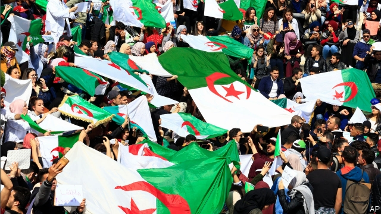
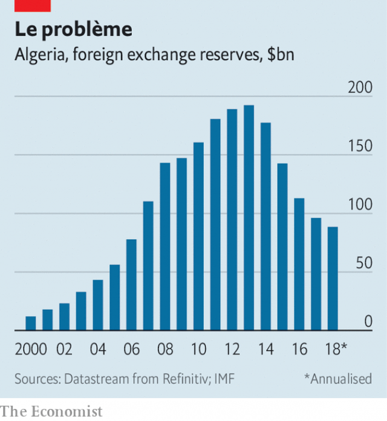

###### “Bury him, don’t elect him”

# Algeria’s ailing 82-year old president wants a fifth term 

##### Furious protesters would rather Abdelaziz Bouteflika retired 

 

> Mar 7th 2019 

ABDELAZIZ BOUTEFLIKA started his campaign for a fifth term as Algeria’s president by promising not to finish it. The ailing ruler, who turned 82 this month, is not even in the country. An associate filed the papers for his candidacy while Mr Bouteflika lay in a hospital bed in Geneva. For two weeks Algerians have been protesting against his decision to run. The largest rally, on March 1st, drew tens of thousands of people. In a letter read on state television, Mr Bouteflika acknowledged their cri de cœur. If re-elected he vowed to call a new presidential vote—and not to contest it. 

Such promises are by now something of a cliché in the Arab world. Hosni Mubarak and Zine el-Abidine Ben Ali, the deposed leaders of Egypt and Tunisia, offered in vain to stand down later if protesters went home. Algerians were similarly unimpressed by the offer. Protests have continued. Mr Bouteflika has rarely been seen in public since a stroke in 2013. In rare videos from official events he appears hunched over in a wheelchair, seemingly unable to speak. That such an invalid could rule the country, even for another year, strikes many of his citizens as an insult. “Respect the dead. Bury him, don’t elect him,” quips one placard seen at the demonstrations. 

But Algerians will have few other options at the polls on April 18th. The main opposition blocs refuse to field candidates, saying they do not wish to legitimise the process. Ali Benflis, a former prime minister who won 12% of the vote in the presidential election of 2014, is not running. Independents have been blocked. A former journalist who hoped to run bowed out after being detained by police at a protest in Algiers, the capital, last month. 

In case this was not farcical enough, enter Rachid Nekkaz, a French-born businessman of Algerian descent who unsuccessfully vied for the French presidency in 2007. Though he has since renounced his French citizenship, he is ineligible to run in Algeria, which bars the office to anyone who has held another nationality. No matter: he enlisted his cousin, an auto mechanic also named Rachid Nekkaz, to run in his stead. If elected, the spanner-wielder would resign and cede power to his namesake. The electoral commission has until March 13th to decide whether to permit this creative scheme. It is likely that Ali Ghadiri, a retired army general, will be the only real opposition candidate. 

Mr Bouteflika has ruled Algeria since 1999. He helped end the gruesome civil war against Islamists that killed some 200,000 Algerians in the 1990s. His party, the National Liberation Front (FLN), led the struggle for independence from France a half-century earlier. But appeals to the past offer little legitimacy in a country where the median age is 28. Most of Algeria’s 42m citizens have no real memory of the civil war, let alone the French occupation. All they have known is one president ruling over an opaque political system. With Mr Bouteflika ill, power rests in the hands of le pouvoir (the power), a cabal of army officers and businessmen who have grown rich off state-funded projects. 

When he faced protests in 2011 Mr Bouteflika bought his way out of trouble with subsidies, pay rises for civil servants and other handouts. This strategy is no longer viable. A decade ago Algeria posted healthy surpluses; last year it ran a deficit equal to 9% of GDP. Foreign reserves have shrunk by 55% since 2013 (see chart). Oil prices are projected to average just over $60 a barrel this year. The government says they must be above $99 to balance the budget. Unemployment stands at 11%, and more than twice that for young people. 

 

These protests seem to have surprised the regime. Security forces have so far applied a light touch. Videos from the protest on March 1st showed demonstrators mingling with police. Powerful figures have hinted that the regime’s patience is limited, though. Ahmed Gaid Salah, the army chief, accused the protesters of trying to drag Algeria back to the days of civil war. “In Syria, protests began with flowers and ended with blood,” warned Ahmed Ouyahia, the prime minister. 

Eight years after Tunisians toppled Mr Ben Ali, the surviving Arab autocrats think they have weathered the revolutionary storm. Like Mr Ouyahia they invoke chaos in Libya, Syria and Yemen to deter their own frustrated citizens from protesting. The economic and social conditions that caused the Arab spring have only worsened, though. Omar al-Bashir, Sudan’s dictator, has faced months of unrest. Since the beginning of 2018 Tunisia, Jordan and Iraq have all seen big demonstrations. This is not the Arab spring redux: the protesters have narrower demands and the sense of pan-Arab solidarity has faded. But the tension in Algeria is another sign that the region’s autocratic stability is illusory. 

Even if Mr Bouteflika is re-elected, he cannot take office without swearing an oath “before the people”. It is unclear that he can manage that. Whether he can survive a full term is doubtful. Opposition parties want to delay the vote. There was talk earlier this year of le pouvoir dumping le président, but they could not agree on a new candidate. After decades of autocracy, Algeria’s hollow political institutions offer few alternatives—though perhaps there is a mechanic named Abdelaziz Bouteflika open to an unexpected career change. 

-- 

 单词注释:

1.ailing['eiliŋ]:a. 生病的 [医] 患病的, 病痛的 

2.protester[]:n. 抗议者, 持异议者, 拒付者 [经] 反对者 

3.abdelaziz[]:n. (Abdelaziz)人名；(阿拉伯)阿卜杜勒-阿齐兹 

4.bouteflika[]:[网络] 布特弗利卡；阿尔及利亚总统布特弗利卡；布特佛里卡 

5.abdelaziz[]:n. (Abdelaziz)人名；(阿拉伯)阿卜杜勒-阿齐兹 

6.bouteflika[]:[网络] 布特弗利卡；阿尔及利亚总统布特弗利卡；布特佛里卡 

7.candidacy['kændidәsi]:n. 候选人的地位, 候选资格 [法] 候选人的身份, 资格 

8.Geneva[dʒi'ni:vә]:n. 日内瓦, (荷兰)杜松子酒 

9.Algerian[æl'dʒiәriәn]:a. 阿尔及利亚的 n. 阿尔及利亚人 

10.rally['ræli]:n. 重振旗鼓, 集合, 群众集会, 跌停回升 v. 重整旗鼓, 集合, 恢复精神, 团结, 挖苦, 嘲笑 

11.tens[]:十位 

12.de[di:]:[化] 非对映体过量 [医] 铥(69号元素铥的别名,1916年Eder离得的假想元素) 

13.vow[vau]:n. 誓约, 誓言, 许愿 vi. 起誓, 发誓, 郑重宣言 vt. 立誓, 起誓要, 郑重地宣布 

14.presidential[.prezi'denʃәl]:a. 总统制的, 总统的, 首长的, 统辖的 [法] 总统的, 议长的, 总经理的 

15.Hosni[]:n. (Hosni)人名；(阿拉伯)胡斯尼 

16.Mubarak[]:n. 穆巴拉克（姓氏） 

17.Zine[zin]:[计] 电子杂志 

18.ben[ben]:n. 内室 [医] 贝昂(俗名,一般指辣木Moringa oleifera,有时也指一些不同属的植物) 

19.ALI[]:[计] 异步线路接口 

20.depose[di'pәuz]:vt. 免职, 废黜, 作证 vi. 作证, 供证 

21.Egypt['i:dʒipt]:n. 埃及 

22.Tunisia[tju:'nisiә]:n. 突尼斯 

23.unimpressed['ʌnim'prest]:a. 无印记的, 没有印象的, 未受感动的 

24.hunch[hʌntʃ]:n. 肉峰, 预感, 大块 vt. 弯腰驼背, 预感到, 耸肩 vi. 向前移动, 隆起 

25.wheelchair['hwi:l.tʃєә]:n. 轮椅 

26.seemingly['si:miŋli]:adv. 看来似乎, 表面上看来 

27.invalid[in'vælid]:n. 病人, 残废者 a. 有病的, 无效的 

28.quip[kwip]:n. 妙语, 遁辞, 讽刺 v. 说讽刺话, 嘲弄 

29.placard['plækɑ:d]:n. 公告, 布告, 小牌, 海报 vt. 公布, 布告, 张帖, 贴海报于 

30.demonstration[.demәn'streiʃәn]:n. 示范, 实证 [医] 示教, 实物教授 

31.opposition[.ɒpә'ziʃәn]:n. 反对, 敌对, 相反, 在野党 [医] 对生, 对向, 反抗, 反对症 

32.bloc[blɒk]:n. 集团 

33.legitimise[li'dʒitimaiz]:vt.<主英> = legitimize 

34.Benflis[]:本·弗利斯 

35.detain[di'tein]:vt. 扣留, 扣押, 耽搁 [法] 拘留, 扣押, 留住 

36.Algiers[æl'dʒiәrz]:n. 阿尔及尔 

37.farcical['fɑ:sikәl]:a. 笑剧的, 滑稽的, 笑剧性的 

38.rachid[]:n. (Rachid)人名；(葡、阿拉伯)拉希德；(英)拉奇德 

39.Algerian[æl'dʒiәriәn]:a. 阿尔及利亚的 n. 阿尔及利亚人 

40.descent[di'sent]:n. 降落, 家系, 侵袭, 血统 [医] 下降, 世代, 血统 

41.unsuccessfully[]:adv. 无用；失败地 

42.vie[vai]:vi. 争, 竞争, 争胜 vt. 提出...来竞争, 以...作较量 

43.presidency['prezidәnsi]:n. 总统职权, 总裁职位 

44.renounce[ri'nauns]:vt. 拒绝, 放弃, 否认, 垫牌 vi. 垫牌, 声明放弃权利 n. 垫牌 

45.citizenship['sitizәnʃip]:n. 国籍, 市民权, 市民的身份 [法] 公民权, 公民资格, 公民身分 

46.ineligible[in'elidʒәbl]:a. 无被选任资格的, 不适任的, 无益的 n. 无被选任资格的人, 不合录用资格的人 

47.Algeria[æl'dʒiәriә]:n. 阿尔及利亚 

48.enlist[in'list]:vt. 征募, 参与, 谋取 vi. 从军, 应募, 赞助 

49.stead[sted]:n. 代替, 接替, 有利, 用处, 好处 vt. 对...有利 

50.cede[si:d]:vt. 割让 [法] 割让, 让与, 放弃 

51.namesake['neimseik]:n. 同名人, 同名物 

52.electoral[i'lektәrәl]:a. 选举人的, 选举的, (有关)选举的 [法] 选举的, 选举人的, 由选举人组成的 

53.gruesome['gru:sәm]:a. 可怕的, 令人毛骨悚然的, 阴森的 

54.Islamist[iz'lɑ:mist]:n. 伊斯兰教主义者；回教教徒 

55.fln[]:abbr. fallen 倒下的; 伐倒的; 伏地的; following landing numbers 其后的登陆人员 

56.legitimacy[li'dʒitimәsi]:n. 合法, 正统, 正当 [法] 合法性, 正统性, 婚生 

57.median['mi:diәn]:a. 中央的, 中间的, 正中的 n. 正中动脉, 中位数, 中线 

58.opaque[әu'peik]:n. 不透明物 a. 不透明的, 不传热的, 不传导的, 阴暗的 [计] 白底 

59.cabal[kә'bæl]:n. 秘密结社, (尤指政治上的)阴谋 vi. 策划阴谋 

60.handout['hændaut]:n. 施舍物, 救济品, 分发的印刷品资料, 广告物品 

61.viable['vaiәbl]:a. 能养活的, 能生长发育的 [医] 有活力的, 有生机的 

62.surpluse[]:[网络] 尚余 

63.deficit['defisit]:n. 赤字, 不足额 [医] 短缺 

64.regime[rei'ʒi:m]:n. 政权, 当权期间, 政体, 社会制度, 体制, 情态 [医] 制度, 生活制度 

65.demonstrator['demәnstreitә]:n. 论证者, 证明者, 指示者, 示威者 [医] 示教者 

66.mingle['miŋgl]:v. (使)混合 

67.ahmed[]:n. 艾哈迈德（男子名） 

68.gaid[]:[网络] 通信技术促进发展全球联盟；通信技术与发展联盟；发展联盟 

69.Salah[sә'lɑ:]:n. = salat [变体] 

70.Syria['siriә]:n. 叙利亚 [经] 叙利亚 

71.Tunisian[tju:'niziәn]:a. 突尼斯的, 突尼斯人的 n. 突尼斯人 

72.topple['tɒpl]:vt. 推翻, 颠覆 vi. 倒塌, 摇摇欲坠 

73.autocrat['ɒ:tәkræt]:n. 独裁者 

74.invoke[in'vәuk]:vt. 祈求, 恳求, 实行, 援引, 引起 [计] 调用; 请求 

75.chao[]:n. 钞（货币） 

76.Libya['libiә]:n. 利比亚 

77.yeman[]:[网络] 也门；叶门；园艺业的普及则始于也门 

78.deter[di'tә:]:vt. 制止, 吓住, 威慑 

79.worsen['wә:sn]:vt. 使更坏, 使恶化 vi. 变得更坏, 恶化 

80.omar['әjmɑ:(r)]:n. 奥马尔（男子名） 

81.dictator['dikteitә]:n. 命令者, 独裁者 

82.jordan['dʒɒ:dәn]:n. 约旦, 约旦河, 尿壶 

83.Iraq[i'rɑ:k]:n. 伊拉克 

84.solidarity[.sɒli'dæriti]:n. 团结, 团结一致, 共同一致 [法] 团结, 共同责任 

85.autocratic[.ɒ:tә'krætik]:a. 独裁的, 专制的 

86.illusory[i'lju:sәri]:a. 产生幻觉的, 幻影的, 错觉的 [法] 因错觉产生的, 虚幻的 

87.cannot['kænɒt]:aux. 无法, 不能 

88.oath[әuθ]:n. 誓约, 誓言, 咒骂 [法] 誓言, 誓约, 宣誓 

89.unclear[.ʌn'kliә]:a. 不易了解的, 不清楚的, 含混的 

90.opposition[.ɒpә'ziʃәn]:n. 反对, 敌对, 相反, 在野党 [医] 对生, 对向, 反抗, 反对症 

91.autocracy[ɒ:'tɒkrәsi]:n. 独裁统治, 独裁统治的国家 [法] 独裁政治, 专制政治, 独裁政府 

92.unexpect[]:[网络] 意想不到；使意外 

