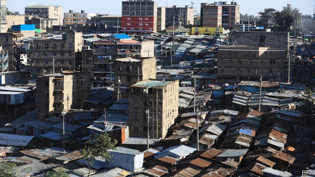

###### Can Kenyatta fix it?

# Nairobi’s planners are knocking the city down to save it 

##### Poor planning and corruption take their toll 

 

> Mar 7th 2019 

MUNICIPAL AUTHORITIES in Nairobi spent much of last year knocking things down. Shopping malls, petrol stations and apartment blocks were levelled; bulldozers cut through slums, leaving tens of thousands homeless. All this destruction may seem rather wanton in a poor city. Yet the government-backed body overseeing it, the Nairobi regeneration task-force, insists that the only way to save the Kenyan capital is to wreck bits of it. 

Nairobi is unrecognisable from the sleepy town it was at the turn of the century. In the past 12 years land prices have soared more than sixfold in 24 of the city’s 32 suburbs and satellite towns, according to HassConsult, a local real-estate agent. What caused it all is disputed, though some developers whisper that the return of dirty money from the West after the 2008 financial crash fuelled the frenzy. Far more money could be made in Kenyan bricks and mortar than in rich-world stockmarkets. Why bother investing in the Nasdaq (returns of 210% since 2007) when an acre in Juja, one of Nairobi’s satellite towns, would have fetched you 1,428%? 

Whatever the reason, many Nairobians cheered the sprouting of the skyscrapers. The boom created jobs for the poor, drove middle-class growth and made the rich richer still. In a city that, like others in Africa, aspires to be a new Dubai or Singapore, what’s not to like? 

Plenty, say urban-planning campaigners. Much of the construction has been unregulated, threatening all manner of problems. With the connivance of corrupt officials, the rich and politically connected built where they pleased. Parks and school playing fields were grabbed. River reserves, and sometimes the rivers themselves, have been partially concreted over, turning Nairobi’s waterways into mosquito-infested open sewers. With nowhere for the water to go, deadly floods wash over the city in rainy seasons. Land set aside for roads has suffered a similar fate, complicating efforts to tackle the city’s spirit-sapping traffic jams. Sky-hugging tower blocks have mushroomed in low-rise residential suburbs: neighbours and zoning regulations be damned. “I was told I could go as high as I liked as long as my pockets were deep enough,” says one project manager. 

Nairobi, once known as “the Green City in the Sun”, has precious few green bits any more. Environmentalists, health experts and engineers are gloomy. Reports crossing the desk of Uhuru Kenyatta, Kenya’s president, warn that the city’s iffy water supply and colonial-era sewers are barely coping, says a presidential adviser. A sanitation crisis looms. 

To try to fix the problem, Mr Kenyatta formed the Nairobi regeneration task-force in 2017. It has identified 4,000 buildings for demolition. Many have already come down, potentially unclogging rivers and freeing space for roads. Yet it will take more than knocking down a few high-rises to reverse a rotten legacy. Nairobi’s population, 3.1m when the last census was taken in 2009, may have added 1.5m since. 

Developing infrastructure to keep pace will be tough. Nairobi’s richer districts have expanded, but so too have its poorer ones. More than half its people live in slums. Shanties will have to be uprooted to let roads, railways and power lines expand. Knocking down buildings in well-heeled areas can cause resentment; taking from the poor may be incendiary. When 10,000 people were uprooted in Kibera, a slum, last July, riot police flanked the bulldozers. 

The government is attempting to deal with some of the problems. A project to build 200,000 low-cost houses in Nairobi is under way. But given how fast the city’s population is growing, little headway will be made in reducing the housing deficit, says Nashon Okowa, who chairs the Association of Construction Managers of Kenya (ACMK). Besides, such schemes have failed before. Plans to ease traffic congestion are in the works, from bus lanes to rapid-transit corridors and commuter trains. Yet these sometimes seem poorly conceived. A measure to ban most public transport from the city centre in December caused gridlock and was quickly abandoned. 

Urban-planning experts say that for Nairobi and other African cities to become the modern metropolises their people dream of, four issues need to be tackled. The first is a skills shortage. Kenyan universities churn out ever more adept planners, but the Nairobi County Government lacks the budget to hire them, so the best often go into the private sector or abroad. Washington Ochieng, a Kenyan who helped develop the EU’s Galileo global navigation satellite system, knows more than most about fixing congestion. But because he heads the Centre for Transport Studies at Imperial College, his expertise benefits London rather than Nairobi. 

Insufficient government investment is a second problem. A loan of $208m from the World Bank to upgrade Nairobi’s transport infrastructure had to be dropped in December after austerity measures were taken to reduce debt. Third, enforcement is hard in societies where the rule of law is weak. Congestion-fighting measures tend not to work if drivers ignore traffic lights. 

This leads to the fourth and biggest problem: corruption. When the demolitions began, Mr Kenyatta promised that no illegal development would be spared, even if it was owned by members of his own family, whose property holdings are said to be vast. Yet the logic of the demolitions was often opaque: buildings belonging to bigwigs were allegedly left standing. Those whose buildings were destroyed, whether investors in the city or shack-owners in the slums, were therefore peeved. “Most of the houses torn down here had been given permits by the district commissioner,” says Josiah Omotto, an activist in Kibera. 

Arbitrary rules deter private investment and hurt property rights. Few know where they stand. Zoning laws are murky. Nairobi’s last functioning master plan was drawn up by British colonial authorities in 1948. There have been efforts to replace it, most recently in 2013, but these are either not enforced or deliberately thwarted by dodgy officials who know that administrative chaos is the best way to extract bribes. “A government that has a record of rent-seeking doesn’t wake up one day and say goodbye to rent-seeking,” says Mr Omotto. For real change to happen, a culture of corruption that has long been endemic in city-planning departments must end. There is little evidence that it has. “Today, construction that is clearly illegal is still being approved,” says Mr Okowa of the ACMK. 

-- 

 单词注释:

1.Kenyatta[]:n. (Kenyatta)人名；(肯)肯雅塔 

2.planner['plænә]:n. 计划者, 设计者, 安排者 [机] 刨床机 

3.corruption[kә'rʌpʃәn]:n. 腐败, 堕落, 贪污 [计] 论误 

4.toll[tәul]:n. 通行费, 代价, 钟声 vt. 征收, 敲钟, 鸣钟, 勾引, 引诱 vi. 征税, 鸣钟 

5.municipal[mju:'nisipl]:a. 市政的, 自治区的, 内政的 [经] 市政的, 市的 

6.Nairobi[nai'rәubi]:n. 内罗比 

7.mall[mɔ:l]:n. 林荫路 

8.bulldozer['buldәuzә]:n. 推土机 [化] 推土机 

9.tens[]:十位 

10.homeless['hәumlis]:a. 无家的, 无养主的 

11.wanton['wɒntәn]:n. 荡妇, 水性杨花的女人 a. 恶意的, 不负责任的, 无节制的, 嬉戏的, 繁茂的, 淫荡的 vi. 变化无常, 嬉戏, 闲荡, 放肆 vt. 挥霍 

12.oversee[.әuvә'si:]:vt. 向下看, 了望, 监督, 偷看到 [法] 监察, 监督, 俯瞰 

13.regeneration[ri.dʒenә'reiʃәn]:n. 再生, 重建 [化] 再生作用 

14.kenyan['kenjәn]:n. 肯尼亚人 

15.unrecognisable[ʌnrekəɡ'naɪzəbl]:a. （人或事物）变得[损坏得]难以辨认的, 无法识别的 

16.soar[sɒ:]:n. 高扬, 翱翔 vi. 往上飞舞, 高耸, 翱翔 

17.sixfold['siksfәuld]:a. 六倍的, 六重的 

18.developer[di'velәpә]:n. 开发者 [计] 显影器 

19.frenzy['frenzi]:n. 疯狂, 狂暴, 狂怒 [医] 暴怒, 狂乱 

20.mortar['mɒ:tә]:n. 臼, 研钵, 灰泥 vt. 用灰泥涂抹, 用灰泥结合 

21.stockmarket[s'tɒkmɑ:kɪt]: 证券市场; 证券交易所; 证券行情 

22.bother['bɒðә]:vt. 烦扰, 迷惑 vi. 烦恼, 操心 n. 麻烦, 纠纷, 讨厌的人 

23.nasdaq['næz,dæk]:abbr. 全国证券交易商自动报价系统协会（National Association of Securities Dealers Automated Quotation） 

24.sprout[spraut]:n. 芽, 萌芽 vt. 使发芽, 摘去芽 vi. 长芽, 抽条 

25.aspire[ә'spaiә]:vi. 渴望, 立志于 

26.dubai['dju:bai]:n. 迪拜（阿拉伯联合酋长国的酋长国之一）；迪拜港（阿拉伯联合酋长国港市） 

27.Singapore[.siŋgә'pɒ:]:n. 新加坡 

28.campaigner[kæm'peinә]:n. 从军者, 老兵, 竞选者 

29.unregulated[]:a. 未经调节的；未校准的 

30.connivance[kә'naivәns]:n. 默许, 纵容 [法] 纵容, 默许 

31.politically[]:adv. 政治上 

32.grab[græb]:n. 抓握, 掠夺, 强占, 东方沿岸帆船 vi. 抓取, 抢去 vt. 攫取, 捕获, 霸占 

33.waterway['wɒtәwei]:n. 航道, 水路 [法] 水道, 水路航道 

34.sewer['su:ә]:n. 下水道, 阴沟, 裁缝师 vt. 用下水道排, 铺设下水道于 

35.tackle['tækl]:n. 工具, 复滑车, 滑车, 装备, 扭倒 vt. 固定, 处理, 抓住 vi. 扭倒 

36.residential[.rezi'denʃәl]:a. 住宅的, 与居住有关的 [法] 有关居住的, 房产的:居所的, 适于居住的 

37.zoning['zәuniŋ]:n. 分区制 [医] 带现象(补体结合) 

38.damn[dæm]:n. 一点, 诅咒, 丝毫 interj. 该死, 该死的 vt. 诅咒, 罚...下地狱 vi. 指责, 谴责, 骂...该死, 证明...有罪 

39.environmentalist[in,vaiәrәn'mentlist]:n. 环保人士 

40.uhuru[u:'huru:]:[斯瓦希里]乌呼噜, 自由 

41.iffy['ifi]:a. 富于偶然性的, 可怀疑的, 未确定的 

42.presidential[.prezi'denʃәl]:a. 总统制的, 总统的, 首长的, 统辖的 [法] 总统的, 议长的, 总经理的 

43.adviser[әd'vaizә]:n. 顾问, 劝告者, 指导教师 [法] 顾问, 劝告者 

44.sanitation[sæni'teiʃәn]:n. (环境)卫生, 环境卫生的提倡/维持, 卫生设备, 下水道设施, 卫生设施 [医] 环境卫生 

45.loom[lu:m]:n. 织布机, 若隐若现的景象 vi. 朦胧地出现, 隐约可见, 可怕地出现 

46.demolition[.demә'liʃәn]:n. 破坏, 毁坏, 撤销 [经] 拆毁(除,破坏) 

47.potentially[pә'tenʃәli]:adv. 可能地, 潜在地 

48.unclog['ʌn'klɔ^]:vt.使畅通,清除…的阻塞, 扫除…的阻碍 

49.legacy['legәsi]:n. 祖先传下来之物, 遗赠物 [经] 遗产, 遗赠物 

50.census['sensәs]:n. 户口普查 vt. 实施统计调查 

51.infrastructure['infrәstrʌktʃә]:n. 基础结构, 基础设施 [经] 基础设施 

52.shanty['ʃænti]:n. 棚屋 

53.uproot[ʌp'ru:t]:vt. 连根拔起, 根除 

54.resentment[ri'zentmәnt]:n. 怨恨, 愤恨 

55.incendiary[in'sendjәri]:a. 放火的, 煽动的, 燃烧的 n. 纵火犯人, 煽动者, 燃烧弹 

56.kibera[]:[网络] 基贝拉；贫民窟基贝拉区；贫民窟奇贝拉 

57.riot['raiәt]:n. 暴动, 喧闹, 放纵 vi. 发动, 暴动, 纵情, 放荡 vt. 浪费, 挥霍 

58.flank[flæŋk]:n. 侧面, 侧腹, 胁, 腰窝肉 vt. 攻击侧面, 守侧面 vi. 侧面与...相接 

59.headway['hedwei]:n. 前进, 航行速度, 进展 [经] 进尺, 钻井 

60.deficit['defisit]:n. 赤字, 不足额 [医] 短缺 

61.Kenya['kenjә]:n. 肯尼亚 

62.congestion[kәn'dʒestʃәn]:n. 拥挤, 充血 [计] 拥挤, 拥塞 

63.commuter[kә'mju:tә]:n. 乘公共车辆上下班者, 月季票乘客 [经] 非(当地)居民 

64.poorly['puәli]:adv. 贫穷地, 不充分地, 贫乏地 a. 身体不舒服的 

65.conceive[kәn'si:v]:vt. 构思, 认为 vi. 怀孕 

66.gridlock[ˈgrɪdlɒk]:n. 交通全面大堵塞; 僵局 v. （交通等）堵塞 

67.quickly['kwikli]:adv. 很快地 

68.metropolis[mi'trɒpәlis]:n. 大都市, 重要中心, 首府 [医] 产地, 生地 

69.churn[tʃә:n]:n. 搅乳器 v. 搅拌, 搅动 

70.adept[ә'dept]:a. 熟练的, 老练的, 巧妙的 n. 能手, 内行 

71.sector['sektә]:n. 扇形, 部门, 部分, 函数尺, 象限仪, 段, 区段 vt. 把...分成扇形 [计] 扇面; 扇区; 段; 区段 

72.Washington['wɒʃiŋtn]:n. 华盛顿 

73.Galileo[.gæli'leiәu]:n. 伽利略 

74.imperial[im'piәriәl]:a. 帝王的, 宗主国的, 至尊的, 壮丽的 n. 特等品 

75.expertise[.ekspә:'ti:z]:n. 专家意见, 专门技术 [法] 专门知识, 专家意见 

76.upgrade['ʌpgreid]:n. 上坡, 升级, 上升 adv. 往上 vt. 使升级, 提升, 改良品种 vi. 升级 [计] 升级 

77.austerity[ɒ'sterәti]:n. 朴素, 苦行, 严格, 严峻 

78.enforcement[in'fɒ:smәnt]:n. 执行, 强制 [法] 实施, 加强, 厉行 

79.holding['hәuldiŋ]:n. 把持, 支持, 保持 [法] 租借地, 占有物, 拥有的财产 

80.bigwig['bigwig]:n. 要人, 大亨 

81.allegedly[ә'ledʒidli]:adv. 依其申述 

82.investor[in'vestә]:n. 投资者 [经] 投资者 

83.peeve[pi:v]:v. (使)气恼, (使)焦躁, (使)忿怒 n. 麻烦的事物, 怨恨, 生气, 触怒 

84.commissioner[kә'miʃәnә]:n. 委员, 理事, 行政长官 [法] 委员, 政府的特派员, 地方地官 

85.Josiah[dʒəu'saiə]:n. 约西亚（男子名） 

86.activist['æktivist]:n. 激进主义分子 

87.deter[di'tә:]:vt. 制止, 吓住, 威慑 

88.zoning['zәuniŋ]:n. 分区制 [医] 带现象(补体结合) 

89.murky['mә:ki]:a. 黝暗的, 阴沉的, 朦胧的 

90.colonial[kә'lәunjәl]:a. 殖民的, 殖民地的 [法] 殖民地居民 

91.thwart[θwɒ:t]:a. 横放的 vt. 反对, 阻挠, 横过 prep. 横过 adv. 横过 

92.dodgy['dɒdʒi]:a. 狡猾的, 逃避的, 难弄的 

93.administrative[әd'ministrәtiv]:a. 管理的, 行政的 [法] 行政的, 管理的, 遗产管理的 

94.chao[]:n. 钞（货币） 

95.extract[ik'strækt]:n. 榨出物, 精汁, 摘录, 选段 vt. (费力地)取出, 采掘, 榨取, 摘录, 吸取 [计] 提取 

96.bribe[braib]:n. 贿赂 vt. 贿赂, 收买 vi. 行贿 

97.endemic[en'demik]:n. 地方病 a. 某地(或某些人中)流行的, 地方的 

