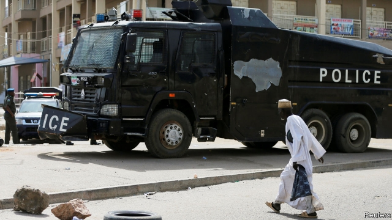

###### States of despair

# Nigeria’s state elections are more violent than national ones 

##### The stakes are high, the rules are ignored 

 

> Mar 9th 2019 

THE BESPECTACLED young woman from Kano, northern Nigeria’s largest city, laughs shyly before she speaks. But scars above her eyebrow and on her forearm hint at a dark past. As a member of a Yandaba gang—politically linked hoodlums who terrorise the city—she would get high before brawling with rival parties’ gangs or, during elections, grabbing ballot boxes from polling stations. 

Most of Nigeria’s 36 states, which elect their governors and state legislators on March 9th, have some equivalent to the Yandaba. These straddle the boundary between party cadres and criminal gangs. They embody the rottenness of state politics in Nigeria. Governors run their states like personal fiefs, amassing fortunes and grooming protégés once they have hit the two-term limit. Although outsiders often pay little attention to them, many in Nigeria fear the upcoming state elections could be bloodier than the presidential poll, in which at least 39 people died (it was won by the incumbent, Muhammadu Buhari). Since states are in charge of budgets for education and health, their elections are also more important. 

When it gained independence from Britain in 1960 Nigeria was divided into three regions. These were later split into four regions before being sliced up into 12 states in 1967 as the government tried to prevent the secession of one of the regions, Biafra. It was brought to heel in a bloody civil war. In the years since then the country has been further diced into 36 states, several of which are failing. In Borno, in the north-east, jihadists control much of the countryside. In Zamfara, in the north-west, bandits have gone on a kidnapping spree. 

Governance is often abysmal. At the end of 2017, according to BudgIT, an NGO, only two states generated more than half of their revenue internally, instead of relying on federal handouts. Debt exceeded annual revenue in 31 states. Kano’s governor, Abdullahi Ganduje, was filmed last year pocketing stacks of hundred-dollar bills. (He says the video is fake.) His predecessor, Rabiu Kwankwaso, spent $200m building three “mega-cities”, one of which he named after himself. Their expensive bungalows are empty aside from the occasional squatter. Before him came Ibrahim Shekarau, who thought polio vaccines were a Western plot to make women infertile. 

Checks on governors’ power are feeble. Although each state has its own legislative assembly and electoral commission for local polls, Maliki Kuliya, who served as Mr Kwankwaso’s justice commissioner, says that these are “just appendages of the executive”. As a result, political parties usually matter less than the politicians who constantly switch between them. Mr Kwankwaso, for instance, looms large over Kano’s politics. He has amassed followers, called the Kwankwasiyya, who wander the streets sporting his distinctive red cap. Not to be outdone, Mr Ganduje—a former Kwankwasiyya who fell out with his mentor—has strived to build up his own personality cult, the Gandujiyya. The two groups rely on Yandaba gangs to swell their ranks and provide muscle. 

The election pits Mr Ganduje against Mr Kwankwaso’s son-in-law. Both sets of supporters have been busy, holding frequent political rallies. Kano’s residents live in fear of such events, during which the gangs go on rampages, attacking each other and snatching purses and phones from passers-by. “Politicians ask for your votes while their followers steal from you,” sighs Michael Sodipo, who runs an NGO that helps young people leave the gangs behind. 

“If we had something else to do, we wouldn’t have done this,” reflects another ex-Yandaba. “But we didn’t know where our next meal would come from.” His friend says the politicians treat them as disposable. Both have spent time in prison, arrested by the same politicians who used to give them drugs and cash. “When I got out,” he adds, “I burned my red cap.” 

-- 

 单词注释:

1.bespectacled[bi'spektәkld]:a. 戴眼镜的 

2.Kano['kɑ:nәu]:卡诺[尼日利亚北部城市] 

3.shyly[]:adv. 害羞地；羞怯地；胆怯地；小心地 

4.eyebrow['aibrau]:n. 眉毛 [医] 眉 

5.forearm['fɒ:rɑ:m]:n. 前臂 vt. 预先武装, 准备 

6.hoodlum['hu:dlәm]:n. 暴徒, 年轻无赖 

7.terrorise['terәraiz]:vt. 使恐怖, 恐吓, 威胁, 胁迫 vi. 引起恐怖, 实行恐怖统治 

8.brawl[brɒ:l]:n. 争吵 vi. 争吵, 哗哗地流水 

9.grab[græb]:n. 抓握, 掠夺, 强占, 东方沿岸帆船 vi. 抓取, 抢去 vt. 攫取, 捕获, 霸占 

10.ballot['bælәt]:n. 投票, 投票用纸, 抽签 vi. 投票, 抽签 vt. 投票选出, 拉选票 

11.legislator['ledʒisleitә]:n. 立法者, 立法官, 立法委员 [法] 立法者, 立法机关成员, 立法委员 

12.straddle['strædl]:n. 跨坐, 观望 v. 跨坐, 两腿叉开坐, 观望 

13.cadre['kædri.'kɑ:dә]:n. 框架, 干部 [经] 干部 

14.embody[im'bɒdi]:vt. 具体表达, 使具体化 [经] 合并, 具体化, 具体表现 

15.rottenness['rɑtnnɪs]: [医]腐败, 腐烂, 败坏; 易碎性 

16.politic['pɒlitik]:a. 精明的, 明智的, 策略的 

17.Nigeria[nai'dʒiriә]:n. 尼日利亚 

18.fief[fi:f]:n. 封地, 采邑 

19.amass[ә'mæs]:vt. 积聚, 堆积 

20.groom[gru:m]:n. 马夫, 新郎, 男仆 vt. 喂马, 使...整洁, 推荐 vi. 打扮, 穿戴 

21.outsider[' aut'saidә]:n. 外人, 局外人, 非会员, 外行, 门外汉, 比赛中获胜可能性不大的选手 [经] 外船公司 

22.upcoming['ʌp.kʌmiŋ]:a. 即将来临的, 即将出现的 

23.bloody['blʌdi]:a. 血腥的, 嗜杀的, 有血的 

24.presidential[.prezi'denʃәl]:a. 总统制的, 总统的, 首长的, 统辖的 [法] 总统的, 议长的, 总经理的 

25.incumbent[in'kʌmbәnt]:a. 现任的, 依靠的, 负有义务的 n. 领圣俸者, 在职者 

26.buhari[]:[网络] 布哈里 

27.secession[si'seʃәn]:n. 脱离, 分离 

28.Biafra[bi'ɑ:frә]:比夫拉[尼日利亚东南部一地区] , 比夫拉湾(几内亚湾一部分, 靠西非的赤道几内亚、喀麦隆和尼日利亚等国) 

29.dice[dais]:n. 骰子 vt. 切成方块 vi. 掷骰子 

30.borno['bɔ:nəu]: [地名] [尼日利亚、意大利] 博尔诺 

31.jihadist[]:n. 伊斯兰圣战士 

32.zamfara[]:[网络] 扎姆法拉州；赞法拉州；赞法拉省 

33.bandit['bændit]:n. 强盗 

34.kidnap['kidnæp]:vt. 绑架, 诱拐, 拐骗 [法] 拐带, 诱拐, 绑架 

35.spree[spri:]:n. 戏耍, 喧闹, 宴会, 狂饮 vi. 狂欢, 狂饮 

36.governance['gʌvәnәns]:n. 统治, 统辖, 管理 [法] 统治, 管理, 支配 

37.abysmal[ә'bizmәl]:a. 深不可测的, 无底的 

38.ngo[]:abbr. 民间组织；非政府组织（Non-Governmental Organization） 

39.internally[in'tәnәli]:[计] 内部的 

40.handout['hændaut]:n. 施舍物, 救济品, 分发的印刷品资料, 广告物品 

41.abdullahi[]:n. (Abdullahi)人名；(阿拉伯)阿卜杜拉希 

42.fake[feik]:n. 假货, 欺骗, 诡计 a. 假的 vt. 假造, 仿造 vi. 伪装 

43.predecessor[.predi'sesә]:n. 前任, 先辈, 前身 [医] 初牙, 前辈, 祖先 

44.squatter['skwɒtә]:n. 蹲着的人, 擅自占用土地或房屋者 vi. 涉水而过 

45.Ibrahim[]:n. 易卜拉欣（与阿丹、努哈、穆萨、尔撒和穆罕默德并称为安拉的六大使者, 亦系犹太教和基督教推崇的圣人和希伯来人的祖先） 

46.polio[]:n. 脊髓灰质炎, 小儿麻痹症 [医] 脊髓灰质炎 

47.vaccine['væksi:n]:n. 牛痘苗, 疫苗 a. 疫苗的, 牛痘的 

48.infertile[in'fә:tail]:a. 不肥沃的, 不毛的, 不结果实的 

49.legislative['ledʒislәtiv]:n. 立法机构 a. 立法的, 有立法权的 

50.electoral[i'lektәrәl]:a. 选举人的, 选举的, (有关)选举的 [法] 选举的, 选举人的, 由选举人组成的 

51.Maliki[]:[网络] 马利基；伊拉克总理马里奇；总理马利基 

52.commissioner[kә'miʃәnә]:n. 委员, 理事, 行政长官 [法] 委员, 政府的特派员, 地方地官 

53.appendage[ә'pendidʒ]:n. 附加物, 附器 [医] 附件, 附器 

54.les[lei]:abbr. 发射脱离系统（Launch Escape System） 

55.constantly['kɒnstәntli]:adv. 不变地, 不断地, 时常地 

56.loom[lu:m]:n. 织布机, 若隐若现的景象 vi. 朦胧地出现, 隐约可见, 可怕地出现 

57.follower['fɒlәuә]:n. 从者, 属下, 追补者 [电] 随动机 

58.distinctive[di'stiŋktiv]:a. 有特色的, 出众的 

59.outdo[.aut'du:]:vt. 超越, 胜过, 战胜 

60.strive[straiv]:vi. 努力, 奋斗, 斗争 

61.cult[kʌlt]:n. 膜拜, 礼拜式, 祭仪, 一群信徒 [医] 迷信, 巫术 

62.supporter[sә'pɒ:tә]:n. 支持者, 后盾, 迫随者, 护身织物 [法] 支持者, 赡养者, 抚养者 

63.rally['ræli]:n. 重振旗鼓, 集合, 群众集会, 跌停回升 v. 重整旗鼓, 集合, 恢复精神, 团结, 挖苦, 嘲笑 

64.rampage['ræmpeidʒ]:n. 乱闹, 乱冲, 暴跳 vi. 乱闹, 狂暴 

65.michael['maikl]:n. 迈克尔（男子名） 

66.disposable[dis'pәuzәbl]:a. 可任意处理的 [法] 可任意处理或处置的, 可自由使用的 

