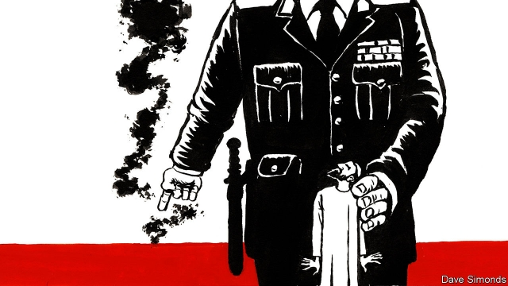

###### Brothers under the bed

# The Egyptian government’s favourite scapegoat 

##### When things go wrong, the regime invariably blames the Muslim brothers 

 

> Mar 9th 2019 

PASSENGERS WAITING on the platform had only seconds to run before they were engulfed in flames. On February 27th a train hurtled into Cairo’s main station, crashed into a barrier and exploded. Twenty-two people died. The cause was a negligent conductor who failed to apply the brake before getting off his train to argue with another worker. It was another failure by a state railway with a long history of them. 

For Egypt’s obsequious journalists, however, darker forces were at work. Pundits falsely claimed that the conductor was from Kerdasa, a village known for its sympathies to the Muslim Brotherhood, once Egypt’s pre-eminent Islamist group. “I cannot rule out that the Brotherhood used the driver,” said Nishat al-Dehi, a television host. An academic interviewed on another channel argued that the furious reaction to the crash was proof of a conspiracy. The group wanted to “divert attention from the achievements” of President Abdel-Fattah al-Sisi. 

Nearly six years have passed since Mr Sisi, then the defence minister, overthrew an elected Brotherhood government in a coup. He paints himself as a modernising force, the man who rescued Egypt from an illiberal regime and set out to fix its stagnant economy. Inconvenient stories are swept under the rug by the secret police, who call networks each day with a list of topics that cannot be discussed. Even the most servile journalists, however, could not ignore a catastrophe in the heart of Cairo. They turned instead to a familiar scapegoat. The Brotherhood is banned, its assets confiscated, its leaders jailed or scattered in exile—and yet, to judge by the media, it is responsible for the country’s every ill. 

Last autumn the price of potatoes rose from five Egyptian pounds ($0.30) per kilogram to 15 or more. It was supply and demand in action: a currency devaluation in 2016 pushed up seed costs, so farmers stopped planting a loss-making crop. For the private daily, Al-Watan, this was not simple economics. It was “financial terrorism”. The Brotherhood had supposedly purchased the nation’s potato crop and hoarded it in warehouses. A sugar shortage in 2016 was similarly blamed on the group. 

Freak winter storms in November 2015 dumped more than 50mm of rain on Alexandria, nearly double what the coastal city receives in an average month. The flooding that followed was, naturally, blamed on the Brotherhood. To prove that it had blocked sewers with cement, the interior ministry released a photograph of a man sitting next to a drain. 

Conspiracy theories are not new in Egypt’s discourse. Shark attacks and out-of-wedlock pregnancies were once blamed on Mossad, Israel’s spy service. The Brotherhood has its own wild rhetoric. In November jihadists thought to be linked to Islamic State killed seven Coptic Christians. The Brotherhood’s website called it a false-flag attack meant to defame Islamists. Egyptian police, for their part, killed ten suspects and claimed they were a well-funded Brotherhood cell because they had a stockpile of bread, cheese and canned tuna—though, notably, no potatoes. 

-- 

 单词注释:

1.scapegoat['skeipgәut]:n. 替罪羔羊, 替人顶罪者, 替身 [法] 替罪羊, 代人受过者 

2.regime[rei'ʒi:m]:n. 政权, 当权期间, 政体, 社会制度, 体制, 情态 [医] 制度, 生活制度 

3.invariably[in'vєәriәbli]:adv. 不变化地, 恒定地, 始终如一地 

4.Muslim['mjzlim; (?@) 'mʌzlem]:n. 伊斯兰教, 伊斯兰教教徒 

5.engulf[in'gʌlf]:vt. 卷入, 吸进, 吞没, 使全神贯注 

6.hurtle['hә:tl]:vi. 猛冲, 碰撞, 突进 vt. 猛撞, 猛投 n. 投掷, 碰撞, 碰撞声 

7.negligent['neglidʒәnt]:a. 疏忽的, 粗心的, 不在意的 

8.obsequious[әb'si:kwiәs]:a. 谄媚的, 奉承的, 顺从的 

9.pundit['pʌndit]:n. 学者, 梵文学者, 博学的印度人, 权威 

10.falsely['fɒ:lsli]:adv. 虚伪地, 错误地, 不实地 

11.Islamist[iz'lɑ:mist]:n. 伊斯兰教主义者；回教教徒 

12.cannot['kænɒt]:aux. 无法, 不能 

13.conspiracy[kәn'spirәsi]:n. 同谋, 阴谋, 阴谋集团 [法] 阴谋, 通谋, 共谋 

14.divert[dai'vә:t]:vt. 转移, 使欢娱 vi. 转移 

15.sisi[]:n. (Sisi)人名；(意)西西 abbr. 短增量敏感指数（short increment sensitivity index） 

16.overthrow[.әuvә'θrәu]:n. 推翻, 瓦解, 倾覆 vt. 打倒, 推翻, 倾覆 

17.coup['ku:]:n. 砰然的一击, 妙计, 出乎意料的行动, 政变 [医] 发作, 中, 击 

18.modernise['mɔdәnaiz]:vt.vi. (使)现代化, (使)适应现代需要 vi. 用现代方法 

19.Egypt['i:dʒipt]:n. 埃及 

20.illiberal[i'libәrәl]:a. 狭隘的, 无教养的, 吝啬的 

21.stagnant['stægnәnt]:a. 不流动的, 停滞的, 不景气的, 萧条的, 污浊的, 迟钝的 [经] 萧条的 

22.inconvenient[.nkәn'vi:njәnt]:a. 不便的, 有困难的 

23.servile['sә:vail]:a. 奴隶的, 奴性的, 卑屈的 

24.Cairo['kaiәrәu]:n. 开罗 

25.asset['æset]:n. 资产, 有益的东西 

26.confiscate['kɒnfiskeit]:vt. 没收, 把...充公, 查抄 a. 被没收的 

27.devaluation[,di:vælju'eiʃәn]:n. 降低价值, 贬值 [经] 贬值 

28.terrorism['terәrizm]:n. 恐怖主义, 恐怖统治, 恐怖状态 [法] 胁迫, 暴政, 恐怖政治 

29.supposedly[sә'pәuzidli]:adv. 想象上, 看上去像, 被认为是, 恐怕, 按照推测 

30.hoard[hɒ:d]:n. 贮藏物, 密藏的金钱 v. 囤积, 贮藏 

31.freak[fri:k]:n. 畸形人, 畸形物, 不正常的事物, 反复无常 a. 奇异的, 反常的 

32.alexandria[,æli^'zɑ:ndriә]:n. 亚历山大港（位于埃及）；亚历山大市（美国弗吉尼亚一城市）；亚历山大大帝 

33.coastal['kәustәl]:a. 海岸的, 沿海的, 沿岸的 [法] 海岸的, 沿海的 

34.sewer['su:ә]:n. 下水道, 阴沟, 裁缝师 vt. 用下水道排, 铺设下水道于 

35.conspiracy[kәn'spirәsi]:n. 同谋, 阴谋, 阴谋集团 [法] 阴谋, 通谋, 共谋 

36.discourse['diskɒ:s]:n. 谈话, 演讲 vi. 谈话, 讲述 

37.pregnancy['preɡnәnsi]:n. 怀孕；丰富, 多产；意义深长 

38.Mossad['mɔsæd]:n. 摩萨德（以色列情报机关） 

39.rhetoric['retәrik]:n. 修辞, 修辞学, 雄辩(术) 

40.jihadist[]:n. 伊斯兰圣战士 

41.Islamic[iz'læmik]:a. 伊斯兰教的, 穆斯林的 

42.Coptic['kɔptik]:a. 科普特人的, 科普特语的, 科普特基督教徒的 n. 科普特语 

43.defame[di'feim]:vt. 诽谤, 中伤, 破坏名誉 [法] 诽谤, 中伤, 诋毁名誉 

44.Islamist[iz'lɑ:mist]:n. 伊斯兰教主义者；回教教徒 

45.stockpile['stɒkpail]:n. 储蓄, 积蓄, 库存 vt. 储蓄, 贮存 

46.canned[kænd]:a. 罐装的, 录音的, 一稿数用的, 刻板的, 被囚的 [机] 洋铁罐的, 罐头的 

47.notably['nәjtbәli]:adv. 显著地, 著名地, 尤其, 特别 

