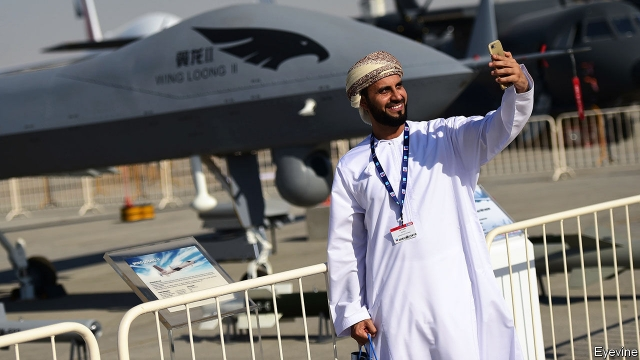

###### Predator pricing

# The growing appetite for armed drones in the Middle East 

##### As America holds back, China is cornering the market 

 

> Mar 9th 2019 

FOR YEARS Al-Anad air base was the springboard for America’s drone war in Yemen. Remote-controlled Predator aircraft wielding Hellfire missiles would take off from the base in Lahej province, in the south-west, to clobber hundreds of suspected jihadists across the country. In January a familiar high-pitched whine returned to the base as a drone emerged from the clouds. It blew up above a parade stand, killing six soldiers. A seventh victim, Yemen’s intelligence chief, died of his injuries three days later. It was the latest of at least a dozen drone attacks by the Houthis, a Shia group that swept across the country in 2014 and is backed by Iran. 

Armed drones have become ubiquitous in the Middle East, say Aniseh Bassiri Tabrizi and Justin Bronk of the Royal United Services Institute, a British think-tank, in a recent report. America has jealously guarded the export of such aircraft for fear that they might fall out of government hands, be turned on protesters or used against Israel. America has also been constrained by the Missile Technology Control Regime, an arms-control agreement signed by 35 countries, including Russia, that restricts the transfer of particularly capable missiles and drones (both rely on the same underlying technology). 

China, which is not a signatory, has stepped in. It has few hang-ups about human rights and no pesky Congress to block deals. It has sold missile-toting drones to Egypt, Jordan, Iraq, Saudi Arabia and the United Arab Emirates (UAE). All are American security partners. “We are seeing Chinese replicas of American [drone] technology deployed on the runways in the Middle East,” growled Peter Navarro, the White House’s trade adviser, last year. He thinks China’s Wing Loong II, bought by the UAE after it was refused an armed type of Predator, is “a clear knock-off”. Other countries, such as Israel, Turkey and Iran, have filled the gap with their own models. 

America wants to muscle its way back into the market. In April 2018 the Trump administration began loosening export rules to let countries buy armed drones directly from defence companies rather than through official channels. Drones with “strike-enabling technology”, such as lasers to guide bombs to their targets, were reclassified as unarmed. 

American drones are costlier and require more paperwork than Chinese models, but are more capable. On average, Chinese drones cannot fly as high or carry as much. Nor can they plug into American or European communication systems. Older variants lack satellite links, limiting how far they can fly from ground stations. Newer ones have that feature, but can be used only with Chinese satellite networks. 

The flood of drones into the market is already making an impact—sometimes literally. Ms Tabrizi and Mr Bronk say some Middle Eastern customers see drones as an “affordable and risk-free” way to strike across borders. Iran and Turkey have used their home-built ones to hit enemies in Syria and Iraq. In April 2018 the UAE sent a Chinese drone to assassinate a Houthi leader in Yemen. Manned warplanes might have been used for any of these missions, of course. But drones are cheaper to fly, attract less attention and can loiter above targets for longer. Their use is bound to grow. 

Non-state actors are unwilling to be left out of the party. The jihadists of Islamic State often used drones in Iraq and Syria. But these were commercial quadcopters that could neither travel as far nor bomb as heavily as the fixed-wing aircraft sold by China. Groups like Yemen’s Houthis and Lebanon’s Hizbullah have more sophisticated fleets, largely thanks to Iranian help. 

Hizbullah was the first such group to use drones when it hit 23 fighters linked to al-Qaeda in Syria in 2014. The Houthi drone that bombed Al-Anad looked a lot like an Iranian model. Last year the Houthis sent a similar one more than 100km (60 miles) into Saudi Arabia before it was shot down. Others have ploughed into the radars of Saudi missile-defence systems. Like China, Iran has copied drone designs from American models. Middle Eastern skies look set to grow busier and dicier. 

-- 

 单词注释:

1.predator['predәtә]:n. 食肉动物, 掠夺者 [医] 捕食者 

2.drone[drәun]:n. 雄蜂, 懒惰者, 嗡嗡的声音, 无人驾驶飞机(或船) vi. 嗡嗡作声, 混日子 vt. 低沉地说 

3.springboard['spriŋbɒ:d]:n. 跳板, 出发点 

4.yeman[]:[网络] 也门；叶门；园艺业的普及则始于也门 

5.wield[wi:ld]:vt. 挥舞, 运用 

6.hellfire['helfaiә]:n. 地狱之火, 严酷的苦难 

7.Lahej[]:[网络] 拉赫治；也门 

8.clobber['klɒbә]:n. 衣服, (鞋匠用来掩饰皮革缝的)软膏 vt. 痛打, 击倒, 拉垮 

9.jihadist[]:n. 伊斯兰圣战士 

10.whine[hwain]:n. 哀叫声, 嘎嘎声, 哀鸣 vi. 哭诉, 嘎嘎响, 发呜呜声 vt. 哀诉 

11.houthis[]:[网络] 胡塞叛军；侯赛斯；青年运动 

12.shia[]:n. 什叶；什叶派（等于Shiah） 

13.Iran[i'rɑ:n]:n. 伊朗 

14.ubiquitous[ju:'bikwitәs]:a. 无所不在的, 到处存在的, 普遍存在的 

15.tabrizi[]:n. (Tabrizi)人名；(伊朗)大不里士 

16.justin['dʒʌstin]:n. 贾斯廷（男子名） 

17.bronk[]: [人名] 布朗克 

18.jealously[]:adv. 嫉妒, 羡慕, 留心, 戒备 

19.protester[]:n. 抗议者, 持异议者, 拒付者 [经] 反对者 

20.Israel['izreil]:n. 以色列, 以色列后裔, 犹太人 

21.constrain[kәn'strein]:vt. 强迫, 限制, 关押 

22.regime[rei'ʒi:m]:n. 政权, 当权期间, 政体, 社会制度, 体制, 情态 [医] 制度, 生活制度 

23.underlie[.ʌndә'lai]:vt. 位于...之下, 成为...的基础 

24.signatory['si^nәtәri]:n. 协议的签署者, 签约国 a. 签署的, 签约的 

25.pesky['peski]:a. 麻烦的, 恼人的, 棘手的, 讨厌的 

26.Egypt['i:dʒipt]:n. 埃及 

27.jordan['dʒɒ:dәn]:n. 约旦, 约旦河, 尿壶 

28.Iraq[i'rɑ:k]:n. 伊拉克 

29.saudi['sajdi]:a. 沙乌地阿拉伯（人或语）的 

30.Arabia[ә'reibiә]:n. 阿拉伯半岛 

31.emirate[e'miәrit]:n. 埃米尔的地位, 酋长国 

32.UAE[]:阿拉伯联合酋长国 

33.replica['replikә]:n. 复制品 [计] 目录分区复制 

34.deploy[di'plɒi]:v. 展开, 配置 

35.runway['rʌnwei]:n. 跑道, 河床, 过道 [化] 单轨架空道; 吊车道 

36.growl[graul]:n. 吠声, 咆哮声 v. 怒吠, 咆哮, 吼 

37.peter['pi:tә]:vi. 逐渐消失, 逐渐减少 

38.Navarro[]:n. (Navarro)人名；(法、西、意、罗、葡)纳瓦罗 

39.adviser[әd'vaizә]:n. 顾问, 劝告者, 指导教师 [法] 顾问, 劝告者 

40.loong[lu:ŋ]:n. 龙; 中国龙; 吉祥物; 中华民族的图腾和象征 

41.ii[]:abbr. 微光（Image Intensification） 

42.trump[trʌmp]:n. 王牌, 法宝, 喇叭 vt. 打出王牌赢, 胜过 vi. 出王牌, 吹喇叭 

43.reclassify['ri:'klæsifai]:[经] 三级分类 

44.unarm[.ʌn'ɑ:m]:vt. 缴械 vi. 放下武器 

45.cannot['kænɒt]:aux. 无法, 不能 

46.variant['vєәriәnt]:n. 变体, 异体 a. 不同的, 有差别的 [计] 变体型 

47.literally['litәrәli]:adv. 逐字地, 按照字面上地, 不夸张地 

48.affordable[]:[计] 普及型 

49.Syria['siriә]:n. 叙利亚 [经] 叙利亚 

50.assassinate[ә'sæsineit]:vt. 暗杀, 行刺 [法] 暗杀, 行刺, 中伤 

51.houthi[]:[网络] 胡塞；也门一侧胡塞；什叶派胡塞 

52.warplane['wɒ:plein]:n. 军用飞机 

53.les[lei]:abbr. 发射脱离系统（Launch Escape System） 

54.loiter['lɒitә]:v. 闲荡, 虚度, 徘徊 

55.Islamic[iz'læmik]:a. 伊斯兰教的, 穆斯林的 

56.quadcopters[]:[网络] 四位数 

57.hizbullah[]:n. 真主党 

58.sophisticate[sә'fistikeit]:n. 久经世故的人, 精于...之道的人 vt. 篡改, 曲解, 使变得世故, 掺合, 弄复杂 vi. 诡辩 

59.Iranian[i'reiniәn]:a. 伊朗的, 伊朗语系的 n. 伊朗人, 伊朗语 

60.dicey['daisi]:a. 不确定的, 危险的, 冒险性的 

