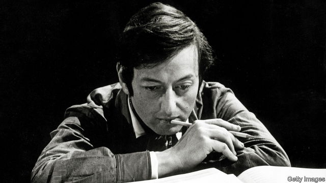

###### Maestro and music

# Obituary: André Previn died on February 28th 

##### The conductor, pianist and composer was 89 

 

> Mar 7th 2019 

WHEN CRITICS had a go at André Previn in his heyday, the word “showman” was an easy gibe. The maestro seemed bigger than the music, and that was no surprise. After all, his background was in Hollywood scores, turning out reams of stuff for Lassie to bark at or Debbie Reynolds to talk over. Some of that glitz and schmaltz seemed to hang around in his gentle American voice, as well as in his soft spot for Rachmaninov and the too-lush sound of his string sections. In his spare time, for many years, he played jazz with his own trio in smoky dives. He liked television and was often on it in Britain in the 1970s, presenting orchestral music as light entertainment and even as comedy. The conductor at various times of several of the world’s great orchestras, the London Symphony, the London Philharmonic, the Pittsburgh Symphony, the Vienna Philharmonic, took a lifetime to shed that label of lightweight Los Angeles Romanticism. 

It clung to him well before he arrived in London in 1968, with his dark mop of hair, mandarin jackets, Swinging Sixties ways and the air of a casual, if reserved, film star. He had been fired as music director of the Houston Symphony partly for parading round town in blue jeans with Mia Farrow, an elfin actress who became his third wife, while he was still married to his second, Dory, who poured out desperate songs about him. There were more wives, many flings. For years the press swarmed after him like flies. 

Yet he was more than capable of defending himself. On the subject of the women, they were all the best of friends. On taking classical music downmarket, the figures spoke for themselves. When he conducted the Houston Symphony in its dollar concerts at the Sam Houston Coliseum, he would pack 12,000 in. Each time he hosted “André Previn’s Music Night” on the BBC, chatting informally to the audience since he was sitting in their living rooms, he probably drew in more people in a week than the LSO, his chief orchestra, had managed in 65 years of performances. And when he appeared on “Morecambe and Wise” with the LSO as “Andrew Preview”, letting Eric Morecambe lift him by the lapels for questioning the comedian’s “playing” of Grieg’s Piano Concerto, he made the orchestra so famous that it was saved from bankruptcy, and himself so instantly recognisable that taxi drivers hailed him with “Hallo, Mr Preview!”. This made him very happy. 

As for Hollywood, he had loved it. His Jewish family had fled to Los Angeles from Berlin, via Paris, in 1938 when he was ten; Hollywood was where he plunged into life. Who wouldn’t like to go to work each day in glorious sunshine, with all those pretty girls, and noodle a little Jerome Kern at parties? When he was 17 Ava Gardner tried to seduce him; two years later, he was confident enough to try the same with her. (Result, zero.) He won four Oscars for his film music, which included “Gigi” and “My Fair Lady”, and was nominated for nine more. If he could have kept laughing at the idiocies of producers who demanded, like Irving Thalberg, that “no music in an MGM film is to contain a minor chord”, he could have spent the rest of his career in that swimming-pool life. 

And it could never have satisfied him. For under that peripheral glamour he was deeply committed to music for its own sake, a commitment he entered into at five, by asking his father for piano lessons. At six, he was in the Conservatory. Piano remained the deepest part of his multi-layered career, with recordings of the Mozart and Ravel concertos as well as chamber works by Brahms, Prokofiev, Gershwin and Barber, to name a few. His playing too was nurtured in Los Angeles by the many European émigrés, refugees from great orchestras, who relieved their boredom with film music by playing chamber music in abandoned school halls. It was there he discovered, through the violinist Joseph Szigeti, the trios of Beethoven and Schubert, and formed a classical trio himself. He played for Schoenberg and Stravinsky and, among the émigrés, began to feel the power of a baton in his hand. Meanwhile he went on joyously with jazz, again in his own trio. His intricate “games” with them sold hundreds of thousands of records. 

The definite shift to conducting came in 1968, at 39, when the LSO recruited him for a spell that lasted 11 years. He accepted so fast that it shocked him, but his boyhood passion had been to see the hills that inspired Vaughan Williams and the sea that pulsed through Britten’s “Peter Grimes”. These composers, as well as Elgar and Walton, who wanted to dedicate his never-written third symphony to him, now became favourites in his repertoire. (He recorded all nine symphonies of Vaughan Williams, rapturously confessing that he really was a romantic.) Conducting required an even more serious approach, though he remained good at cloaking it with soft-spoken jokiness: massive amounts of research and rehearsal time, especially for pieces the players thought they knew. 

But music directing too had its infuriating sides: politicking and socialising, ladies’ committees, truculent boards, shop stewards. None of that had anything to do with the music, which always stayed several steps ahead of him. He could spend his life chasing a great symphony, and never catch up. No performance could ever be as good as the work itself. Straggling behind, he composed many pieces of his own: sonatas, trios and songs, with a violin concerto for his fifth wife, the violinist Anne-Sophie Mutter. In older age, as in his Hollywood film-score years, he would pick up his pencil every day. It was not a question of waiting for the muse to kiss him, though that would have been nice. He wanted to understand the engineering of perfection: how Debussy could write “L’après midi d’un faune” without a single note put in for show; how the beginning of Brahms’s Fourth Symphony could reduce him to tears; how the unsurpassable serenity of the second movement of Beethoven’s Violin Concerto could change the way he saw the world. Before something as beautiful and frightening as music, he could only efface himself. 

-- 

 单词注释:

1.maestro[mɑ:'estrәu]:n. 音乐大师, 大音乐家 

2.Previn[]:n. (Previn)人名；(英)普雷文 

3.composer[kәm'pәuzә]:n. 作曲家, 作家, 调停者 

4.heyday['heidei]:n. 全盛期 interj. 嘿 

5.showman['ʃәumәn]:n. 演出主持人, 玩杂耍的人 

6.gibe[dʒaib]:v. 嘲笑 n. 嘲笑 

7.maestro[mɑ:'estrәu]:n. 音乐大师, 大音乐家 

8.Hollywood['hɔliwud]:n. 好莱坞, 美国电影界, 美国电影工业, 美国式电影 

9.ream[ri:m]:n. 令, 大量 vt. 扩(孔), 榨取, 挖 

10.lassie['læsi]:n. 少女, 姑娘, 恋人 

11.debbie['debi]:n. 黛比（女子名, 等于Debby） 

12.reynolds['renәldz]:n. 雷诺兹（姓氏） 

13.glitz[glɪts]:n. 闪光, 炫目, 浮华 

14.schmaltz[ʃmɒ:lts]:n. 过于感伤的作品, 伤感 

15.Rachmaninov[]:拉赫曼尼诺夫(俄裔作曲家) 

16.trio['tri:әu]:n. 三重唱 

17.smoky['smәuki]:a. 冒烟的, 满是烟的, 熏脏的, 烟灰色的 

18.orchestral[ɒ:'kestrәl]:a. 管弦乐队的 

19.philharmonic[.filɑ:'mɒnik]:a. 爱好音乐的, 交响乐团的, 爱乐团体的 n. 音乐爱好者, 音乐协会, 音乐会, 交响乐团 

20.Pittsburgh['pitsbә:g]:n. 匹兹堡 

21.Vienna[vi'enә]:n. 维也纳 

22.lightweight['laitweit]:n. 不到平均重量的人/物, 轻量级, 无足轻重的人, 性格不够强的人 a. 平均重量以下的, 重量轻的 [计] 轻便的, 轻量的 

23.los[lɔ:s]:abbr. 月球轨道航天器（Lunar Orbiter Spacecraft）；视线（Line of Sight） 

24.angeles[]:n. 安杰利斯（姓氏）；天使城（菲律宾地名） 

25.romanticism[rәu'mæntisizm]:n. 浪漫主义精神, 浪漫主义 

26.cling[kliŋ]:vi. 粘紧, 附着, 紧贴, 坚持 

27.mandarin['mændәrin]:n. 中国官话, 国语, 满清官吏, 柑橘 a. (中国式)紧身马褂的 

28.Houston['hju:stәn]:n. 休斯敦 

29.jean[dʒi:n]:n. 牛仔裤, 牛仔布, 斜纹棉布 

30.mia[]:abbr. 战斗中失踪的（Missing In Action） 

31.farrow['færәu]:n. 一窝小猪, 猪的一胎 

32.elfin['elfin]:a. 小妖精的, 象小妖精的 n. 小精灵, 矮人, 淘气鬼 

33.dory['dɒ:ri]:n. 平底小渔船, 海鲂 

34.fling[fliŋ]:n. 投掷, 急冲, 嘲弄 vt. 投, 丢下, 抛弃, 使陷入, 挥动, 嘲笑, 扫视 vi. 猛冲 

35.downmarket[ˌdaʊnˈmɑ:kɪt]:a. （商品或服务）价廉质次的, 下品的, 低档的 

36.SAM[sæm]:[计] 安全性帐户管理器 

37.coliseum[,kɔli'siәm]:n. 大体育馆, 大剧场,大公共娱乐场 

38.BBC[]:英国广播公司 

39.informally[]:adv. 非正式地；不拘礼节地 

40.lso[]:abbr. London Symphony Orchestra 伦敦交响乐团 

41.Morecambe[]:n. (Morecambe)人名；(英)莫克姆 

42.andrew['ændru:]:n. 安德鲁（男子名） 

43.eric['erik]:abbr. 科教资源信息中心（Educational Resources Information Center）；电子遥控与独立控制（Electronic Remote and Independent Control） 

44.lapel[lә'pel]:n. 翻领 

45.concerto[kәn'tʃєәtәu]:n. 协奏曲 

46.bankruptcy['bæŋkrәptsi]:n. 破产者 [经] 破产, 倒闭 

47.recognisable[]:a. 可辨认的；可认识的；可承认的（=recognizable） 

48.hail[heil]:n. 冰雹, 致敬, 欢呼, 招呼 vt. 向...欢呼, 致敬, 招呼, 使象下雹样落下 vi. 招呼, 下雹 interj. 万岁, 欢迎 

49.hallo[hә'lәu]:interj. 嘿, 喂, 哈罗 

50.Berlin[bә:'lin]:n. 柏林, (软质)柏林毛线 

51.jerome[dʒә'rәum]:n. 杰罗姆（男子名） 

52.kern[kә:n]:n. 核, 颗粒, 仁 vt.vi. 结果实 [计] 出格字母, 出格部分, 压缩字距 

53.ava[]:[医] 卡法根, 麻醉椒(根及根茎) 

54.gardner['^ɑ:dnә(r)]:n. 加德纳（男子名） 

55.seduce[si'dju:s]:vt. 唆使, 怂恿, 引诱, 诱奸 [法] 勾引, 诱惑, 诱奸 

56.Oscar['ɔskә]:n. 奥斯卡金像奖, 钱, 现金 

57.gigi[]:n. 吉吉；金粉世界；琪琪（电影名） 

58.nominate['nɒmineit]:vt. 提名, 任命, 命名 [法] 提名...为候选人, 指定, 推荐 

59.idiocy['idiәsi]:n. 白痴, 极端愚蠢 [医] 白痴 

60.producer[prә'dju:sә]:n. 生产者, 制作者, 制作人 [化] 发生器; (炉煤气)发生炉; 制气炉; 生产者 

61.irving['ә:viŋ]:n. 欧文（男子名, 涵义为海的朋友）；欧文（美国作家） 

62.thalberg[]:[网络] 塔尔贝格；泰伯格；泰尔贝格 

63.mgm[]:abbr. 美国米高梅电影制片公司（Metro-Goldwyn-Mayer） 

64.chord[kɒ:d]:n. 弦, 和音 [医] 索, 带 

65.peripheral[pә'rifәrәl]:a. 周边的, 周围的, 圆周的, 无关紧要的, 肤浅的 [医] 外周的, 周围的, 末梢的 

66.glamour['glæmә]:n. 魅力, 迷人的美, 魔法 vt. 迷惑 

67.conservatory[kәn'sә:vәtәri]:a. 保存性的, 有保存力的 n. 温室, 音乐学校 

68.recording[ri'kɒ:diŋ]:a. 记录的, 记录用的 n. 录音 

69.Mozart['mәutsɑ:t]:n. 莫扎特 

70.ravel['rævәl]:vt. 使纠缠, 使混乱, 拆开, 弄清 vi. 散开, 解除 n. 纠缠的一团, 散纱 

71.concerto[kәn'tʃєәtәu]:n. 协奏曲 

72.brahm[]: [人名] 布拉姆 

73.Prokofiev[]:普罗科菲耶夫（人名） 

74.Gershwin['^ә:ʃwin]:格什温(姓氏) 

75.nurture['nә:tʃә]:n. 养育, 营养物, 培育 vt. 养育, 供给营养物, 教养 

76.refugee[.refju'dʒi:]:n. 难民, 流亡者 [法] 避难者, 流亡者, 难民 

77.boredom['bɒ:dәm]:n. 厌烦, 厌倦, 令人厌烦的事物 

78.Joseph['dʒәuzif]:n. 约瑟夫（男子名）；约瑟（圣经中雅各的第十一子） 

79.szigeti[]:[网络] 西盖蒂；西格提；约瑟夫 

80.Beethoven['beitәuvәn]:n. 贝多芬 

81.schubert[]:n. 舒伯特（奥地利作曲家） 

82.Schoenberg[]:舍恩伯格（人名） 

83.Stravinsky[]:斯特拉温斯基（人名） 

84.baton['bætәn]:n. 指挥棒, 接力棒, 警棍 

85.joyously[]:adv. 快乐地 

86.intricate['intrikit]:a. 复杂的, 错综的, 缠结的, 难懂的 

87.boyhood['bɒihud]:n. 少年时代 

88.vaughan[vɔ:n]:沃恩（姓氏, 男子名） 

89.williams['wiljәmz]:n. 威廉姆斯（男子名） 

90.peter['pi:tә]:vi. 逐渐消失, 逐渐减少 

91.grime[graim]:n. 尘垢, 煤尘, 污点 vt. 使污秽, 使...弄脏 

92.Elgar['el^ә]:埃尔加(姓氏) 

93.walton['wɔ:ltәn]:n. 沃尔顿（男子姓氏） 

94.dedicate['dedikeit]:vt. 献出, 贡献 

95.repertoire['repәtwɑ:]:n. 全部剧目, 全部技能, 全部节目, 全部作品 

96.rapturously['ræptʃərəslɪ]:adv. 兴高采烈地, 狂喜地 

97.infuriate[in'fjuәrieit]:a. 狂怒的 vt. 激怒 

98.politick['pɔlitik]:vi. 进行政治活动, 谈论政治 

99.socialise['sәjʃәlaiz]:vt. 使社会化, 使社会主义化, 使适合社会需要 vi. (美)(非正式)参加社交活动, 发生社交往来 

100.truculent['trʌkjulәnt]:a. 野蛮的, 粗暴的, 致命的, 好斗的 

101.alway['ɔ:lwei]:adv. 永远；总是（等于always） 

102.straggle[strægl]:vi. 掉队, 落伍, 蔓延, 散乱 n. 低空扫射 

103.sonata[sә'nɑ:tә]:n. 奏鸣曲 

104.muse[mju:z]:n. 沉思, 冥想 v. 沉思, 冥想, 若有所思地凝望或说 

105.debussy[]:n. 德彪西（法国作曲家） 

106.midi['midi]:n. 中长裙, 乐器数字化接口 [计] 乐器数字化接口 

107.faune[]:[网络] 牧神 

108.unsurpassable[,ʌnsә'pɑ:sәbl; -'pæ-]:a. 无法超越的 

109.serenity[si'reniti]:n. 宁静, 沉着, 晴朗 

110.efface[i'feis]:vt. 抹去, 消除, 忘却 

