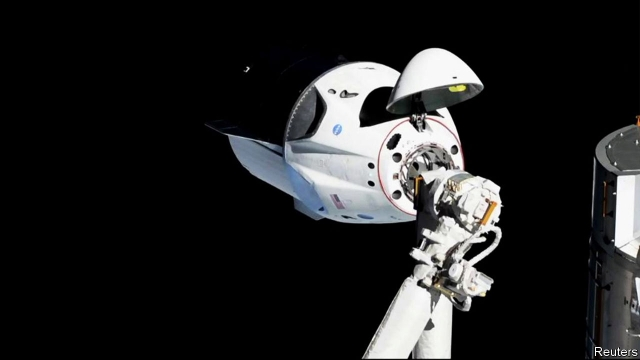

###### Enter, the dragon

# A Dragon visits the ISS 

##### This time, the crew is a dummy. Next time, people will be on board 

 

> Mar 7th 2019 

ELON MUSK’S AMBITION to launch people into orbit around Earth took another step forward on March 3rd. That was when a Crew Dragon space capsule, built by Mr Musk’s company, SpaceX, docked successfully with the International Space Station (ISS). Crew Dragon is the human-capable version of a craft SpaceX has been sending to the ISS for the past seven years as a supply truck. On this flight the capsule had a dummy on board (as well as supplies for the station). Later in the year, if all goes according to plan, Bob Behnken and Doug Hurley, both veterans of America’s space-shuttle programme, will become SpaceX’s first two astronauts. Whether they will beat SpaceX’s rival, Boeing’s Starliner, to the ISS remains to be seen. Boeing is planning its own dummy mission in April. If that works, the race will truly be on. 

-- 

 单词注释:

1.ISS[]:[化] 离子散射能谱; 离子散射能谱学 

2.dummy['dʌmi]:n. 傀儡, 假人, 仿制品 a. 虚设的, 假的, 名义上的 

3.elon[i'lɔn]:n. 埃伦（可溶性显影剂粉末） 

4.spacex[]:[网络] 太空探索技术公司；美国太空探索技术公司；太空探索科技公司 

5.bob[bɒb]:vt. 剪短, 敲击 vi. 振动, 上下跳动 n. 短发, 悬挂的饰品, 浮子, 摆动, 轻敲, 5便士 

6.doug[]:n. 道格 

7.hurley['hә:li]:赫尔利(姓氏) 

8.starliner[]:[网络] 尼奥普兰推出星际线；星空女士腕表；尼奥普兰星际线 

9.boe[bəu]:abbr. back outlet eccentric 后偏心（轮）出口 

