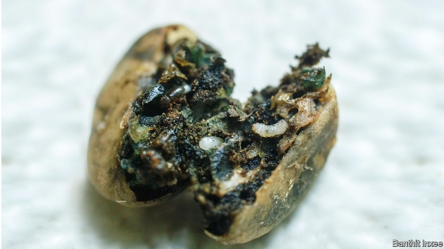

###### Pest control

# A cheap way to protect coffee crops from boring beetles 

##### Build bridges to predatory ants’ nests using string 

 

> Mar 7th 2019 

FEW PESTS wreak more havoc on coffee plantations than the berry-borer beetle. In Brazil alone its depredations are reckoned to cost $300m a year, so keeping the insects under control is a priority for plantation owners around the world. That is easier said than done. Berry borers spend most of their lives inside the berries. Their eggs hatch there. Their larvae feed, grow and pupate there. And their adults mate there. Only pregnant females seeking another berry to lay their eggs actually see the light of day. This makes attacking the beetles with insecticides tricky. 

Researchers have, however, known for some time that a species of Central American ant called Azteca sericeasur is adept at keeping berry-borer populations at bay. These ants live in trees grown alongside coffee bushes to provide shade—for coffee bushes do not thrive in direct sunlight. In particular, the ants prefer to nest in a tree called the cuaniquil. 

The question is how to encourage Azteca’s foraging workers down from their cuaniquil eyries and into coffee bushes in large enough numbers to keep berry borers under control. And, as they report in Biotropica, Esteli Jimenez-Soto of the University of California, Santa Cruz, and Jonathan Morris of the University of Michigan think they have an answer: build bridges. 

Working with a team of colleagues, Dr Jimenez-Soto and Dr Morris studied a coffee plantation in Chiapas, Mexico. All of the coffee bushes there were growing under a canopy of shade trees, and some of these trees were cuaniquil. The researchers selected 20 sites, each separated from the others by at least ten metres, for their experiment. All included a cuaniquil that hosted an active ant colony and six coffee bushes that were not touching one another. To the trunks of three of these bushes, selected at random, they tied strings that led to branches of the ant-bearing cuaniquil. The other three bushes were left untouched and monitored as controls. The team followed up by counting ants periodically on specific sections of the coffee bushes during the days that followed. 

To decide whether the newly established string highways were indeed granting protection, three days after building the connections Dr Jimenez-Soto and Dr Morris attached white cards bearing ten dead adult female borer beetles to the trunks of all the coffee bushes in the research sites. They monitored these cards for half an hour, noting ant activity on them, and also recording how many beetles were removed during that period. 

The string highways proved popular with the ants. Three-quarters of them turned into ant trails, and at least some were used in this way in every one of the study sites. Presumably as a consequence, ant activity on bushes connected by strings to cuaniquil trees more than doubled, while that on unconnected neighbours saw no statistically significant change. 

This extra activity resulted in more beetle-scavenging. Coffee bushes connected by string to a cuaniquil had an average of three of the carded insects removed by the ants during the 30-minute window, triple the rate for unconnected bushes. Dead beetles on cards are clearly easier prey than live ones hidden in coffee berries. Nevertheless, this is an encouraging result for plantation owners. If further experiments back these results up it may be that the coffee-borer problem can be alleviated by a combination of planting the right sorts of shade trees and the wise deployment of some balls of string. 

-- 

 单词注释:

1.beetle['bi:tl]:n. 甲虫, 大槌 vi. 快速移动 vt. 捶 

2.predatory['predәtәri]:a. 掠夺成性的, 捕食生物的, 掠夺的 [医] 捕食的 

3.wreak[ri:k]:vt. 发泄(怒火), 报仇 [法] 报仇, 报复, 施 

4.havoc['hævәk]:n. 大破坏, 蹂躏 vt. 严重破坏 

5.Brazil[brә'zil]:n. 巴西 

6.depredation[.depri'deiʃәn]:n. 掠夺, 破坏 

7.reckon['rekәn]:vt. 计算, 总计, 估计, 认为, 猜想 vi. 数, 计算, 估计, 依赖, 料想 

8.borer['bɒ:rә]:n. 穿孔者, 钻孔器, 钻孔虫 [医] 钻孔器, 钻蛀虫 

9.larva['lɑ:vә]:n. 幼虫 [医] 幼虫(昆虫), 蚴(蠕虫) 

10.pupate['pju:peit]:vi. 化蛹 

11.insecticide[in'sektisaid]:n. 杀虫剂 [化] 杀虫剂 

12.tricky['triki]:a. 狡猾的, 机敏的 

13.specie['spi:ʃi]:n. 硬币 [经] 硬币 

14.azteca[]:[网络] 阿兹特克；阿兹台克；阿兹提克 

15.adept[ә'dept]:a. 熟练的, 老练的, 巧妙的 n. 能手, 内行 

16.forage['fɒridʒ]:n. 粮草, 饲料, 搜寻粮草 vt. 喂, 掠夺, 搜寻粮秣 vi. 搜寻粮草, 掠夺 

17.eyry['aiәri,'iәri]:n. (=eyrie)巢, 雏 

18.esteli[]:[网络] 斯特利；埃斯特利；尼加拉瓜埃斯特利 

19.California[.kæli'fɒ:njә]:n. 加利福尼亚 

20.santa['sæntә]:n. 圣诞老人（等于Santa Claus） 

21.cruz[]:n. （西）克鲁兹（男子名） 

22.jonathan['dʒɔnәθәn]:n. 乔纳森（男子名） 

23.morris['mɒ:ris]:n. 莫里斯舞 

24.Michigan['miʃigәn]:n. 密歇根州 

25.Chiapas[tʃi'ɑ:pɑ:s]:n. 恰帕斯（墨西哥南部一州） 

26.canopy['kænәpi]:n. 天篷, 遮篷, 苍穹 vt. 用天蓬遮盖 

27.untouched[.ʌn'tʌtʃt]:a. 未触摸过的, 未改变的, 未受影响的 

28.periodically[,piәri'ɔdikəli]:adv. 定期, 循环, 间歇, 周期, 定期刊行, 期刊 

29.unconnected['ʌnkә'nektid]:a. 不连接的, 分离的, 不连贯的, 无亲属关系的 [计] 非连通的 

30.statistically[]:adv. 用统计的方法, 统计学上 

31.triple['tripl]:n. 三倍数, 三个一组 a. 三倍的 vt. 使增至三倍 vi. 增至三倍 

32.prey[prei]:n. 被掠食者, 牺牲者 vi. 捕食 

33.alleviate[ә'li:vieit]:vt. 减轻, 使缓和 

34.deployment[]:[计] 展开 

