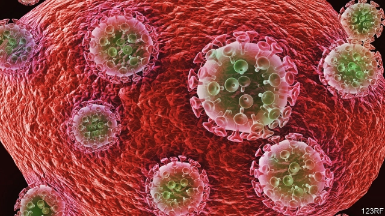

###### Curing HIV

# A second case of someone probably cured of HIV has been reported 

##### The treatment tailors stem-cell transplants intended for leukaemia 

 

> Mar 7th 2019 

ESTABLISHED HIV infection is easy to control but impossible to cure. Or almost impossible. The exception seems to be Timothy Brown, a man often referred to as the Berlin patient. In 2006, after a decade of successfully suppressing his infection with antiretroviral drugs, Mr Brown developed an unrelated blood cancer, acute myeloid leukaemia. To treat this life-threatening condition he opted, the following year, for a blood-stem-cell transplant. And, at the same time, he volunteered as a guinea pig for an experimental anti-HIV treatment, which worked. Now, a team of doctors in London have reported a similar case. 

Blood-stem-cell transplantation is an established, though extreme, treatment for various sorts of blood cancer. Stem cells are the precursors from which particular tissues grow. Blood-stem-cell transplantation involves using drugs (backed up, in Mr Brown’s case, by radiotherapy) to kill a patient’s natural blood-producing tissue, the bone marrow, and then transfusing in new stem cells from a donor. 

So far, so normal. But Mr Brown, at the suggestion of his doctors, chose from among the 267 possible tissue-matched donors one who had inherited from both parents a mutation that, in healthy people, prevents HIV infection in the first place. (The mutation in question alters one of the proteins the virus attaches itself to when entering a cell.) After two such transplants Mr Brown was cleared of the leukaemia and, as far as it is possible to tell, HIV had stopped replicating in his body. 

The newly reported patient, treated by Ravindra Gupta of University College, London, and his colleagues, had Hodgkin’s lymphoma and underwent a stem-cell transplant for this in 2016. As in Mr Brown’s case, the cell donor had inherited the protective mutation from both parents. Sixteen months later, as they describe in Nature, the patient’s doctors withdrew the HIV-controlling drugs and watched. There was no resurgence of the virus, as would be usual if those drugs were withdrawn from any other HIV patient. Nor has there been any change in the patient’s HIV status in the 18 months since the drugs’ withdrawal. 

In cases like this doctors are loth to use the word “cured”, since the future is unpredictable and the mechanism involved serves only to break HIV’s reproductive chain, not to purge the virus from the body entirely. They talk instead of patients being “in remission”. Nevertheless, the experience of the person who will probably come to be known as the London patient is important. It shows that Mr Brown’s case was not a fluke. Which gives comfort to those working on the idea of editing protective mutations into stem cells drawn from people with HIV, and then returning the edited cells to the patient. This would avoid the risks of rejection that come with transplants from donors. 

Most researchers in the field are proceeding cautiously, testing their results on mice, and with some success. But this is an area that can encourage overreach. The gene-edited-baby scandal which happened in China late last year was, according to those involved, an attempt to engineer the relevant mutation into people from birth. 

Such overreach aside, even if the editing of blood stem cells could be made to work reliably, transplanting them back into people would probably remain a rare procedure—for the methods used to kill a patient’s existing bone marrow make such transplantation dangerous in and of itself. But it would at least be available as a treatment of last resort for those with forms of HIV that have developed resistance to drugs. And that would save some lives. 

-- 

 单词注释:

1.hiv[]:abbr. 艾滋病病毒（human immunodeficiency virus） 

2.leukaemia[lu:'ki:miә]:n. 白血病 

3.timothy['timәθi]:n. 梯牧草 [医] 梯牧草, 牛草 

4.Berlin[bә:'lin]:n. 柏林, (软质)柏林毛线 

5.suppress[sә'pres]:vt. 镇压, 使止住, 禁止, 抑制, 查禁 [法] 镇压, 平定, 禁止出版 

6.infection[in'fekʃәn]:n. 传染, 影响, 传染病 [医] 传染, 感染 

7.antiretroviral[ˌæntɪˌretrəʊ'vaɪrəl]: [医]抗逆转录病毒的, 抗后病毒的 

8.unrelated[]:[法] 无关的 

9.myeloid['maiә,lɔid]:骨髓的, 骨髓状的, 由骨髓而来的 

10.opt[ɒpt]:vi. 选择 

11.guinea['gini]:n. 几内亚 

12.transplantation[trænsplɑ:n'teiʃәn]:n. 移植, 移民, 移植术 [医] 移植术 

13.precursor[.pri:'kә:sә]:n. 先驱者, 前导, 前兆 [化] 前体; 前身; 产物母体 

14.radiotherapy[.reidiәu'θerәpi]:n. 放射疗法 [医] 放射疗法, 放射治疗 

15.marrow['mærәu]:n. 髓, 骨髓, 精华, 活力, 配偶 [医] 髓(尤指骨髓) 

16.transfuse[træns'fju:z]:vt. 输血, 充满 [医] 输血, 输液 

17.donor['dәunә]:n. 捐赠人 [化] 给体; 供体 

18.mutation[mju:'teiʃәn]:n. 变化, 突变, 元音变化 [化] 突变 

19.replicate['replikeit]:vt. 折叠, 折转, 复制 n. 复现试验, 复制品, 高八度音 a. 复现的, 复制的, 折转的, 弯回的 

20.ravindra[]:[网络] 拉文南；拉文答腊 

21.Gupta[]:n. (Gupta)人名；(德、意、印、孟、尼)古普塔 笈多 

22.lymphoma[lim'fәumә]:n. 淋巴瘤, 淋巴组织瘤, 淋巴腺瘤 [医] 淋巴[组织]瘤 

23.resurgence[ri'sә:dʒәns]:n. 再起, 复活, 再现 

24.withdrawal[wið'drɒ:l]:n. 提款, 撤退, 退回, 撤消, 退隐, 戒毒过程 [医] 戒除, 脱瘾 

25.loth[lәuθ]:a. 不愿意的, 厌恶的 

26.unpredictable[.ʌnpri'diktәbl]:a. 不可预知的 

27.mechanism['mekәnizm]:n. 机械, 机构, 结构, 机理, 技巧 [化] 机理; 历程; 机构 

28.reproductive[.ri:prә'dʌktiv]:a. 生殖的, 再生的, 复制的 [医] 生殖的, 复现的 

29.purge[pә:dʒ]:n. 净化, 清除, 泻药 v. (使)净化, 清除, (使)通便 [计] 服务器文件删除实用程序 

30.entirely[in'taiәli]:adv. 完全, 全然, 一概 

31.remission[ri'miʃәn]:n. 宽恕, 豁免, 免罪, 缓和, 减轻 [医] 缓解, 弛张 

32.fluke[flu:k]:v. 侥幸成功 n. 锚爪, 侥幸, 偶然事故 

33.edit['edit]:vt. 编辑, 编校, 修订, 剪辑 [计] 编辑; DOS外部命令:该命令是一个用于编辑文本文件的全屏幕编辑程序 

34.rejection[ri'dʒekʃәn]:n. 拒绝, 抛弃, 驳回, 被抛弃的东西, 呕出物 [化] 报废; 拒收 

35.cautiously['kɒ:ʃәsli]:adv. 慎重地 

36.overreach[.әuvә'ri:tʃ]:vt. 扩展...以上, 过度伸张, 走过头 vi. 伸得过远, 过分, 过火 

37.reliably[ri'laiәbli]:adv. 可靠地, 可信赖地 

