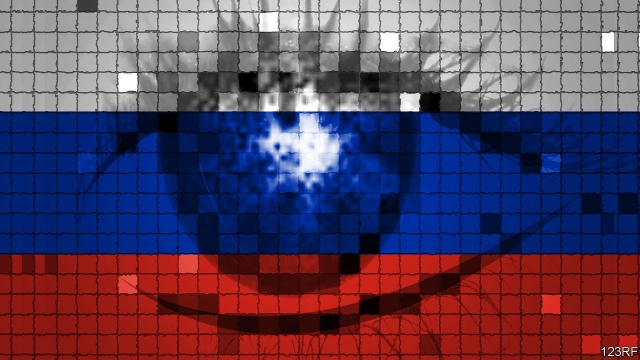

###### Computer security

# In the cyber break-in stakes, the champion is Russia 

##### Russian computer hackers are seven times faster than North Koreans 

 

> Mar 7th 2019 

RUSSIAN INTELLIGENCE has not had a great year. After the botched attempt to assassinate Sergei Skripal, an ex-spy living in Britain, scores of its officers were booted out of Western embassies. Hundreds more were exposed by sloppy tradecraft, such as the use of sequentially numbered passports. Yet there is at least some cheer for Russia’s cyber-spies: they have topped a rogue’s table of hacking prowess. 

CrowdStrike, an American cyber-security company, published its annual report last month. For the first time, this included a ranking of the West’s cyber-foes. It did so by looking not at the sophistication of their tools (which can be bought from others) but instead at “breakout time”. 

Breakout time measures how long it takes hackers to go from getting into a machine (say, an employee’s stolen laptop) to moving into more valuable parts of the network which that machine is part of (such as servers containing secrets). This typically involves looking around to find more vulnerabilities or swiping credentials that allow the intruder to masquerade as a network administrator, a process known as “privilege escalation”. 

In its previous report, covering 2017, CrowdStrike had found the average breakout time to be just under two hours. In 2018 that had more than doubled—to over four-and-a-half. Apparently, then, a victory for the defenders. But this average concealed a lot of variation. 

Russian spies, in particular, were blisteringly fast at breaking out into their enemies’ networks, taking an average of just 18 minutes to do so. That made them seven times faster than those of their nearest rival, North Korea, whose agents took a little over two hours. Chinese intelligence was way behind in third place, taking a leisurely four hours to gain access to the vaults—though the Chinese made up what they lacked in speed with sheer volume. (China has conducted over 100 “significant” cyber-attacks since 2006—more than anyone else—according to data compiled by the Centre for Strategic and International Studies, CSIS, an American think-tank.) Iranian hackers were positively languorous, requiring five hours. Criminal groups needed almost ten. 

However, experts and officials caution that faster breakout times do not always reflect sharper skills. For one thing, defensive technology has been getting better in recent years. Hasty lateral movement can trip defensive systems such as “canaries”. These are traps for the unwary—for example, special passwords left cunningly lying around which sound the alarm if used. 

Spy agencies also have their own personalities. Russia’s speed may reflect insouciance as much as virtuosity. Russian spy agencies compete furiously with each other and often do not care whether they get caught. James Lewis, a bigwig at the CSIS, also observes that different states go after different targets, which will affect their breakout times. North Korea, in particular, has preferred low-hanging fruit like Bangladesh’s central bank to heavily fortified military networks. “Muggers are quick when they mug grandmothers,” notes Mr Lewis. 

-- 

 单词注释:

1.cyber['saibә]:a. 网络的, 计算机的 

2.hacker['hækә]:[计] 计算机窃贼, 计算机新技术挑战者, 黑客 

3.Korean[kә'riәn]:n. 朝鲜人, 朝鲜语 a. 朝鲜人的, 朝鲜语的 

4.botch[bɒtʃ]:v. 拙笨地修补, 糟蹋 n. 拙笨的修补, 难看的补缀 

5.assassinate[ә'sæsineit]:vt. 暗杀, 行刺 [法] 暗杀, 行刺, 中伤 

6.Sergei[]:塞奇（人名） 

7.sloppy['slɒpi]:a. 泥泞的, 潮湿的, 粗心的 

8.tradecraft['tredkræft]: 谍报技术 

9.sequentially[si'kwenʃәli]:adv. 继续地, 从而 [电] 循序地 

10.hack[hæk]:n. 劈, 砍, 砍痕, 出租车, 干咳, 晒架, 鹤嘴锄 vt. 劈, 砍, 出租, 用旧 vi. 劈, 砍, 干咳, 驾驶出租车 a. 出租的 

11.prowess['prauis]:n. 英勇, 勇敢, 超凡技术 

12.sophistication[sә.fisti'keiʃәn]:n. 诡辩, 老于世故, 复杂(性) [医] 掺假 

13.breakout['breikajt]:n. 爆发, 越狱, 突围 [计] 中断, 断裂 

14.breakout['breikajt]:n. 爆发, 越狱, 突围 [计] 中断, 断裂 

15.laptop[]:[计] 膝上型的 

16.server['sә:vә]:n. 服伺者, 上菜用具, 发球员 n. 服务器 [计] 服务器, 服务器启动程序, 服务台程序 

17.typically['tipikәli]:adv. 代表性地；作为特色地 

18.vulnerability[.vʌlnәrә'biliti]:n. 易受伤, 易受责难, 易受伤部位 [医] 易损性 

19.swipe[swaip]:n. 强打, 用力挥击, 尖刻的话, 碰擦, 起重杆 vt. 强打, 用力挥击, 偷 

20.credential[kri'denʃәl]:n. 国书, 凭据, 证明书 [经] 凭证, 证书 

21.intruder[in'tru:dә]:n. 侵入者, 干扰者, 妨碍者 [计] 入侵者 

22.masquerade[.mɑ:skә'reid]:n. 化装舞会, 伪装 vi. 参加化装舞会, 伪装, 假装 

23.administrator[әd'ministreitә]:n. 管理人, 行政官 [经] 遗产管理人员 

24.escalation[.eskә'leiʃәn]:n. 扩大, 增加 [经] 调查, 价格调整 

25.apparently[ә'pærәntli]:adv. 表面上, 清楚地, 显然地 

26.defender[di'fendә]:n. 防卫者, 防护者, 辩护者 [法] 辩护人, 保护人 

27.blisteringly['blistəriŋli]:adv. 极度地；极快地；猛烈地；愤怒地 

28.Korea[kә'riә]:n. 朝鲜, 韩国 

29.leisurely['li:ʒәli]:a. 悠闲的, 从容的 adv. 从容地, 悠闲地 

30.sheer[ʃiә]:a. 绝对的, 全然的, 纯粹的, 透明的, 峻峭的 vi. 偏转, 偏航 vt. 使急转向, 使偏航 adv. 完全, 全然, 峻峭 n. 偏航 

31.datum['deitәm]:n. 论据, 材料, 资料, 已知数 [医] 材料, 资料, 论据 

32.CSIS[]:加拿大安全情报局（Canadian Security Intelligence Service） 战略与国际研究中心（Center for Strategic and International Studies） 

33.Iranian[i'reiniәn]:a. 伊朗的, 伊朗语系的 n. 伊朗人, 伊朗语 

34.positively[]:adv. 明确地, 肯定地, 无疑地, (非正式)确实地, 真正地 

35.languorous['læŋgәrәs]:a. 怠惰的, 疲倦的, 无力的 

36.alway['ɔ:lwei]:adv. 永远；总是（等于always） 

37.Sharpe['ʃa:p]:n. 夏普指数；夏普指标；夏普（人名） 

38.defensive[di'fensiv]:a. 防卫的, 防备用的, 自卫的 n. 守势, 防卫姿势, 防卫物 

39.lateral['lætәrәl]:n. 侧部, 支线, 边音 a. 侧面的, 旁边的 

40.canary[kә'nєәri]:n. 金丝雀, 淡黄色 

41.password['pæswә:d]:n. 密码, 口令, 通行手段 [计] 口令 

42.cunningly[]:adv. 巧妙地, 狡猾地 

43.insouciance[in'su:sjәns]:n. 无忧无虑 

44.virtuosity[.vә:tju'ɒsiti]:n. 精湛技巧, 对古董等的爱好 

45.furiously[]:adv. 狂暴地；猛烈地 

46.jame[]: 灰岩井 

47.lewis['lu:is]:n. 吊楔 

48.bigwig['bigwig]:n. 要人, 大亨 

49.fortify['fɒ:tifai]:vt. 设要塞于, 加强, 使坚强, 增加 vi. 筑防御工事 

50.mugger['mʌgә]:n. 泽鳄 [法] 行凶抢劫, 谋财害命的盗匪 

