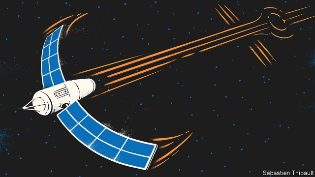

###### Manoeuvring satellites

# Spacecrafts’ solar panels can serve double-duty as sails 

##### Sometimes they used air molecules. Sometimes sunlight 

 

> Mar 7th 2019 

MANOEUVRING A SATELLITE in orbit usually requires thrusters. Sometimes the thrust is provided by a fuel-burning rocket motor. Sometimes it comes from electrically heated gas. Both methods, though, add weight in the form of propellant, thus reducing launch payload. They also involve parts that may fail. And eventually they run out of juice. Moreover, satellites carrying an energetic fuel like hydrazine must undergo special tests to be certified as safe for inclusion in a launch. Other ways of manoeuvring spacecraft would thus be welcome. And two, in particular, are now being developed. 

The first takes advantage of errant air molecules that have wandered into space from Earth’s atmosphere. In orbits near to Earth, where these molecules are most abundant, the resistance they provide is such that a satellite with a small forward-facing surface area will slowly gain on another launched at the same speed with a larger such area. For this effect to be useful, engineers have calculated that a satellite needs to be able to enlarge or shrink its forward-facing area on demand by a factor of about nine. If it can do that, then the method of “differential drag” becomes a practical way of manoeuvring satellites relative to one another. And serendipitously, that factor of nine has proved reasonably easy to arrange. 

The serendipity is the result of satellites needing solar cells to power their electronics. These cells are usually fixed to panels that, once a satellite is in orbit, unfold into wing-like structures much bigger than the spacecraft’s body itself. If a satellite is oriented so that its panels are facing in the direction of travel it will, over time, slow down. If it then rotates so that the panels are parallel with that direction, the braking will ease. A satellite operator in San Francisco, called Planet, says that it was the first organisation to manoeuvre operational craft in this way, back in 2013. The test was so successful that the firm now flies 120 Earth-imaging satellites which manoeuvre solely by differential drag. A mere 20 of Planet’s satellites still use thrusters. 

The reason firms like Planet need to manoeuvre satellites in the first place is that the cheapest way to launch them is in groups taken up by a single rocket. This means they enter orbit as a cluster. But jobs like Earth-watching and relaying telecommunications require such groups of satellites to be spread out, for maximum coverage. Spire, another satellite operator based in San Francisco, says that differential drag takes only a few weeks to spread a cluster sufficiently to eliminate unnecessary overlaps. The 72 satellites Spire has in orbit at the moment manoeuvre exclusively by differential drag. 

The actual process of manoeuvring involves reorienting the satellite. That, in turn, requires torque. Satellites generate this torque using a spinning reaction wheel and an electromagnet that interacts with Earth’s magnetic field. The technology is now precise enough to imagine using differential drag to permit satellites to rendezvous, according to Pini Gurfil of Technion University, in Israel. Dr Gurfil points to impressively close approaches between the small CubeSats that are part of a test project called QB50, which is led by the von Karman Institute for Fluid Dynamics, in Belgium. 

Differential drag is not a perfect answer to manoeuvring in space. Above an altitude of about 650km, air molecules are too rare for the technique to be feasible, so it works only in the lowest of low-Earth orbits. It also takes a fair amount of time to execute. So, for example, if there is a war, satellites that rely on differential drag will be more vulnerable to attack than those with thrusters. 

In addition, changing the level of drag adjusts only the rate of deceleration, and therefore of descent. The technique cannot be used to lift a spacecraft into a higher orbit. But a second thrusterless technique can manage this trick, too. It involves using the solar panels as light sails. 

Light exerts pressure. That pressure can be employed in the same way as the pressure of the wind on Earth, to drive and manoeuvre a craft. Orient a satellite so that its solar panels are hit by the maximum possible amount of light in the part of its orbit when it is receding from the sun, and the minimum amount when it is approaching it, and the spacecraft will gain speed, and therefore altitude. 

For a CubeSat smaller than a shoebox, with solar panels the size of two old-fashioned record-album sleeves, harnessing sunlight in this way should lift its orbit by several dozen metres a day, according to Dr Gurfil. Not a huge amount. But enough, for example, to dodge a potential collision with a piece of space debris—of which there is an increasing amount in orbit. 

Technion will try this idea out soon. It expects, in what Dr Gurfil claims will be a first, to launch three test satellites in about six months’ time. The mission is named SAMSON. With luck, the temple will not come crashing down around it. 

-- 

 单词注释:

1.manoeuvre[mә'nu:vә]:n. 调遣, 演习, 策略 vi. 调动, 演习, 用策略 vt. 调动, 操纵 

2.thruster['θrʌstә]:n. 向上钻营的人, 推进器 

3.electrically[i'lektrikәli]:adv. 电力地；有关电地 

4.propellant[prәu'pelәnt]:n. 推进剂, 发射火药, 推进者 [化] 火药 

5.payload['peilәud]:n. 商务载重, 工资负担, 净载重量, 有效负荷, 弹头 [化] 负荷量 

6.hydrazine['haidrәzi:n]:n. 肼 [化] 肼; 联氨 

7.certify['sә:tifai]:v. 证明, 保证 

8.inclusion[in'kluʒәn]:n. 包含, 内含物 [计] 蕴含 

9.errant['erәnt]:a. 周游的, 离开正道的, 不定的 

10.differential[difә'renʃәl]:a. 差别的, 特异的, 微分的 n. 差别, 两路线运费差额, 工资差额 

11.serendipitously[]:[网络] 幸运的 

12.reasonably['ri:znәbli]:adv. 适度地, 相当地 

13.serendipity[,serәn'dipiti]:n. 偶然发现珍宝的运气/才能, 易遇奇缘的运气 

14.san[sɑ:n]:abbr. 存储区域网（Storage Area Networking） 

15.francisco[fræn'siskәu]:n. 弗朗西斯科（男子名, 等于Francis） 

16.organisation[,ɔ: ^әnaizeiʃən; - ni'z-]:n. 组织, 团体, 体制, 编制 

17.cluster['klʌstә]:n. 串, 丛, 群, 簇 vi. 成串, 丛生 vt. 使聚集 [计] 簇 

18.telecommunication['telikәmju:ni'keiʃәn]:n. 电讯, 远距离通讯, 无线电通讯 [计] 远程通信, 电信 

19.coverage['kʌvәridʒ]:n. 覆盖的范围, 保险总额, 新闻报导 [化] 可达范围; 覆盖度 

20.spire[spaiә]:n. 尖塔, 尖顶, 锥形体, 螺旋 vi. 突出, 耸立, 螺旋形上升 vt. 给...加塔尖 

21.overlap[.әuvә'læp]:n. 重叠, 重复, 部分的同时发生 vt. 重叠, 重复, 与...同时发生 vi. 迭盖, 部分的同时发生 [计] 重叠 

22.reorient[.ri:'ɒ:rient]:vt. 使适应, 再调整 

23.torque[tɒ:k]:n. 扭转力, 转矩, 项圈 [化] 转矩 

24.electromagnet[i.lektrәu'mægnit]:n. 电磁石 [化] 电磁体; 电磁铁 

25.interact[.intәr'ækt]:vi. 互相影响, 交互作用 n. 幕间剧, 幕间休息 

26.rendezvous['rɒndivu:]:n. 约会, 约会地点 v. 集合, 集结, 在约定场所会面 [计] 会合 

27.pini[]:n. (Pini)人名；(法、意、罗、捷)皮尼 

28.technion[]:[网络] 以色列理工学院；以色列理工大学；以色列工程技术学院 

29.Israel['izreil]:n. 以色列, 以色列后裔, 犹太人 

30.impressively[]:adv. 令人难忘地；感人地 

31.CubeSats[]:[网络] 立方体卫星；立方体微卫星；卫星立方体 

32.Von[vɔn;fɔn;fәn]:[计] 冯·诺伊曼 

33.Karman['kɑ:mәn]:cannula, Karman catheter [医]卡门导管(用真空吸出的人工流产工具) 

34.differential[difә'renʃәl]:a. 差别的, 特异的, 微分的 n. 差别, 两路线运费差额, 工资差额 

35.vulnerable['vʌlnәrәbl]:a. 易受伤害的, 有弱点的, 易受影响的, 脆弱的, 成局的 [医] 易损的 

36.deceleration[.di:selә'reiʃәn]:n. 减速 [医] 减速[度] 

37.descent[di'sent]:n. 降落, 家系, 侵袭, 血统 [医] 下降, 世代, 血统 

38.cannot['kænɒt]:aux. 无法, 不能 

39.recede[ri'si:d]:vi. 向后退, 退却, 收回, 降低, 减弱 [医] 退缩 

40.CubeSat[]:[网络] 立方体卫星；立方卫星；正方体卫星 

41.shoebox[ˈʃu:bɒks]: 鞋盒 

42.dodge[dɒdʒ]:v. 避开, 躲避 n. 诡计, 躲藏 

43.samson[]:n. 大力士；[圣经]参孙 

