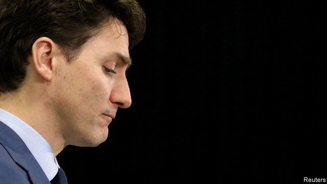

###### Trudeau’s troubles

# A scandal threatens Canada’s prime minister 

##### Justin Trudeau’s inept handling of explosive allegations prompts a second minister to resign 

 

> Mar 7th 2019 

AT A CAMPAIGN-STYLE rally in Toronto on March 4th, Justin Trudeau, the Canadian prime minister, began his speech on a downbeat note. Although the purpose of the rally was to tout the climate-change policies of his Liberal government, Mr Trudeau had to start by acknowledging that he had lost one of his most respected ministers. Hours before he took the podium, Jane Philpott quit as head of the Treasury Board, which oversees government spending. Her departure was an expression of dismay at Mr Trudeau’s handling of the worst scandal to befall his government since it took office in October 2015. Two members of his cabinet and his closest aide have resigned so far. His fans’ cheers in Toronto could not disguise the fact that his government is in crisis. Mr Trudeau’s hope of re-election in October this year has been dented. 

The controversy has raged since February 7th, when the Globe and Mail, a newspaper, published a report alleging that Mr Trudeau and his aides had put improper pressure on the justice minister and attorney-general, Jody Wilson-Raybould. Quoting unnamed sources, the report said that Mr Trudeau and his team wanted Ms Wilson-Raybould to decide against the prosecution of SNC-Lavalin, a Quebec-based construction firm, on charges of bribing officials in Libya when the country was ruled by Muammar Qaddafi. They pressed her to offer instead a deferred-prosecution agreement, in which the firm would have acknowledged wrongdoing and paid a large fine. When she resisted, Mr Trudeau demoted her to minister of veterans’ affairs, the newspaper claimed. 

Ms Wilson-Raybould quit the cabinet on February 12th. Her own account, in testimony before the House of Commons’ justice committee two weeks later, largely backed the newspaper’s. She testified that in meetings and phone calls Mr Trudeau and his officials repeatedly urged her to block a prosecution. Gerald Butts, the aide who resigned, disputed her account in testimony on March 6th, saying that he had asked her only to consider the consequences for 9,000 SNC-Lavalin workers. 

Mr Trudeau’s defence has been feeble. He moved Ms Wilson-Raybould, he said, because another minister’s retirement had opened a spot that he needed to fill. Few Canadians believe that. Mr Trudeau admits to talking to her about the case. But he insists he did nothing unethical and points out that he did not order her to change her decision. The prosecution is going ahead. Ms Philpott’s resignation undermined those arguments. The “independence and integrity of our justice system” is at stake, she wrote in her resignation letter. As The Economist went to press Mr Trudeau was expected to explain further at a press conference. 

“There’s no easy way out of this for the government,” says Darrell Bricker of Ipsos, a pollster. Most Canadians think Ms Wilson-Raybould’s story is more believable than the prime minister’s, polls show. Even though no one is accusing Mr Trudeau or his aides of doing anything criminal, the scandal has tarnished the Liberals’ image as “prince charmings who can do no wrong”, in the phrase once used by an opposition politician. Andrew Scheer, the leader of the Conservative Party, has demanded Mr Trudeau’s resignation. Groups representing women and indigenous Canadians are angry at his treatment of a female minister with aboriginal roots. 

Mr Trudeau’s career is by no means finished. The Liberals’ lag in the polls is so far small. Neither Mr Scheer nor Jagmeet Singh, the leader of the left-wing New Democratic Party, looks to most Canadians like a credible prime minister. And voters have reasons to back the one they have. The unemployment rate of 5.8% is close to a 40-year low. Economic growth has been strong, though it is starting to weaken. That, plus the introduction of a child benefit in 2016, has led to a drop in poverty. 

Most important for Mr Trudeau is that the remaining cabinet ministers have pledged to stick by him. Another high-profile resignation could be fatal. 

-- 

 单词注释:

1.justin['dʒʌstin]:n. 贾斯廷（男子名） 

2.inept[in'ept]:a. 不适当的, 不理智的, 笨拙的 [法] 不称职者, 无能的, 不符要求的 

3.allegation[.æli'geiʃәn]:n. 断言, 主张, 申辩 [法] 声明, 事实陈述, 断言 

4.rally['ræli]:n. 重振旗鼓, 集合, 群众集会, 跌停回升 v. 重整旗鼓, 集合, 恢复精神, 团结, 挖苦, 嘲笑 

5.toronto[tә'rɔntәu]:n. 多伦多（加拿大城市） 

6.trudeau[]:n. (Trudeau)人名；(英、法)特鲁多 特鲁多 

7.downbeat['dajnbi:t]:n. 强拍, 下降, 低沉, 衰退 a. 悲观的, 低沉的 

8.tout[taut]:vi. 招徕顾客, 兜售物品 vt. 招徕, 刺探...情报 n. 兜售者, 侦查者 

9.podium['pәudiәm]:n. 墩座, 矮隔墙, 指挥台 [医] 足, 吸足 

10.jane[dʒein]:n. 简（女子名） 

11.philpott[]: [人名] [英格兰人姓氏] 菲尔波特 Philip的昵称 

12.treasury['treʒәri]:n. 国库, 宝库, 财政部, 国库券 [经] 库存, 国库, 金库 

13.oversee[.әuvә'si:]:vt. 向下看, 了望, 监督, 偷看到 [法] 监察, 监督, 俯瞰 

14.dismay[dis'mei]:n. 沮丧 vt. 使惊愕, 使气馁 

15.befall[bi'fɒ:l]:v. 降临(于) 

16.aide[eid]:n. 助手, 副官 [计] 数据输入的可说明性 

17.dent[dent]:n. 凹痕 vt. 使凹下, 削弱 vi. 塌陷 

18.controversy['kɒntrәvә:si]:n. 论争, 辩论, 论战, 争论 [法] 论战, 争论, 争吵 

19.allege[ә'ledʒ]:vt. 宣称, 主张, 提出, 断言 [法] 断言, 指称, 指证 

20.improper[im'prɒpә]:a. 不合适的, 错误的, 不成体统的, 不道德的 [法] 不适当的, 不合适的, 不正确的 

21.jody['dʒәjdi]:n. 乔迪（女子名, 等于Judith, Jodi, Jodie） 

22.unnamed['ʌn'neimd]:a. 未命名的, 没有名字的, 未提及的 [计] 无名的 

23.prosecution[.prɒsi'kju:ʃәn]:n. 执行, 经营, 起诉 

24.bribe[braib]:n. 贿赂 vt. 贿赂, 收买 vi. 行贿 

25.Libya['libiә]:n. 利比亚 

26.Muammar[]:穆阿迈尔（人名） 

27.Qaddafi[]:n. (Qaddafi)人名；(阿拉伯)卡扎菲 卡扎菲 

28.wrongdoing['rɒŋ'du:iŋ]:n. 干坏事, 坏事 

29.demote[.di:'mәut]:vt. 使降级, 使降职 

30.testimony['testimәni]:n. 证言, 证据, 声明 [医] 证据 

31.testify['testifai]:v. 证明, 作证, 声明, 表明 

32.gerald['dʒerәld]:n. 杰拉尔德（男子名, 义为勇敢的战士） 

33.butt[bʌt]:n. 粗大的一头, 烟头, 靶, 笑柄 [医] 对核 

34.retirement[ri'taiәmәnt]:n. 退休, 隐居, 撤退 [经] 退休, 退股, (固定资产)报废 

35.unethical[]:a. 不道德的 

36.undermine[.ʌndә'main]:vt. 在...下面挖, 渐渐破坏, 暗地里破坏 [法] 暗中破坏, 以阴谋中伤伤害 

37.integrity[in'tegriti]:n. 正直, 廉正, 完整 [计] 完整性 

38.economist[i:'kɒnәmist]:n. 经济学者, 经济家 [经] 经济学家 

39.darrell['dærәl]:n. 达雷尔（男子名） 

40.bricker[]: [人名] 布里克 

41.ipso[]:abbr. incremental phase shift oscillator 增量移相振荡器; Internet protocol security option 因特网协议安全选件; iodized poppy-seed oil 碘化罂粟子油 

42.pollster['pәulstә]:n. 民意调查人, 民意测验经办人 

43.believable[bi'li:vәbl]:a. 可信的 

44.tarnish['tɑ:niʃ]:n. 失泽, 失泽膜, 污点 vt. 使失去光泽, 玷污 vi. 失去光泽, 被玷污 

45.opposition[.ɒpә'ziʃәn]:n. 反对, 敌对, 相反, 在野党 [医] 对生, 对向, 反抗, 反对症 

46.andrew['ændru:]:n. 安德鲁（男子名） 

47.scheer[]: [人名] 希尔; [地名] [德国] 谢尔 

48.indigenous[in'didʒinәs]:a. 本土的, 国产的, 固有的 [医] 原产的, 本土的 

49.aboriginal[.æbә'ridʒәnәl]:a. 原始的, 土著的 n. 土著居民, 土生生物 

50.Singh[siŋ]:n. 辛格（印度总理）；查理·拉杰（电影名） 

51.credible['kredәbl]:a. 可信的, 可靠的 [法] 可信的, 可靠的 

52.voter['vәutә]:n. 选民, 投票人 [法] 选民, 选举人, 投票人 

53.pledge[pledʒ]:n. 诺言, 保证, 誓言, 抵押, 信物, 保人, 祝愿 vt. 许诺, 保证, 使发誓, 抵押, 典当, 举杯祝...健康 

