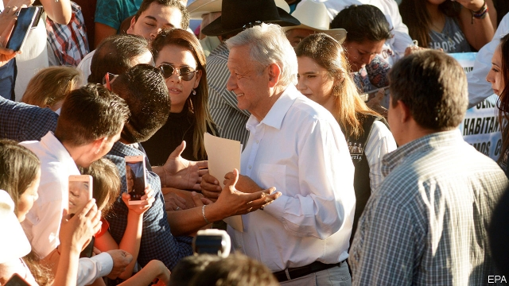

###### Pesos to the people

# AMLO splashes the cash in his first 100 days 

##### How Andrés Manuel López Obrador is reshaping the Mexican state 

 

> Mar 7th 2019 

“POWER STUNS the intelligent and drives fools mad.” Andrés Manuel López Obrador, Mexico’s president, repeats this adage often, as a rebuke to politicians who promise much and accomplish little. On March 4th, the 94th day of his presidential term, he tweeted the phrase again to show that power has neither stunned nor maddened him, and that he will keep his promise to transform Mexico. 

Mr López Obrador, or AMLO, as he is known, has already brought considerable change. He cancelled construction of a part-built international airport, stopped new private investment in the oil industry and shut down fuel pipelines to prevent theft, a measure that caused shortages in much of the country. He has revived Mexico’s policy of non-interference in other countries’ affairs by recognising Venezuela’s left-wing dictator, Nicolás Maduro, rather than the head of its legislature, Juan Guaidó, as the country’s president. Most big democracies recognise Mr Guaidó. AMLO has cut the salaries of senior officials and bureaucrats, including his own, and put their cars up for auction. He travels about by commercial airliner. 

More than three-quarters of Mexicans like what they see. Nearing 100 days in office, AMLO is more popular than any president at that stage bar Vicente Fox, the first president of the democratic era, in 2001. Although AMLO is restricted to one six-year term, he hopes that his left-wing Movement for National Regeneration (Morena) will be in power for much longer. 

His plan to achieve this involves restoring the state to its earlier position as the main underwriter of Mexicans’ well-being. Most recent presidents thought that one of its main roles was to create conditions for firms and civil-society groups to provide prosperity and welfare. Enrique Peña Nieto, AMLO’s predecessor, invited foreigners to invest in oil and introduced competition in telecoms, which lowered prices. But crime and corruption during his presidency overshadowed those achievements. He left office as Mexico’s least popular president. Under AMLO, the state will take the lead, and the credit. However, he must reconcile that ambition with the need to contain spending and avoid budget deficits. 

AMLO’s statism does not preclude co-operation with the private sector. As Mexico City’s mayor in the early 2000s, he worked closely with firms, for example to rebuild the city’s centre. Many of the infrastructure projects he plans, such as the “Maya train” through the south, will need private or foreign finance. But no one will doubt that the train comes from him. 

AMLO has begun by giving more money directly to individuals. His government has doubled pension benefits and made more people eligible for them. It set a minimum price for beans grown in the state of Zacatecas. Eventually, most major crops across Mexico will have support prices. The government will give scholarships and grants to 2.3m young adults. To maintain a budget surplus, AMLO has slowed the introduction of these programmes, for example by raising pensions for city-dwellers over 68, not 65 as he had hoped. 

Where non-state groups spend the government’s money to promote its goals, AMLO wants to cut out the middleman. Ministers are forbidden to channel money through “intermediaries” such as contractors, trade unions or NGOs. Under Mr Peña, some 10,000 civil-society groups got 30bn pesos ($1.6bn) over six years; more went to contractors, child-care providers and other “parallel structures”, as AMLO calls them. Much of their money has ended up in the pockets of politicians’ cronies, he contends. Now all government support “will be delivered directly to the beneficiaries”. This has a political pay-off. “Voters will say: ‘AMLO gave me this money,’” notes Luis de la Calle, an economist. 

Change is coming to child care. The “children’s room” programme created by Felipe Calderón, president from 2006 to 2012, pays 950 pesos a month per child to women who provide day care in their neighbourhoods, often their homes. Some 300,000 mothers use the programme. Many do not realise that the state is subsidising the  bill. AMLO plans to correct this (and save some money) by paying mothers 800 pesos a month directly. 

The pesos-for-the-people approach may not always help its intended beneficiaries. AMLO said he would end subsidies for women’s shelters but failed to explain how he would give money to victims of domestic abuse. After an outcry, he retreated. 

Seeming generous will sustain his popularity only if he keeps other promises, especially to reduce crime and corruption, and keep the economy strong. His dirigisme, and his suspicion of independent institutions, may make that harder. 

There is no sign yet that the murder rate, which last year was higher than in Colombia and Brazil for the first time, is on its way down. AMLO’s big idea for reducing it is setting up a national guard, which is to have 150,000 members by 2024. This may help, but it will not compensate for failures of state and local police. AMLO has resisted the appointment of an independent anti-corruption prosecutor. Any scandal would undermine his claim that his honesty alone will inspire probity in others. 

The biggest threat to his popularity is the economy. The central bank has revised its projection of GDP growth for this year down from 2.2% to 1.6%. Foreign direct investment in the last quarter of 2018 was 15% below its level a year before, partly because investors distrust AMLO and because American tax cuts make investing at home more attractive for American firms. 

AMLO has failed to convince investors that he will solve the problems of Pemex, the state-owned oil giant, which provides a fifth of government revenue but has an alarmingly high debt. That puts Mexico’s investment-grade credit rating at risk. On March 2nd S&P Global, a rating agency, downgraded the outlook for Mexico’s sovereign debt from stable to negative. A recession in the United States next year, which some analysts deem likely, could cause one in Mexico. That would spell trouble for a president who needs growth to pay for his social programmes. 

But for now, millions of Mexicans are cheering a windfall, and the president, just as he hopes. Marcos Velázquez, a repairman in Mexico City, says his mother has just seen her pension double. They both voted for AMLO, and do not regret it. Unlike the politicians of the past, Mr Velázquez says, AMLO has brought “real change”. 

-- 

 单词注释:

1.peso['peisәu]:n. 比索 [经] 比索 

2.AMLO['æmləʊ]:(=aeromedical liaison office) 航空医疗联络处,(=aeromedical liaison officer) 航空医疗联络官 

3.manuel['mænjuel]:n. 曼纽尔（男子名）；曼努埃尔二世（拜占庭皇帝约翰五世的次子） 

4.López[]:[地名] 洛佩斯 ( 阿根、厄 ) 

5.obrador[]:[网络] 布拉多 

6.reshape[ri:'ʃeip]:vt. 改造, 使成新的形状, 打开新局面 vt. 整形 vi. 整形 [计] 整形 

7.stun[stʌn]:vt. 使昏迷, 使震惊, 打昏 n. 昏迷, 猛击 

8.adage['ædidʒ]:n. 格言, 谚语 

9.rebuke[ri'bju:k]:n. 指责, 谴责, 非难 vt. 斥责, 指责, 制止 

10.presidential[.prezi'denʃәl]:a. 总统制的, 总统的, 首长的, 统辖的 [法] 总统的, 议长的, 总经理的 

11.tweet[twi:t]:vi. 啁啾 n. 小鸟叫声 

12.madden['mædn]:vt. 使发狂, 激怒 vi. 发狂, 发怒 

13.revive[ri'vaiv]:vt. 使苏醒, 使复兴, 使振奋, 回想起, 重播 vi. 苏醒, 复活, 复兴, 恢复精神 

14.dictator['dikteitә]:n. 命令者, 独裁者 

15.maduro[mә'duәrәu]:a. 色深味浓的烟草做的, (雪茄)色深味浓的 

16.legislature['ledʒisleitʃә]:n. 立法机关, 议会, 立法院 [法] 立法机构, 立法机关 

17.juan[hwɑ:n]:n. 胡安（男子名） 

18.bureaucrat['bjuәrәukræt]:n. 官僚作风的人, 官僚, 官僚主义者 [法] 官僚, 官僚作风的人 

19.auction['ɒ:kʃәn]:n. 拍卖 vt. 拍卖 

20.airliner['єәlainә]:n. 班机, 大型客机 

21.Vicente[]:n. 韦森特（男子名） 

22.regeneration[ri.dʒenә'reiʃәn]:n. 再生, 重建 [化] 再生作用 

23.morena[mɔ:'reinә]:n. 莫雷纳(非洲莱索托人对首领的称呼,也作为对白人等的尊称)(亦作marena)[土著语] 

24.underwriter['ʌndә.raitә]:n. 保险业者, 证券包销者 [法] 承保人, 保险人, 保险商 

25.Enrique[enrik]:n. 恩里克（男子名） 

26.nieto[]:[网络] 尼亚图；托；外孙子 

27.predecessor[.predi'sesә]:n. 前任, 先辈, 前身 [医] 初牙, 前辈, 祖先 

28.telecom['telәkɔm]:telecommunication 电信 

29.corruption[kә'rʌpʃәn]:n. 腐败, 堕落, 贪污 [计] 论误 

30.presidency['prezidәnsi]:n. 总统职权, 总裁职位 

31.overshadow[.әuvә'ʃædәu]:vt. 遮阴, 使阴暗, 使失色, 使相形见绌, 使蒙上阴影 

32.reconcile['rekәnsail]:vt. 使和解, 调停, 使和谐, 使一致, 使听从 [经] 对帐, 使一致 

33.deficit['defisit]:n. 赤字, 不足额 [医] 短缺 

34.statism['steitizm]:n. 中央集权制 [法] 国家主义 

35.preclude[pri'klu:d]:vt. 预先排除, 预防, 阻止, 妨碍 [法] 预防, 排除, 消除 

36.sector['sektә]:n. 扇形, 部门, 部分, 函数尺, 象限仪, 段, 区段 vt. 把...分成扇形 [计] 扇面; 扇区; 段; 区段 

37.infrastructure['infrәstrʌktʃә]:n. 基础结构, 基础设施 [经] 基础设施 

38.Maya['mɑ:jә]:n. 马雅人, 马雅语 a. 马雅人的, 马雅语的 

39.eligible['elidʒәbl]:a. 有资格当选的, 合格的 n. 有资格者, 合格者, 适任者 

40.Zacatecas[,sɑ:kɑ:'teikәs]:萨卡特卡斯(墨西哥中部一州及该州的首府) 

41.middleman['midlmæn]:n. 中间人 [法] 调解人, 中间人, 中人 

42.intermediary[.intә'mi:diәri]:n. 仲裁者, 调解者, 媒介物, 中间人 a. 中间的, 媒介的 

43.contractor['kɒntræktә]:n. 立契约的人, 承包商 [化] 承包者; 承包工厂 

44.ngos[]:abbr. non-government organization 非政府组织，非政府机构 

45.provider[prә'vaidә]:n. 供应者, 供养人, 伙食承办人 [计] 提供器 

46.crony['krәuni]:n. 密友, 亲密伙伴, 好朋友 

47.contend[kәn'tend]:vi. 奋斗, 斗争, 竞争 vt. 为...斗争 

48.voter['vәutә]:n. 选民, 投票人 [法] 选民, 选举人, 投票人 

49.luis[]:n. 路易斯（人名） 

50.de[di:]:[化] 非对映体过量 [医] 铥(69号元素铥的别名,1916年Eder离得的假想元素) 

51.La[lɔ:, lɑ:]:[医] 镧(57号元素) 

52.calle[]:n. （西）街道 

53.economist[i:'kɒnәmist]:n. 经济学者, 经济家 [经] 经济学家 

54.Felipe[]:n. (Felipe)人名；(西、葡、罗)费莉佩(女名), 费利佩 

55.Calderón[]:[地名] 卡尔德龙 ( 多米共 ) 

56.subsidise[]:vt. 给...补助金, 津贴, 资助 

57.alway['ɔ:lwei]:adv. 永远；总是（等于always） 

58.beneficiary[.beni'fiʃәri]:n. 受惠者, 受益人 a. 受封的 

59.outcry['autkrai]:n. 尖叫, 倒彩, 强烈抗议, 喊价 vi. 喊叫 vt. 叫得比...响 

60.popularity[.pɒpju'læriti]:n. 名声, 受大众欢迎, 流行 

61.dirigisme[,di:ri:'ʒi:sm]:n. <法> (政府对国民经济)干预或统制(主义) 

62.Colombia[kә'læmbiә]:n. 哥伦比亚 

63.Brazil[brә'zil]:n. 巴西 

64.prosecutor['prɒsikju:tә]:n. 实行者, 告发者, 公诉人 [法] 原告, 起诉人, 检举人 

65.undermine[.ʌndә'main]:vt. 在...下面挖, 渐渐破坏, 暗地里破坏 [法] 暗中破坏, 以阴谋中伤伤害 

66.probity['prәubәti]:n. 诚实, 正直 

67.projection[prә'dʒekʃәn]:n. 发射, 计划, 突出部分, 设计, 推测 [计] 投影 

68.investor[in'vestә]:n. 投资者 [经] 投资者 

69.distrust[dis'trʌst]:n. 不信任 vt. 不信任 

70.pemex[]:abbr. Petroleos Mexicanos (Spanish=Mexican Oils) （西班牙语）墨西哥石油公司 

71.alarmingly[ ə'lɑːmɪŋli]:adv. 让人担忧地 

72.downgrade['dajn^reid]:vt. 降低, 贬低 n. 下坡 a. 下坡 adv. 下坡 

73.sovereign['sɒvrin]:n. 元首, 独立国 a. 具有主权的, 至高无上的, 国王的, 完全的 

74.recession[ri'seʃәn]:n. 后退, 凹处, 衰退, 归还 [医] 退缩 

75.analyst['ænәlist]:n. 分析者, 精神分析学家 [化] 分析员; 化验员 

76.deem[di:m]:v. 认为, 相信 

77.windfall['windfɒ:l]:n. 被风吹落的果子, 横财 [经] 意外损失 

78.repairman[ri'pєәmæn]:n. 修理工 

