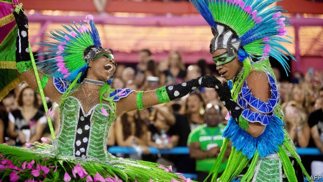

###### History with a beat

# Carnival history lesson 

##### A parade honoured forgotten black and indigenous heroes 

 

> Mar 7th 2019 

THE MANGUEIRA SAMBA samba school won Rio de Janeiro’s Carnival competition for the 20th time. This year’s parade and theme song were a drum-blasted history lesson celebrating largely forgotten black and indigenous heroes, including Dandara, a colonial-era warrior who chose suicide over slavery. Also honoured was Marielle Franco, a gay Rio city councilwoman who was murdered in March last year. “I’ve come to protest, not to parade,” her widow said. 

-- 

 单词注释:

1.carnival['kɑ:nivәl]:n. 嘉年华会, 狂欢节, 饮宴狂欢 

2.indigenous[in'didʒinәs]:a. 本土的, 国产的, 固有的 [医] 原产的, 本土的 

3.mangueira[]:[网络] 曼格拉；曼盖拉；曼盖拉桑巴舞学校 

4.samba['sæmbә]:n. 桑巴舞 vi. 跳桑巴舞 

5.samba['sæmbә]:n. 桑巴舞 vi. 跳桑巴舞 

6.rio[]:n. 里约（巴西共和国的旧首都） 

7.de[di:]:[化] 非对映体过量 [医] 铥(69号元素铥的别名,1916年Eder离得的假想元素) 

8.warrior['wɒ:riә]:n. 战士, 勇士, 武士, 鼓吹战争的人, 战斗, 尚武 

9.suicide['sjuisaid]:n. 自杀, 自杀者 v. 自杀 a. 自杀的 

10.marielle[]:n. (Marielle)人名；(法)马里耶勒 

11.franco['fræŋkәu]:a. 免费的 [经] 全部费用在内价, 运费准免的 

12.councilwoman['kajnsәl,wjmәn]:[法] 女议员 

