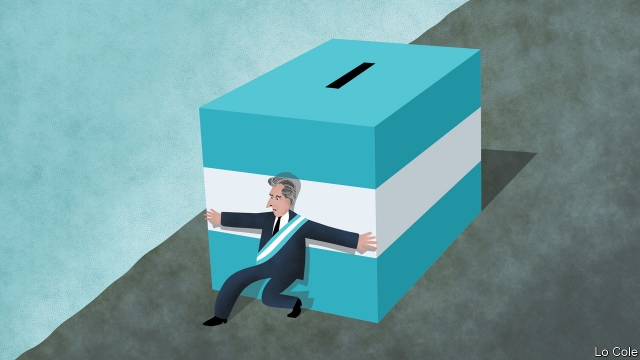

###### Bello

# Mauricio Macri’s long odds 

##### In his bid to win a second term, Argentina’s president is defying history 

 

> Mar 7th 2019 

THESE HAVE been difficult days for Mauricio Macri, Argentina’s president, and not just because his father, a businessman from whom he was often estranged, died on March 2nd. The previous day he had delivered his annual message to congress, in which he was forced to eat his words. A year ago he had told Argentines that “the worst is over”. Since then the peso has lost half its value, inflation is close to 50% a year, interest rates have soared and the economy has fallen into recession. In return for a $57bn bail-out from the IMF, an institution reviled by many Argentines, Mr Macri has pledged austerity to eliminate the primary fiscal deficit (ie, before interest payments) this year. “Many are going to think, ‘I am worse off’…and they are right,” the president admitted. 

Despite all this, Mr Macri, a reformist of the centre-right, is poised to seek a second term at an election in October. That looks quixotic. Even if the economy starts to pick up, as officials insist it will, it will be a while before the average voter feels the benefit. While accepting responsibility for the setback, in his speech the president laid much of the blame on the mess he inherited from Cristina Fernández de Kirchner, a populist Peronist, and on circumstances. A rise in interest rates in the United States prompted investors to jib at financing Mr Macri’s gradual fiscal adjustment. To cap it all, drought last year cut Argentina’s exports of farm goods—its mainstay—by some 20%. 

Although the government made mistakes, too, these are good excuses. But Latin America’s recent political history suggests they won’t wash with voters. In a paper published in 2015 Daniela Campello and Cesar Zucco of the Fundação Getulio Vargas, a Brazilian university, analysed 107 presidential elections in the region between 1980 and 2012. They found that in countries that relied on commodity exports and had low domestic savings (and thus high dependence on international capital flows) “voters reward incumbents who rule when international interest rates are low and commodity prices are high.” They punish leaders when the opposite applies. Since neither world interest rates nor commodity prices are under the control of a Latin American government, these results show that “voters do not separate chance from competence when evaluating their presidents,” the authors conclude. 

The drought during Mr Macri’s presidency had the same effect as a fall in commodity prices. Argentina’s recent history offers him only faint hope. In 2001-02 a severe recession prompted a change of political control. Economists at J.P. Morgan, a bank, expect a quicker recovery now than back then, starting in the next three months. But they expect the recovery to be slower than that from an earlier recession in 1994-95, during which Carlos Menem, who undertook drastic free-market reform, romped to a second term. 

In his speech to congress, Mr Macri laid out his pitch. Casting off his customary icy languor, he found an unsuspected inner passion as he invited voters to take a longer view and to reject the legacy of Ms Fernández’s government, with its corruption, fiscal tricks and hidden inflation. “Argentina is better placed than in 2015,” he said. “We’ve left the swamp.” Lasting change requires patience, he stressed. The institutions of democracy are stronger, corruption is being punished and more infrastructure is being built without padded contracts. “We Argentines have matured,” Mr Macri insisted, and will thus recognise all this. 

Perhaps. “Something very unusual has happened,” says Carlos Malamud, an Argentine historian. “While the economy remains very important, it’s not decisive for voters.” Although Mr Macri’s approval rating has fallen to 34%, from 48% a year ago, it has not collapsed. The other issues do matter, especially if his chief opponent is Ms Fernández, as is possible. She faces several corruption cases in the courts. Many Argentines “would hold their nose and vote for Macri to stop Cristina coming back”, says Mr Malamud. 

A moderate Peronist, of whom there are several, would be a tougher opponent. Primaries on August 11th will be unusually important in clarifying Mr Macri’s chances, as will several provincial elections before then. It is vital for him that the economy does not get worse, as it might if political uncertainty starts putting renewed pressure on the peso. It helps that he is an effective campaigner, as he showed when pulling off an unexpected victory in 2015. Repeating that would deserve to be called historic. 

-- 

 单词注释:

1.bello[]:n. 贝罗（姓氏） 

2.Mauricio[]:n. 毛利西奥（男子名） 

3.odds[ɒdz]:n. 可能性, 几率, 机会, 胜算, 不平等 

4.defy[di'fai]:vt. 藐视, 挑衅, 使落空 n. 挑战 

5.macri[]: [人名] 麦克里 

6.estrange[i'streindʒ]:vt. 使疏远, 离间, 使离开 

7.argentine['ɑ:dʒәntain]:n. 银, 银白色金属, 银白色鱼鳞, 阿根廷人 a. 银的, 银色的, 阿根廷的 

8.peso['peisәu]:n. 比索 [经] 比索 

9.inflation[in'fleiʃәn]:n. 胀大, 夸张, 通货膨胀 [化] 充气吹胀; 膨胀 

10.soar[sɒ:]:n. 高扬, 翱翔 vi. 往上飞舞, 高耸, 翱翔 

11.recession[ri'seʃәn]:n. 后退, 凹处, 衰退, 归还 [医] 退缩 

12.IMF[]:国际货币基金组织 [经] 国际货币基金 

13.revile[ri'vail]:v. 辱骂, 斥责 

14.pledge[pledʒ]:n. 诺言, 保证, 誓言, 抵押, 信物, 保人, 祝愿 vt. 许诺, 保证, 使发誓, 抵押, 典当, 举杯祝...健康 

15.austerity[ɒ'sterәti]:n. 朴素, 苦行, 严格, 严峻 

16.fiscal['fiskәl]:a. 财政的, 国库的 [经] 财政上的, 会计的, 国库的 

17.deficit['defisit]:n. 赤字, 不足额 [医] 短缺 

18.IE['i:ei]:[计] 中断启动 

19.reformist[ri'fɒ:mist]:n. 改良主义者, 改革者 

20.poise[pɒiz]:n. 平衡, 均衡, 姿势, 镇静, 安静, 砝码 vt. 使平衡, 使悬着, 保持...姿势 vi. 平衡, 悬着, 准备好 

21.quixotic[kwik'sɔtik]:a. 堂吉诃德式的, 愚侠的, 狂热而侠义的, 理想而不实际的, 充满幻想的 

22.voter['vәutә]:n. 选民, 投票人 [法] 选民, 选举人, 投票人 

23.setback['setbæk]:n. 挫折, 退步, 逆流 

24.Cristina[]:n. 克里斯蒂娜（电视剧中的人物） 

25.de[di:]:[化] 非对映体过量 [医] 铥(69号元素铥的别名,1916年Eder离得的假想元素) 

26.kirchner[]:柯克纳（人名） 

27.Populist['pɔpjulist]:n. 民粹派的成员 

28.Peronist[pә'rәjnist]:a. (阿根廷总统)庇隆的,庇隆主义的, 庇隆主义者的 

29.investor[in'vestә]:n. 投资者 [经] 投资者 

30.jib[dʒib]:n. 船首三角帆, 铁臂 vi. 移转, 踌躇不前, 停止不动 

31.daniela[dæn'jelə]:n. 丹妮拉（女子名, 等于Danielle） 

32.campello[]: [地名] [西班牙] 坎佩略 

33.Cesar[]:n. 恺撒, 古罗马帝王 

34.zucco[]:n. (Zucco)人名；(意)祖科 

35.getulio[]:[网络] 格图利奥；格图柳 

36.VARGAS[]:瓦尔加斯, 瓦格斯（人名） 巴尔加斯（地名, 在阿根廷、巴拿马、玻利维亚、古巴、洪都拉斯） 

37.Brazilian[brә'ziljәn]:n. 巴西人 a. 巴西的, 巴西人的 

38.presidential[.prezi'denʃәl]:a. 总统制的, 总统的, 首长的, 统辖的 [法] 总统的, 议长的, 总经理的 

39.commodity[kә'mɒditi]:n. 农产品, 商品, 有用的物品 [经] 商品, 货物, 日用品 

40.dependence[di'pendәns]:n. 依赖, 依存, 信赖 [医] 依赖(如对药物的依赖,即瘾或癖), 从属, 偏利共生 

41.incumbent[in'kʌmbәnt]:a. 现任的, 依靠的, 负有义务的 n. 领圣俸者, 在职者 

42.presidency['prezidәnsi]:n. 总统职权, 总裁职位 

43.economist[i:'kɒnәmist]:n. 经济学者, 经济家 [经] 经济学家 

44.JP[]:n. 治安官, 地方司法官 [计] 作业处理器 

45.Morgan['mɒ:gәn]:n. 摩根马 

46.carlo[]:n. 卡洛（男子名） 

47.menem[]:[网络] 梅内姆；阿根廷总统梅内姆；梅内姆总统 

48.drastic['dræstik]:a. 激烈的 [医] 峻泻药, 剧烈的 

49.romp[rɒmp]:n. 喧闹游玩, 顽皮女孩 vi. 喧闹玩耍, 轻快奔跑 

50.customary['kʌstәmәri]:a. 习惯的, 惯常的 [经] 通常的, 习惯的 

51.icy['aisi]:a. 冰的, 冰冷的, 冷淡的, 滑溜的 

52.languor['læŋgә]:n. 怠惰, 疲倦, 无气力 [医] 疲倦, 无力 

53.unsuspected['ʌnsәs'pektid]:a. 不受怀疑的, 无嫌疑的, 未知的, 意料外的 [法] 未被怀疑的, 无嫌疑的 

54.legacy['legәsi]:n. 祖先传下来之物, 遗赠物 [经] 遗产, 遗赠物 

55.corruption[kә'rʌpʃәn]:n. 腐败, 堕落, 贪污 [计] 论误 

56.Argentina[.ɑ:dʒәn'ti:nә]:n. 阿根廷 

57.infrastructure['infrәstrʌktʃә]:n. 基础结构, 基础设施 [经] 基础设施 

58.Malamud[]:马拉默德 

59.argentine['ɑ:dʒәntain]:n. 银, 银白色金属, 银白色鱼鳞, 阿根廷人 a. 银的, 银色的, 阿根廷的 

60.historian[hi'stɒ:riәn]:n. 历史学家, 记事者 

61.decisive[di'saisiv]:a. 决定性的, 坚定的, 果断的 

62.provincial[prә'vinʃәl]:n. 外地人, 粗野的人 a. 省的, 外地的, 偏狭的 

63.uncertainty[.ʌn'sә:tnti]:n. 不确定, 不可靠, 不确定的事物 [化] 不确定度 

64.campaigner[kæm'peinә]:n. 从军者, 老兵, 竞选者 

65.unexpect[]:[网络] 意想不到；使意外 

66.historic[hi'stɒrik]:a. 历史上著名的, 有历史性的 

