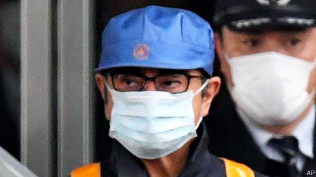

###### Facebook’s third act

# Business this week 

 

> Mar 7th 2019 

 Carlos Ghosn was released from detention in Tokyo after posting bail of ¥1bn ($9m). The sacked chairman of Nissan, Mitsubishi and Renault had been held in custody since mid-November on charges of financial wrongdoing at Nissan, which he denies. Under strict bail conditions, Mr Ghosn will stay at a house under 24-hour camera surveillance. He is not allowed to communicate with people over the internet. See article. 

In an announcement that took Washington by surprise, Scott Gottlieb said he would resign as commissioner of the Food and Drug Administration. Mr Gottlieb had worked to speed up the approval of new drugs, but he was greatly disliked by the tobacco industry for his forceful attempt to halt the epidemic of teen vaping and proposal to ban menthol cigarettes. Before his resignation, conservative groups had been trying to halt his efforts to crack down on the vaping industry. Biotech stocks sank on the news, whereas tobacco stocks rose. 

The chief executive of Vale stepped down. Prosecutors had asked for his “temporary” suspension after the collapse of a dam in Brazil that held waste from one of Vale’s iron-ore mines, killing at least 186 people. Scores are still missing. See article. 

Chevron and ExxonMobil significantly increased their production targets for shale oil in the Permian Basin, underlining how bigger oil companies are putting pressure on smaller independent firms that operate in the region. Chevron’s boss remarked that “the shale game has become a scale game.” 

The American economy grew by 2.9% in 2018, its best performance in three years. The surge in growth in the middle of the year, thanks in part to tax cuts, was offset by decelerating consumer spending towards the end of the year. 

A slowdown in the fourth quarter hit South Africa’s economy, which grew by just 0.8% last year, well below the roughly 5% that is needed to make a dent in an unemployment rate of 27%. 

Mizuho, one of Japan’s biggest banks, booked a ¥680bn ($6.1bn) write-down. That was mostly because of restructuring costs, though Mizuho also lost money trading in foreign bonds, which many Japanese banks turned to in search of higher yields when interest rates turned negative at home. 

America removed India from its Generalised System of Preferences, which lowers the barriers of entry for trade on certain goods, claiming that India had failed to provide equal access to its markets. Donald Trump has stepped up his complaints against India’s trade practices, notably its stiff tariffs on imports of American motorcycles. Meanwhile, in a blow to Mr Trump, America’s trade deficit in goods was $891bn in 2018, a record. See article. 

Huawei launched a lawsuit against the American government over its ban on the company’s telecoms equipment from official networks. America says that the Chinese firm represents a security threat, which it denies. In Canada a court heard America’s request for the extradition of Meng Wanzhou, Huawei’s chief financial officer. 

Mark Carney said that “constructive developments” had reduced the Bank of England’s estimate of the economic damage that would result from a disorderly Brexit. The bank had previously put the cost to the economy at around 8% of GDP. Mr Carney said that had fallen by about 3.5 percentage points but continued to warn of a “material” shock. The bank also reported that the potential disruption to cross-border financial services had been mitigated in Britain, but it criticised the EU for a lack of action on its part. Of the thousands of businesses that have spoken to the bank, half are unprepared for a no-deal Brexit. Of the half that do have plans, 50% claim to be “as prepared as we can be”. 

Lyft filed for an IPO, overtaking Uber, its bigger rival in the ride-hailing business, in the race to float on the stockmarket. Lyft will probably list in April on the NASDAQ exchange. Uber is expected to launch its IPO later this year. See article. 

Gap decided to hive off its Old Navy business into a separately listed company. Old Navy sells a cheaper clothing range than Gap-branded apparel and provides almost half of the Gap company’s sales. Gap became big when it cottoned on to the fashion for pastel colours in the 1980s, but it has struggled recently, announcing more store closures. 

Days after defeating the government’s appeal against its takeover of Time Warner,  AT&T undertook a broad restructuring of the business. A newly created WarnerMedia Entertainment will house a string of assets, including HBO. The swift departure of Richard Plepler as HBO’s boss spawned comparisons to “Game of Thrones”, one of the channel’s many hits. See article. 

-- 

 单词注释:

1.ghosn[]:[网络] 戈森 

2.detention[di'tenʃәn]:n. 阻止, 监禁, 拘留 [医] 隔离, 拘留, 滞留, 停滞 

3.bail[beil]:n. 保释, 拎环, 杓, 栅栏 vt. 保释, 舀水 

4.nissan[]:n. 尼桑（日产汽车名） 

5.Mitsubishi[mi'tsubiʃi]:[经] 三菱 

6.renault[rә'nәu]:n. 法国雷诺公司；雷诺（姓氏） 

7.custody['kʌstәdi]:n. 监护, 拘留, 监禁 [经] 保管, 照顾, 保护 

8.wrongdoing['rɒŋ'du:iŋ]:n. 干坏事, 坏事 

9.surveillance[sә:'veilәns]:n. 监视, 监督 [电] 侦测 

10.Washington['wɒʃiŋtn]:n. 华盛顿 

11.scott[skɔt]:n. 斯科特（男子名） 

12.Gottlieb[]:戈特利布（人名） 

13.commissioner[kә'miʃәnә]:n. 委员, 理事, 行政长官 [法] 委员, 政府的特派员, 地方地官 

14.forceful['fɒ:sful]:a. 有力的, 强烈的, 有说服力的 

15.epidemic[.epi'demik]:n. 传染病, 流行病 a. 流行的, 传染性的 

16.teen[ti:n]:n. 愤怒, 悲哀 

17.vaping[]:[网络] 蒸汽吐烟；吸蒸气 

18.menthol['menθoul]:n. 薄荷醇 [化] 薄荷醇; ┮醇 

19.biotech['baɪəʊtek]:n. 生物技术 

20.vale[veil]:n. 谷, 溪谷, 告别 interj. 再见 

21.prosecutor['prɒsikju:tә]:n. 实行者, 告发者, 公诉人 [法] 原告, 起诉人, 检举人 

22.Brazil[brә'zil]:n. 巴西 

23.chevron['ʃevrәn]:n. V形袖章, 锯齿形花饰 [计] 人字形 

24.exxonmobil[]:n. 埃克森美孚国际公司 

25.significantly[]:adv. 值得注目地；意味深长地 

26.shale[ʃeil]:n. 页岩 

27.Permian['pә:miәn]:a. 二叠纪的, 二叠纪岩的 n. 二叠纪(岩) 

28.surge[sә:dʒ]:n. 巨涌, 汹涌, 澎湃 vi. 汹涌, 澎湃, 颠簸, 猛冲, 突然放松 vt. 使汹涌奔腾, 急放 [计] 电压尖峰 

29.offset['ɒ:fset]:n. 抵消, 把...并列, 旁系, 支管, 用胶印法印 vt. 弥补, 抵消, 胶印 vi. 装支管 n. 偏移量 [计] 偏移量 

30.decelerate[.di:'selәreit]:v. (使)减速 

31.slowdown['slәudaun]:n. 降低速度, 减速 

32.dent[dent]:n. 凹痕 vt. 使凹下, 削弱 vi. 塌陷 

33.mizuho[]: [地名] [日本] 瑞穗; [地名] [南极洲] 瑞穗站 

34.restructuring[]:[计] 重构的 

35.generalise['dʒenәrәlaiz]:vt.vi. (使)一般化, 从...引出一般性结论, 泛论, 概括出, 归纳出, 使广义化 

36.donald['dɔnәld]:n. 唐纳德（男子名） 

37.trump[trʌmp]:n. 王牌, 法宝, 喇叭 vt. 打出王牌赢, 胜过 vi. 出王牌, 吹喇叭 

38.notably['nәjtbәli]:adv. 显著地, 著名地, 尤其, 特别 

39.tariff['tærif]:n. 关税, 关税表, 价格表, 收费表 vt. 课以关税 [计] 价目表 

40.deficit['defisit]:n. 赤字, 不足额 [医] 短缺 

41.huawei[]: 华为 

42.lawsuit['lɒ:sju:t]:n. 诉讼 [法] 诉讼, 诉讼案件 

43.telecom['telәkɔm]:telecommunication 电信 

44.extradition[.ekstrә'diʃәn]:n. 引渡逃犯, 亡命者送还本国 [法] 引渡 

45.meng[]:abbr. 工程硕士（Master of Engineering） 

46.Wanzhou[]:万州 

47.carney['kɑ:ni]:v. 哄骗 n. 哄骗的话 

48.constructive[kәn'strʌktiv]:a. 建设性的, 构造上的 [医] 构成的 

49.disorderly[dis'ɒ:dәli]:a. 无秩序的, 乱的, 骚乱的 [法] 妨害治安的, 骚乱的, 无法无天的 

50.Brexit[]:[网络] 英国退出欧盟 

51.disruption[dis'rʌpʃәn]:n. 分裂, 崩溃, 瓦解 

52.mitigate['mitigeit]:vt. 温和, 缓和, 减轻 [医] 缓和, 减轻 

53.criticise['kritisaiz]:v. 批评, 吹毛求疵, 非难 

54.EU[]:[化] 富集铀; 浓缩铀 [医] 铕(63号元素) 

55.unprepared[.ʌnpri'pєәd]:a. 无准备的, 即席的, 不期而遇的 

56.lyft[]:[网络] 散落 

57.ipo[]:abbr. 首次公开募股（Initial Public Offerings）；初次公开发行（Initial Public Offering） 

58.uber['ju:bә]:[医] 乳房 

59.stockmarket[s'tɒkmɑ:kɪt]: 证券市场; 证券交易所; 证券行情 

60.nasdaq['næz,dæk]:abbr. 全国证券交易商自动报价系统协会（National Association of Securities Dealers Automated Quotation） 

61.apparel[ә'pærәl]:n. 衣服, 外表 vt. 使穿衣, 装饰 

62.pastel[pæ'stel]:n. 粉蜡笔, 粉蜡笔画, 随笔 a. 彩色蜡笔的, 蜡笔画的, 柔和的, 纤弱的 

63.closure['klәuʒә]:n. 关闭 vt. 使终止 

64.takeover[]:n. 接管, 接收 [经] 接收 

65.warner['wɔ:nә]:n. 警告者, 告诫者, 预告者 [化] 报警器 

66.asset['æset]:n. 资产, 有益的东西 

67.hbo[]:abbr. 家庭影院（Home Box Office）；美国家庭电影院 

68.richard['ritʃәd]:n. 理查德（男子名） 

69.spawn[spɒ:n]:n. (鱼)卵, 产物 vt. 产卵, 酿成, 大量生产 vi. 产卵, 大量生产 

