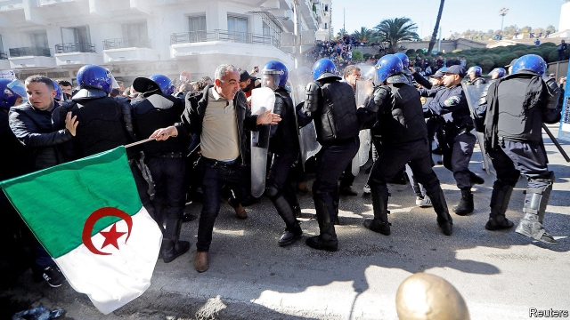
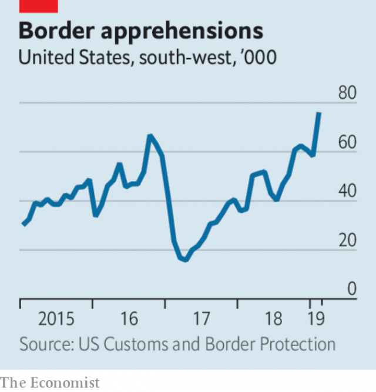

###### Facebook’s third act

# Politics this week 

 

> Mar 7th 2019 

Abdelaziz Bouteflika, the president of Algeria, defied protesters by registering to run for a fifth term in office. The ailing octogenarian is widely seen as a figurehead for a cabal of generals and businessmen, who hold real power. They have sought to assuage critics by promising that if Mr Bouteflika is re-elected, he will hold an early election, which he would not contest. See article. 

America closed its consulate-general in Jerusalem, which had acted as a de facto embassy to the Palestinians. The State Department said this did not signal a change in policy; the consulate’s operations will be handled by the new American embassy to Israel in the city. But the Palestinians suggested that it further undermined America’s role as peacemaker. 

The Netherlands recalled its ambassador to Iran after the government in Tehran expelled two Dutch diplomats. Tension between the countries has risen since last year, when the Dutch government expelled two Iranian embassy workers over suspicion that Iran was involved in the assassination of two Dutch-Iranian citizens. 

Rwanda accused neighbouring Uganda of supporting rebel movements aimed at overthrowing its president, Paul Kagame, and closed a key border crossing between the two countries. Relations between the two countries have soured as they battle for influence in the eastern part of the Democratic Republic of Congo. 

China’s prime minister, Li Keqiang, said the country would aim for GDP growth this year of between 6% and 6.5%, down from 6.6% last year and the slowest rate in nearly three decades. He was speaking at the start of the annual ten-day session of China’s rubber-stamp parliament. Mr Li said the economy faced danger from abroad, a reference to the trade war with America. See article. 

Satellite images suggested that North Korea is rebuilding a facility it had used to launch satellites and test missile engines, but had partially dismantled. The construction was interpreted as a signal that the country might resume testing missiles if it did not get its way in stalled talks with America about nuclear disarmament. See article. 

Pakistan arrested dozens of militants in a clampdown after the Jaish-e-Muhammad group claimed responsibility for a terrorist attack in which 40 Indian paramilitary policemen were killed, causing a military face-off with India. India’s politicians, meanwhile, rowed about how effective its air strikes against an alleged terrorist training camp in Pakistan had been. 

Thailand’s constitutional court banned Thai Raksa Chart, a party linked to Thaksin Shinawatra, an exiled former prime minister. The party had upset King Vajiralongkorn by nominating his sister for prime minister. 

Estonia’s centre-right Reform Party won a legislative election with 29% of the vote. Kaja Kallas, its leader, began coalition negotiations with the centre-left Centre Party and could become the country’s first female prime minister. 

EU member states vetoed a blacklist prepared by the justice commissioner of 23 territories that facilitate money-laundering or terrorist financing. The proposed list included Saudi Arabia and four American territories. Saudi and American opposition probably torpedoed the list. 

Emmanuel Macron, the French president, addressed European citizens with a manifesto on the future of the EU printed in newspapers in every EU country. Mr Macron has been trying to rally a co-ordinated liberal pro-EU campaign for the European Parliament elections in May. See article. 

A man in London may become only the second person in the world to be cured of  HIV infection. A stem-cell transplant to treat lymphoma means his immune-system cells are now coated with proteins that HIV cannot latch onto. An American who had similar treatment in 2007 still remains free of the virus. See article. 

Michael Bloomberg ruled out a run for the American presidency in 2020, disappointing those who wanted a strong moderate voice in the race. 

 

America’s border-protection agency reported a sharp rise in the number of migrants trying to cross from Mexico illegally. More than 76,000 people tried to cross in February, the highest number for that month in 12 years. Families and children without parents accounted for 60% of the 66,450 who were apprehended; they came predominantly from Guatemala, Honduras and El Salvador. Illegal crossings remain far below their peak in the 1990s. 

Juan Guaidó, recognised as Venezuela’s interim president by the legislature and by more than 50 countries, returned to the country after a failed attempt to send in humanitarian aid and a tour of Latin American capitals. He was greeted by large crowds opposed to the dictatorial regime of Nicolás Maduro. 

Jane Philpott, the president of Canada’s Treasury Board, which oversees government spending, quit the cabinet in dismay over allegations that the office of the prime minister, Justin Trudeau, had tried to improperly influence the judiciary. A former justice minister has claimed that Mr Trudeau and his aides sought to discourage her from authorising the prosecution of an engineering firm charged with bribing Libyan officials. See article. 

A court in Argentina convicted eight people, including a former judge, of obstructing an investigation into the bombing of a Jewish centre in Buenos Aires in 1994, which killed 85 people. The court acquitted five defendants, including Carlos Menem, who was the then Argentine president. 

“What is a golden shower?” That question was surprisingly posed on Twitter by Brazil’s president, Jair Bolsonaro, who had earlier tweeted a video of a man urinating on a woman during the country’s Carnival celebrations. “I’m not comfortable showing this, but we have to expose the truth” of what many Carnival street parties have become, wrote the conservative Christian president. 

-- 

 单词注释:

1.politic['pɒlitik]:a. 精明的, 明智的, 策略的 

2.abdelaziz[]:n. (Abdelaziz)人名；(阿拉伯)阿卜杜勒-阿齐兹 

3.bouteflika[]:[网络] 布特弗利卡；阿尔及利亚总统布特弗利卡；布特佛里卡 

4.Algeria[æl'dʒiәriә]:n. 阿尔及利亚 

5.defy[di'fai]:vt. 藐视, 挑衅, 使落空 n. 挑战 

6.protester[]:n. 抗议者, 持异议者, 拒付者 [经] 反对者 

7.ailing['eiliŋ]:a. 生病的 [医] 患病的, 病痛的 

8.octogenarian[.ɒktәudʒә'nєәriәn]:a. 80岁到90岁(的人)的 n. 80岁到90岁的人 

9.figurehead['figәhed]:n. 装饰船头的人像, 傀儡领袖 

10.cabal[kә'bæl]:n. 秘密结社, (尤指政治上的)阴谋 vi. 策划阴谋 

11.assuage[ә'sweidʒ]:vt. 平息, 缓和, 减轻 

12.Jerusalem[dʒә'ru:sәlәm]:n. 耶路撒冷 

13.de[di:]:[化] 非对映体过量 [医] 铥(69号元素铥的别名,1916年Eder离得的假想元素) 

14.facto[]:[法] 实际上, 事实上 

15.Palestinian[,pælis'tiniәn]:[经] 巴勒斯坦的 

16.Israel['izreil]:n. 以色列, 以色列后裔, 犹太人 

17.undermine[.ʌndә'main]:vt. 在...下面挖, 渐渐破坏, 暗地里破坏 [法] 暗中破坏, 以阴谋中伤伤害 

18.peacemaker['pi:smeikә]:n. 调解者, 和事佬 

19.Netherlands['neðәlәndz]:n. 荷兰 

20.Iran[i'rɑ:n]:n. 伊朗 

21.tehran[teә'ræn,-'rɑ:n]:n. 德黑兰 

22.Dutch[dʌtʃ]:n. 荷兰人, 荷兰语 a. 荷兰的 

23.diplomat['diplәmæt]:n. 外交官, 有外交手腕的人 [法] 外交家, 外交官, 有权谋的人 

24.Iranian[i'reiniәn]:a. 伊朗的, 伊朗语系的 n. 伊朗人, 伊朗语 

25.assassination[ә.sæsi'neiʃәn]:n. 暗杀 [法] 暗杀, 行刺 

26.rwanda[rj'ændә]:n. 卢旺达（东非国家）；卢旺达语 

27.Uganda[ju(:)'^ændә, u:'^ændә]:n. 乌干达 

28.overthrow[.әuvә'θrәu]:n. 推翻, 瓦解, 倾覆 vt. 打倒, 推翻, 倾覆 

29.paul[pɔ:l]:n. 保罗（男子名） 

30.kagame[]:[网络] 卡加梅；卡加梅总统；卡根 

31.Congo['kɔŋ^әu]:n. 刚果, 刚果河, 工夫茶 [建] 刚果, 直接刚果红 

32.Keqiang[]:[网络] 绿庆 

33.Korea[kә'riә]:n. 朝鲜, 韩国 

34.dismantle[dis'mæntl]:vt. 拆除...的设备, 分解, 去除覆盖物 

35.stall[stɒ:l]:n. 厩, 停车处, 牧师职位, 货摊, 托辞, 拖延 vt. 关入厩, 停顿, 推托, 支吾, 使陷于泥中 vi. 被关在厩内, 陷于泥中, 停止, 支吾 

36.Pakistan[.pɑ:ki'stɑ:n]:n. 巴基斯坦 

37.militant['militәnt]:a. 好战的 

38.clampdown['klæmdaun]:n. 压制, 取缔 

39.terrorist['terәrist]:n. 恐怖分子 [法] 恐怖份子, 恐怖主义 

40.paramilitary[.pærә'militәri]:a. 辅助军事的 

41.allege[ә'ledʒ]:vt. 宣称, 主张, 提出, 断言 [法] 断言, 指称, 指证 

42.constitutional[.kɒnsti'tju:ʃәnl]:a. 宪法的, 立宪的, 体质的 [医] 全身的; 体质的 

43.Thai[tai]:n. 泰国人, 泰语 

44.thaksin[]: 塔克辛; 塔辛（人名） 

45.shinawatra[]:[网络] 西那瓦；那越；钦那瓦 

46.exile['eksail]:n. 放逐, 流放, 被放逐者 vt. 放逐, 流放, 使背井离乡 

47.Vajiralongkorn[]:[网络] 王储哇集拉隆功；哇集拉隆功王储；玛哈·哇集拉隆功王储 

48.nominate['nɒmineit]:vt. 提名, 任命, 命名 [法] 提名...为候选人, 指定, 推荐 

49.legislative['ledʒislәtiv]:n. 立法机构 a. 立法的, 有立法权的 

50.kaja[]:n. (Kaja)人名；(日)冠者 (姓)；(塞、德、波)卡娅(女名), 卡亚 

51.kallas[]: [人名] 卡拉斯 

52.coalition[.kәuә'liʃәn]:n. 结合体, 结合, 联合 [经] 联合, 联盟 

53.negotiation[ni.gәuʃi'eiʃәn]:n. 谈判, 磋商, 交涉 [经] 谈判, 协商 

54.EU[]:[化] 富集铀; 浓缩铀 [医] 铕(63号元素) 

55.veto['vi:tәu]:n. 否决权 vt. 否决, 禁止 

56.blacklist['blæklist]:n. 黑名单 

57.commissioner[kә'miʃәnә]:n. 委员, 理事, 行政长官 [法] 委员, 政府的特派员, 地方地官 

58.facilitate[fә'siliteit]:vt. 使容易, 促进, 帮助 [法] 使容易, 使便利, 推进 

59.saudi['sajdi]:a. 沙乌地阿拉伯（人或语）的 

60.Arabia[ә'reibiә]:n. 阿拉伯半岛 

61.opposition[.ɒpә'ziʃәn]:n. 反对, 敌对, 相反, 在野党 [医] 对生, 对向, 反抗, 反对症 

62.emmanuel[i'mænjuәl]:n. 以马内利（耶稣基督的别称）；伊曼纽尔（男子名, 等于Immanuel） 

63.macron['mækrәn]:n. 长音符号 

64.manifesto[.mæni'festәu]:n. 宣言, 声明 

65.rally['ræli]:n. 重振旗鼓, 集合, 群众集会, 跌停回升 v. 重整旗鼓, 集合, 恢复精神, 团结, 挖苦, 嘲笑 

66.hiv[]:abbr. 艾滋病病毒（human immunodeficiency virus） 

67.infection[in'fekʃәn]:n. 传染, 影响, 传染病 [医] 传染, 感染 

68.lymphoma[lim'fәumә]:n. 淋巴瘤, 淋巴组织瘤, 淋巴腺瘤 [医] 淋巴[组织]瘤 

69.cannot['kænɒt]:aux. 无法, 不能 

70.latch[lætʃ]:n. 门闩 vi. 上闩, 抓住, 占有 vt. 闩上 [计] 门闩线路; 锁存器 

71.michael['maikl]:n. 迈克尔（男子名） 

72.bloomberg[]: [人名] 布隆伯格 

73.presidency['prezidәnsi]:n. 总统职权, 总裁职位 

74.migrant['maigrәnt]:n. 候鸟, 移居者 [法] 移居者 

75.illegally[]:[法] 非法地, 不合法地, 违法地 

76.apprehend[.æpri'hend]:vt. 理解, 忧虑, 逮捕 vi. 担心, 理解 

77.predominantly[]:adv. 主要地, 显著地, 大多数地, 突出地 

78.Guatemala[.gwɑ:tә'mɑ:lә]:n. 危地马拉 

79.Honduras[hɒn'djurәs]:n. 洪都拉斯 

80.el[el]:abbr. 预期损失（Expected Loss） 

81.Salvador['sælvәdɔ:]:[经] 萨尔瓦多 

82.juan[hwɑ:n]:n. 胡安（男子名） 

83.interim['intәrim]:a. 暂时的, 临时的, 间歇的 n. 过渡时期 

84.legislature['ledʒisleitʃә]:n. 立法机关, 议会, 立法院 [法] 立法机构, 立法机关 

85.humanitarian[hju:.mæni'tєәriәn]:n. 人道主义者, 博爱者, 基督凡人论者 a. 人道主义的, 博爱的, 凡人论的 

86.dictatorial[diktә'tɒ:riәl]:a. 独裁者的, 独裁的, 独断的 

87.regime[rei'ʒi:m]:n. 政权, 当权期间, 政体, 社会制度, 体制, 情态 [医] 制度, 生活制度 

88.maduro[mә'duәrәu]:a. 色深味浓的烟草做的, (雪茄)色深味浓的 

89.jane[dʒein]:n. 简（女子名） 

90.philpott[]: [人名] [英格兰人姓氏] 菲尔波特 Philip的昵称 

91.treasury['treʒәri]:n. 国库, 宝库, 财政部, 国库券 [经] 库存, 国库, 金库 

92.oversee[.әuvә'si:]:vt. 向下看, 了望, 监督, 偷看到 [法] 监察, 监督, 俯瞰 

93.dismay[dis'mei]:n. 沮丧 vt. 使惊愕, 使气馁 

94.allegation[.æli'geiʃәn]:n. 断言, 主张, 申辩 [法] 声明, 事实陈述, 断言 

95.justin['dʒʌstin]:n. 贾斯廷（男子名） 

96.trudeau[]:n. (Trudeau)人名；(英、法)特鲁多 特鲁多 

97.improperly[]:[计] 不适当地 

98.judiciary[dʒu:'diʃiәri]:a. 司法的, 法院的, 法官的 n. 司法部, 司法系统, 法官 

99.aide[eid]:n. 助手, 副官 [计] 数据输入的可说明性 

100.authorise['ɔ:θәraiz]:vt. 授权；批准；允许；委任（等于authorize） 

101.prosecution[.prɒsi'kju:ʃәn]:n. 执行, 经营, 起诉 

102.bribe[braib]:n. 贿赂 vt. 贿赂, 收买 vi. 行贿 

103.Libyan['libiәn]:a. 利比亚的 n. 利比亚人, 古代利比亚语 

104.Argentina[.ɑ:dʒәn'ti:nә]:n. 阿根廷 

105.convict[kәn'vikt]:n. 囚犯, 罪犯 vt. 宣告有罪, 使知罪 

106.obstruct[әb'strʌkt]:vt. 阻隔, 妨碍, 阻塞, 遮没 vi. 设障碍 

107.Buenos[]:n. (Buenos)人名；(西)布埃诺斯 

108.aire[]:n. 亚耳河（英国约克郡西部河流） 

109.acquit[ә'kwit]:vt. 无罪释放, 表现, 使履行 [法] 开释, 释放, 免 

110.defendant[di'fendәnt]:n. 被告 [经] 被告方 

111.carlo[]:n. 卡洛（男子名） 

112.menem[]:[网络] 梅内姆；阿根廷总统梅内姆；梅内姆总统 

113.argentine['ɑ:dʒәntain]:n. 银, 银白色金属, 银白色鱼鳞, 阿根廷人 a. 银的, 银色的, 阿根廷的 

114.twitter['twitә]:n. 啁啾, 唧唧喳喳声 vi. 啭, 啁啾, 颤抖 vt. 嘁嘁喳喳地讲, 抖动 

115.jair[]:[网络] 睚珥；贾伊尔；睢珥 

116.tweet[twi:t]:vi. 啁啾 n. 小鸟叫声 

117.urinate['juәrineit]:vi. 小便, 撒尿 [医] 排尿 

118.carnival['kɑ:nivәl]:n. 嘉年华会, 狂欢节, 饮宴狂欢 

