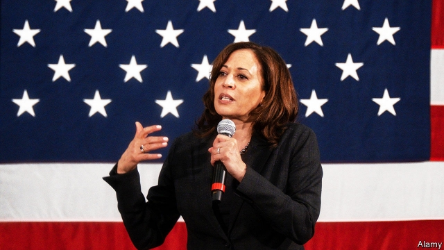
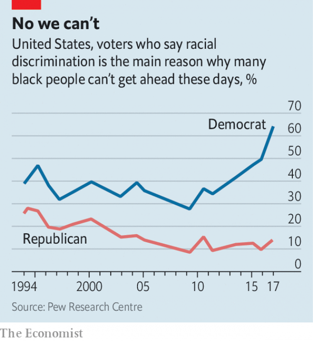

###### The look-homeward angle

# African-Americans are the Democrats’ most loyal constituency 

##### They are now at the centre of the party’s strategy 

 

> Mar 7th 2019 

“THERE IS NO such thing as a base voter,” says Stacey Abrams, who last year came closer than any Democrat this century to becoming Georgia’s governor. Ms Abrams embraced identity politics—she contributed an article to the current issue of Foreign Affairs entitled “Identity politics strengthens democracy”—and made registration and mobilisation of young and non-white voters central to her campaign. “To win we had to activate voters [in] communities that had been discounted because they were seen as not viable. Republicans didn’t worry about them because they could never win. And Democrats didn’t engage because they didn’t vote.” 

In purely strategic terms, it is not obvious that Democrats need make a special effort to court black voters. The last Republican to win a majority of their votes was Herbert Hoover, in 1932. No American ethnic group is as reliably and deeply partisan. Since 1964—when Republicans nominated Barry Goldwater, who voted against that year’s Civil Rights Act—no Democratic presidential candidate has captured less than 80% of the black vote. 

This loyalty leaves many African-Americans feeling taken for granted, as though Democrats have not so much courted their votes as assumed they will show up. “What we’ve seen in the past,” explains DeJuana Thompson, whose group Woke Vote helped propel Doug Jones to victory in Alabama’s Senate race in 2017, is “candidates who show up in black churches two weeks before” election day, expecting parishioners to “trust, vote, and get out and work for their campaigns for free.” 

Things are different as the Democratic Party’s marathon primary gets under way. Not only are two African-American senators, Cory Booker and Kamala Harris, among the top tier of Democratic candidates. Both they and their rivals have discussed racism and racial inequities openly, in ways that previous Democratic candidates have shied away from. The Democrats’ directness about race reflects both shifting priorities within their coalition and a tactical bet on how to best mobilise and expand their base. 

 

As recently as the primaries of 2008, when Barack Obama was picking up delegates thanks to his strength with African-Americans and white progressives, Hillary Clinton was appealing to “hard-working Americans, white Americans”. Such rhetoric would be immediately disqualifying for a Democrat today. As whites without a college degree have left the party, the Democratic coalition of well-educated whites with members of ethnic minorities has grown more unified around questions of racism. In 2009 just 28% of Democrats agreed with the statement “Racial discrimination is the main reason why black people can’t get ahead these days”; by the summer of 2017, that share had risen to 64% (see chart). 

Rhetoric from the party’s candidates reflects that consensus. Elizabeth Warren mentioned racial wealth gaps in the first minute of her campaign announcement. Soon after Kirsten Gillibrand announced, she acknowledged “systemic, institutional and daily individual acts of racism”, and decried racial income gaps, as did Ms Harris in her announcement speech, along with the state of criminal justice and police killings of young black men. Cory Booker backs “baby bonds”—a plan to give each child $1,000 at birth, followed by annual payments, tailored to family wealth, until the child turns 18—as a way to narrow the racial wealth gap. Ms Harris, Ms Warren and Julián Castro, a former mayor and cabinet secretary also seeking the nomination, have all endorsed some form of reparations for slavery, but have all stopped short of calling for direct financial transfers. 

Some might consider these positions pandering. But as Leah Wright-Rigueur, a Harvard professor who wrote “The Loneliness of the Black Republican” notes, voters might ask, “Do I really care that they’re pandering? Maybe I want to be pandered to. Republicans pander to their base all the time.” 

The tactical bet, that lots of people who have not voted before can be led to the polls, is one that Ms Abrams and Andrew Gillum made in their governors’ races, in Georgia and Florida respectively. According to this theory, the limited time and energy of a campaign is better spent mining untapped black voters than trying to win back wavering white ones. Some fear this strategy may turn off white voters, who still comprise a majority of the electorate. After all, both Ms Abrams and Mr Gillum lost—the latter in a swing state, in a year that was otherwise favourable to Democrats. 

That suggests the bet may be mistaken. It may also be a category error. When it comes to issues, black Democrats are not very different from Democrats of other hues. Criminal-justice reform, investing in public education and expanding access to health care all have particular appeal to black voters, who bear the brunt of mass incarceration and poor schools. They also appeal to Democratic voters of all stripes. Ultimately, says Gilda Cobb-Hunter, a state representative from South Carolina, black Democrats are looking for the same thing as every other Democrat. “In the past it’s been kind of like a beauty contest: who’s speaking to your heart. But what I’m picking up now is a real sense of, ‘I want a winner’. And the winner is going to be the candidate who can beat 45.” 

That candidate need not be black to win black votes. But he or she will need to court their support more vigorously than in past cycles. That is not only an acknowledgment of past oversight. Ms Abrams argues it will, be “cost-efficient. These communities are already tilted toward the value system and policies of Democrats. The mission isn’t to get someone to change their ideology. The mission is to get them to act on their beliefs.” 

-- 

 单词注释:

1.constituency[kәn'stitjuәnsi]:n. 选民, 顾客, 读者 [法] 选区, 全体选民, 选区内的选民 

2.voter['vәutә]:n. 选民, 投票人 [法] 选民, 选举人, 投票人 

3.stacey[]:n. 史黛丝（女子名） 

4.abram['eibrәm]:n. 艾布拉姆（男子名, 等于Abraham） 

5.democrat['demәkræt]:n. 民主人士, 民主主义者, 民主党党员 [经] 民主党 

6.politic['pɒlitik]:a. 精明的, 明智的, 策略的 

7.registration[.redʒi'streiʃәn]:n. 登记, 挂号, 注册 [计] 登记; 定位; 对齐; 记录 

8.mobilisation[ˌməʊbɪlaɪ'zeɪʃən]:n. 动员, 运用 

9.activate['æktiveit]:vt. 使活动, 使激活, 正式建成 vi. 有活力 

10.viable['vaiәbl]:a. 能养活的, 能生长发育的 [医] 有活力的, 有生机的 

11.democrat['demәkræt]:n. 民主人士, 民主主义者, 民主党党员 [经] 民主党 

12.herbert['hә:bәt]:n. 赫伯特（男人名） 

13.hoover['hu:vә]:n. 胡佛电动吸尘器 vi. 用真空吸尘器打扫 

14.ethnic['eθnik]:a. 人种的, 种族的 [医] 人种的 

15.reliably[ri'laiәbli]:adv. 可靠地, 可信赖地 

16.partisan['pɑ:tizn]:n. 党羽, 虔诚信徒, 同党, 游击队员 a. 党派的, 偏袒的, 效忠的, 献身的, 盲目推崇的 

17.nominate['nɒmineit]:vt. 提名, 任命, 命名 [法] 提名...为候选人, 指定, 推荐 

18.Barry['bæri]:n. 巴里（男子名） 

19.goldwater['ɡәuld.wɔ:tә]:n. 金水酒（一种含有大量小片金叶状物的酒, 原产于波兰格但斯克） 

20.presidential[.prezi'denʃәl]:a. 总统制的, 总统的, 首长的, 统辖的 [法] 总统的, 议长的, 总经理的 

21.les[lei]:abbr. 发射脱离系统（Launch Escape System） 

22.thompson['tɔmpsn]:n. 汤普森（姓） 

23.propel[prәu'pel]:vt. 推进, 驱使 [机] 推进 

24.doug[]:n. 道格 

25.jones[dʒәunz]:n. 琼斯（姓氏） 

26.parishioner[pә'riʃәnә]:n. 教民 

27.senator['senәtә]:n. 参议员, (某些大学的)理事 [法] 参议员, 上议员 

28.cory[]:n. 克里, 科里（人名） 

29.booker['bukә]:n. （旅馆车票, 戏票等的）登记人；寻选模特儿的人 

30.kamala[kә'meilә]:n. [植] 粗糠柴 

31.harris['hæris]:n. 哈里斯（英国苏格兰一地区）；哈里斯（姓氏） 

32.tier[tiә]:n. 排, 层, 等级 

33.racism['reisizm]:n. 种族主义, 种族偏见 [法] 种族主义, 种族歧视, 种族歧视主张 

34.inequity[in'ekwiti]:n. 不公平, 不公正 

35.openly['әjpәnli]:adv. 公开地, 坦率地, 直率地, 公然地 

36.directness[di'rektnis]:n. 笔直, 率直 

37.coalition[.kәuә'liʃәn]:n. 结合体, 结合, 联合 [经] 联合, 联盟 

38.tactical['tæktikl]:a. 战术的, 用兵上的, 策略的 

39.mobilise['mәjbilɑiz]:vi.vt. 动员, 松动, 使活动, 调动, 发动 

40.barack[bɑ:'ræk]:n. 巴拉克（男子名） 

41.obama[]:n. 奥巴马(姓) 

42.Hillary['hiləri:]:n. 希拉里（美国现任国务卿） 

43.clinton['klintәn]:n. 克林顿（男子名） 

44.rhetoric['retәrik]:n. 修辞, 修辞学, 雄辩(术) 

45.disqualify[dis'kwɒlifai]:vt. 使不适合, 取消...资格 

46.unify['ju:nifai]:v. 统一, 使成一体 

47.rhetoric['retәrik]:n. 修辞, 修辞学, 雄辩(术) 

48.elizabeth[i'lizәbәθ]:n. 伊丽莎白（女子名） 

49.warren['wɒrәn]:n. 养兔场, 拥挤的地区 

50.Kirsten['k\\:stәn]:n. 柯尔斯顿(f.) 

51.gillibrand[]: [人名] 吉利布兰德 

52.systemic[si'stemik]:a. 系统的, 体系的, 全身的 [医] 系统的, 全身的 

53.institutional[.insti'tju:ʃәnәl]:a. 制度的, 公共机构的, 学会的 [法] 组织机构的, 制度的, 公共机构的 

54.decry[di'krai]:vt. 反对, 责难, 诽谤, 诋毁 

55.killing['kiliŋ]:n. 谋杀, 杀戮 a. 杀害的, 疲惫的, 迷人的 

56.Castro['kæstrəu]:n. 卡斯特罗（古巴领导人, 1976-2006年在任） 

57.nomination[.nɒmi'neiʃәn]:n. 提名, 任命, 提名权 

58.endorse[in'dɒ:s]:vt. 支持, 赞同, 背书于, 签署 [经] 赞成, 背书 

59.reparation[.repә'reiʃәn]:n. 补偿, 赔偿, 弥补, 修复, 修理 [经] 赔偿, 补偿, 修理 

60.pander['pændә]:vi. 勾引, 怂恿, 卑劣地迎合 n. 拉皮条者, 怂恿者, 助恶者 

61.Leah[liә]:n. 利亚(<<圣经>>故事人物) 

62.Harvard['hɑ:vәd]:n. 哈佛大学 

63.loneliness['lәunlinis]:n. 寂寞, 孤独, 清静 

64.andrew['ændru:]:n. 安德鲁（男子名） 

65.gillum[]: [人名] [英格兰人姓氏] 吉勒姆 William的变体 

66.Georgia['dʒɒ:dʒjә]:n. 乔治亚州 

67.Florida['flɒridә]:n. 佛罗里达州 

68.untap[]:abbr. United Nations Technical Assistance Programme 联合国技术援助计划 

69.waver['weivә]:n. 动摇, 踌躇, 挥动者 vi. 摇摆, 颤抖, 摆动, 摇曳, 犹豫 

70.electorate[i'lektәrit]:n. 选民, 有选举权者, 选区 [法] 选民, 选举团, 选区 

71.hue[hju:]:n. 样子, 色度, 色彩, 叫声, 色调 [计] 色调 

72.brunt[brʌnt]:n. 主要冲力, 冲击 

73.incarceration[in.kɑ:sә'reiʃәn]:n. 下狱, 监禁, 禁闭 [医] 箝闭 

74.gilda['gildə]:n. 吉尔达（女子名） 

75.Carolina[.kærә'lainә]:n. 北(或南)卡罗来纳州 

76.vigorously[]:adv. 朝气蓬勃, 精力充沛, 壮健, 茁壮, 健壮, 强有力 

77.acknowledgment[әk'nɔlidʒmәnt]:n. 承认, 答谢, 认可, 谢礼, 收到的通知, 收到的回音, 谢意 [计] 肯定, 确认认可 

78.oversight['әuvәsait]:n. 勘漏, 失察, 失败, 照料 [经] 监督权 

79.tilt[tilt]:n. 倾斜, 倾向, 船篷, 车篷 vt. 使倾斜, 使倾侧, 用帆布篷遮盖 vi. 倾斜, 翘起, 冲, 评击 [计] 倾斜 

80.ideology[.aidi'ɒlәdʒi]:n. 思想体系, 意识形态, 观念学, 空论 [医] 观念学, 观念形态 

