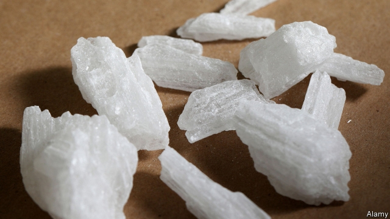
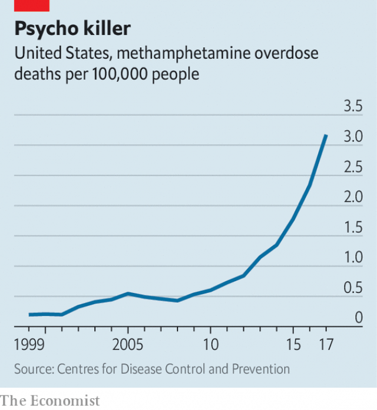

###### Scourge upon scourge

# Amid the opioid crisis, a different drug comes roaring back 

##### Deaths caused by meth use have risen 18-fold this decade 

 

> Mar 9th 2019 

LONDON BREED, the mayor of San Francisco, recently announced a new drugs task-force, which is the kind of thing mayors do. This task force, though, was unusual because it was not aimed at opioids but at methamphetamine. In 2017 meth overdoses killed 87 people in the city, more than twice as many as heroin. Open-air dealing, uninterrupted by the police, is a common sight in the poor Tenderloin district. Use is widespread among the city’s many homeless. Because the drug induces aggression, frenzy and paranoia, passers-by often feel unsafe. Half the people now admitted for psychiatric emergencies to the city’s general hospital are suffering from the effects of meth-induced psychosis. 

The problem is not confined to San Francisco. Although politicians and journalists are understandably transfixed by the 50,000 people killed by opioids each year, the rise in meth-overdose deaths has attracted less attention (see chart). In 2000 only 578 Americans died of an overdose. By 2017, deaths had increased 18-fold to 10,333 people. Meth addiction mostly afflicts western and south-western states like Arizona, Oklahoma and New Mexico, where fentanyl and heroin deaths are less common than in the east. For that reason, states tend to either have a meth problem or an opioid problem—with the exception of West Virginia, which leads the nation in overdose deaths for both. 

 

Much of this deadly surge is caused by supply. Little meth is now made in America. The number of domestic meth labs busted by police dropped from 15,000 in 2010 to 3,000 in 2017. Most of these are amateurish operations that cops call “Beavis and Butthead labs”, incapable of producing more than two ounces of the stuff per batch. “Mexican cartels dominate the market. They manufacture meth in superlabs across the border,” says Chris Nielsen, the special agent in charge of the Drug Enforcement Administration’s (DEA) San Francisco division. Left unmolested, the chemists have perfected their technique. The purity of Mexican-produced meth has surged from 39% in 2007 to 97% today. At the same time, competition between cartels has increased supply, quartering prices. “They’re becoming more brazen now. The loads are becoming bigger,” says Mr Nielsen. His division seized 830kg of meth in 2018—47% more than the year before. 

Another reason for the meth surge is the growth of so-called polydrug abuse. Half of those who died of meth overdoses in 2017 also had opioids in their system. Users usually have a drug of choice—opioids, which numb feeling, or stimulants such as cocaine and meth. When they cannot cheaply or easily obtain their preferred hit (or if they are afraid that the local batch is tainted), they will often substitute another drug. In robust urban markets, doses of fentanyl-laced heroin or meth can be obtained for as little as $5. 

One factor that had limited the spread of meth is that it is a pain to use. Injecting it requires dissolving it in acid and high heat, which then damages veins. Smoking it harms the lungs. But that too may now be changing, as manufacturers are experimenting with putting the drug in pill form. A husband and wife were recently arrested for running a meth-pill operation from their business, a care home in Vallejo, California. They had 31lb of pills embossed with reproductions of American icons like the Kool-Aid man, Tesla and Donald Trump. Widespread introduction of such pills would not just make the drug easier to take; it could also be sold as a party drug to unsuspecting youngsters. 

In San Francisco, where the death rate in 2017 was nearly triple the national average, rates of use are especially high among gay residents, who take it as a party drug, and the homeless. Its cheapness has accelerated “a problem that has existed for decades among the LGBT community around meth use,” says Raphael Mandelman, a member of the city’s board of supervisors. It is also used by “folks who are homeless who are trying to get through a cold night or stay awake,” he says. 

Like opioids, meth is highly addictive and difficult to quit. But unlike opioids, it lacks effective pharmacological treatments. There is no approved medication-assisted treatment for addiction which substantially decreases the chance of relapse. There is also no equivalent of naloxone, a life-saving drug that reverses an opioid overdose. Meth kills by overloading blood vessels, eventually resulting in aneurysms, heart failure and strokes. As a result, longtime older users are likeliest to die—in San Francisco, the average age of those who die of a meth overdose is 49. 

All this makes treatment difficult. One 12-week programme run by the San Francisco Aids Foundation has found success by giving gift cards of small value to people as a reward for negative drug-test results. After completing the programme, 63% of participants stopped using meth. The city has at least managed to sidestep some of the most serious health consequences of injection drug use—increased transmission of hepatitis C and HIV—by providing clean syringes. Last year it dispensed 5.3m clean needles, or six per resident. 

-- 

 单词注释:

1.scourge[skә:dʒ]:n. 鞭, 苦难根源, 灾祸 vt. 鞭打, 痛斥, 蹂躏 

2.scourge[skә:dʒ]:n. 鞭, 苦难根源, 灾祸 vt. 鞭打, 痛斥, 蹂躏 

3.amid[ә'mid]:prep. 在其间, 在其中 [经] 在...中 

4.opioid[əʊ'pi:əʊɪd]:a. 类鸦片（引起）的 n. 类鸦片活性肽 

5.meth[meθ]:n. 甲安菲他明（一种兴奋剂） 

6.san[sɑ:n]:abbr. 存储区域网（Storage Area Networking） 

7.francisco[fræn'siskәu]:n. 弗朗西斯科（男子名, 等于Francis） 

8.methamphetamine[,meθæ'fetәmin]:[化] 脱氧麻黄碱 

9.overdose['әuvәdәus]:n. 配药量过多 vt. 配药过量, 使过分沉溺 

10.heroin['herәuin]:n. 海洛因, 吗啡 [化] 海洛因; 二醋吗啡; 二乙酰吗啡 

11.uninterrupted['ʌn.intә'rʌptid]:a. 不间断的, 连续的, 不断的 

12.tenderloin['tendәlɒin]:n. 腰部嫩肉, 里脊肉 

13.homeless['hәumlis]:a. 无家的, 无养主的 

14.induce[in'dju:s]:vt. 引诱, 招致, 归纳出, 感应 [医] 诱导, 感应 

15.frenzy['frenzi]:n. 疯狂, 狂暴, 狂怒 [医] 暴怒, 狂乱 

16.paranoia[.pærә'nɒiә]:n. 偏执狂, 多疑症 [法] 妄想狂, 偏执狂 

17.psychiatric[saiki'ætrik; (?@) si-]:a. 精神病学的, 医精神病的 [医] 精神病学的 

18.psychosis[sai'kәusis]:n. 精神病, 精神不正常 [医] 精神病 

19.understandably[]:adv. 可懂, 可了解, 可理解 

20.transfix[træns'fiks]:vt. 刺穿, 使呆住, 使固定 [医] 贯穿, 刺通 

21.les[lei]:abbr. 发射脱离系统（Launch Escape System） 

22.meth[meθ]:n. 甲安菲他明（一种兴奋剂） 

23.addiction[ә'dikʃәn]:n. 入迷, 瘾 [医] 瘾, 癖嗜 

24.afflict[ә'flikt]:vt. 使苦恼, 折磨 

25.Arizona[æri'zәunә]:n. 亚利桑那州 

26.Oklahoma[.әuklә'hәumә]:n. 俄克拉何马 

27.fentanyl[fen'tænil,'fentәnil]:[化] 芬太尼 

28.Virginia[vә'dʒinjә]:n. 弗吉尼亚 

29.surge[sә:dʒ]:n. 巨涌, 汹涌, 澎湃 vi. 汹涌, 澎湃, 颠簸, 猛冲, 突然放松 vt. 使汹涌奔腾, 急放 [计] 电压尖峰 

30.bust[bʌst]:n. 半身像, 胸部, 失败, 殴打 vt. 使爆裂, 使破产 vi. 爆裂, 破产 [计] 操作错 

31.amateurish[.æmә'tә:riʃ]:a. 业余的, 外行的, 不熟练的 

32.cop[kɒp]:n. 警官 vt. 抓住 

33.Beavis[]:比维斯（人名） 

34.butthead[]:[网络] 对接 

35.incapable[in'keipәbl]:a. 无能力的, 不能的 [机] 不能行的, 耐不住的 

36.batch[bætʃ]:n. 一次所烘的面包, 一次所制之量, 一组, 批, 成批, 分批 v. 成批, 分批处理 [计] 一批 

37.cartel[kɑ:'tel]:n. 卡特尔, 企业联合, 俘虏交换条约, 决斗挑战书 [经] 同业联合, 联合贩卖, 卡特尔 

38.superlabs[]:[网络] 超文本 

39.chris[kris]:n. 克里斯（男子名）；克莉丝（女子名） 

40.nielsen[]:n. 尼耳森（人名） 

41.enforcement[in'fɒ:smәnt]:n. 执行, 强制 [法] 实施, 加强, 厉行 

42.dea[]:abbr. [军]数据交换协议（Data Exchange Agreement）；禁药取缔机构（Drug Enforcement Administration） 

43.unmolested['ʌnmәu'lestid]:a. 不受烦扰的, 不受干涉的, 平平安安的 

44.brazen['breizn]:a. 黄铜制的, 厚颜无耻的 vt. 厚脸皮地对待 

45.polydrug[,pɔli'drʌ^]:a. 吸用多种毒品的 

46.stimulant['stimjulәnt]:a. 兴奋性的, 激励的, 鼓舞的 n. 兴奋剂, 酒精饮料 

47.cocaine[kә'kein]:n. 可卡因, 古柯碱 [化] 可卡因; 古柯碱 

48.cannot['kænɒt]:aux. 无法, 不能 

49.cheaply['tʃipli]:adv. 便宜地 

50.taint[teint]:n. 污点, 耻辱, 感染 vt. 污染, 使腐败, 沾染, 腐蚀 

51.robust[rәu'bʌst]:a. 健康的, 强健的, 要用力气的, 坚定的, 粗野的 [计] 健壮性 

52.inject[in'dʒekt]:vt. 注射, 注入, 使入轨 [医] 注射 

53.vein[vein]:n. 血管, 静脉, 纹理, 气质, 情绪 vt. 使有脉络, 像脉络般分布于 

54.vallejo[]:n. (Vallejo)人名；(葡)瓦莱若；(西)巴列霍 瓦列霍 

55.California[.kæli'fɒ:njә]:n. 加利福尼亚 

56.emboss[im'bɒs]:vt. 浮雕, 加以浮饰, 装饰 [化] 压印 

57.reproduction[.ri:prә'dʌkʃәn]:n. 再现, 复制, 生殖, 繁殖, 复制品 [医] 生殖, 复现(心理) 

58.icon['aikɒn]:n. 画像, 肖像, 偶像, 图标, 像标 [计] 像标, 图标 

59.Tesla['teslә]:[电] 特斯拉 

60.donald['dɔnәld]:n. 唐纳德（男子名） 

61.trump[trʌmp]:n. 王牌, 法宝, 喇叭 vt. 打出王牌赢, 胜过 vi. 出王牌, 吹喇叭 

62.unsuspecting[.ʌnsә'spektiŋ]:a. 不怀疑的, 无疑虑的, 信任的 [法] 无怀疑的, 信任的 

63.triple['tripl]:n. 三倍数, 三个一组 a. 三倍的 vt. 使增至三倍 vi. 增至三倍 

64.cheapness['tʃi:pnis]:n. 廉价 

65.lgbt[.el dʒiː biː 'tiː]:[网络] 同志；跨性别者；双性恋和跨性别 

66.raphael['reifl, 'ræfeil]:n. 拉斐尔（姓氏）；拉斐尔（意大利画家、建筑学家） 

67.supervisor[.sju:pә'vaizә]:n. 管理者, 监督者, 指导者, 视导员 [计] 管理程序 

68.addictive[ә'diktiv]:a. 上瘾的 

69.pharmacological[.fɑ:mә'kɒlәʒikl]:a. 药理学的, 药物学的 [医] 药理学的 

70.substantially[sәb'stænʃәli]:adv. 实质上, 本质上, 大体上 

71.relapse[ri'læps]:n. 回复, 故态复萌, 复发 vi. 故态复萌, 再陷邪道, 再度堕落 

72.naloxone['nælәksәun]:[化] 纳洛酮 

73.overload[.әuvә'lәud]:vt. 超载, 过载, 超过负荷 n. 超载, 负荷过多 

74.aneurysm['ænjuәrizm]:n. 动脉瘤 [医] 动脉瘤 

75.longtime['lɔŋtaim;'lɔ:ŋ-]:a. (已持续)长时间的,为时甚久的 adv. 长久 

76.participant[pɑ:'tisipәnt]:n. 参加者, 参与者 a. 有份的, 参加的, 参与的 

77.sidestep['saidstep]:n. 横跨的一步, 台阶 vt. 横跨一步躲避, 回避 vi. 回避问题, 躲避打击 

78.hepatitis[.hepә'taitis]:n. 肝炎 [医] 肝炎 

79.C[si:]:[计] 调用, 访问, 呼叫；电容, 进位, 通道, 字符, 清除, 常数, 控制, 周期；C 程序设计语言 [化] 碳的化学符号; 胞苷 

80.syringe['sirindʒ]:n. 注射器, 洗涤器 vt. 注射, 洗涤 

81.dispense[dis'pens]:vt. 分发, 分配 vi. 特许, 豁免 

