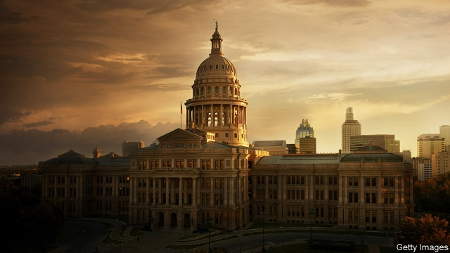

###### Twilight in Austin

# Political competition is moderating Texas Republicans 

##### Bathroom bills are out; funding schools is in 

 

> Mar 7th 2019 

THE KEY TO understanding Texas is the state Capitol in Austin. It is there that legislators meet only every other year to pass new laws and set the state budget. The elegant domed building is several feet taller than the Capitol in Washington, and that matters to Texans. Gun-owners with a concealed-carry licence can enter through a separate security lane and do not have to go through the indignity of a metal detector, as lowly journalists do. The Capitol is built of pinkish granite, a suitable material for a red state now facing the prospect of diluted Republican influence. 

After years of pushing to the right on social issues and immigration, Texas Republicans have shifted their tone during the current legislative session. “There’s been a rush to the middle,” explains Jason Sabo of Frontera Strategy, a lobbying firm. Evidence of that lies in the list of priorities presented by Greg Abbott, the recently re-elected Republican governor. His “emergency” items, which he wants the legislature to focus on, include financing public schools, paying teachers more, reforming the property-tax regime, funding for special education and expanding access to mental-health services. 

How unlike the previous session of the biennial legislature, in 2017. Back then Republicans passed a hugely controversial immigration bill, giving law-enforcement officers the right to stop people and ask to see papers confirming their citizenship. Some compare this action to Proposition 187, an anti-immigration bill that passed in California in 1994 and turned Hispanics in that state against the Republican Party. Another contentious legislative item that session was a “bathroom bill”, designed to regulate where transgender people are allowed to pee. Mr Abbott declared it a priority at the time, though ultimately it withered after opposition from businesses. 

Republicans “have moved over to our issue set and the things we had been talking about,” says Manny Garcia, executive director of the Texas Democratic Party. Culture wars are still playing out in this legislative session, including over abortion, but they are fewer. Republicans are “not talking about divisive social issues any more,” says Joe Straus, who served as Speaker of the Texas House for a decade before stepping down in January. Republicans moved to the right to win primaries against other Republicans, but now they face more challenging general elections. Today “there’s more fear of the November voter than there is of the primary voter. But there’s fear of both,” says Mr Straus. 

There are several reasons for the Republicans’ change of tone and approach, but the 2016 and 2018 elections are central to it. In 2016 Hillary Clinton lost Texas by the smallest margin of any Democrat since 1996. In 2018, when Democrats picked up 12 House seats and two state Senate seats, many right-wing Republicans lost what were thought to be safe districts or won by slimmer margins than expected. This had more than a little to do with Beto O’Rourke, who was challenging Republican Ted Cruz for the US Senate. Although he lost, Mr O’Rourke helped get many down-ballot Democratic state legislators and judges elected. 

Donald Trump has also cast a shadow over state Republicans. “The worst thing that ever happened to Texas Republicans was the election of Donald Trump,” says Mark Jones of Rice University in Houston. Mr Trump has alienated many white Republican women in Texas, and has also pushed away Hispanics, who account for around 40% of the state’s population. Long after Mr Trump leaves office, demographic change in Texas will continue to exert an influence on the fortunes of Republicans, as the Hispanic population grows, millennials vote in increasing numbers and people continue to move to Texas from other states, bringing their more liberal politics with them. According to a recent poll by the University of Texas and Texas Tribune, more Texans say they would sooner vote for a candidate running against Mr Trump than re-elect the president. 

Showing voters that they can bring about change on bread-and-butter issues may help Republicans fend off competition in 2020. Legislators are broadly in agreement that the state needs to do something about property taxes, which have risen considerably as Texas’s economy has boomed and pushed up property values. Texas does not have a state income tax, so it relies disproportionately on property taxes to fund schools. But because the property tax is a very transparent levy, voters frequently complain about their high bills. 

Mr Abbott has suggested capping the rate by which local governments can raise taxes at 2.5% without a special vote (today, that threshold is 8%); this is probably just a starting point for negotiation. But how the state will manage to reduce property-tax growth rates while doing more to fund public schools equitably and boost their performance—another legislative priority—is unclear. Restricting the ability of local districts to raise revenue when they have so few other sources available to them could damage the state’s educational prospects in the long run. 

The property-tax issue points to a broader theme in Texas politics: the clash between state and local control. In theory, Republicans tend to be in favour of light-touch regulation and leaving governance and policymaking to local authorities. But as cities have turned into Democratic bastions and forged their own liberal visions for the future, Republicans have changed their stance. For example, last year Austin and San Antonio passed ordinances that require employers to offer paid sick leave. But a bill making its way through the state Senate would hamstring cities’ ability to set such policies. 

Much is at stake. If Republicans lose the state House, Democrats will have a stronger influence on the redistricting process. (A Democrat-controlled House would presumably not agree with a Republican-controlled Senate plan.) In another twist, next year’s election will be the first when “straight ticket” voting (ie, ticking a single box to vote for every candidate from that party on a ballot) is eliminated, thanks to efforts by Republicans in the previous legislative session. Candidates will have to compete more on their own merits rather than rely on party loyalty. This could contribute, sometime between 2020 and 2026, to the end of the Republicans’ 20-year dominance of all statewide offices, according to Mr Jones of Rice University. 

Democrats are certainly banking on it. This week Nancy Pelosi, the Speaker of the US House of Representatives, travelled to Dallas and Austin and declared Texas “ground zero” for Democratic efforts in 2020. Houston is one of three finalist cities applying to host the 2020 Democratic National Convention; if selected, it would further underscore the Democrats’ strategic embrace of the state. Many are waiting to see whether Mr O’Rourke will run for president, joining Julián Castro, a fellow Texan and former mayor of San Antonio, to compete for the Democratic nomination. “South by Southwest”, a popular convention in Austin beginning on March 8th, is set to draw other Democratic nominees, including Elizabeth Warren and Amy Klobuchar, who are hoping to drum up support. Those visiting Austin will find it nearly impossible to ignore that prodigious dome, with its faint glow of pink. 

-- 

 单词注释:

1.twilight['twailait]:n. 暮光, 曙光, 黎明, 黄昏, 微光, 朦胧状态 a. 微明的 

2.austin['ɔ:stin]:n. 奥斯丁（人名）；英国制汽车牌名 

3.Texas['teksәs]:n. 德克萨斯 

4.Capitol['kæpitl]:n. 国会大厦, 州议会大厦, 朱比特神庙 

5.legislator['ledʒisleitә]:n. 立法者, 立法官, 立法委员 [法] 立法者, 立法机关成员, 立法委员 

6.dome[dәum]:n. 圆顶 vt. 加圆顶 vi. 成圆顶状 

7.Washington['wɒʃiŋtn]:n. 华盛顿 

8.Texan['teksәn]:a. 得克萨斯州的 n. 得克萨斯州的人, 得克萨斯人 

9.indignity[in'digniti]:n. 侮辱 [法] 侮辱的言行, 无礼, 有伤尊严 

10.detector[di'tektә]:n. 发现者, 检验器, 检波器 [计] 检波器; 检测器 

11.lowly['lәuli]:a. 地位低的, 卑下的, 谦卑的 adv. 位置低下的, 低声地, 谦逊地 

12.pinkish['piŋkiʃ]:a. 略带桃色的 

13.granite['grænit]:n. 花岗岩 [化] 花岗岩 

14.dilute[dai'lju:t]:vt. 冲淡, 稀释 a. 淡的, 稀释的 

15.legislative['ledʒislәtiv]:n. 立法机构 a. 立法的, 有立法权的 

16.jason[]:n. 詹森（男子名） 

17.sabo[]:abbr. sabotage 破坏，故意损毁 

18.frontera[]: [地名] [玻利维亚、墨西哥、西班牙] 弗龙特拉 

19.lobby['lɒbi]:n. 大厅, 休息室, 游说议员者 vi. 游说议员, 游说 vt. 游说 

20.greg[greg]:n. 格雷格（男子名, 等于Gregory） 

21.Abbott['æbət]:n. 阿尔伯特（人名）；雅培（公司名） 

22.legislature['ledʒisleitʃә]:n. 立法机关, 议会, 立法院 [法] 立法机构, 立法机关 

23.regime[rei'ʒi:m]:n. 政权, 当权期间, 政体, 社会制度, 体制, 情态 [医] 制度, 生活制度 

24.biennial[bai'eniәl]:n. 两年生植物, 两年一次的事 a. 两年生的, 两年一次的 

25.hugely['hju:dʒli]:adv. 巨大地, 非常地 

26.citizenship['sitizәnʃip]:n. 国籍, 市民权, 市民的身份 [法] 公民权, 公民资格, 公民身分 

27.proposition[.prɒpә'ziʃәn]:n. 建议, 命题, 主张 vt. 向...提议, 向...提出猥亵的要求 

28.California[.kæli'fɒ:njә]:n. 加利福尼亚 

29.Hispanic[his'pænik]:a. 西班牙的 

30.contentious[kәn'tenʃәs]:a. 好争吵的, 爱争论的, 有异议的 [法] 诉讼的, 争执的, 引起争论的 

31.transgender[trænzˈdʒendə(r)]:n. 变性人 

32.pee[pi:]:n. (英)便士, 小便 vi. 小便 

33.wither['wiðә]:vt. 使凋谢, 使消亡, 使畏缩 vi. 枯萎, 衰退 

34.opposition[.ɒpә'ziʃәn]:n. 反对, 敌对, 相反, 在野党 [医] 对生, 对向, 反抗, 反对症 

35.Manny['mæni:]:n. 曼尼（男子名） 

36.garcia['^ɑ:ʃjә]:n. 加西亚（姓氏） 

37.divisive[di'vaisiv]:a. 区分的, 制造分裂的, 造成不和的 

38.joe[dʒәu]:n. 乔（男子名） 

39.Straus[straus]:施特劳斯(①姓氏 ②Oskar, 1870-1954, 生于奥地利的法国作曲家) 

40.voter['vәutә]:n. 选民, 投票人 [法] 选民, 选举人, 投票人 

41.Hillary['hiləri:]:n. 希拉里（美国现任国务卿） 

42.clinton['klintәn]:n. 克林顿（男子名） 

43.democrat['demәkræt]:n. 民主人士, 民主主义者, 民主党党员 [经] 民主党 

44.democrat['demәkræt]:n. 民主人士, 民主主义者, 民主党党员 [经] 民主党 

45.beto[]:n. (Beto)人名；(英)贝托 

46.ted[ted]:vt. 翻晒 

47.cruz[]:n. （西）克鲁兹（男子名） 

48.donald['dɔnәld]:n. 唐纳德（男子名） 

49.trump[trʌmp]:n. 王牌, 法宝, 喇叭 vt. 打出王牌赢, 胜过 vi. 出王牌, 吹喇叭 

50.jones[dʒәunz]:n. 琼斯（姓氏） 

51.Houston['hju:stәn]:n. 休斯敦 

52.alienate['eiljәneit]:vt. 使疏远, 离间, 转让 [法] 转让, 让与, 疏远 

53.demographic[.demә'græfik]:a. 人口统计的 [法] 人口统计的, 人口学的 

54.Hispanic[his'pænik]:a. 西班牙的 

55.millennials[mɪ'leniəl]:adj. 一千年的；一千年至福的 [网络] 千禧世代；千禧之子；千禧一代 

56.politic['pɒlitik]:a. 精明的, 明智的, 策略的 

57.tribune['tribju:n]:n. 护民官, 军团指挥官, 公民权利保护者, 讲坛 

58.fend[fend]:vt. 击退, 保护, 供养 

59.broadly['brɒ:dli]:adv. 宽广地, 明白地, 无礼貌地 

60.considerably[kәn'sidәrәbli]:adv. 非常地, 很, 颇 

61.disproportionately[]:adv. 不匀称, 不相称 

62.levy['levi]:n. 税款, 所征的人数, 征收 vi. 征税, 课税 vt. 征收, 强求, 召集 

63.threshold['θreʃәuld]:n. 门槛, 入口, 开端, 阈 [计] 阈; 阈值 

64.negotiation[ni.gәuʃi'eiʃәn]:n. 谈判, 磋商, 交涉 [经] 谈判, 协商 

65.equitably['ekwitәbli]:adv. 公正地, 依据衡平法 

66.unclear[.ʌn'kliә]:a. 不易了解的, 不清楚的, 含混的 

67.educational[.edju'keiʃәnl]:a. 教育的, 教育性的 

68.clash[klæʃ]:n. 冲突, 撞击声, 抵触 vi. 冲突, 抵触 vt. 使发出撞击声 [计] 对撞 

69.governance['gʌvәnәns]:n. 统治, 统辖, 管理 [法] 统治, 管理, 支配 

70.policymaking['pɔlәsi,meikiŋ]:[法] 政策制定者, 决策人 

71.bastion['bæstʃәn]:n. 棱堡, 阵地工事 

72.forge[fɒ:dʒ]:n. 熔炉, 铁工厂 vt. 打制, 锻造, 伪造 vi. 锻造, 伪造 

73.stance[stæns]:n. 准备击球姿势, 站立的姿势, 位置, 姿态 [经] 地位, 形势 

74.san[sɑ:n]:abbr. 存储区域网（Storage Area Networking） 

75.antonio[æn'tәuniәu]:n. 安东尼奥（男名） 

76.ordinance['ɒ:dinәns]:n. 法令, 条例, 圣餐礼 [经] 法令, 条款, 条例 

77.hamstring['hæmstriŋ]:n. 后腿腱 vt. 切断腿腱使成跛腿, 使瘫痪 

78.redistrict[ri:'distrikt]:vt. 把...重新区分, 重划选区 

79.IE['i:ei]:[计] 中断启动 

80.ballot['bælәt]:n. 投票, 投票用纸, 抽签 vi. 投票, 抽签 vt. 投票选出, 拉选票 

81.dominance['dɔminәns]:n. 优势, 显性, 统治, 控制, 支配 [计] 控制, 扰势 

82.statewide['steitwaid]:a. 全州的, 遍及全州的 

83.nancy['nænsi]:n. 女性化的男人 a. 女性化的, 同性恋的 

84.pelosi[]:佩洛西 

85.dallas['dælәs]:n. 达拉斯（美国城市） 

86.finalist['fainәlist]:n. 决赛选手, 决赛队 

87.underscore[.ʌndә'skɒ:]:vt. 划线于...下 n. (表强调的)下划线 [计] 底线 

88.Castro['kæstrəu]:n. 卡斯特罗（古巴领导人, 1976-2006年在任） 

89.Texan['teksәn]:a. 得克萨斯州的 n. 得克萨斯州的人, 得克萨斯人 

90.nomination[.nɒmi'neiʃәn]:n. 提名, 任命, 提名权 

91.nominee[.nɒmi'ni:]:n. 被提名者, 被任命者 [经] 被指定人 

92.elizabeth[i'lizәbәθ]:n. 伊丽莎白（女子名） 

93.warren['wɒrәn]:n. 养兔场, 拥挤的地区 

94.amy['eimi]:n. 艾米（女子名） 

95.klobuchar[]:[网络] 克罗布歇 

96.prodigious[prәu'didʒәs]:a. 庞大的, 惊人的, 异常的 

