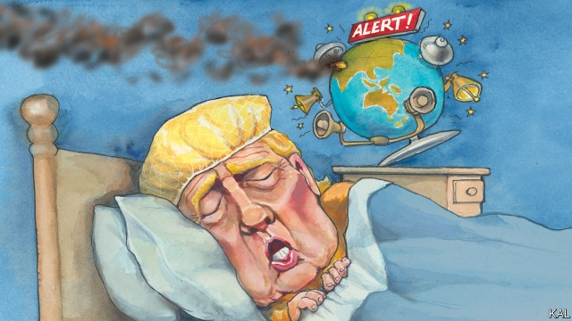

###### Lexington

# The Trump administration and the Indo-Pakistan crisis 

##### How America First works in Kashmir 

 

> Mar 7th 2019 

FOREIGN POLICY savants had long worried about what Donald Trump’s administration would do when faced with its first global crisis. Yet when the metaphorical “3am call” came last month, relaying news of the slaughter of 40 Indian policemen by a Pakistani militant group, months away from an Indian general election, the administration’s initial response was to roll over and go back to sleep. This Indo-Pakistan confrontation, which included tit-for-tat air strikes across their border in Kashmir, is the first such crisis in which America has not played a leading role since both countries tested nuclear weapons in 1998. 

Previous crises, similarly sparked by attacks on India by jihadists connected to Pakistan, prompted high-powered American delegations to rush to both countries: for example in 2001 and 2008. They also involved the president directly—including in 1999 when Bill Clinton harangued Nawaz Sharif to end a small war Pakistan had launched in Kashmir. By contrast, neither Mr Trump nor Mike Pompeo, the secretary of state, appear to have paid much attention to the early stages of the current crisis. The initial American response consisted of a phone call by John Bolton, the national security adviser, to his Indian counterpart, Ajit Doval, in which he was reported in India to have acknowledged India’s right to “self-defence” against “cross-border” terrorism. Mr Trump later said he understood India was “looking at something very strong”. This was tantamount to an American green light for the Indian air strikes that followed, which were the first by either country since the 1971 war that led to the division of Pakistan. Only afterwards did Mr Pompeo issue the customary plea to both sides for restraint. 

In part, this reflects America’s changing relations with the subcontinent. Until recently it had closer ties to Pakistan, its former cold-war ally and partner, of sorts, in the war on terror. Yet as America’s need for the Pakistanis has diminished, with its drawdown in Afghanistan, so frustration with the “international migraine” that is Pakistan, in Madeleine Albright’s phrase, has increased. America has meanwhile got much closer to India, which it views as a counterweight to China. Out of respect for an important new partner, whose anger at Pakistan’s complicity in jihadist violence it shares, the Trump administration was therefore more content than its predecessors to leave it to India to decide how it wanted to respond to the latest Pakistan-linked attack. 

The Obama administration, whose South Asia policies Mr Trump has broadly continued, acted similarly. After jihadists killed 19 Indians in Kashmir in 2016, Mr Obama did not send a heavyweight delegation to the subcontinent either. And in a post-attack call to Mr Doval, Susan Rice, Mr Obama’s national security adviser, also omitted the traditional American call for restraint. Mr Obama had reached the limits of his patience with Pakistan. He had also moderated his earlier insistence on the need to resolve the two countries’ dispute over Kashmir as a means to ending their nuclear-armed rivalry. So the Trump administration has in a sense merely made Mr Obama’s growing partiality for India more explicit. It has shown no interest in the Kashmir dispute, which it says is a matter for the two countries to resolve (or not). In this context, Mr Bolton’s tacit support for India’s right to launch a retaliatory strike into Pakistan looks not just reckless—though it was that. It looks like a final repudiation of Pakistan’s effort to turn any Indo-Pakistani confrontation into an international discussion on the status of Kashmir. 

That is logical: India resisted outside advice on Kashmir even when it was far more evenly matched with Pakistan than it is today. Yet the combination of passivity and partiality in the Trump administration’s response to this crisis also reflects its broader lack of interest in solving problems abroad. This week the State Department provided another illustration of that, by announcing that it had folded its 175-year-old diplomatic mission to Jerusalem, which had served as a de facto embassy to the Palestinians, into its new Israeli embassy. It suggests America may no longer be committed to a two-state solution to the Middle East conflict. 

The main downside to America’s retreat from problem-solving is that the world still needs its leadership. It also seems self-defeating. America’s efforts to keep the peace have tended to enhance its power. As Jake Sullivan, a Democratic foreign-policy expert, argues, America’s claim to have an exceptional responsibility for the global good has helped it win domestic support for the ambitious foreign policy its national interests require. Moreover, if aspiring to global leadership may be irksome, forfeiting it carries costs. Having helped establish a precedent whereby India feels able to launch air strikes on Pakistan in response to a terrorist attack, Mr Bolton has made the prospect of a nuclear exchange in South Asia more likely. Exerting such little pressure on the Israelis to treat fairly with the Palestinians is probably making both sides more radical, and the Middle East less stable. 

Another concern is the Trump administration’s conception of the national interest. Its management of the State Department, the country’s premier foreign-policy institution, has been a fiasco. As the Indo-Pakistan crisis has highlighted, America has no permanent ambassador in Pakistan; nor has it in Egypt, Turkey and Saudi Arabia. It is also, despite the administration’s friendliness to India, increasingly incoherent in its approach to the country. This week Mr Trump told Congress he planned to end the preferential trade terms India enjoys with America because of its high tariffs on goods such as whiskey. This is liable to be as damaging to America’s reputation in India as Mr Bolton’s amenable view of its right to self-defence was helpful. Yet the cost of the trade programme to America, at around $190m a year, is modest. It is the policy of a president compelled by tactics but devoid of strategy. Sun Tzu called that the noise before a defeat. 

-- 

 单词注释:

1.lexington['leksiŋtәn]:n. 列克星敦市（位于美国肯塔基州） 

2.trump[trʌmp]:n. 王牌, 法宝, 喇叭 vt. 打出王牌赢, 胜过 vi. 出王牌, 吹喇叭 

3.Kashmir['kæʃmiә]:n. 克什米尔 

4.savant['sævәnt]:n. 学者, 专家 

5.donald['dɔnәld]:n. 唐纳德（男子名） 

6.metaphorical[metә'fɒ:rikl]:a. 隐喻性的, 比喻性的 

7.slaughter['slɒ:tә]:n. 残杀, 屠杀, 杀戮 vt. 残杀, 屠杀, 亏本出售 

8.Pakistani[.pɑ:ki'stɑ:ni]:a. 巴基斯坦的 n. 巴基斯坦人 

9.militant['militәnt]:a. 好战的 

10.confrontation[.kɔnfrʌn'teiʃәn]:n. 对抗；对质；面对 

11.jihadist[]:n. 伊斯兰圣战士 

12.Pakistan[.pɑ:ki'stɑ:n]:n. 巴基斯坦 

13.clinton['klintәn]:n. 克林顿（男子名） 

14.harangue[hә'ræŋ]:n. 演讲, 热烈讨论, 长篇大论, 夸夸其谈 vt. 向...夸夸其谈地讲话 

15.Nawaz[]:n. (Nawaz)人名；(印、孟、巴基、阿富)纳瓦兹 

16.Sharif[ʃɑ:'ri:f]:n. 沙里夫(m.)  n. =sherif 

17.mike[maik]:vi. 偷懒, 游手好闲 n. 休息, 游手好闲, 扩音器, 话筒 

18.pompeo[]:n. (Pompeo)人名；(意)蓬佩奥 

19.john[dʒɔn]:n. 盥洗室, 厕所, 嫖客 

20.bolton['bәultәn]:a. 可用螺栓固定的 

21.adviser[әd'vaizә]:n. 顾问, 劝告者, 指导教师 [法] 顾问, 劝告者 

22.counterpart['kauntәpɑ:t]:n. 副本, 复本, 配对物, 相应物 [经] 副本, 正副二份中之一 

23.ajit[]:n. (Ajit)人名；(马来、印)阿吉特 

24.doval[]:[网络] 道瓦尔 

25.terrorism['terәrizm]:n. 恐怖主义, 恐怖统治, 恐怖状态 [法] 胁迫, 暴政, 恐怖政治 

26.tantamount['tæntәmaunt]:a. 同等的, 相等的, 相当于...的 [法] 相等的, 相当的, 同等的 

27.afterwards['ɑ:ftәwәdz]:adv. 然后, 后来 

28.customary['kʌstәmәri]:a. 习惯的, 惯常的 [经] 通常的, 习惯的 

29.plea[pli:]:n. 恳求, 辩解, 抗辩, 诉讼, 请愿, 托词 [法] 抗辩, 申诉案件, 答辩 

30.subcontinent[sʌb'kɒntinәnt]:n. 次大陆 

31.ally['ælai. ә'lai]:n. 同盟者, 同盟国, 助手 vt. 使联盟, 使联合, 使有关系 vi. 结盟 

32.Pakistani[.pɑ:ki'stɑ:ni]:a. 巴基斯坦的 n. 巴基斯坦人 

33.diminish[di'miniʃ]:v. (使)减少, (使)变小 

34.drawdown['draudaun]:n. 水位降低, 减少, 消耗 [经] 提款 

35.Afghanistan[æf'gænistæn]:n. 阿富汗 

36.frustration[frʌs'treiʃәn]:n. 挫折, 顿挫 [医] 挫折 

37.migraine['mi:^rein, 'mai-]:n. 严重的周期性偏头痛 [医] 偏头痛 

38.Madeleine['mædәlin, -lein]:n. 马德琳（女子名） 

39.counterweight['kauntәweit]:n. 平衡物, 平衡力, 秤锤 [机] 配重 

40.complicity[kәm'plisiti]:n. 同谋, 串通, 复杂 [法] 共谋, 共犯关系 

41.predecessor[.predi'sesә]:n. 前任, 先辈, 前身 [医] 初牙, 前辈, 祖先 

42.obama[]:n. 奥巴马(姓) 

43.broadly['brɒ:dli]:adv. 宽广地, 明白地, 无礼貌地 

44.heavyweight['heviweit]:n. 重量级拳击运动员, (非正式)有影响的要人 a. 最重量级的 

45.susan['su:zn]:n. 苏珊（女子名） 

46.insistence[in'sistәns]:n. 坚持, 坚决主张 

47.rivalry['raivlri]:n. 竞争, 对抗 [医] 拮抗 

48.partiality[.pɑ:ʃi'æliti]:n. 偏心, 偏颇, 不公平, 特别喜欢, 癖好 [法] 偏袒, 偏见, 不公平 

49.context['kɒntekst]:n. 上下文, 背景, 来龙去脉 n. 上下文 [计] 上下文 

50.tacit['tæsit]:a. 沉默寡言的, 不苟言笑的, 缄默的 

51.retaliatory[ri'tæliәtәri]:a. 报复的 [经] 报复性的 

52.repudiation[ri.pju:di'eiʃәn]:n. 抛弃, 否认, 拒付 [法] 遗弃, 废弃, 否认 

53.statu[]:[网络] 状态查看；雕像；特级雪花白 

54.evenly['i:vәnli]:adv. 平衡地, 平坦地, 平等地 

55.passivity[pæ'siviti]:n. 被动, 被动性, 无抵抗, 钝性, 被动结构 [化] 钝态 

56.diplomatic[.diplә'mætik]:a. 外交的, 老练的 [法] 外交的, 外交上的, 文献上的 

57.Jerusalem[dʒә'ru:sәlәm]:n. 耶路撒冷 

58.de[di:]:[化] 非对映体过量 [医] 铥(69号元素铥的别名,1916年Eder离得的假想元素) 

59.facto[]:[法] 实际上, 事实上 

60.Palestinian[,pælis'tiniәn]:[经] 巴勒斯坦的 

61.Israeli[iz'reili]:a. 以色列的, 以色列人(语)的 n. 以色列人 

62.downside['daunsaid]:n. 底侧；下降趋势 

63.jake[dʒeik]:a. 满意的, 上等的 n. 乡下佬, 家伙 

64.sullivan[]:n. 沙利文, 苏利文（人名） 

65.exceptional[ik'sepʃәnәl]:a. 例外的, 异常的, 特别的 

66.ambitious[æm'biʃәs]:a. 有野心的, 抱负不凡的, 雄心勃勃的 

67.aspire[ә'spaiә]:vi. 渴望, 立志于 

68.irksome['ә:ksәm]:a. 厌恶的, 讨厌的, 令人厌烦的 

69.forfeit['fɒ:fit]:n. 没收物, 罚金, 丧失 vt. 没收, 丧失 a. 丧失了的 

70.precedent['presidәnt]:n. 先例, 前例 a. 在先的, 在前的 

71.whereby[(h)weә'bai]:adv. 靠什么, 如何, 为何, 靠那个, 因此, 由此 [法] 因此, 由是 

72.terrorist['terәrist]:n. 恐怖分子 [法] 恐怖份子, 恐怖主义 

73.Israeli[iz'reili]:a. 以色列的, 以色列人(语)的 n. 以色列人 

74.les[lei]:abbr. 发射脱离系统（Launch Escape System） 

75.conception[kɒn'sepʃәn]:n. 观念, 概念 [医] 妊娠, 受孕; 概念 

76.fiasco[fi'æskәu]:n. 惨败, 大失败 

77.Egypt['i:dʒipt]:n. 埃及 

78.saudi['sajdi]:a. 沙乌地阿拉伯（人或语）的 

79.Arabia[ә'reibiә]:n. 阿拉伯半岛 

80.friendliness['frendlinis]:n. 友谊, 亲切, 亲密 

81.incoherent[.inkәu'hiәrәnt]:a. 不连贯的, 语无伦次的 [医] 不连贯的 

82.preferential[.prefә'renʃәl]:a. 优先的, (关税等)优惠的 [经] 特惠的; 特惠关税率, 优先权 

83.tariff['tærif]:n. 关税, 关税表, 价格表, 收费表 vt. 课以关税 [计] 价目表 

84.whiskey['hwiski]:n. 威士忌酒 a. 威士忌酒的 

85.amenable[ә'mi:nәbl]:a. 服从的, 会接纳的, 有义务的 [法] 服从的, 有责任的, 有服从义务的 

86.tactic['tæktik]:n. 一项战术, 一条策略 a. 战术的, 顺序的, 排列的 

87.devoid[di'vɒid]:a. 全无的, 缺乏的 

88.tzu[]:n. (Tzu)人名；(东南亚国家华语)滋 

