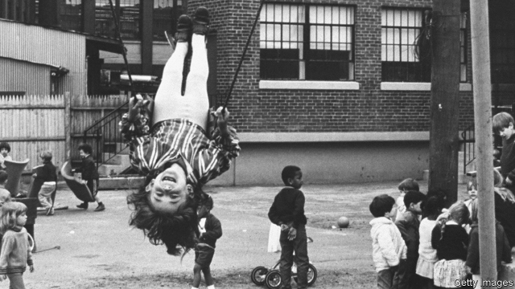

###### Day care for all

# The right way to help poor children and their mothers 

##### Why cash beats government-funded childcare 

 

> Mar 7th 2019 

DANIEL PATRICK MOYNIHAN, the sociologist and senator who died in 2003, once said that America’s longstanding preference for bureaucratic social services for the poor over simply handing them cash was like “feeding the sparrows by feeding the horses”. The universal child-care plan offered by Elizabeth Warren, a senator from Massachusetts and Democratic candidate for 2020, falls into such a snare. Given the cost of American child care, which is the least affordable among developed countries, some plan is clearly needed. Her ambitious proposal calls for publicly funded child-care centres nationwide, which would be free to those making less than 200% of the poverty line (or $51,500 for a family of four) and cost no more than 7% of income for those above it. The complicated infrastructure it envisions would be less efficient than simple cash transfers to poor families with children—and would give uncertain returns. 

In the late 1990s, the Canadian province of Quebec introduced a universal child-care scheme backed by large subsidies—out-of-pocket costs were limited to $5 a day. When social scientists tracked the life outcomes for the children and parents who took part in the programme, the results were unexpectedly terrible. Children came out no cleverer and with worse health, life satisfaction and rates of criminal offence. Although women worked more, the taxes generated on their additional labour fell far short of the costs of running the programme. Studies of European programmes have found more positive results, but the outcomes of the recent experiment in North America are troubling. “It tells us that a poorly funded programme that was rapidly rolled out did not generate the benefits that were promised,” says Amitabh Chandra, a professor of economics at Harvard. And “we have a history of underfunding programmes in the US when they disproportionately benefit the poor.” 

In practice, the universal child care envisioned by Ms Warren would operate as more of a middle-class entitlement than a well-targeted anti-poverty programme. The costs of child care vary enormously by place. In Washington, DC, it costs around $22,000 a year. Assuming identical costs, Ms Warren’s plan would grant a well-to-do professional couple in the city making $150,000 an $11,500 subsidy to deposit Junior in day care. And although it is true that a poor working mother would receive the same service free of charge, the public costs of looking after her child might well exceed her annual earnings. Giving even a fraction of that amount in cash to mother and child would probably be better for both. 

Poor and ethnic-minority mothers are also less likely to use formal day-care centres in the first place. They tend to stay at home to look after children or to use informal child care, such as relatives. “There’s this amazing tone-deafness to the cultural implications. It’s not just a technocratic policy to close the female wage gap or to grow the earnings of kids,” says Sam Hammond of the Niskanen Centre, a think-tank. The Quebec experiment showed a significant crowding out of informal child-care arrangements in favour of cheap, government-run facilities. 

Ms Warren herself once grasped this conundrum. In her book “The Two-Income Trap”, co-written with her daughter in 2003, she dismissed the “sacred cow” of free day care. “Subsidised day care benefits only some kids—those whose parents both work outside the home. Day-care subsidies offer no help for families with a stay-at-home mother,” Ms Warren wrote then. She also recognised its possible exacerbating effect on inequality. “Every dollar spent to subsidise the price of day care frees up a dollar for the two-income family to spend in the bidding wars for housing, tuition, and everything else,” she continued. 

A better way to reduce child poverty is to provide a basic monthly child allowance which could be spent on food, rent or formal child care. Michael Bennet and Sherrod Brown, two Democratic senators, have proposed paying families $250-300 per child each month—which would cut the child-poverty rate by almost half, and at the same cost as Ms Warren’s plan. If child care is to be subsidised, it is probably better done through means-tested tax credits. Sadly, the phrase “fully refundable child tax credits” does not stir the soul of Democratic primary voters quite like “universal child-care” does. 

-- 

 单词注释:

1.childcare['tʃaildkεә]:n. 儿童照管；儿童保育 

2.daniel['dænjәl]:n. 丹尼尔（男子名） 

3.patrick['pætrik]:n. 帕特里克（男子名） 

4.Moynihan[]:n. 莫伊尼汉（姓氏） 

5.sociologist[.sәusi'ɒlәdʒist]:n. 社会学家 [法] 社会学家 

6.senator['senәtә]:n. 参议员, (某些大学的)理事 [法] 参议员, 上议员 

7.longstanding['lɔŋ'stændiŋ;'lɔ:ŋ-]:a. 长期间的, 长期存在的 

8.elizabeth[i'lizәbәθ]:n. 伊丽莎白（女子名） 

9.warren['wɒrәn]:n. 养兔场, 拥挤的地区 

10.Massachusetts[.mæsә'tʃu:sits]:n. 麻萨诸塞州 

11.snare[snєә]:n. 陷阱, 诱惑, 圈套 vt. 以陷阱捕获, 诱惑 

12.affordable[]:[计] 普及型 

13.ambitious[æm'biʃәs]:a. 有野心的, 抱负不凡的, 雄心勃勃的 

14.les[lei]:abbr. 发射脱离系统（Launch Escape System） 

15.infrastructure['infrәstrʌktʃә]:n. 基础结构, 基础设施 [经] 基础设施 

16.envision[in'viʒәn]:vt. 想象, 预想 

17.quebec[kwi'bek]:n. 魁北克（加拿大港市省名） 

18.unexpectedly[]:adv. 想不到的, 突然的, 意外的, 出乎意料的 

19.poorly['puәli]:adv. 贫穷地, 不充分地, 贫乏地 a. 身体不舒服的 

20.amitabh[]:[网络] 阿穆塔布；阿米达；阿米达巴 

21.Chandra[]:n. 钱德拉（印度的月神） 

22.Harvard['hɑ:vәd]:n. 哈佛大学 

23.underfunding[,ʌndə'fʌnd]:vt. 对…提供的资金不足 

24.disproportionately[]:adv. 不匀称, 不相称 

25.entitlement[]:n. 权利 [法] 权利 

26.enormously[i'nɒ:mәsli]:adv. 非常地, 巨大地 

27.Washington['wɒʃiŋtn]:n. 华盛顿 

28.DC[]:直流电 [计] 数据单元, 数据中心, 数据代码, 数据通信, 数据控制, 数字控制, 直流 

29.earning['ә:niŋ]:n. 收入（earn的现在分词） 

30.informal[in'fɒ:mәl]:a. 非正式的, 不拘礼的, 通俗的 [经] 非正式的, 日常使用的 

31.cultural['kʌltʃәrәl]:a. 文化的, 教养的, 修养的 [医] 培养的 

32.technocratic[ˌteknə'krætɪk]:a. 由技术专家官员组成的；受技术官僚影响的 

33.SAM[sæm]:[计] 安全性帐户管理器 

34.hammond['hæmәnd]:n. 哈蒙德（美国城市） 

35.niskanen[]: [人名] 尼斯卡宁 

36.conundrum[kә'nʌndrәm]:n. 谜语, 难题 

37.subsidise[]:vt. 给...补助金, 津贴, 资助 

38.exacerbate[ek'sæsәbeit]:vt. 使恶化, 使增剧, 激怒, 使加剧 

39.inequality[.ini'kwɒliti]:n. 不平等, 不同, 不平坦, 不平均 n. 不平等, 不等式 [计] 不等式 

40.michael['maikl]:n. 迈克尔（男子名） 

41.bennet['benit]:n. 水杨梅, 花梗 

42.sherrod[]: [人名] 谢罗德 

43.fully['fuli]:adv. 十分地, 完全地, 充分地 

44.refundable[ri'fʌndәbl]:a. 可偿还的, 可归还的 

45.voter['vәutә]:n. 选民, 投票人 [法] 选民, 选举人, 投票人 

