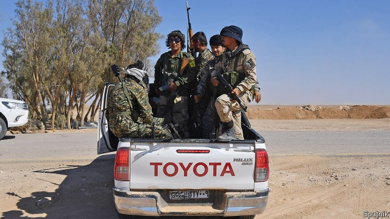

###### Demob unhappy

# Afghans worry about the return of Shia fighters from Syria’s civil war 

##### Will they further undermine their country’s stability? 

 

> Mar 14th 2019 

ALIREZA QANBARI has still not told his parents the truth about what he did when he left Afghanistan for Iran. The 23-year-old is happy for his father to believe he worked as a labourer. In fact, he fought with an Afghan militia recruited by Iran to help prop up the government in Syria’s civil war. With the war now dying down, Afghan fighters are starting to come home. Just as the West agonises about the return of radicalised émigrés, many in Afghanistan worry about what the former fighters will do—and where their loyalties lie. 

At its height, the Fatemiyoun, as the Afghan militia was known, had as many as 20,000 fighters, largely from the Hazara ethnic minority. Most Hazaras are Shia Muslims, as are the ruling elite in both Iran and Syria. Long downtrodden, Hazaras were especially persecuted by the Sunni Muslims of the Taliban. More recently the Afghan branch of Islamic State has launched terror attacks on Hazara targets. 

Mr Qanbari, which is not his real name, was desperate to escape stifling poverty in the countryside near Herat, close to Afghanistan’s border with Iran. So, like many of his peers, he crossed the frontier to find work. A Hazara friend of his in Iran disappeared, only to resurface nine months later in a military hospital. His friend revealed he had been wounded in Syria with the Fatemiyoun, which paid three times a labourer’s wage. Moreover, Iran was handing out prized residency permits to those who fought—a powerful incentive given that around 250,000 Afghans who lack the right papers are deported from Iran each year. 

There were also historical reasons for the birth of the Fatemiyoun. Many Afghans had fought for their neighbour during the Iran-Iraq War, and ties between those veterans and the Iranian security apparatus endured. The founder of the Fatemiyoun, Alireza Tavasoli, was one such veteran. 

While most recruits joined the Fatemiyoun for the money, they also received religious indoctrination, Mr Qanbari and others say. Young recruits were told they would be defending Shia shrines against Islamic State. After scant training, they were sent into some of the war’s worst fighting and suffered terrible casualties. 

Although most Fatemiyoun veterans are thought to have remained in Iran, many have returned to Afghanistan. That is causing unease. During the most chaotic phase of Afghanistan’s civil war, in the 1990s, Iran backed militias as proxies, just as Pakistan backed the Taliban. The Fatemiyoun may play such a role in the future, Afghan intelligence officials fear. “It is a concern that when the national interests of the country that trained them are in danger, these people will go back and even act against our national interests,” says Sayed Azim Kabarzani, an MP from Herat. Fatemiyoun veterans say they feel they are under scrutiny by the authorities. They are reluctant to talk to journalists. 

Yet Iran would struggle to mobilise the Fatemiyoun inside Afghanistan, says Said Reza Kazemi, an academic. There would also be great resistance among Afghan Shias to any sort of mobilisation against the Afghan state. Hazaras have benefited from the current political order and have no desire to turn against it. A more likely prospect, says Ahmad Shuja, who has interviewed dozens of Hazara leaders and veterans for a report for the United States Institute of Peace, is that if security in the Hazara areas worsens and residents feel abandoned, veterans will form self-defence forces. When Taliban fighters overran previously safe Hazara areas in central Afghanistan last year, Fatemiyoun veterans tried to hold them off, but were not well organised, intelligence officials say. 

Mr Qanbari carries many scars from his years at the front. His mental health has suffered and he is prone to seizures. But he is also unemployed and short of money. With Iran having declared victory in Syria, the future of the Fatemiyoun is uncertain. In January America blacklisted it for its ties to Iran’s Revolutionary Guards. But Mr Qanbari wonders if his best hope is to return to Iran and start lying to his parents again. 

-- 

 单词注释:

1.demob[di:'mɔb]:n. 遣散, 复员 

2.Afghan['æfgæn]:a. 阿富汗的, 阿富汗人的 n. 阿富汗人, 阿富汗语, 阿富汗毛毯 

3.shia[]:n. 什叶；什叶派（等于Shiah） 

4.undermine[.ʌndә'main]:vt. 在...下面挖, 渐渐破坏, 暗地里破坏 [法] 暗中破坏, 以阴谋中伤伤害 

5.alireza[]:n. (Alireza)人名；(伊朗、阿拉伯)阿里-礼萨 

6.Afghanistan[æf'gænistæn]:n. 阿富汗 

7.Iran[i'rɑ:n]:n. 伊朗 

8.Afghan['æfgæn]:a. 阿富汗的, 阿富汗人的 n. 阿富汗人, 阿富汗语, 阿富汗毛毯 

9.militia[mi'liʃә]:n. 义勇军, 民兵组织, 国民军 

10.prop[prɒp]:n. 支柱, 支持者, 倚靠人, 道具, 螺旋桨 vt. 支撑, 维持 

11.agonise['æ^әnaiz]:v. 烦恼, 挣扎 

12.radicalise['rædikəlaiz]:vt. 使激进（等于radicalize） vi. 变得激进（等于radicalize） 

13.hazara[]: [地名] [阿富汗] 哈扎拉 

14.ethnic['eθnik]:a. 人种的, 种族的 [医] 人种的 

15.hazaras[]:[网络] 哈扎拉人；哈札拉人；哈兹拉 

16.Muslim['mjzlim; (?@) 'mʌzlem]:n. 伊斯兰教, 伊斯兰教教徒 

17.elite[ei'li:t]:n. 精华, 精锐, 中坚分子 

18.Syria['siriә]:n. 叙利亚 [经] 叙利亚 

19.downtrodden['dajntrɔd(ә)n]:a. 被蹂躏的, 受压制的 

20.persecute['pә:sikju:t]:vt. 迫害, 虐待, 困扰, 同...捣乱 [法] 迫害, 虐待, 烦扰 

21.Sunni['suni:]:n. 〈伊斯兰〉逊尼派教徒 

22.Taliban[]:塔利班 

23.Islamic[iz'læmik]:a. 伊斯兰教的, 穆斯林的 

24.stifle['staifl]:vt. 使窒息, 抑止, 扼杀 vi. 窒息, 被扼杀 

25.Herat[he'rɑ:t]:n. 赫拉特（阿富汗西北部城市） 

26.peer[piә]:n. 同等的人, 匹敌, 贵族 vi. 凝视, 窥视, 费力地看, 隐现 vt. 与...同等, 封为贵族 

27.resurface[ri:'sә:fis]:vi. 重铺路面 vi. 重新露面 

28.residency['rezidәnsi]:n. 住处 [法] 住处, 管辖区 

29.incentive[in'sentiv]:n. 动机 a. 激励的 

30.deport[di'pɒ:t]:vt. 举止, 驱逐出境 [法] 放逐, 驱逐, 递解 

31.Iranian[i'reiniәn]:a. 伊朗的, 伊朗语系的 n. 伊朗人, 伊朗语 

32.founder['faundә]:n. 创立者, 建立者 vt. 使沉没, 使摔倒, 弄跛, 浸水, 破坏 vi. 沉没, 摔到, 变跛, 倒塌, 失败 

33.alireza[]:n. (Alireza)人名；(伊朗、阿拉伯)阿里-礼萨 

34.indoctrination[in.dɒktri'neiʃәn]:n. 教导, 教化 [法] 教育, 教训, 灌输 

35.shrine[ʃrain]:n. 圣地, 神龛, 庙 vt. 将...置于神龛内 

36.scant[skænt]:a. 不充分的, 不足的 vt. 减少, 吝啬, 限制, 藐视, 忽略 

37.casualty['kæʒjuәlti]:n. 意外事故, 伤亡, 受害者 [化] 事故 

38.unease[.ʌn'i:z]:n. 不安 

39.chaotic[kei'ɒtik]:a. 混乱的, 无秩序的 [法] 混乱的, 混沌的 

40.proxy['prɒksi]:n. 代理, 代理人, 委托书 [经] 代理人, 代表权, 授权书 

41.Pakistan[.pɑ:ki'stɑ:n]:n. 巴基斯坦 

42.sayed[]:[网络] 赛义德；萨伊德；伊德 

43.azim[]:n. (Azim)人名；(土、哈萨、塔吉、吉尔、土库、阿塞、乌兹、津、阿拉伯)阿齐姆 

44.MP[]:国会议员, 下院议员 [计] 宏处理程序, 维护程序, 线性规划, 微程序, 多处理器 

45.scrutiny['skru:tini]:n. 细看, 仔细检查, 监视, 选票检查 [经] 复查, 评核, 仔细检查 

46.mobilise['mәjbilɑiz]:vi.vt. 动员, 松动, 使活动, 调动, 发动 

47.REZA[]:n. 雷扎（男子名） 

48.kazemi[]:[网络] 风冥 

49.shia[]:n. 什叶；什叶派（等于Shiah） 

50.mobilisation[ˌməʊbɪlaɪ'zeɪʃən]:n. 动员, 运用 

51.ahmad[]:n. 阿哈默德（穆罕默德在《古兰经》中的名称） 

52.shuja[]:[网络] 舒雅 

53.worsen['wә:sn]:vt. 使更坏, 使恶化 vi. 变得更坏, 恶化 

54.overrun[.әuvә'rʌn]:n. 蔓延, 风行一时, 超过限度 vt. 蔓延, 蹂躏, 超过, 泛滥 vi. 泛滥, 超载限度 [计] 超限 

55.prone[prәun]:a. 俯伏的, 面向下的, 有...倾向的 [医] 旋前的, 伏的, 俯的 

56.seizure['si:ʒә]:n. 捕获, 夺取, 占领, 捕获物, 没收, 充公 [医] 发作; 癫痫发作 

57.unemployed[.ʌnim'plɒid]:a. 失业的, 未被利用的 [经] 没有被雇用的, 失业的, 没有被利用的 

58.blacklist['blæklist]:n. 黑名单 

