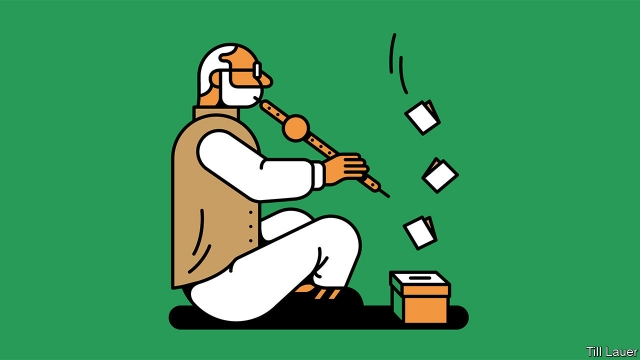

###### Banyan

# Air strikes on Pakistan may win Narendra Modi India’s election 

##### For many, patriotism trumps their grievances with the prime minister 

 

> Mar 14th 2019 

THE STARTER’S gun has been fired on the biggest democratic exercise on Earth: an Indian general election. The Election Commission has set out a schedule for the country’s 900m-odd eligible voters to select a new parliament, in seven stages, with results due on May 23rd. The process, despite electronic voting and an increase in polling stations, to 1m, is lumbering. The scale is intimidating. Some 84m Indians—a whole Germany—have become eligible to vote since the previous poll, in 2014. 

To young Indians, economic opportunity counts above all. Five years ago Narendra Modi clothed a reputation as a Hindu firebrand in an inclusive message about jobs and progress: sabka saath, sabka vikas, or “all together, development for all”. His Bharatiya Janata Party (BJP) swept to power. 

Yet Mr Modi’s record is patchy. Growth of 6.6% might sound good, but it has not generated enough work. His promise of 10m new jobs a year has proven hollow. Unemployment is close to half-century highs. 

In the countryside, the strains are severe. Five years ago India’s 230m farmers opted for Mr Modi in droves. Yet in office, he eased imports of food and curbed exports to bring prices down. That was good for urban consumers, but hurt farmers, many of whom protested. 

Then, just over two years ago, the government voided over four-fifths of banknotes in circulation. The move was supposedly to curb corruption and tax evasion. In practice it hit lowly trades, from farmers to barbers, whose receipts are in cash. Rural Muslims and lower-caste Hindus have faced growing violence from vigilantes out to lynch people suspected of slaughtering cows, which are sacred to Hindus, or just acting above their station. Mr Modi, to whom inclusiveness does not come naturally, has often met such outrages with silence. 

Congress, the once-lame opposition, has found new pep. Late last year it won three state elections in the BJP’s Hindi-speaking heartland. Even its 48-year-old president, Rahul Gandhi, a political dynast with the perennial air of a management trainee, has shown leadership, landing punches on Mr Modi over the economy and murky procurement deals. 

But what a difference a few air strikes make. Mr Modi has changed the dynamics of the race with his response to the deaths of 40 paramilitary police in a suicide bombing in Kashmir on February 14th that was claimed by Jaish-e-Muhammad (JeM), a terrorist group based in Pakistan. 

The chattering classes of New Delhi, who despise Mr Modi and his coterie as cynical rabble-rousers, hold that view reluctantly. They level (justified) criticism at the prime minister for dangerously escalating matters with a rival nuclear power by sending warplanes to bomb undisputed Pakistani territory—a first (for either side) since 1971. They level scorn at government claims to have killed hundreds of JeM terrorists, when the presumed target, an empty madrasa, may (intentionally or otherwise) not even have been hit. They say Mr Modi’s adventurism stands in contrast to the statesmanship of his Pakistani counterpart, Imran Khan, who swiftly handed back a downed Indian pilot, Abhinandan Varthaman. And (again justifiably) they worry that crucial national-security decisions are being made by only a tiny band around Mr Modi; even the defence minister is said to be out of the loop. 

To many voters, though, none of this matters. Mr Varthaman, whose bewhiskered face has popped up on billboards, is a national hero. At weekends enthusiastic crowds flock to the new war memorial behind India Gate. Jingoism abounds. The national cricket team has taken to playing in army-camouflage caps. Cabin attendants with Air India, the state airline, are required to proclaim Jai Hind—“Victory for India”—after every announcement. They must do this “after a slight pause and [with] much fervour”. 

Mr Modi is in his element again. Settling scores, he says proudly, is “my habit”. That is a challenge not just to jihadists whom the prime minister has promised to “go below the seven seas to find”. It is a dog-whistle to bigots looking for other supposed traitors, among them the harmless Kashmiri fruit-sellers recently beaten up in Lucknow. 

Mr Modi knows that even Indians at the bottom of the pile, exposed to social media and tub-thumping television channels, are patriots. Many are surely warming to him. Namumkin ab mumkin hai: “the impossible is now possible” is the new government slogan. Mr Modi, for one, is not writing himself off. 

-- 

 单词注释:

1.banyan['bænjәn]:n. 印度榕树 [医] 榕树, 孟加拉榕 

2.Pakistan[.pɑ:ki'stɑ:n]:n. 巴基斯坦 

3.narendra[]:[网络] 纳伦德拉；纳兰德；纳然陀 

4.MODI['mәudai]:[计] 模块化光学数字接口 

5.patriotism['peitriәtizm]:n. 爱国心, 爱国精神, 爱国主义 

6.trump[trʌmp]:n. 王牌, 法宝, 喇叭 vt. 打出王牌赢, 胜过 vi. 出王牌, 吹喇叭 

7.grievance['gri:vәns]:n. 委屈, 冤情, 苦况 [经] 不满(对雇用条件的) 

8.eligible['elidʒәbl]:a. 有资格当选的, 合格的 n. 有资格者, 合格者, 适任者 

9.voter['vәutә]:n. 选民, 投票人 [法] 选民, 选举人, 投票人 

10.Hindu['hindu:]:a. 印度教教徒的 n. 印度教教徒 

11.firebrand['faiәbrænd]:n. 火把, 在燃烧的木柴, 煽动叛乱者 

12.inclusive[in'klu:siv]:a. 包含的, 包括的 

13.vikas[]:[网络] 维卡斯；男性 

14.Bharatiya[]:[网络] 巴拉蒂亚 

15.Janata['dʒʌnətɑ:]:n. （印度）人民团体；人民党（印度联合政党） 

16.bjp[]: [医][=Bence Jones protein]本周（氏）蛋白，凝溶蛋白 

17.patchy['pætʃi]:a. 补缀的, 凑合的, 不调和的, 散落的, 斑驳的, 不完全的 

18.opt[ɒpt]:vi. 选择 

19.drove[drәuv]:n. 畜群 drive的过去式 

20.curb[kә:b]:n. 抑制, 勒马绳, 边石 vt. 抑制, 束缚, 勒住 

21.void[vɒid]:n. 空虚, 空间, 空白, 空隙, 空虚感 a. 空的, 无效的, 无人的, 没有的, 无用的 [计] 脱墨; 空白点 

22.banknote['bæŋknәut]:n. 钞票 

23.circulation[.sә:kju'leiʃәn]:n. 流通, 循环, 发行量 [化] 环流 

24.supposedly[sә'pәuzidli]:adv. 想象上, 看上去像, 被认为是, 恐怕, 按照推测 

25.corruption[kә'rʌpʃәn]:n. 腐败, 堕落, 贪污 [计] 论误 

26.evasion[i'veiʒәn]:n. 逃避, 藉口 [法] 回避, 规避, 逃避 

27.lowly['lәuli]:a. 地位低的, 卑下的, 谦卑的 adv. 位置低下的, 低声地, 谦逊地 

28.Muslim['mjzlim; (?@) 'mʌzlem]:n. 伊斯兰教, 伊斯兰教教徒 

29.Hindu['hindu:]:a. 印度教教徒的 n. 印度教教徒 

30.vigilante[.vidʒi'lænti]:n. 警戒会会员 

31.lynch[lintʃ]:n. 私刑, 私罚 vt. 处以私刑处死, 加私刑 

32.slaughter['slɒ:tә]:n. 残杀, 屠杀, 杀戮 vt. 残杀, 屠杀, 亏本出售 

33.inclusiveness[]:n. 包容性 

34.outrage['autreidʒ]:n. 暴行, 侮辱, 愤怒 vt. 凌辱, 虐待, 触犯 

35.opposition[.ɒpә'ziʃәn]:n. 反对, 敌对, 相反, 在野党 [医] 对生, 对向, 反抗, 反对症 

36.pep[pep]:n. 活力, 气力, 劲头, 锐气 vt. 鼓起精神, 激励, 使充满活力 

37.heartland['hɑ:tlænd]:n. 心脏地区, 中心地带 

38.rahul[]:n. 拉胡尔（人名） 

39.Gandhi['gændi:]:n. 甘地 

40.dynast['dainæst]:n. (尤指世袭的)君主, 开国君主 

41.perennial[pә'reniәl]:a. 常年的, 长期的, 反复的 [医] 多年生的 

42.trainee[trei'ni:]:n. 实习生, 新兵, 受培训者 [经] 学徒工, 培训人员 

43.murky['mә:ki]:a. 黝暗的, 阴沉的, 朦胧的 

44.procurement[prә'kjuәmәnt]:n. 获得 [经] 采购 

45.paramilitary[.pærә'militәri]:a. 辅助军事的 

46.suicide['sjuisaid]:n. 自杀, 自杀者 v. 自杀 a. 自杀的 

47.Kashmir['kæʃmiә]:n. 克什米尔 

48.jem[]:abbr. 正义与平等运动（Justice and Equality Movement）；日本通信卫星（Japan Experiment Module）；日本电器制造者协会标准（TheStandard of Japanese Electrical Manufacture's Association） 

49.terrorist['terәrist]:n. 恐怖分子 [法] 恐怖份子, 恐怖主义 

50.chatter['tʃætә]:n. 饶舌, 啁啾, 喋喋不休 vi. 喋喋不休地谈, (鸟)啭鸣 

51.delhi['deli]:n. 德里（印度城市名） 

52.coterie['kәutәri]:n. 同人, 圈内人, 小集团 

53.cynical['sinikәl]:a. 愤世嫉俗的, 讽刺的, 冷嘲的 

54.reluctantly[rɪ'lʌktəntlɪ]:adv. 不情愿地, 勉强地 

55.dangerously[]:adv. 危险, 不安全 

56.escalate['eskәleit]:vi. 逐步扩大, 逐步升高, 逐步增强 vt. 使逐步上升 

57.warplane['wɒ:plein]:n. 军用飞机 

58.undisputed[.ʌndis'pju:tid]:a. 无可争辩的, 无异议的 [法] 无需争论的, 无疑问的, 确然无疑的 

59.Pakistani[.pɑ:ki'stɑ:ni]:a. 巴基斯坦的 n. 巴基斯坦人 

60.presume[pri'zu:m]:vt. 假定, 推测, 擅自, 意味着 vi. 擅自行动, 相信 

61.madrasa[]: 马德拉沙（穆斯林高等教育机构） 

62.intentionally[]:adv. 故意地, 有意地 

63.adventurism[әd'ventʃәrizm]:n. 冒险主义 

64.statesmanship[]:n. 治国之才, 政治家的才能, 政治家风度 

65.counterpart['kauntәpɑ:t]:n. 副本, 复本, 配对物, 相应物 [经] 副本, 正副二份中之一 

66.IMRAN[]:n. 伊姆兰（男子名） 

67.khan[kɑ:n]:n. 可汗, 商队宿店 

68.swiftly['swiftli]:adv. 很快地, 即刻 

69.justifiably[dʒʌstɪ'faɪəblɪ]:adv. 无可非议地 

70.bewhiskered[bi'wiskәd]:有髯的, 陈旧的 

71.billboard['bilbɒ:d]:n. 广告牌, 布告板 vt. 宣传 

72.jingoism['dʒiŋ^әjiz(ә)m]:n. 侵略主义, 大国沙文主义 

73.abound[ә'baund]:vi. 大量存在, 富于, 充满 

74.attendant[ә'tendәnt]:n. 随从, 侍者, 出席者 a. 侍候的, 伴随的, 出席的, 在场的 

75.jai[dʒæ]:n. （印英）胜利 

76.fervour['fә:vә]:n. 炽热, 热诚, 热情, 热烈 

77.proudly['praudli]:adv. 傲慢地, 自大地, 得意洋洋地 

78.jihadist[]:n. 伊斯兰圣战士 

79.bigot['bigәt]:n. 盲从者, 偏执的人 

80.Kashmiri[kæʃ'miәri]:n. 克什米尔语, 克什米尔人 

81.Lucknow['lʌknaj]:勒克瑙[印度北部城市](北方邦首府) 

82.patriot['peitriәt]:n. 爱国者, 爱国主义者 

83.ab[æb]:prep. 从, 自 [计] 地址总线 

