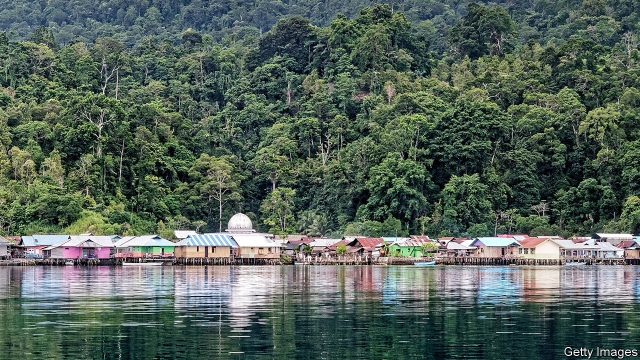
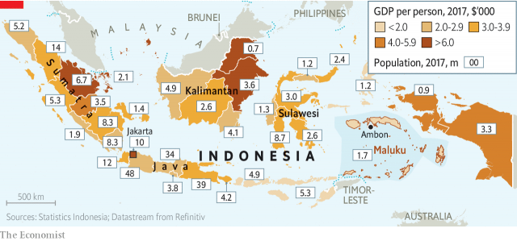

###### Outer-island views

# In remote parts of Indonesia, voters feel let down 

##### National politicians ignore them and local ones deceive them 

 

> Mar 14th 2019 

THE MAIN market in Ambon, the capital of the Indonesian province of Maluku, is a riotous affair. Stalls sprawl from the pavement into the road. Shouting over the screech and rattle of traffic, vendors and customers haggle over bags of spices and fresh-cut bunches of bananas. The smell of durians and barbecued fish hangs in the air. Amid the hubbub, a group of vendors finds time to talk politics. They hold a dim view of their leaders in Jakarta, Indonesia’s distant capital, insisting that their lives are never improved by new policies. “The central government does not really think about us,” says one. “It just does whatever people in the west think.” 

By “the west”, she means the islands of Java and Sumatra, which together are home to more than three-quarters of Indonesians (see map). The rest are spread across a further 13,000 or so islands. On April 17th 190m voters across the archipelago will head to the polls to pick a president as well as national and regional legislatures. Because national politicians naturally lavish attention on the most populous places, people in the far-flung corners of the country often feel neglected. 

Maluku is a good example. It is sparsely populated, with less than 2m of the country’s 265m people. It is also remote—some 2,400km from Jakarta. Small wonder national politicians rarely visit. That peeves Moluccans, giving them the sense that their problems are not understood by those in power in Jakarta. Olivia Latuconsina, a candidate for the local parliament, points out that Maluku consists of more than 1,400 islands. That makes building infrastructure and delivering public services much more expensive than on Java. But this cost is not reflected in the central government’s transfers to the regions. 

 

Poor public services, partly due to meagre funding, amplify resentment. In remote bits of Maluku schools lack textbooks and classrooms; teachers are often anyone from the village with a high-school diploma. On some islands locals have to get in a boat even to collect fresh water. Moluccans are aghast when they see photos of Jakarta’s highways and high-rises. “We are being left behind,” laments Iqbal Kumkelo, a student. 

Almost a fifth of Moluccans live below the poverty line of $28 a month, twice the national average. GDP per person in the province is about $1,700, on a par with Congo. In Jakarta it is ten times higher, similar to Poland’s. Last year three villagers in a remote part of the province died of starvation before the government could send aid, after rodents ate their crops. 

In theory a strong local government should help counter the sense of disenfranchisement. In 1999 Indonesia started a process of decentralisation, partly to sap support for the country’s various separatist movements, including a largely dormant one in Maluku. Provincial and local governments have accrued ever more powers. They now account for half of all government spending. 

But many in Maluku have lost trust in local politicians, citing broken promises. Ido, a fisherman, complains that a lending scheme announced by the local mayor never got off the ground. Roly, another fisherman, says local officials only distribute handouts from the central government to their friends and relatives. One well-connected farmer was given free fishing equipment, which lies unused in his field. 

Nonetheless, Moluccans seem determined to vote. Students, businessmen, fishermen and street vendors all proudly say that it is their duty to participate, no matter how disillusioned they feel. And the province is refreshingly free of identity politics. Most Indonesians are Muslims. Elections often become contests of piety rather than policy. Smear campaigns have accused Joko Widodo, the president, who is running for re-election, of being a closet Christian. Maluku, where two-fifths of people are Christian, suffered a paroxysm of religious violence from 1999 to 2002. More than 5,000 people died. 

Those horrors have made Moluccans particularly wary of attempts to capitalise on divisions between Christians and Muslims. Two of the local candidates for PAN, an Islamic party, are Protestant. A Muslim student group recently helped paint a new church near their university. “We are united, just like brothers and sisters,” says Max Hallussy, a local priest. It is a unity forged in adversity. 

-- 

 单词注释:

1.Indonesia[.indәu'ni:ʒә]:n. 印尼 

2.voter['vәutә]:n. 选民, 投票人 [法] 选民, 选举人, 投票人 

3.ambon[]:[医] 关节盂缘 

4.Indonesian[.indәu'ni:ʒәn]:a. 印尼的 n. 印尼人, 印尼语群 

5.Maluku[mɑ:'lu:ku:]:马鲁古群岛 

6.riotous['raiәtәs]:a. 引起骚扰的, 暴乱的, 放荡的 

7.stall[stɒ:l]:n. 厩, 停车处, 牧师职位, 货摊, 托辞, 拖延 vt. 关入厩, 停顿, 推托, 支吾, 使陷于泥中 vi. 被关在厩内, 陷于泥中, 停止, 支吾 

8.sprawl[sprɒ:l]:vi. 伸开手足躺, 爬行, 蔓生, 蔓延 vt. 懒散地伸开, 使蔓生, 使不规则地伸展 n. 伸开手足躺卧姿势 

9.screech[skri:tʃ]:n. 尖声喊叫, 尖叫声, 煞车声 vt. 尖声讲 vi. 发出尖声 

10.rattle['rætl]:vt. 使嘎嘎响, 喋喋不休地说 vi. 格格响, 喋喋不休 n. 格格声, 拨浪鼓, 喋喋不休的话 

11.vendor['vendә]:n. 小贩, 卖主, 自动售货机 [计] 计算机销售商 

12.haggle[hægl]:vi. 争论, 杀价 vt. 乱砍, 乱劈 n. 杀价, 讨论, 争论 

13.spice[spais]:n. 香料, 药料, 香气, 调味品, 情趣, 少许 vt. 加香料, 使添趣味 

14.durian['du:riәn]:[植](马来群岛产的)榴莲果, 榴莲树 

15.amid[ә'mid]:prep. 在其间, 在其中 [经] 在...中 

16.hubbub['hʌbʌb]:n. 吵闹声, 叫嚷声, 混乱 

17.politic['pɒlitik]:a. 精明的, 明智的, 策略的 

18.jakarta[dʒә'kɑ:tә]:n. 雅加达（印尼首都, 等于Djakarta） 

19.Java['dʒɑ:vә]:n. 爪哇, 爪哇咖啡 [计] Java 程序设计语言 

20.sumatra[su'mɑ:trә]:n. 苏门答腊岛（印尼西部的大岛） 

21.Indonesian[.indәu'ni:ʒәn]:a. 印尼的 n. 印尼人, 印尼语群 

22.archipelago[.ɑ:ki'pelәgәu]:n. 群岛, 多岛屿的海 

23.regional['ri:dʒәnәl]:a. 地方的, 地域性的 [医] 区的, 部位的 

24.legislature['ledʒisleitʃә]:n. 立法机关, 议会, 立法院 [法] 立法机构, 立法机关 

25.lavish['læviʃ]:a. 大方的, 丰富的, 浪费的 vt. 浪费, 滥用, 慷慨给予 

26.populous['pɒpjulәs]:a. 人口多的, 人口稠密的 

27.sparsely[spɑ:slɪ]:adv. 稀疏地; 稀少地; 不足地; 贫乏地 

28.populate['pɔpjuleit]:vt. 使人口聚居在...中, 殖民于, 移民于, 居住于, 定居于 

29.les[lei]:abbr. 发射脱离系统（Launch Escape System） 

30.peeve[pi:v]:v. (使)气恼, (使)焦躁, (使)忿怒 n. 麻烦的事物, 怨恨, 生气, 触怒 

31.Moluccan[mәu'lʌkәn]:摩鹿加群岛的, 摩鹿加居民[语言]的 

32.olivia['ɔliviә]:n. 奥利维亚（女子名） 

33.infrastructure['infrәstrʌktʃә]:n. 基础结构, 基础设施 [经] 基础设施 

34.meagre['mi:^ә(r)]:a. 瘦的, 不毛的, 贫乏的, 贫弱的, 少量的, 力量不够的, 质不高的, 量不足的 

35.resentment[ri'zentmәnt]:n. 怨恨, 愤恨 

36.aghast[ә'gɑ:st]:a. 惊骇的, 吓呆的 

37.lament[lә'ment]:n. 悲叹, 悔恨, 恸哭, 挽歌, 悼词 vt. 哀悼 vi. 悔恨, 悲叹 

38.Iqbal[]:n. 伊克巴尔（姓氏）；孩子的天空（电影名） 

39.par[pɑ:]:n. 标准, 票面价值, 平均数量, 同等水平 a. 票面的, 平常的, 标准的, 平价的 [计] 重新传输的肯定回答 

40.Congo['kɔŋ^әu]:n. 刚果, 刚果河, 工夫茶 [建] 刚果, 直接刚果红 

41.rodent['rәudәnt]:a. 咬的, 啮齿类的 n. 啮齿动物 

42.disenfranchisement[]:[法] 剥夺公民权, 剥夺选举权, 剥夺特权 

43.decentralisation[di:,sentrәlai'zeiʃən]:n. <主英>=decentralization 

44.sap[sæp]:n. 树液, 体液, 活力, 坑道, 消弱, 警棍 vt. 使排出体液, 使伤元气, 使衰竭, 挖坑道逼近, 逐渐侵蚀 vi. 挖坑道, 消弱 [计] 共享汇编程序, 结构分析程序, 符号汇编程序, 服务器广告协议 

45.separatist['sepәreitist]:n. 分离主义者, 独立派 

46.dormant['dɒ:mәnt]:a. 睡眠状态的, 静止的 [医] 休眠的, 不活动的, 休止的 

47.provincial[prә'vinʃәl]:n. 外地人, 粗野的人 a. 省的, 外地的, 偏狭的 

48.accrue[ә'kru:]:vi. 自然增加, 产生 [经] 应计, 产生, 出现 

49.cite[sait]:vt. 引用, 引证, 表彰 [建] 引证, 指引 

50.ido['i:dәu]:abbr. （联合国）工业开发组织（Industrial Development Organization） 

51.roly[]:[网络] 全威国际；灆；御颜堂 

52.handout['hændaut]:n. 施舍物, 救济品, 分发的印刷品资料, 广告物品 

53.unused[.ʌn'ju:zd]:a. 不用的, 不在使用的, 从未用过的 

54.nonetheless[,nʌnðә'les]:conj. 然而, 尽管, 不过 adv. 不过, 仍然, 尽管如此, 然而 

55.proudly['praudli]:adv. 傲慢地, 自大地, 得意洋洋地 

56.disillusion[.disi'lu:ʒәn]:n. 觉醒, 幻灭 vt. 使醒悟, 使幻想破灭 

57.refreshingly[rɪ'freʃɪŋlɪ]:adv. 清爽地, 有精神地 

58.Muslim['mjzlim; (?@) 'mʌzlem]:n. 伊斯兰教, 伊斯兰教教徒 

59.piety['paiәti]:n. 虔诚, 孝敬, 虔诚的行为 

60.smear[smiә]:vt. 涂, 擦上, 玷污, 把...擦模糊 vi. 被弄脏 n. 污点, 污迹, 污蔑 

61.Joko[]:[网络] 佐戈；上甲；彩绘阿祥 

62.widodo[]:[网络] 阿斯 

63.closet['klɒzit]:n. 壁橱, 小室 a. 秘密的, 空谈的 vt. 把...关入小室 

64.paroxysm['pærәksizәm]:n. 发作, 突发 [医] 发作, 阵发 

65.wary['wєәri]:a. 谨慎的, 小心的, 机警的, 周到的, 唯恐的 

66.capitalise['kæpitәlaiz]:vt. 用大写字母写, 用大写字母印, 投资于, 使变为资本, 提供资本给 vi. 利用 

67.Islamic[iz'læmik]:a. 伊斯兰教的, 穆斯林的 

68.Protestant['prɒtistәnt]:n. 新教徒 a. 新教的, 新教徒的 

69.Muslim['mjzlim; (?@) 'mʌzlem]:n. 伊斯兰教, 伊斯兰教教徒 

70.MAX[mæks]:[计] 最大 

71.forge[fɒ:dʒ]:n. 熔炉, 铁工厂 vt. 打制, 锻造, 伪造 vi. 锻造, 伪造 

72.adversity[әd'vә:sәti]:n. 逆境, 不幸, 灾祸, 灾难 

