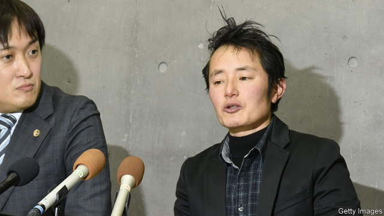

###### The unkindest cut

# Japan says transgender people must be sterilised 

##### Some European countries used to insist on this, too 

 

> Mar 14th 2019 

SHOULD TRANSGENDER people be sterilised before they are recognised? Earlier this year Japan’s Supreme Court decided that the answer is yes. Takakito Usui, a transgender man (ie, someone who was born female but identifies as male), had sued over a requirement that, to be officially designated a man, he has to have his ovaries and uterus removed (as well as have surgery to make his genitals look male, be over 20, single, have no minor children and have been diagnosed as suffering from “gender-identity disorder”). He argued that all this violated his right to self-determination and was therefore unconstitutional. The court disagreed. 

Human-rights groups say demanding irreversible surgery is outrageous. Although several Asian countries, including South Korea, have similar laws, Western countries that once also used to require sterilisation, such as Norway, France and Sweden, no longer do. In 2017 the European Court of Human Rights called for the change in all 47 countries under its jurisdiction. Sweden has started to compensate transgender people who underwent mandatory sterilisation. 

Critics of Japan’s laws also reject the notion that transgender people are suffering from a psychological disorder. “The movement here has not been viewed as about rights but more about helping sick people overcome their illness,” says Junko Mitsuhashi, a professor and campaigner who studies the history of transgender issues. She is also a transgender woman who has not gained legal recognition for her gender, having been unwilling to undergo massively invasive surgery. 

Japanese courts often seem more concerned with maintaining social harmony than defending individual rights. In its ruling, the court said that the law was intended to avoid “confusion” and “abrupt change” to society. Yukari Ishii, a researcher at Toyo University in Tokyo, says that whereas in America and Europe long campaigns for gay rights paved the way for transgender people to call for more equitable treatment, Japan is further behind. Japanese society is patriarchal and retains strong gender stereotypes, she says. 

Change is coming, however. The court in Mr Usui’s case did acknowledge that the law may need to evolve as society does. Polls suggest that Japan is becoming more liberal on many social issues. Over 70% of respondents to a survey in January said they were in favour of stronger legal protections for gay or transgender people. Almost no Japanese ground their objections to such rights in religion, as people often do in other countries. 

In recent years a handful of Japanese towns and cities have introduced partnership certificates for same-sex couples. Some have gender-neutral bathrooms. A small number of firms are trying to be more welcoming to transgender people, as well as offering benefits to same-sex partners. Ms Mitsuhashi says she has had no problems at her university (in contrast, when she first came out as transgender, one of her employers at the time fired her). Nonetheless, Japan needs to be much readier to accept diversity in general, says Ms Ishii. The country can be donkan—“thick-headed”—about where the world is going, says Ms Mitsuhashi. 

-- 

 单词注释:

1.unkindest[]:a. 不够和善的, 残酷的, 欠考虑的( unkind的最高级 ) 

2.transgender[trænzˈdʒendə(r)]:n. 变性人 

3.sterilise['sterɪlaɪz]:vt. 使无用; 使无菌; 使绝育; 使贫瘠化 

4.transgender[trænzˈdʒendə(r)]:n. 变性人 

5.usui[]: [地名] [日本] 碓水 

6.sue[su:]:vt. 控告, 起诉, 请求 vi. 提出诉讼, 提出请求 

7.officially[ә'fiʃәli]:adv. 作为公务员, 职务上, 官方地 

8.designate['dezigneit]:vt. 指定, 指明, 称呼 a. 已选出而未上任的 

9.ovary['әuvәri]:n. 卵巢, 子房, 果核 [医] 卵巢, 子房 

10.uterus['ju:tәrәs]:n. 子宫 [医] 子宫 

11.genital['dʒenitl]:a. 生殖的 [医] 生殖的, 生殖器的 

12.diagnose['daiәgnәuz]:v. 诊断 

13.unconstitutional['ʌnkɔnsti'tju:ʃәnәl]:a. 违反宪法的, 不符合宪法的 [法] 违反宪法的, 违宪的, 不合宪法规定的 

14.irreversible[,iri'vә:sәbl,-sib-]:a. 不可逆的, 不可改变的, 不能倒置的, 不能翻转的, 不能倒转的, 不可撤销的 [计] 不可逆的 

15.outrageous[aut'reidʒәs]:a. 暴虐的, 极无礼的, 可恶的 

16.Korea[kә'riә]:n. 朝鲜, 韩国 

17.sterilisation[ˌsterɪlaɪ'zeɪʃən]: [医]绝育, 消毒, 灭菌 

18.Norway['nɒ:wei]:n. 挪威 

19.Sweden['swi:dn]:n. 瑞典 

20.jurisdiction[.dʒuәris'dikʃәn]:n. 司法权, 审判权, 管辖权 [经] 法律管辖权, 审判权 

21.mandatory['mændәtәri]:a. 命令的, 托管的 [经] 受托者, 命令者 

22.junko[]:n. (Junko)人名；(日)顺子；(英)琼科 

23.campaigner[kæm'peinә]:n. 从军者, 老兵, 竞选者 

24.gender['dʒendә]:n. 性 vt. 产生 

25.massively[]:adv. 大而重, 厚实, 粗大, 强有力, 结实, 魁伟, 大块, 大量, 大规模, 实心, 块状 [计] 大规模地 

26.invasive[in'veisiv]:a. 侵入的, 侵略性的, 攻击性的 

27.Yukari[]:[网络] 香里；加里；由香里就读做 

28.ishii[]:[网络] 石井；石井光；石井章 

29.toyo[]:n. 日本东洋 

30.equitable['ekwitәbl]:a. 公平的, 公正的 [法] 公平的, 公正的, 平衡法的 

31.patriarchal[.peitri'ɑ:kәl]:a. 家长的, 族长的, 由族长统治的 [法] 家长的, 家长制的, 主教的 

32.stereotype['stiәriәtaip]:n. 铅版, 陈规, 老套 vt. 使用铅版, 把...印制成盲文, 套用老套, 使一成不变 

33.respondent[ri'spɒndәnt]:a. 回答的, 应答的, 反射的 n. 应答者, 被告 

34.partnership['pɑ:tnәʃip]:n. 合伙, 合股, 合作关系 [经] 合伙(合作)关系, 全体合伙人 

35.nonetheless[,nʌnðә'les]:conj. 然而, 尽管, 不过 adv. 不过, 仍然, 尽管如此, 然而 

36.diversity[dai'vә:siti]:n. 差异, 多样性 [化] 多样性 

