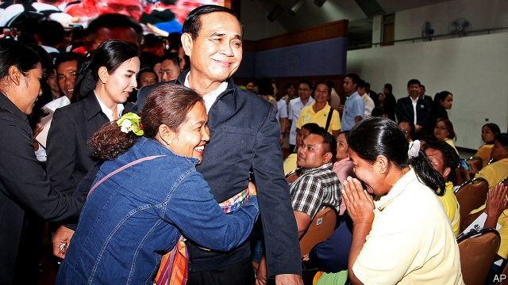

###### All for show

# Thailand’s generals plan to remain in charge, whatever voters say 

##### Their rigging of the system makes this month’s election a sham 

 

> Mar 14th 2019 

“WE WILL TAKE good care of the price of rice in the market,” declares Uttama Savanayana, the leader of the Palang Pracharat party, to a sweating crowd of farmers in Thailand’s north-east. The party, which supports the ruling military regime and is staffed by several of its former ministers, such as Mr Uttama, was founded last year. It will carry the flag for the junta in a national election on March 24th. The generals, having supposedly put an end to the instability they cited to justify taking power five years ago, are now purporting to return power to the people. It is ironic that the chief failing of the government the generals ousted, according to the courts, was to cause losses to the state by intervening in the rice market. But this seems lost on Mr Uttama. Then again, his party also does not seem to see the irony in naming as its candidate to lead a restored democratic government the man who overthrew the previous one, Prayuth Chan-ocha, the junta’s leader and the current prime minister. 

The election is the first since 2011 (a partially boycotted one in 2014 was invalidated) and many Thais are delighted at the chance to vote. Roughly 7m are eligible to do so for the first time. Turnout may be as high as 80%. Dozens of parties and thousands of candidates are running. They fall roughly into three camps: those who support the generals and their attempts to retain power; those who abhor the regime and are pushing for greater democratic freedom; and fence-sitters. 

The three camps reflect deeper divisions. For the past 13 years royalist elites and military types, known as “yellow shirts”, have feuded with those keener on electoral democracy, known as “red shirts”. Thaksin Shinawatra, a populist former prime minister who has lived in exile since being ousted in a coup in 2006, is the figurehead for the reds. Parties linked to him have won every election since 2001. So the junta has designed an electoral system to thwart him. 

The new parliament will consist of a 250-seat Senate and a 500-seat House of Representatives. The entire Senate will be appointed by the junta. The prime minister, who does not need to be a member of parliament, will be selected by a joint sitting of the two houses. That means that Mr Prayuth (pictured), with the Senate in the bag, would require just 126 supporters in the house to keep his job. 

To foil Pheu Thai, Mr Thaksin’s main political party, and help the likes of Palang Pracharat, the government has introduced a contorted, partly proportional voting system that favours smaller parties. Only 350 seats will go to the winner of the vote in each constituency. Votes for losing candidates will be used to allocate the 150 party-list seats. According to Prajak Kongkirati of Thammasat University in Bangkok, if Pheu Thai wins the same share of the constituency vote as it did in 2011, it will receive 41 fewer seats. 

The generals have other tools at their disposal, too. Section 44 of the interim constitution that they promulgated shortly after seizing power allows them to do almost anything in the name of protecting the monarchy, national security, public order and other worthy causes. It will cease to apply only once a new cabinet is installed, after the election. A harsh cyber-security law allows the government to monitor online traffic in the event of “an emergency”. A proliferation of obscure rules surrounds campaigning. Doling out any sort of gift to supporters is prohibited. So is mentioning the monarchy. The single placard allowed to be posted at each party office cannot exceed 4 metres by 7.5 metres. On social media, posts with anything other than candidates’ names, pictures and biographies, and the party’s name, logo, policies and slogans are banned. 

Politicians fear that minor violations of these rules may result in disqualification or other punishments from the Election Commission, before or after the election. It can dole out “yellow cards”, which require a new ballot in the constituency concerned, or “red cards”, which require a re-run without the offending candidate. 

The constitutional court, at the commission’s recommendation, has already dissolved another party favourable to Mr Thaksin, Thai Raksa Chart, and banned its leaders from politics for a decade. The court said that, by naming a princess as its preferred candidate for prime minister, the party had shown itself to be hostile to democracy, even though the move was not against the law and Thailand has had prime ministers of royal descent in the past. This is the third time a party linked to Mr Thaksin has been banned. Thai Raksa Chart was fielding candidates in 100 constituencies. They have all been struck from the ballot. 

They are not the only opponents of the junta to face legal troubles. On March 21st the attorney-general will announce whether he intends to charge two candidates for Pheu Thai and a senior member of Thai Raksa Chart with sedition, for attempting to hold a press conference last year to discuss the regime’s failings. Three members of Future Forward, a popular new party, including its leader, Thanathorn Juangroongruangkit, were charged with computer crimes last month. They apparently “uploaded false information” during Facebook live sessions last year when they stated, truthfully, that the junta had been poaching MPs from other parties. 

The junta’s assiduous efforts to manipulate the election have led it to neglect much else. For a regime with almost unlimited powers, it has got little done. Although it has promised lots of new infrastructure, not much has materialised. Meanwhile it has neglected even bigger drags on the economy, such as the sorry state of the education system. Growth has been relatively stable since the last coup, but lower than in Mr Thaksin’s heyday. The poorest two-fifths of Thais have seen their incomes drop. Farmers reminisce about the far higher prices of commodities such as rubber and rice under Mr Thaksin’s leadership; the most recent data from the national statistics service show farm debt rising from 2.4trn baht ($67bn) in 2016 to 2.8trn baht the following year. 

Palang Pracharat loudly touts the welfare cards the junta has introduced, which provide a small monthly stipend to be spent on subsidised goods at designated shops. More than 14m of them have been handed out to the poorest Thais. At a rally for the party in a huge auditorium at Ubon Ratchathani University, Thongpan Puangpua says she is there because of her card, “even if it is a bit complicated to use”. She used to support Pheu Thai. The party also promises more help for expectant mothers and those with young children, as well as three years of relief from debt repayments, subsidies for rice farmers and other goodies. Mainly, however, it pledges stability and continuity. 

When they are not simply bashing the junta, Pheu Thai’s candidates try to lure voters with similar handouts. They say they will improve the welfare-card scheme, and promise debt relief and subsidies for farmers as well as a big cut in military spending. Sudarat Keyuraphan, a former health minister under Mr Thaksin, is its most prominent leader. She is the main attraction at the party’s bustling rallies in Isaan, the north-eastern region that elects more MPs than any other part of the country. But the gatherings are not as crammed as they were eight years ago, says Titipol Phakdeewanich, a local academic. One party insider worries that its standard-bearers are not popular enough to secure yet another election victory. 

Analysts agree, assuming that Pheu Thai will remain the biggest party but not win enough seats to overturn Mr Prayuth’s built-in advantage. Even with the support of other parties at odds with the junta, such as Future Forward, Pheu Thai will struggle to muster the 376 seats to form a government. However, analysts also project that Palang Pracharat will fall short of the 126 seats Mr Prayuth needs to remain prime minister. That means he will have to win over some smaller parties or strike a deal with the Democrats, who may emerge as the second-biggest party. They are yellow shirts, broadly speaking, but the party’s leader, Abhisit Vejjajiva, says Mr Prayuth should not stay on as prime minister. 

Given that the Election Commission has 60 days before it must announce the official results, there will be plenty of time for the generals to secure the outcome they want. King Vajiralongkorn’s glitzy coronation ceremony will probably occur in the midst of it all, distracting the public from unseemly goings-on. But if Mr Prayuth has to knock heads to keep his job, his new government is likely to be even less effective than the current one. He may not need a majority among elected MPs to become prime minister, but he will need one to pass legislation. “I’m only half confident in this election,” confides a farmer watching Mr Uttama speak in Isaan. She is being extremely generous. 

-- 

 单词注释:

1.voter['vәutә]:n. 选民, 投票人 [法] 选民, 选举人, 投票人 

2.rig[rig]:n. 装备, 帆装 vt. 装配, 装扮, 给船装帆, 垄断, 操纵 

3.sham[ʃæm]:n. 假, 赝品, 骗子, 哄骗 a. 假的, 伪造的 vt. 假装, 冒充 vi. 装假 

4.palang[]:[网络] 巴冷刀；崩龙人 

5.regime[rei'ʒi:m]:n. 政权, 当权期间, 政体, 社会制度, 体制, 情态 [医] 制度, 生活制度 

6.junta['dʒʌntә]:n. 以武力政变上台的(军)政府, 私党, 阴谋小集团, 政务会 

7.supposedly[sә'pәuzidli]:adv. 想象上, 看上去像, 被认为是, 恐怕, 按照推测 

8.instability[.instә'biliti]:n. 不安定, 不稳定 [医] 不稳定性 

9.cite[sait]:vt. 引用, 引证, 表彰 [建] 引证, 指引 

10.purport['pә:pɒ:t]:n. 意义, 要旨, 目的 vt. 意味着, 声称, 打算 

11.ironic[aiә'rɔnik]:a. 冷嘲的, 挖苦的, 反话的, 讽刺的, 令人啼笑皆非的, 出乎意料的 

12.oust[aust]:vt. 逐出, 罢黜, 剥夺, 驱逐 [法] 驱逐, 剥夺, 免职 

13.intervene[.intә'vi:n]:vi. 插入, 调停, 干涉 [经] 进场干预 

14.irony['aiәrәni]:n. 反语, 讽刺, 具有讽刺意味的事 

15.overthrow[.әuvә'θrәu]:n. 推翻, 瓦解, 倾覆 vt. 打倒, 推翻, 倾覆 

16.Prayuth[]:[网络] 巴狱 

17.invalidate[in'vælideit]:vt. 使无效 [法] 使无效, 使无效力, 使作废 

18.Thai[tai]:n. 泰国人, 泰语 

19.eligible['elidʒәbl]:a. 有资格当选的, 合格的 n. 有资格者, 合格者, 适任者 

20.turnout['tә:naut]:n. 聚集的人群, 出席者, 产量 [化] 输出; 产额 

21.abhor[әb'hɒ:]:vt. 憎恶, 痛恨, 回避, 拒绝 

22.royalist['rɒiәlist]:n. 保皇党员, 顽固分子 a. 保皇党的 

23.elite[ei'li:t]:n. 精华, 精锐, 中坚分子 

24.feud[fju:d]:n. 不和, 封地, 争执 vi. 长期不和, 擦亮 

25.electoral[i'lektәrәl]:a. 选举人的, 选举的, (有关)选举的 [法] 选举的, 选举人的, 由选举人组成的 

26.thaksin[]: 塔克辛; 塔辛（人名） 

27.shinawatra[]:[网络] 西那瓦；那越；钦那瓦 

28.Populist['pɔpjulist]:n. 民粹派的成员 

29.exile['eksail]:n. 放逐, 流放, 被放逐者 vt. 放逐, 流放, 使背井离乡 

30.coup['ku:]:n. 砰然的一击, 妙计, 出乎意料的行动, 政变 [医] 发作, 中, 击 

31.figurehead['figәhed]:n. 装饰船头的人像, 傀儡领袖 

32.thwart[θwɒ:t]:a. 横放的 vt. 反对, 阻挠, 横过 prep. 横过 adv. 横过 

33.supporter[sә'pɒ:tә]:n. 支持者, 后盾, 迫随者, 护身织物 [法] 支持者, 赡养者, 抚养者 

34.foil[fɒil]:n. 箔, 烘托, 衬托 vt. 贴箔于, 衬托, 阻止, 挡开, 挫败 

35.Thai[tai]:n. 泰国人, 泰语 

36.contort[kәn'tɒ:t]:vt. 扭弯, 曲解 vi. 扭弯 

37.constituency[kәn'stitjuәnsi]:n. 选民, 顾客, 读者 [法] 选区, 全体选民, 选区内的选民 

38.Bangkok['bæŋkɒk]:n. 曼谷 

39.interim['intәrim]:a. 暂时的, 临时的, 间歇的 n. 过渡时期 

40.promulgate[prә'mʌlgeit]:vt. 发布, 公布, 发表, 传播 [法] 颁布, 公告, 散播 

41.monarchy['mɒnәki]:n. 君主政体, 君主国, 君主政治 [法] 君主政体, 君主制度, 君主国 

42.online[]:[计] 联机 

43.proliferation[.prәulifә'reiʃәn]:n. 增殖, 激增 [医] 增生, 增殖 

44.dole[dәul]:n. 救济品, 失业救济金 vt. 发放救济 

45.placard['plækɑ:d]:n. 公告, 布告, 小牌, 海报 vt. 公布, 布告, 张帖, 贴海报于 

46.cannot['kænɒt]:aux. 无法, 不能 

47.logo['lәugәu]:n. 连合活字, 商标, 徽标 [计] 徽标 

48.violation[.vaiә'leiʃәn]:n. 违反, 违背, 妨碍 [法] 违犯, 违背, 违反 

49.disqualification[dis,kwɔlifi'keiʃәn]:n. 不适合, 剥夺资格, 不合格, 无资格 [法] 无资格, 不合格, 取消资格 

50.ballot['bælәt]:n. 投票, 投票用纸, 抽签 vi. 投票, 抽签 vt. 投票选出, 拉选票 

51.constitutional[.kɒnsti'tju:ʃәnl]:a. 宪法的, 立宪的, 体质的 [医] 全身的; 体质的 

52.politic['pɒlitik]:a. 精明的, 明智的, 策略的 

53.Thailand['tailәnd]:n. 泰国 

54.descent[di'sent]:n. 降落, 家系, 侵袭, 血统 [医] 下降, 世代, 血统 

55.sedition[si'diʃәn]:n. 煽动骚乱, 暴动, 妨害治安, 骚动 [法] 煽动, 煽动叛逆罪, 暴动 

56.failing['feiliŋ]:n. 失败, 缺点 prep. 如果没有... a. 失败的 

57.apparently[ә'pærәntli]:adv. 表面上, 清楚地, 显然地 

58.upload['ʌp,lәud]:[计] 上装, 加载, 储入 

59.facebook[]:n. 脸谱网 

60.truthfully[]:adv. 诚实地；深信不疑地 

61.poach[pәutʃ]:vt. 水煮(蛋), 偷猎, 侵入, 窃取 vi. 偷猎, 陷入泥中 

62.MP[]:国会议员, 下院议员 [计] 宏处理程序, 维护程序, 线性规划, 微程序, 多处理器 

63.assiduous[ә'sidjuәs]:a. 勤勉的, 刻苦的 

64.manipulate[mә'nipjuleit]:vt. 操纵, 利用, 操作, 巧妙地处理, 假造 

65.unlimited[.ʌn'limitid]:a. 无限的, 不受限制的, 无条件的 [经] 无限的, 不定的 

66.infrastructure['infrәstrʌktʃә]:n. 基础结构, 基础设施 [经] 基础设施 

67.materialise[mә'tiәriәlaiz]:vi.vt. (使)物质化, (使)具体化, (使)追求物质利益, (使)显形, 成为事实, 实现 vi. 突然出现 

68.heyday['heidei]:n. 全盛期 interj. 嘿 

69.reminisce[.remi'nis]:vt. 追忆说 vi. 追忆往事, 话旧 

70.commodity[kә'mɒditi]:n. 农产品, 商品, 有用的物品 [经] 商品, 货物, 日用品 

71.datum['deitәm]:n. 论据, 材料, 资料, 已知数 [医] 材料, 资料, 论据 

72.statistic[stә'tistik]:n. 统计量 a. 统计的, 统计学的 

73.baht[bɑ:t]:n. 铢(泰国货币单位) 

74.tout[taut]:vi. 招徕顾客, 兜售物品 vt. 招徕, 刺探...情报 n. 兜售者, 侦查者 

75.stipend['staipend]:n. 薪金, 定期生活津贴 [经] 薪水 

76.subsidise[]:vt. 给...补助金, 津贴, 资助 

77.designate['dezigneit]:vt. 指定, 指明, 称呼 a. 已选出而未上任的 

78.rally['ræli]:n. 重振旗鼓, 集合, 群众集会, 跌停回升 v. 重整旗鼓, 集合, 恢复精神, 团结, 挖苦, 嘲笑 

79.auditorium[.ɒ:di'tɒ:riәm]:n. 听众席, 礼堂 [医] 大讲堂, 大会堂 

80.Ubon[j'bʌn,,u:'bɔ:n]:乌汶[泰国东部城市] 

81.expectant[iks'pektәnt]:n. 预期者, 期待者, 候选人 a. 预期的, 期待的 

82.repayment[ri'peimәnt]:n. 付还, 偿还, 报复, 付还的钱 [经] 偿还, 付还 

83.goody['gudi:]:n. 身分低微之老妇, 糖果, 姥姥 a. 感伤的, 伪善的 interj. 太好了 

84.pledge[pledʒ]:n. 诺言, 保证, 誓言, 抵押, 信物, 保人, 祝愿 vt. 许诺, 保证, 使发誓, 抵押, 典当, 举杯祝...健康 

85.continuity[.kɒnti'nju:iti]:n. 连续性 [化] 连续性 

86.bash[bæʃ]:v. 猛击, 打坏 n. 猛撞, 猛击 

87.lure[luә]:n. 饵, 诱惑 vt. 引诱, 诱惑 

88.handout['hændaut]:n. 施舍物, 救济品, 分发的印刷品资料, 广告物品 

89.bustle['bʌsl]:n. 喧闹, 裙撑 vi. 奔忙, 喧闹 vt. 使忙碌, 催促 

90.gathering['gæðәriŋ]:n. 聚集, 集中, 采集 [化] 富集 

91.cram[kræm]:vt. 塞满, 填满, 猛吃 vi. 贪吃 n. 极度拥挤, 死记硬背 

92.insider['in'saidә]:n. 内部的人, 权威人士, 知道内情的人 [经] 熟悉内情者 

93.analyst['ænәlist]:n. 分析者, 精神分析学家 [化] 分析员; 化验员 

94.overturn[.әuvә'tә:n]:n. 倾覆, 破灭, 革命 vt. 推翻, 颠倒 vi. 翻倒 

95.odds[ɒdz]:n. 可能性, 几率, 机会, 胜算, 不平等 

96.muster['mʌstә]:n. 召集, 集合, 检阅, 清单, 花名册, 样品 vt. 召集, 集合, 应召 vi. 集合, 集中 

97.democrat['demәkræt]:n. 民主人士, 民主主义者, 民主党党员 [经] 民主党 

98.broadly['brɒ:dli]:adv. 宽广地, 明白地, 无礼貌地 

99.abhisit[]:[网络] 阿披习；阿比西 

100.vejjajiva[]:维乍集瓦 

101.glitzy['^litsi]:a. <美><加> 闪光的, 耀眼的, 眩目的 

102.coronation[.kɔ:rә'neiʃәn]:n. 加冕礼 

103.distract[dis'trækt]:vt. 转移, 分心, 使发狂 

104.unseemly[.ʌn'si:mli]:a. 不合适的, 不适宜的, 不得体的 

105.les[lei]:abbr. 发射脱离系统（Launch Escape System） 

106.confide[kәn'faid]:vt. 吐露, 委托 vi. 信赖 

