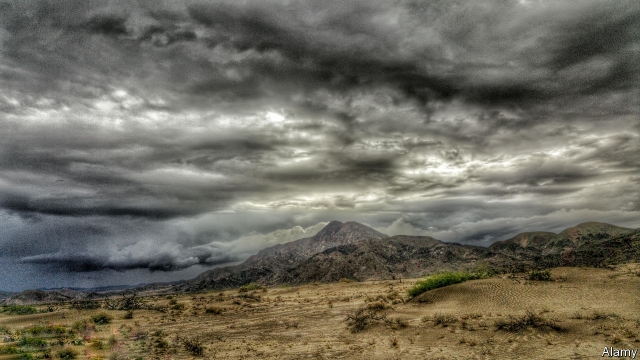

###### Desert storms

# A mystery in the Mojave 

##### In Laila Lalami’s new novel, a father dies and a daughter returns home 

 

> Mar 14th 2019 

The Other Americans. By Laila Lalami.Pantheon; 320 pages; $25.95. Bloomsbury Circus; £16.99. 

LAILA LALAMI’S debut novel, “Hope and Other Dangerous Pursuits”, charted the plight of four desperate Moroccans who attempt to flee their country and cross the Strait of Gibraltar in search of a better life. In “The Moor’s Account” she gave voice to a real-life Moroccan slave who accompanied a Spanish conquistador on a disastrous expedition to the modern-day Gulf coast of the United States. In both books, characters learned the hard way that it is better to travel in hope than to arrive. 

Ms Lalami’s latest novel, “The Other Americans”, revolves around a Moroccan family who are not travellers but long-term settlers. Nora Guerraoui, a young jazz composer, receives a call in Oakland informing her that her father, Driss, has been killed by a speeding car. She returns to her childhood home-town in the Mojave desert to join her mother Maryam and follow the police investigation. Was the death a tragic accident or a premeditated killing? 

The story unfolds from multiple perspectives. Maryam reflects on the life she left in Casablanca, the culture shock of California and her fragmented family: “We were like a thrift-store tea set, there was always one piece missing.” Efraín, a Mexican eyewitness, is reluctant to give evidence because he lacks papers. Coleman, a detective, is as keen to solve her first homicide in town as to decipher her son’s mood swings. 

Two main characters emerge from the ensemble: Nora and her former classmate Jeremy, now a veteran of the Iraq war. As a romance develops between them, he comforts her through her grief and she helps him cope with his trauma. The narrative opens out to become a tender love story, a family drama and a gripping mystery. 

When Ms Lalami brings in other minor characters and relays their versions of events, she loses momentum and the book becomes episodic. But she recovers the pace to orchestrate a charged denouement in which secrets are shared, loyalties tested and fates hang in the balance. The result is a powerful novel of intolerance and compassion, resilience and weakness, love and loss, populated by flawed but sympathetic characters whose lives are rocked by actions and emotions beyond their control. It turns out that this family’s journey was not quite finished, after all. 

-- 

 单词注释:

1.Mojave[mәj'hɑ:vi]:n. 莫哈韦沙漠(在美国加利福尼亚西南) 

2.laila[]:n. (Laila)人名；(瑞典、印尼、阿拉伯)莱拉 

3.Bloomsbury['blu:mzbəri]:n. 布鲁姆斯伯里（英国中伦敦附近） 

4.laila[]:n. (Laila)人名；(瑞典、印尼、阿拉伯)莱拉 

5.debut['deibju:]:n. 初次登台, 开张 v. 初次登台 

6.plight[plait]:n. 困境, 窘境 vt. 宣誓, 保证 

7.Moroccan[mә'rɒkәn]:a. 摩洛哥的 n. 摩洛哥人 

8.Gibraltar[dʒi'brɒltә]:n. 直布罗陀 

9.Moroccan[mә'rɒkәn]:a. 摩洛哥的 n. 摩洛哥人 

10.conquistador[kɒn'kwistәdɒ:]:n. 西班牙征服者, 征服者 

11.disastrous[di'zɑ:strәs]:a. 损失惨重的, 悲伤的 

12.expedition[.ekspi'diʃәn]:n. 远征, 探险队, 迅速 

13.revolve[ri'vɒlv]:v. (使)旋转, 反复考虑, 循环出现 

14.traveller['trævlә]:n. 旅行者 [经] 旅行商 

15.nora['nɔ:rә]:n. 诺拉（女子名） 

16.composer[kәm'pәuzә]:n. 作曲家, 作家, 调停者 

17.oakland['әuklәnd]:n. 奥克兰（美国加州西部城市） 

18.driss[]:abbr. data read-in subsystem 数据读入子系统 

19.maryam[]:n. (Maryam)人名；(阿塞、哈萨、吉尔、塔吉、土库、乌兹、伊朗)马里亚姆, 玛丽亚姆(女名) 

20.tragic['trædʒik]:a. 悲惨的, 悲剧的 

21.premeditate[pri'mediteit]:v. 预谋, 预先考虑 

22.Casablanca[,kæsә'blæŋkә]:n. 卡萨布蓝卡 

23.California[.kæli'fɒ:njә]:n. 加利福尼亚 

24.alway['ɔ:lwei]:adv. 永远；总是（等于always） 

25.coleman['kәulmәn]:n. 科尔曼（姓氏） 

26.homicide['hɒmisaid]:n. 杀人, 杀人者 [医] 杀人, 杀人者 

27.decipher[di'saifә]:vt. 译解, 解释 n. 密电译文 

28.jeremy['dʒerimi]:n. 杰里米（男子名） 

29.Iraq[i'rɑ:k]:n. 伊拉克 

30.romance[rәu'mæns]:n. 冒险故事, 浪漫史, 传奇文学 vi. 写传奇, 作空想, 虚构 

31.grief[gri:f]:n. 伤心, 忧愁, 悲痛, 不幸, 灾难 

32.trauma['trɒ:mә]:n. 外伤, 损伤 [医] 创伤, 外伤 

33.narrative['nærәtiv]:n. 叙述, 故事 a. 叙述的, 叙事的, 故事体的 

34.momentum[mәu'mentәm]:n. 动力, 动量 [化] 动量 

35.episodic[.epi'sɒdik]:a. 插曲似的 

36.orchestrate['ɒ:kistreit]:v. 编管弦乐曲 

37.denouement[dei'nu:mɔŋ; (?@) dei'nu:mɔ:ŋ]:n. 结局, 终场 

38.intolerance[in'tɒlәrәns]:n. 不宽容, 偏狭, 不容许相反的言论 [医] 不耐[性] 

39.compassion[kәm'pæʃәn]:n. 同情, 怜悯 

40.resilience[ri'ziliәns]:n. 弹回, 有弹力, 恢复力 [化] 回弹; 弹性; 弹回性; 回能; 弹能 

41.populate['pɔpjuleit]:vt. 使人口聚居在...中, 殖民于, 移民于, 居住于, 定居于 

42.flaw[flɒ:]:n. 缺点, 裂纹, 瑕疵, 一阵狂风 [化] 划痕; 裂缝; 裂纹 

