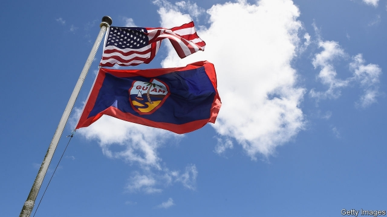

###### Pointillist power

# America’s hidden history of imperialism 

##### Daniel Immerwahr’s new book traces the rise and shrinking of an unheralded empire 

 

> Mar 14th 2019 

How to Hide an Empire: A History of the Greater United States. By Daniel Immerwahr. Farrar, Straus and Giroux; 528 pages; $30. Bodley Head; £25. 

THE UNITED STATES was born out of rebellion against imperial power. Yet it then amassed more of an empire than is commonly realised, including by Americans. Indeed the country’s history, according to Daniel Immerwahr’s lively new book, is a history of empire. 

Grasping that history means looking beyond today’s “logo map” of America, as Mr Immerwahr, a historian at Northwestern University, calls the country’s core. His focus is on the wider lands that have come under its control: the Greater United States. At various times this has included the Philippines (a colony from 1899 to 1946) and Puerto Rico (now a commonwealth), as well as American Samoa, Guam, the US Virgin Islands, Northern Marianas and myriad other territories around the world. 

This history is a drama in three acts. The first describes the amassing of “logo” America through westward expansion and the displacement of Native Americans. The story of the land-hungry country’s manifest destiny is well known but well told by Mr Immerwahr. 

Next, in act two, comes the annexing of other territories. In the 19th century a craze for guano for use as fertiliser leads to the occupation of dozens of uninhabited islands in the Caribbean and Pacific. Alaska is purchased. Military victories bring in the northern part of Mexico and then Spain’s overseas empire, including the Philippines, Puerto Rico, thousands of islands and 8.5m people, though at great cost. By one calculation, the fight for the Philippines claims more lives than the American civil war. With hostilities stretching from 1899 to 1913, it is America’s longest conflict save for the one that is still raging in Afghanistan today. The killing in the Philippines in the second world war is the most destructive event ever on American soil. 

At the end of that war the Greater United States contains some 135m people outside the mainland, more than the 132m living in the core country itself. However, except for a brief period of enthusiasm for empire around the turn of the 20th century, the country’s imperial reach is played down by its politicians. Unlike London, Washington is not festooned with grand offices to run the colonies. 

And then, in act three, something remarkable happens: America gives up territory. The population of American lands beyond the core states shrinks from 51% of the total in 1945 to 2% in 1960 (after Hawaii and Alaska join the union). These days, all the overseas territories add up to an area smaller than Connecticut. 

Why the retreat? Projecting power no longer requires going to the trouble of holding large amounts of land, often against the will of the local population. Instead, globalisation replaces colonisation. Thanks to aviation, logistical mastery and other world-shrinking innovations, America can substitute technology for territory. 

Not that holding territory is wholly irrelevant, even now. The superpower has roughly 800 overseas bases (compared with some 30 held by others in total); in Mr Immerwahr’s vivid formulation, its empire is now a “pointillist” one. The United States did not abandon empire, but “reshuffled its imperial portfolio, divesting itself of large colonies and investing in military bases, tiny specks of semi-sovereignty strewn around the globe”. 

Mr Immerwahr peppers his account with colourful characters and enjoyable anecdotes. This tale of territorial empire, he suggests, throws light on the histories of everything from the Beatles to Godzilla, the birth-control pill to the transistor radio—even on the use of the word “America”, which entered common parlance surprisingly late, spreading only after 1898. It also has darker sides: racism, the legal grey zone in which many overseas territories exist and the lack of full representation that still affects the 4m or so people living in them. Deadly impacts of empire, according to Mr Immerwahr, range from terrorism in retaliation against the presence of American bases to inadequate responses to disasters in places with second-class citizenship (such as the feeble reaction to the carnage wreaked by Hurricane Maria in Puerto Rico in 2017). 

He does not explore the implications of President Donald Trump’s back-to-the-core America First approach for the Greater United States. Nor does he dwell on the rise of a rival empire, which is famous for learning from the American experience. Some observers will look at the Belt and Road Initiative, and the occupation of islands in the South China Sea, and detect pointillism with Chinese characteristics. 

-- 

 单词注释:

1.pointillist['pwæntilist, 'pɔin-]:n. 点彩派画家, 分色主义画家 

2.imperialism[im'piәriәlizm]:n. 帝国主义, 帝制 [法] 帝国主义 

3.daniel['dænjәl]:n. 丹尼尔（男子名） 

4.unheralded[ʌnˈherəldɪd]:a. （艺术家、运动员等）被埋没的, 怀才未遇的; 出乎意料的；毫无先兆的 

5.Farrar['færә]:法勒(姓氏) 

6.Straus[straus]:施特劳斯(①姓氏 ②Oskar, 1870-1954, 生于奥地利的法国作曲家) 

7.giroux[]: [人名] 吉鲁 

8.Bodley['bɔdli]:n. <口>=Bodleian 

9.imperial[im'piәriәl]:a. 帝王的, 宗主国的, 至尊的, 壮丽的 n. 特等品 

10.amass[ә'mæs]:vt. 积聚, 堆积 

11.logo['lәugәu]:n. 连合活字, 商标, 徽标 [计] 徽标 

12.historian[hi'stɒ:riәn]:n. 历史学家, 记事者 

13.northwestern[.nɒ:θ'westәn]:a. 在西北部的, 西北方的, 来自西北的 

14.Philippine['filipi:n]:a. 菲律宾(群岛)的, 菲律宾人的 

15.Puerto[]:n. 垭口, 港口, 山口 n. (Puerto)人名；(西)普埃尔托 

16.rico[]:abbr. 反诈骗腐败组织集团犯罪法（Racketeer Influenced and Corrupt Organizations Act） 

17.commonwealth['kɔmәnwelθ]:n. 共和国；联邦；国民整体 

18.samoa[sә'mәuә]:n. 萨摩亚（南太平洋中部一群岛） 

19.Guam['gwɑ:m]:n. 关岛 

20.virgin['vә:dʒin]:n. 处女 a. 处女的, 贞洁的, 纯洁的, 初始的, 纯的 

21.marianas[,mæri'ɑ:nəz]:abbr. Mariana Islands 马里来纳群岛 

22.myriad['miriәd]:n. 无数, 无数的人(或物) a. 无数的, 种种的 

23.displacement[dis'pleismәnt]:n. 换置, 移位, 移动, 取代 [化] 顶替展开法 

24.manifest['mænifest]:n. 载货单, 运货单, 旅客名单 a. 显然的, 明白的 vi. 显示, 出现 vt. 表明, 表现, 证明 

25.destiny['destini]:n. 命运, 定数 

26.annex[ә'neks]:n. 附加物, 附属建筑物 vt. 附加, 盖(印), 并吞 

27.craze[kreiz]:n. 狂热, 大流行 v. (使)发狂, (使)开裂 

28.guano['gwɑ:nәu]:n. 海鸟粪, 鸟粪石, 鱼肥料 vt. 施海鸟肥料 

29.fertiliser['fә:tilaizә]:[化] 肥料 

30.uninhabited['ʌnin'hæbitid]:a. 无人居住的, 杳无人迹的 

31.Caribbean[.kæri'bi:әn]:n. 加勒比海 a. 加勒比海的, 加勒比人的 

32.Alaska[ә'læskә]:n. 阿拉斯加州 

33.oversea['әuvә'si:]:adv. 海外, 向国外, 向海外, 国外 a. 外国的, 在国外的, 在海外的, 舶来的 

34.hostility[hɒs'tiliti]:n. 敌意, 敌对, 反对 

35.Afghanistan[æf'gænistæn]:n. 阿富汗 

36.Washington['wɒʃiŋtn]:n. 华盛顿 

37.festoon[fes'tu:n]:n. 花彩 vt. 结彩于 

38.Hawaii[hә'waii:]:n. 夏威夷州, 夏威夷岛 

39.Connecticut[kә'netikәt]:n. 康涅狄格 

40.globalisation[,gləubəlai'zeiʃən]:n. 全球化, =globalization 

41.colonisation[,kɔlənai'zeiʃən]:n. 定殖；殖民地化；集群现象 

42.logistical[ lə'dʒɪstɪkl]:a. 逻辑的; 后勤方面的 

43.mastery['mɑ:stәri]:n. 征服, 统治权, 优势, 精通, 掌握 [法] 统治权, 控制权, 征服 

44.innovation[.inәu'veiʃәn]:n. 改革, 创新 [法] 创新, 改革, 刷新 

45.irrelevant[i'relәvәnt]:a. 不恰当的, 无关系的, 不相干的 [法] 无关的, 不相干的, 离题的 

46.superpower[.sju:pә'pauә]:n. 超级强权, 超级大国 [经] 超级大国 

47.formulation[.fɒ:mju'leiʃәn]:n. 系统陈述, 公式化, 配制 [化] 表述; 数学表述; 数式化; 数学表述 

48.pointillist['pwæntilist, 'pɔin-]:n. 点彩派画家, 分色主义画家 

49.reshuffle[ri:'ʃʌfl]:vt. 重新洗牌, 改组, 撤换 n. 重新洗牌, 改组, 撤换 

50.portfolio[pɒ:t'fәuliәu]:n. 皮包, 公文包, 部长职务, 有价证券财产目录, 艺术代表作选辑 [法] 公文包, 文件夹, 阁员职务 

51.divest[dai'vest]:vt. 使摆脱, 使脱去, 夺去 [经] 取消权力 

52.speck[spek]:n. 斑点, 有斑点的东西, 污点, 缺点, 微粒, 肥肉 vt. 使有斑点 

53.strew[stru:]:vt. 散播, 撒满 

54.colourful['kʌlәful]:a. 颜色丰富的, 鲜艳的, 艳丽的, 多色的, 丰富多彩的, 吸引人的, 引人入胜的 [计] 有色的 

55.territorial[.teri'tɒ:riәl]:a. 领土的, 土地的, 地方的, 区域性的 n. 本土自卫队队员 

56.beatles['bi:tlz]:n. 披头士合唱（摇滚乐队） 

57.godzilla[]:n. 哥斯拉（动画片名称） 

58.parlance['pɑ:lәns]:n. 说法, 说话的方式方法, 用语 [法] 说法, 用语, 发言 

59.racism['reisizm]:n. 种族主义, 种族偏见 [法] 种族主义, 种族歧视, 种族歧视主张 

60.representation[.reprizen'teiʃәn]:n. 表示法, 表现, 陈述, 代表 [计] 表示法指定 

61.terrorism['terәrizm]:n. 恐怖主义, 恐怖统治, 恐怖状态 [法] 胁迫, 暴政, 恐怖政治 

62.retaliation[ri.tæli'eiʃәn]:n. 报复 [法] 报仇, 报复, 回敬 

63.inadequate[in'ædikwәt]:a. 不充分的, 不适当的 [法] 不充分的, 不适当的 

64.citizenship['sitizәnʃip]:n. 国籍, 市民权, 市民的身份 [法] 公民权, 公民资格, 公民身分 

65.carnage['kɑ:nidʒ]:n. 大屠杀, 残杀 

66.wreak[ri:k]:vt. 发泄(怒火), 报仇 [法] 报仇, 报复, 施 

67.Maria[mә:'raiә, mә'riә]:n. 玛丽亚（女名） 

68.dwell[dwel]:vi. 居住, 居住(于), 存在(于) 

69.pointillism['pɒintilizm]:n. 点彩画法 

