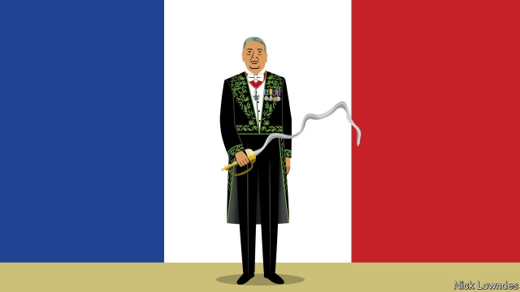

###### Johnson

# Languages are too big for academies to tame 

##### Members of the Académie française have swords but no power 

 

> Mar 14th 2019 

IT IS HARD to imagine now, but once upon a time a prominent writer in English envied the powerful role of an authoritarian French institution. The writer was Jonathan Swift, who in 1712 wrote to the Earl of Oxford that the “daily corruptions” of English were outpacing its “improvements”. The Académie française had been founded to stop exactly that process, and Swift called for an English Academy to do the same. 

In the centuries since, though, many Anglophone writers have been glad that Swift did not get his wish. There is no English Academy. This, allegedly, has let English flourish, promiscuously incorporating vocabulary from around the world, allowing the language, even the grammar, to develop organically. In this version of events, in the matter of language—as in economics and politics— the English are the liberals, while the French are the rigid statists, and French suffers as a result. 

Nonsense. Foreign journalists pay more heed to the Académie française than do the French themselves. It is an endless source of articles like those in recent weeks saying that the Académie will finally “allow” the feminisation of job titles. The sexism of masculine titles such as le président, le premier ministre and le docteur has troubled the country for decades. Traditionally, these had no feminine forms. On February 28th the Académie gave its blessing to feminine variants: la présidente, la première ministre and la docteure. 

This is all to the good, but it is a mistake to think of the Académie as “allowing” anything. Founded in 1634, it is certainly venerable. Its members, of whom there are only 40, are called les immortels; even some of France’s greatest literary luminaries have been denied entry to the club. Academicians wear special green-embroidered jackets and swords, and meet in the palatial rooms of the Institut de France. 

Swords they may have, but no power. As long ago as 1998 the government recognised those feminine job titles, and decreed that they be taught in schools. At the time the Académie strongly objected—and was ignored. Its work is strictly advisory; even then, it is not always the best source of counsel. Its dictionary—in theory the outfit’s premier product—is not considered France’s finest. The membership’s average age is in the 70s; only five of the members are women. 

That the Académie is at best aspirational—a source of guidance people might say they want but often cheerfully ignore—is better understood by the French than by outsiders. France Culture, a radio station, called the recent change of mind on gendered titles “a mea culpa rather than a revolution”. The Académie was behind the times, as even its own ruling acknowledged: its job is to observe “good usage” as already practised, and to recognise the language’s evolution, not to steer it. 

France has the best-known language academy, but not the only one. Italy’s is even older; countries from Spain to Sweden have academies too, others have bodies that perform a similar function. These institutions are not totally useless. Some elements of language can tolerate plenty of variation—words can have several meanings, grammar changes slightly over time, and it was ever thus. But sometimes standardisation is best, which is where academies can help. 

Take the tango of pronunciation and spelling. Always and everywhere, the sounds of words evolve; so every once in a while, official bodies step in to tidy up the orthography, getting rid of inconsistencies and silent letters, nativising foreign borrowings and so on. Traditionalists howl—this too is universal—but in most cases, the new spellings settle in without much fuss. In Europe in the 20th century alone, various spelling reforms affected the writing of Russian, German, Danish, Dutch and other tongues. 

But in other, deeper aspects of language, such as grammar, academies can at best slow natural developments that happen perpetually. Their blessing of a change usually amounts to a belated acceptance of a fait accompli. When academies claim the right to stop a socially or politically motivated update, they enter dangerous territory. Even if they maintain otherwise, their conservatism tends to be as much political as linguistic. 

A language is too big and diverse to be run by even the wisest group of overseers. Some deferential French people may say they want the guidance of their immortels. They fail to realise that another rule-making body wields the real power: the millions of ordinary French-speakers themselves. 

-- 

 单词注释:

1.johnson['dʒɔnsn]:n. 约翰逊（姓氏） 

2.authoritarian[ɒ:.θɒri'tєәriәn]:a. 独裁的, 独裁主义的 

3.jonathan['dʒɔnәθәn]:n. 乔纳森（男子名） 

4.earl[ә:l]:n. 伯爵 

5.Oxford['ɒksfәd]:n. 牛津, 牛津大学 

6.corruption[kә'rʌpʃәn]:n. 腐败, 堕落, 贪污 [计] 论误 

7.outpace[.aut'peis]:vt. 超过...速度, 赶过 

8.anglophone['æŋ^lәufәun]:n. 母语是英语者 

9.allegedly[ә'ledʒidli]:adv. 依其申述 

10.promiscuously[prə'mɪskjʊəslɪ]:adv. 杂乱地, 混杂地 

11.incorporate[in'kɒ:pәreit]:a. 合并的, 组成公司的, 一体化的 vt. 吸收, 合并, 使组成公司, 体现 vi. 合并, 混合, 组成公司 

12.organically[ɒ:'gænikli]:adv. 有机性地, 器官上地, 有组织地 

13.statist['steitist]:n. 统计学者, 中央集权论者 

14.heed[hi:d]:n. 注意, 留心 v. 注意, 留心 

15.feminisation[femɪnaɪ'zeɪʃn]: 雌化 

16.sexism['seksizm]:n. 性别歧视, 歧视女性 

17.masculine['mæskjulin]:n. 阳性, 男性 a. 男性的, 阳性的, 有丈夫气的 

18.LE[]:[计] 小于或等于 

19.ministre[]:[网络] 事工 

20.docteur[]:[网络] 博士 

21.traditionally[]:adv. 传统上；传说上；习惯上 

22.feminine['feminin]:a. 女性的, 阴性的, 柔弱的 [医] 女性的, 雌性的 

23.La[lɔ:, lɑ:]:[医] 镧(57号元素) 

24.venerable['venәrәbl]:a. 庄严的, 值得尊敬的 

25.luminary['lu:minәri]:n. 发光体, 杰出人物 

26.academician[ә.kædә'miʃәn]:n. 学会会员, 院士, 学究, 大学生, 学者 

27.palatial[pә'leiʃәl]:a. 宫殿似的, 宏伟的, 堂皇的, 庄严的 

28.institut[ɪnstɪ'tʌt]: [医]会，协会，研究所 

29.de[di:]:[化] 非对映体过量 [医] 铥(69号元素铥的别名,1916年Eder离得的假想元素) 

30.decree[di'kri:]:n. 法令, 判决, 天意 vt. 颁布, 判决 vi. 发布命令 

31.advisory[әd'vaizәri]:a. 顾问的, 咨询的, 劝告的 [法] 劝告的, 忠告的, 咨询的 

32.alway['ɔ:lwei]:adv. 永远；总是（等于always） 

33.counsel['kaunsәl]:n. 商议, 忠告, 法律顾问 v. 商议, 劝告 

34.cheerfully['tʃiәfuli]:adv. 高高兴兴地 

35.outsider[' aut'saidә]:n. 外人, 局外人, 非会员, 外行, 门外汉, 比赛中获胜可能性不大的选手 [经] 外船公司 

36.gender['dʒendә]:n. 性 vt. 产生 

37.mea[]:abbr. 维修工程分析（Maintenance Engineering Analysis）；β-巯基乙胺（β-Mercaptoethylamine）；沿航线最低高度（Minimum Enroute Altitude） 

38.culpa['kulpә, 'kʌl-]:[法] 过失, 疏忽, 过错 

39.Spain[spein]:n. 西班牙 

40.Sweden['swi:dn]:n. 瑞典 

41.standardisation[,stændədai'zeiʃən, -di'z-]:n. 标准化 

42.tango['tæŋgәu]:n. 探戈舞, 探戈舞曲 vi. 跳探戈舞 

43.orthography[ɒ:'θɒgrәfi]:n. 正确拼字, 拼字法, 正字法 

44.inconsistency[.inkәn'sistәnsi]:n. 不一致, 易变, 前后矛盾的事物 [法] 前后矛盾, 不一致 

45.borrowing['bɔrәuiŋ]:[经] 借款, 贷款 

46.traditionalist[]:n. 传统主义者, 因循守旧者 

47.fuss[fʌs]:n. 大惊小怪, 小题大作, 忙乱 vi. 无事自扰, 焦急, 焦燥, 忙乱 vt. 使激动, 使烦燥 

48.Danish['deiniʃ]:n. 丹麦文 a. 丹麦的, 丹麦人的, 丹麦文的 

49.Dutch[dʌtʃ]:n. 荷兰人, 荷兰语 a. 荷兰的 

50.perpetually[]:adv. 永恒地, 持久地 

51.belated[bi'leitid]:a. 迟来的 [法] 过了期的, 落后了的 

52.fait[]:[法] 契据, 事实, 行为 

53.accompli[]:n. 同谋者 [网络] 天拓；摩托罗拉天拓；天拓系列 

54.socially['sәuʃәli]:adv. 在社会上, 在社交上, 以社会生活方式 

55.politically[]:adv. 政治上 

56.update[ʌp'deit]:vt. 更新, 使现代化 n. 更新 [计] 更新 

57.conservatism[kәn'sә:vәtizәm]:n. 保守, 守旧性, 保守主义, [the]保守党的主张和政策, 保守党 [医] 保守性 

58.linguistic[liŋ'^wistik]:a. 语言的, 语言学的 [计] 语言的, 语言学的 

59.overseer[.әuvә'si:ә]:n. 监督, 工头 [经] 管理人, 监督, 盘工 

60.deferential[.defә'renʃәl]:a. 恭敬的 [医] 输精管的 

61.wield[wi:ld]:vt. 挥舞, 运用 

