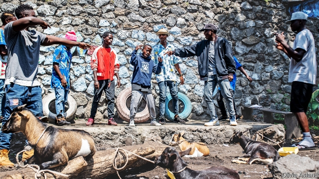

###### The ballad of King D

# Music therapy on the streets of Goma 

##### Three Congolese musicians teach struggling children to rap 

 

> Mar 14th 2019 

DANNY KUBUYA, also known as King D, takes to the stage wearing red sneakers and a blue cap turned backwards. He raps in Swahili. “If I were president, I would make those who have nothing feel valued.” “Yeah,” his backing group intone as they jiggle from side to side. “I would teach the people to look after our nation’s riches.” “Yeah,” repeat the boys behind him, slicing the air with outstretched fingers. “I would stop women from being raped.” The audience of three nod in approval. A goat, tied to a fallen tree trunk and scavenging for food in the dirt, bleats noisily. 

It is a Saturday afternoon in Goma, a town sandwiched between a lake and a volcano in embattled eastern Congo, and a local pop group called Life Song are halfway through teaching a rap lesson. Their 15 students are a mix of boys from their own run-down neighbourhood and children they have found listlessly roaming the streets. These homeless youngsters spend their nights curled up in doorways on folded cardboard boxes. Their stage is a slab of concrete in front of a half-painted wall, a collection of old car tyres propped up against it (see picture). 

At 12, Danny is the youngest, shortest and quietest of the boys off-stage, but oozes charisma on it. His swagger alone sets him apart from the rest. “We took him to one of our shows to perform with us and the audience loved him,” says Robert Rubenga, one of Life Song’s three members. “His lyrics are powerful.” 

That is partly because they are grounded in bitter experience. If Danny were president, he sings, he would plant more cassava so that nobody in Congo has to go hungry (some 15m across the country are severely underfed). He would bring electricity to a country where less than 1% of the rural population has electric light. He would stop the fighting in Rumangabo, a village where his aunt and cousins live that has been intermittently attacked by looting militia for over two decades. 

When Mr Rubenga first met Danny, he was trying to make money carrying bags for shoppers in a market close to the lake. High on glue, he was huddling with friends in an alley at night. He had fled his home after stealing $10 from his mother’s handbag, following orders from a local teenager whose gang he wanted to join. Terrified of his father’s temper, he took to the streets. “My mother forgave me but my father did not. I was scared,” he says. 

From the moment Danny uttered his first rap, Mr Rubenga saw his potential. He had been roaming one of the shabbiest bits of Goma with another band member, Etienne Hodari, when they encountered a posse of street kids. “First we bought them drinks and biscuits, then we sat in a circle and asked them to sing or rap something for us,” says Mr Rubenga. “They were not shy, they like to think of themselves as gangsters.” Danny started showing up to the weekly classes. 

The band can offer music lessons, but not much more, as they are strapped for cash and often go to bed hungry themselves. Their income from performing in bars and at local concerts is meagre; Irene Baeni, the group’s third and only female member, also sews and sells clothes to make ends meet. Though Congo is famous for producing talented musicians (and for its breezy rumba beats), earning a living in the industry is tough. Many stars are financed by wealthy political patrons. Before elections their music tends to turn into propaganda and be peppered with shout-outs to rich officials. 

Yet the country’s problems, exacerbated as they are by predatory and inept leaders, have provided inspiration for generations of lyricists. For their part, Life Song say they want to use music to “tap into people’s consciences”. One of their raps reminds the audience that those who sleep rough are really “just like us”. 

Danny no longer does. Over a number of rap classes, he began to confide in the band members. He eventually gave them his family’s address. After six months on the streets, Mr Rubenga escorted him home. “His mother was so happy when she opened the door, she was crying and crying. She had thought he was dead,” he remembers. In a region where children are killed or kidnapped by armed groups nearly every week, her fear was well-grounded. 

Life Song’s students turn their lives into rap. In the West that might be called music therapy; in Goma it amounts to three musicians and some scruffy boys, hopping around in black volcanic dust, watched by an audience of goats. But in a place where music is as ingrained as hardship and war, tunes with a message retain the power to inspire people and change lives. They might change more if the politicians paid heed to Danny’s rhymes. 

-- 

 单词注释:

1.ballad['bælәd]:n. 歌谣 

2.therapy['θerәpi]:n. 治疗 [医] 疗法, 治疗 

3.goma[]:abbr. general officer money allowance 将级军官货币津贴 

4.Congolese[,kɔŋ^ә'li:z]:n. 刚果人, 刚果语 a. 刚果的, 刚果语的, 刚果人的 

5.rap[ræp]:n. 轻敲, 拍击, 责骂, 无价值的东西 vt. 轻敲, 厉声说出, 叱责, 抢走, 使着迷 vi. 敲击, 发敲击声, 交谈, 同情 [计] 随机存取程序, 资源分配处理器, 常驻汇编程序 

6.Danny['dæni]:n. 丹尼（男子名, 等于Daniel） 

7.backwards['bækwәdz]:adv. 向后 

8.swahili[swɑ:'hi:li]:n. 斯瓦希里人；斯瓦希里语 

9.yeah[jɑ:]:adv. (非正式)是, 是的 

10.intone[in'tәun]:v. 吟咏 

11.jiggle['dʒigl]:v. (使)轻摇, (使)微动 n. 轻摇, 微动 

12.riche[]:n. 暴发户 

13.outstretched[.aut'stretʃt]:a. 伸开的, 扩张的, 延伸的 

14.rape[reip]:n. 抢夺, 掠夺, 强奸, 葡萄渣, 芸苔 vt. 掠夺, 抢夺, 强奸 

15.scaveng[s'kævɪŋ]:清除 

16.bleat[bli:t]:n. 羊的叫声 vi. 咩咩叫 vt. 以颤抖的声音说 

17.embattle[im'bætl]:vt. 列阵, 布阵, 整军备战, 严阵以待 

18.Congo['kɔŋ^әu]:n. 刚果, 刚果河, 工夫茶 [建] 刚果, 直接刚果红 

19.halfway['hɑ:f'wei]:a. 中途的, 不彻底的, 部分的 adv. 半路地, 在中途, 在半途 

20.listlessly['lɪstləslɪ]:adv. 无精打采地, 冷淡地 

21.roam[rәum]:v. 漫游, 闲逛, 徜徉 n. 漫步, 漫游 

22.homeless['hәumlis]:a. 无家的, 无养主的 

23.doorway['dɒ:wei]:n. 门口, 途径 

24.cardboard['kɑ:dbɒ:d]:n. 薄纸板 [化] 咭纸; 特等纸板; 卡纸板; 卡片纸板 

25.slab[slæb]:n. 平板, 厚片 vt. 切成厚板, 以平板盖上 

26.prop[prɒp]:n. 支柱, 支持者, 倚靠人, 道具, 螺旋桨 vt. 支撑, 维持 

27.Danny['dæni]:n. 丹尼（男子名, 等于Daniel） 

28.ooze[u:z]:n. 渗流, 分泌物 v. 渗出, 泄漏 

29.charisma[kә'rizmә]:n. 非凡的领导力, 神秘的个人魅力, 神授的能力 

30.swagger['swægә]:n. 大摇大摆, 吹牛, 妄自尊大, 威吓 vi. 虚张声势吓人, 大摇大摆, 吹牛 vt. 吓唬, 恫吓 a. 漂亮的, 时髦的 

31.Robert['rɔbәt]:[法] 警察 

32.lyric['lirik]:n. 抒情诗, 歌词 a. 抒情的 

33.cassava[kә'sɑ:vә]:n. 木薯 [医] 木薯 

34.underfed['ʌndә'fed]:underfeed的过去式和过去分词 

35.les[lei]:abbr. 发射脱离系统（Launch Escape System） 

36.Rumangabo[]:[地名] 鲁曼加博 ( 刚(金) ) 

37.intermittently[]:adv. 间歇地 

38.loot[lu:t]:n. 赃物, 洗劫, 抢夺 v. 洗劫, 抢夺 

39.militia[mi'liʃә]:n. 义勇军, 民兵组织, 国民军 

40.shopper['ʃɒpә]:n. 购物者 [经] 顾客, 购物的人 

41.huddle['hʌdl]:n. 杂乱一团, 混乱, 拥挤 vt. 把...挤在一起, 乱堆, 草率了事, 蜷曲 vi. 挤作一团, 蜷缩 

42.Etienne[]:n. 艾蒂安（比利时发明家） 

43.hodari[]:[网络] 霍达里 

44.posse['pɒsi]:n. 一队, 一团, 地方武装团队 [法] 可能性 

45.gangster['gæŋstә]:n. 流氓, 歹徒 [法] 暴徒, 恶棍, 打手 

46.meagre['mi:^ә(r)]:a. 瘦的, 不毛的, 贫乏的, 贫弱的, 少量的, 力量不够的, 质不高的, 量不足的 

47.Irene[ai'ri:n]:n. 和平女神 [化] 鸢尾烯 

48.talented['tælәntid]:a. 天资高的, 有才能的 

49.breezy['bri:zi]:a. 有微风的, 通风好的, 活泼的 

50.rumba['rʌmbә]:n. 伦巴舞 vi. 跳伦巴舞 

51.patron['peitrәn]:n. 赞助人, 顾客, 保护人 [法] 保护人, 庇护人, 赞助人 

52.propaganda[.prɒpә'gændә]:n. 宣传, 宣传活动 [医] 宣传 

53.exacerbate[ek'sæsәbeit]:vt. 使恶化, 使增剧, 激怒, 使加剧 

54.predatory['predәtәri]:a. 掠夺成性的, 捕食生物的, 掠夺的 [医] 捕食的 

55.inept[in'ept]:a. 不适当的, 不理智的, 笨拙的 [法] 不称职者, 无能的, 不符要求的 

56.inspiration[.inspә'reiʃәn]:n. 灵感, 鼓舞人心的人或物, 妙计, 吸气 [医] 吸[气] 

57.lyricist['lirisist]:n. 抒情诗人, 歌曲作者 

58.confide[kәn'faid]:vt. 吐露, 委托 vi. 信赖 

59.escort['eskɒ:t]:n. 护送者, 护卫者, 护航舰 vt. 护卫, 护送 

60.kidnap['kidnæp]:vt. 绑架, 诱拐, 拐骗 [法] 拐带, 诱拐, 绑架 

61.scruffy['skrʌfi]:a. 不整齐的, 肮脏的, 破旧的, 褴褛的 

62.hop[hɒp]:n. 单脚跳, 跳跃, 舞会, 飞行 vi. 单脚跳, 跳跃 vt. 跃过, 跳上, 加蛇麻子于, 服麻醉药 [计] 跳跃式传输 

63.volcanic[vɒl'kænik]:a. 火山的, 猛烈的 n. 火山岩 

64.ingrain[in'grein]:vt. 给原纱染色, 使根深蒂固 a. 原纱染色的, 根深蒂固的 n. 原纱染色, 固有品质 

65.heed[hi:d]:n. 注意, 留心 v. 注意, 留心 

