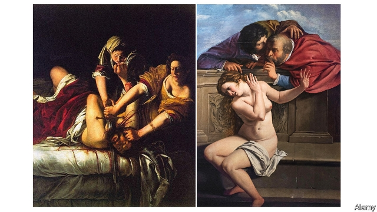

###### This soul of a woman

# Rediscovering Artemisia Gentileschi, four centuries on 

##### The artist’s voice is vividly captured in the transcript of her rapist’s trial 

 

> Mar 14th 2019 

TWO MEN, their cloaks billowing, peer over a wall at a bathing woman. The biblical story of Susanna and the Elders—in which the lechers threaten to tell her husband she has been unfaithful unless she has sex with them—was a popular subject for Baroque and Renaissance artists. Rubens, Tintoretto and Rembrandt all painted it. Their Susanna is a temptress; Artemisia Gentileschi’s version (pictured), which she painted in 1610 at the age of 17, is different. Susanna twists and shields her body, her face contorted in revulsion. 

The few women who painted professionally in her era mostly stuck to modest portraits and still lifes. Gentileschi demanded to be judged by the same artistic standards as men, depicting bold, often violent biblical scenes and female saints such as Mary Magdalene. As well as being the first female artist admitted to the Accademia delle Arti del Disegno in Florence, she was an astute negotiator. She was paid five times more than her collaborators for her part in a cycle of frescoes honouring Michelangelo. She painted her panel—which was on a ceiling—while pregnant. “I will show Your Most Illustrious Lordship what a woman can do,” she told a patron. 

Roughly 60 paintings attributed to Gentileschi survive, along with dozens of her letters. But her character is evoked most vividly in the transcript of a trial in Rome in 1612 (when she was 19), in which she recounts her rape by Agostino Tassi. Her father, Orazio, also an artist, had hired Tassi to teach her perspective. “He placed a hand…at my throat and on my mouth,” she tells the court. “I tried to scream as best I could.” 

A parade of witnesses denounce her as promiscuous. Two midwives examine her body in front of the judge. And, in a barbaric procedure deemed necessary to prove her honesty, cords are tightened around her fingers while she is questioned. “It is true, it is true, it is true,” she pleads, over and over again, until the torture ends. 

Gentileschi’s “Self-Portrait as St Catherine of Alexandria” was acquired last year by the National Gallery in London, becoming only the 21st work by a woman in a 2,300-piece collection. It was recently dispatched on a year-long tour of Britain. Letizia Treves, a curator at the gallery, insists Gentileschi’s work should not be viewed only through the prism of Tassi’s assault. The artist should not be defined by her rape, Ms Treves says, and so frozen in history as a victim. Still, the story of an ambitious woman who overcame sexual predation has bolstered her appeal in the #MeToo era. 

“Her voice in the court transcript is so bold, so forthright, that you immediately want to stage it,” says Ellice Stevens, co-author of “It’s True, It’s True, It’s True”, a play about Gentileschi’s travails that won awards at the Edinburgh Fringe Festival last year, transferred to London and will soon be staged elsewhere. In this telling, her life becomes a parable of sex and power, pain and revenge. She is both a great artist and a feminist hero. 

Her legend has come a long way in a short time. In “Artemisia”, a film released in 1997, Gentileschi is a headstrong young ingénue who falls for her teacher. During the trial—occasioned, in the movie, by Orazio’s fury that his daughter has engaged in sex out of wedlock—Tassi screams, “I love her.” (“Looking back,” Ms Stevens, the playwright, says of the film, “it’s inexcusable.”) In “Painted Lady”, a television series starring Helen Mirren released in the same year, a murder-mystery is constructed around Gentileschi’s ferocious painting, “Judith Beheading Holofernes” (above). In an experimental novel by Anna Banti, published in 1947, the Italian author wove the story of her own life in Nazi-occupied Florence with her mental image of Artemisia, “my companion from three centuries ago”. 

Relevant as Gentileschi’s biography now seems, some scholars are wary of the tendency to find echoes of 21st-century experience in a life lived 400 years ago. “We have to be careful not to confuse the women of the 17th century with feminists of today,” says Babette Bohn, an art historian at Texas Christian University. In Gentileschi’s time, for instance, rape was not viewed as a violation of a woman’s rights but as a matter of family honour. The trial in Rome came about because Orazio had petitioned the pope for compensation. His daughter was considered damaged goods. 

Yet a key feature of her story—the peril of reporting sexual violence—remains indubitably pertinent. “We still see all the same victim-blaming and character-assassination that Gentileschi faced,” says Joy McCullough, author of “Blood Water Paint”, a book about the artist for teenagers that was published last year. Sexual assault remains vastly underreported, in part because of a lack of trust in the authorities and fear of public humiliation. “Her story can give young people a language to face these issues,” Ms McCullough hopes. 

As Artemisia informs the audience at the end of “It’s True, It’s True, It’s True”, “the final pages of the court transcripts are missing.” Tassi, however, seems to have been found guilty. “He’s exiled from Rome,” Artemisia recounts, “for a while.” A favourite artist of successive popes, the real-life Tassi returned to work after a few months. 

But, as the heroine of the play explains, so did she. Gentileschi—who once declared in a letter, “You will find the spirit of Caesar in this soul of a woman”—moved to Florence. Married off to a mediocre artist, she nevertheless set up her own studio. The Medicis commissioned her; King Charles I bought one of her self-portraits. She worked in Naples and London. She became the great artist she always wanted to be. 

-- 

 单词注释:

1.rediscover[.ri:dis'kʌvә]:vt. 重新发现 

2.artemisia[,ɑ:ti'mi:ziә]:n. [植]艾属, 艾 

3.Gentileschi[]:n. (Gentileschi)人名；(意)真蒂莱斯基 

4.vividly[]:adv. 鲜艳, 强烈, 明亮, 鲜明, 活泼, 有生气, 生动, 清晰, 逼真 

5.transcript['trænskript]:n. 抄本, 副本, 成绩单 [法] 法院文本, 官方记录, 记录的副本 

6.billow['bilәu]:n. 巨浪 vi. 象巨浪般汹涌, 象巨浪般波动 vt. 使翻腾 

7.peer[piә]:n. 同等的人, 匹敌, 贵族 vi. 凝视, 窥视, 费力地看, 隐现 vt. 与...同等, 封为贵族 

8.BThE[]:[网络] 实际热效率 

9.biblical['biblikәl]:a. 圣经的 

10.Susanna[su:'zænə]:n. 苏珊娜（女子名） 

11.lecher['letʃә]:n. 好色之徒 

12.unfaithful[.ʌn'feiθful]:a. 不诚实的, 不忠实的 [法] 不正当的, 不信实的, 不正确的 

13.baroque[bә'rɒk]:n. 巴罗克风格, 巴罗克式 a. 巴罗克式的, 绮靡的, 以俗艳标新立异的 

14.renaissance[ri'neisәns]:n. 复活, 复兴, 文艺复兴 a. 文艺复兴的 

15.ruben['ru:bin]:n. 鲁本（男子名, 等于Reuben） 

16.Tintoretto[]:丁托列托（人名） 

17.Rembrandt['rembrænt]:伦布兰特(van Rijn [Ryn], 1609-1669, 荷兰画家) 

18.temptress['temptris]:n. 诱惑男人的女性 

19.contort[kәn'tɒ:t]:vt. 扭弯, 曲解 vi. 扭弯 

20.revulsion[ri'vʌlʃәn]:n. 剧变, 厌恶, 强烈反感 [医] 诱导法 

21.professionally[]:adv. 专业地；内行地 

22.lifes[]:n. 活体模型 

23.depict[di'pikt]:vt. 描述, 描写 

24.mary['meәri]:n. 玛丽（女子名） 

25.magdalene['mægdәli:n]:n. 从良的妓女 

26.accademia[]:[网络] 学院；学院美术馆；艺术学院 

27.delle[]:[医] 小凹(染色红细胞的中央透明区) 

28.arti[]:abbr. 美国国际搜救队（American Rescue Team International） 

29.DEL[del]:[计] 数据输入语言, 作废; DOS内部命令:从磁盘上删除一个或多个文件 

30.disegno[]:[网络] 设计；迪塞诺；新安琪儿 

31.Florence['flɒ:rәns]:n. 佛罗伦萨(意大利城市) 

32.astute[ә'stju:t]:a. 敏锐的, 狡猾的 

33.negotiator[ni'gәuʃieitә]:n. 磋商者, 交涉者, 议定者 [经] 谈判者, 交易者, 协商者 

34.collaborator[kә'læbәreitә]:n. 合干者, 合作者, 通敌者 [法] 合作者, 协助者, 勾结者 

35.fresco['freskәu]:n. 湿壁画, 湿壁画技法 vt. 作湿壁画于 

36.Michelangelo[.mi:kel'ɑ:ndʒelɒ:]:n. 米开朗琪罗 

37.illustrious[i'lʌstriәs]:a. 著名的, 辉煌的, 明亮的 

38.lordship['lɒ:dʃip]:n. 贵族身分, 主权, 支配 

39.patron['peitrәn]:n. 赞助人, 顾客, 保护人 [法] 保护人, 庇护人, 赞助人 

40.evoke[i'vәuk]:vt. 唤起, 引起, 召(魂) [法] 提审, 移送 

41.Rome[rәum]:n. 罗马 

42.recount[ri'kaunt]:vt. 详述, 叙述, 重新计算 n. 重新计算 

43.rape[reip]:n. 抢夺, 掠夺, 强奸, 葡萄渣, 芸苔 vt. 掠夺, 抢夺, 强奸 

44.agostino[]:[网络] 奥古斯丁；提诺；阿哥斯蒂诺 

45.tassi[]: [地名] [加蓬] 塔西 

46.orazio[]:[网络] 奥拉齐奥；威京森；也有再作德国猪脚 

47.denounce[di'nauns]:vt. 告发, 抨击, 谴责 [法] 谴责, 斥责, 告发 

48.promiscuous[prә'miskjuәs]:a. 杂乱的, 混杂的, 混淆的 

49.midwive[]:[网络] 助产士 

50.barbaric[bɑ:'bærik]:a. 野蛮的, 粗野的 

51.deem[di:m]:v. 认为, 相信 

52.tighten['taitn]:vt. 勒紧, 使变紧 vi. 变紧, 绷紧 

53.plead[pli:d]:vi. 辩护, 恳求 vt. 为...辩护, 提出...借口, 托称, 恳求 

54.ST[]:[计] 段表, 状态, 系统测试, 直端连接器 [化] 磺胺噻唑 

55.catherine['kæθәrin]:n. 轮圈外缘装有倒钩的车轮, 侧翻筋斗, 轮转烟火, 车轮窗 

56.alexandria[,æli^'zɑ:ndriә]:n. 亚历山大港（位于埃及）；亚历山大市（美国弗吉尼亚一城市）；亚历山大大帝 

57.dispatch[dis'pætʃ]:vt. 派遣 n. 派遣, 急件 [计] 调度 

58.letizia[]:[网络] 丝雅；莱蒂齐亚；西班牙王妃莱蒂西亚 

59.treve[]:休战；暂停, 暂息, 休止 

60.curator[kjuә'reitә]:n. 管理者, 经理, 主管人, 掌管者, 馆长, 大学学监, 监护人, 保护人 [经] 临时监护人 

61.prism['prizm]:n. 棱镜, 棱柱 [化] 棱镜 

62.assault[ә'sɒ:t]:n. 攻击, 袭击 vt. 袭击, 攻击 vi. 发动攻击 

63.ambitious[æm'biʃәs]:a. 有野心的, 抱负不凡的, 雄心勃勃的 

64.predation[pri'deiʃәn]:掠夺行为 

65.bolster['bәulstә]:n. 支持, 长枕 vt. 支持, 支撑 

66.metoo['metkəʊ]:adj. 〈美口〉行仿效计策的 v. 同意(对方的政见等) [网络] 咪兔；我也是；蜜桃 

67.forthright[fɒ:θ'rait]:adv. 直率地, 直接地, 马上, 立即 a. 直接的, 直率的, 坦白的 n. 直路 

68.ellice[]: [人名] [英格兰人姓氏] 埃利斯 Ellis的变体 

69.stevens['sti:vnz]:n. 史蒂文斯（姓氏） 

70.travail['træveil]:n. 分娩的痛苦, 阵痛, 辛劳 vi. 发生阵痛, 辛劳 

71.Edinburgh['edinbәrә]:n. 爱丁堡 

72.fringe[frindʒ]:n. 边缘, 端, 流苏, 穗, 初步 vt. 加穗于, 加饰边于 a. 边缘的, 附加的 

73.parable['pærәbl]:n. 寓言, 隐晦的比较 

74.feminist['feminist]:n. 男女平等主义者 

75.headstrong['hedstrɒŋ]:a. 顽固的, 刚愎的, 任性的 

76.fury['fjuri]:n. 愤怒, 狂暴, 狂怒的人 [医] 狂乱, 狂暴, 狂怒 

77.playwright['pleirait]:n. 剧作家 

78.inexcusable[.inik'skju:zәbl]:a. 没法辩解的, 不可宽赦的 

79.sery[]:n. (Sery)人名；(俄)谢雷；(科特)塞里 

80.helen['helәn]:n. 海伦（女子名, 火把、光亮的之义） 

81.Mirren[]:n. (Mirren)人名；(英)米伦 

82.ferocious[fә'rәuʃәs]:a. 残忍的, 凶猛的, 可怕的 

83.judith['dʒu:diθ]:n. 朱迪思（女子名） 

84.behead[bi'hed]:vt. 斩首, 砍头 

85.Holofernes[,hɔlәj'f\\:ni:z]:n. 荷罗孚尼(基督教《次经》故事人物) 

86.anna['ænә]:n. 安娜（女子名） 

87.Banti[]:班齐,班蒂 

88.wary['wєәri]:a. 谨慎的, 小心的, 机警的, 周到的, 唯恐的 

89.babette[bæ'bet]:n. 芭贝特（Elizabeth 的法语形式昵称, 女子名） 

90.bohn[]:n. (Bohn)人名；(英、法、德、葡、罗、匈、瑞典)博恩 

91.historian[hi'stɒ:riәn]:n. 历史学家, 记事者 

92.Texas['teksәs]:n. 德克萨斯 

93.violation[.vaiә'leiʃәn]:n. 违反, 违背, 妨碍 [法] 违犯, 违背, 违反 

94.petition[pi'tiʃәn]:n. 请愿, 诉状, 陈情书, 申请, 祈求, 祷文 v. 正式请求, 恳求, 请愿 

95.pope[pәup]:n. 罗马教皇, 主教 

96.compensation[.kɒmpen'seiʃәn]:n. 补偿, 赔偿金, 工资 [医] 代偿(机能), 补偿 

97.peril['peril]:n. 危险, 冒...之险, 险境, 险因 vt. 置...于险境, 冒险, 危及 

98.indubitably[]:adv. 不容置疑地, 明确地, 无疑地 

99.pertinent['pә:tinәnt]:a. 相关的, 中肯的, 切题的 [法] 恰当的, 有关的 

100.McCullough[]:麦卡洛（人名） 麦卡洛（地名） 

101.vastly['vɑ:stli]:adv. 广大地, 许多, 巨大 

102.underreported[]:[网络] 少报；低估；漏报 

103.humiliation[hju:.mili'eiʃәn]:n. 耻辱, 丢脸, 谦卑 

104.exile['eksail]:n. 放逐, 流放, 被放逐者 vt. 放逐, 流放, 使背井离乡 

105.Caesar['si:zә]:n. 恺撒, 暴君 

106.mediocre[.mi:di'әukә]:a. 不好不坏的, 通常, 平凡的 

107.Medicis[]:n. 梅第奇（姓氏） 

108.charle[]:n. 查理（男子名）；查理（姓氏） 

109.Naples['neiplz]:n. 那不勒斯 

110.alway['ɔ:lwei]:adv. 永远；总是（等于always） 

