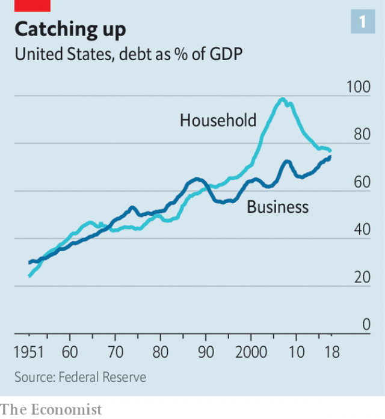
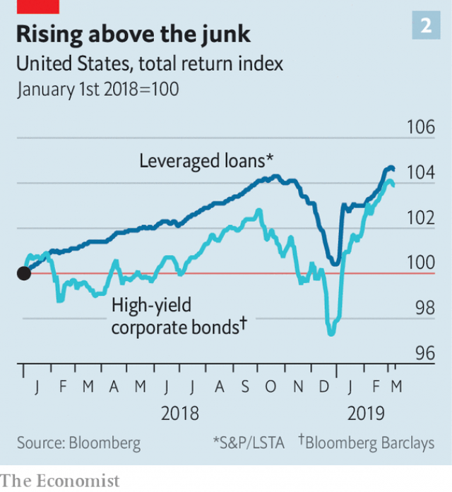
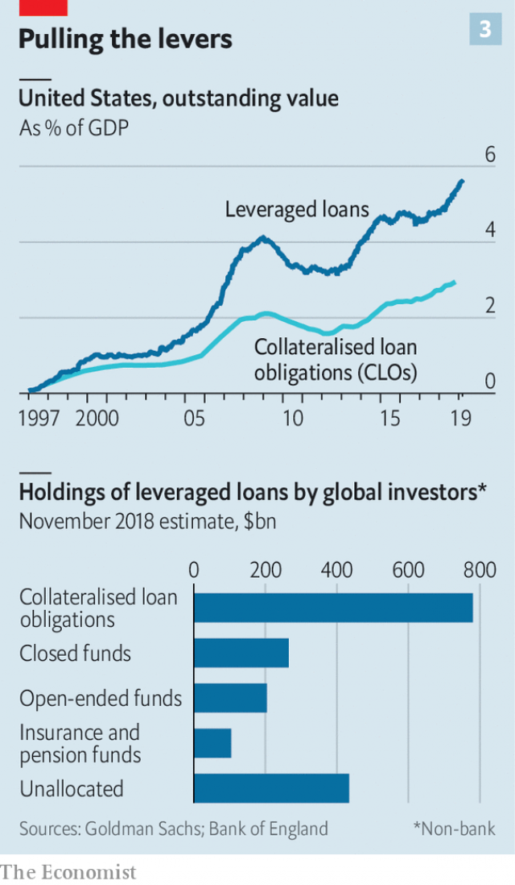

###### Carrying the weight

# Should the world worry about America’s corporate-debt mountain? 

##### It is not like the subprime crisis. But it could make the next recession worse 

 

> Mar 14th 2019 

AMERICAN HOUSEHOLD debt set off the global financial crisis in 2007. But for much of the subsequent recovery America has looked like a paragon of creditworthiness. Its households have rebuilt their balance-sheets; its firms have made bumper profits; and its government goes on providing the world’s favourite safe assets. If people wanted to look for dodgy debt over the past decade they had to look elsewhere: to Europe, where the sovereign debt crisis dragged on; to China, where local governments and state-owned firms have gorged themselves on credit; and to emerging markets, where dollar-denominated debts are a perennial source of vulnerability. 

Should they now look again at America? Household debt has been shrinking relative to the economy ever since it scuppered the financial system. But since 2012 corporate debt has been doing the opposite. According to the Federal Reserve the ratio of non-financial business debt to GDP has grown by eight percentage points in the past seven years, about the same amount as household debt has shrunk. It is now at a record high (see chart 1). 

This is not bad in itself. The 2010s have been a rosier time for firms than for households; they can afford more debt, and a world of low interest rates makes doing so attractive. Moreover the firms are not borrowing the money for risky investments, as they did when a craze for railway investments brought about America’s worst ever corporate-debt crisis in the 1870s. In aggregate they have just given money back to shareholders. Through a combination of buy-backs and takeovers non-financial corporations have retired a net $2.9trn of equity since 2012—roughly the same amount as they have raised in new debt. 

 

For all that, a heavy load of debt does leave companies fragile, and that can make markets jittery. In 2018 concerns about over-indebtedness began to show up in financial markets. The average junk-bond investor ended the year with less money than they had at the start of it (see chart 2)—only the second time this had happened since the financial crisis. In February Jerome Powell, the chair of the Fed, told Congress some corporate debt represented “a macroeconomic risk...particularly in the event of the economic downturn.” Might American firms have overdone it? 

 

Thanks to low interest rates and high profits, American companies are on average well able to service their debts. The Economist has analysed the balance sheets of publicly traded American non-financial firms, which currently account for two-thirds of America’s $9.6trn gross corporate non-financial debt. Their combined earnings before interest and tax are big enough to pay the interest on this mountain of debt nearly six times over. This is despite the fact that the ratio of their debt, minus their cash holdings, to their earnings before interest, tax, depreciation and amortisation (EBITDA) has almost doubled since 2012. 

But life is not lived on average. About $1trn of this debt is accounted for by firms with debts greater than four times EBITDA and interest bills that eat up at least half their pre-tax earnings. This pool of more risky debt has grown faster than the rest, roughly trebling in size since 2012. All told such debts are now roughly the same size as subprime mortgage debt was in 2007, both in absolute terms and as a share of the broader market in which it sits. 

That a trillion dollars might be at risk is not in itself all that worrying. The S&P 500 can lose well over that in a bad month; it did so twice in 2018. The problem with that $1trn of subprime debt was not its mere size; it was the way in which it was financed. Mortgages of households about which little was known were chopped up and combined into securities few understood. Those securities were owned through obscure chains by highly leveraged banks. When ignoring the state of the underlying mortgages became impossible, credit markets froze up because lenders did not know where the losses would show up. Big publicly traded companies are much less inscrutable. They have to provide audited financial statements. Their bonds are traded in public markets. Their debt does not look remotely as worrying, even if some firms are overextended. 

But there is a second way to cut a subprime-sized chunk of worry out of the corporate-debt mountain. This is to focus on the market for so-called “leveraged loans”, borrowing which is usually arranged by a group of banks and then sold on to investors who trade them in a secondary marketplace. Borrowers in this market range from small unlisted firms to big public companies like American Airlines. The stock of these loans has grown sharply in America over recent years (see chart 3). They now rival junk bonds for market size, and seem to have prospered partly at their expense. Unlike bonds, which offer a fixed return, interest rates on leveraged loans typically float. They thus appeal to investors as a hedge against rising interest rates. 

 

Europe has a leveraged-loan market, too, but at $1.2trn, according to the most commonly used estimate, America’s is about six times bigger. It is hard to judge the overlap between these leveraged loans and the debts of fragile public companies. But it exists. 

The rapid growth of leveraged loans is what most worries people about the growth in corporate debt. The list of policymakers to have issued warnings about them, as Mr Powell has done, include: Janet Yellen, his predecessor at the Fed; Lael Brainard, another Fed policymaker; the IMF; the Bank of England; and the Bank for International Settlements, the banker for central banks. On March 7th the Financial Times reported that the Financial Stability Board, an international group of regulators, would investigate the market. 

These worries are mostly based on three characteristics the growth in leveraged loans is held to share with the subprime-mortgage boom: securitisation, deteriorating quality of credit and insufficient regulatory oversight. 

The 2000s saw an explosion in the bundling up of securitised mortgages into collateralised debt obligations (CDOs) which went on to play an infamous role in the credit crunch. In this context the collateralised loan obligations (CLOs) found in the leveraged-loan market immediately sound suspicious. The people who create these instruments typically combine loans in pools of 100 to 250 while issuing their own debt to banks, insurers and other investors. These debts are divided into tranches which face varying risks from default. According to the Bank of England, nearly $800bn of the leveraged loans outstanding around the world have been bundled into CLOs; the instruments soak up more than half of the issuance of leveraged loans in America, according to LCD, the leveraged-loan unit of S&P Global Market Intelligence. 

For evidence of a deterioration in the quality of credit, the worriers point to the growing proportion of leveraged loans issued without “covenants”—agreements which require firms to keep their overall level of debt under control. So-called “covenant-light” loans have grown hand in hand with CLOs; today they make up around 85% of new issuance in America. 

There are also worries about borrowers increasingly flattering their earnings using so-called “add-backs”. For instance, a firm issuing debt as part of a merger might include the projected efficiency gains in its earnings before those gains materialise. When Covenant Review, a credit research firm, looked at the 12 largest leveraged buy-outs of 2018 it found that when such adjustments were stripped out of the calculations the deals’ average leverage rose from 6.1 times EBITDA to 8.7. 

Regulatory slippage completes the pessimistic picture. In 2013 American regulators issued guidance that banks should avoid making loans that would see companies’ debts exceed six times EBITDA. But this was thrown into legal limbo in 2017 when a review determined that the guidance was in fact a full-blown regulation, and therefore subject to congressional oversight. The guidance is now routinely ignored. The six-times earnings limit was breached in 30% of leveraged loans issued in 2018, according to LCD. 

In 2014 regulators drew up a “skin in the game” rule for CLOs—a type of regulation created by the Dodd-Frank financial reform of 2010 that requires people passing on risk to bear at least some of it themselves. But a year ago the skin-in-the-game rule for CLOs was struck down by the DC Circuit Court of Appeals. The court held that, since CLOs raise money first and only then buy up loans on behalf of the investors, they never really take on credit risk themselves. Their skin is safe before the game begins. 

Despite these three points of comparison, though, the leveraged-loan market does not really look like the subprime markets of the mid 2000s. CLOs have more in common with actively managed investment funds than with the vehicles that hoovered up mortgage debt indiscriminately during the mid-2000s. Those securities typically contained thousands of mortgages; those selling them on had little interest in scrutinising the details of their wares. The CLOs pool fewer debts, their issuers know more about the debtors and their analysts monitor the debts after they are bought. They need to protect their reputations. 

Unlike the racy instruments of the housing boom, which included securitisations-of-securitisations, CLOs have long been the asset of choice for investors wanting exposure to leveraged loans. And they have a pretty solid record. According to Goldman Sachs, a bank, in 2009 10% of leveraged loans defaulted, but top-rated CLO securities suffered no losses. The securitisation protected senior investors from the underlying losses, as it is meant to. 

And the rise in covenant-light lending “is not the same thing as credit quality deteriorating,” says Ruth Yang of LCD. It may just reflect the sort of investors now interested in the market. Leveraged loans are increasingly used as an alternative to junk bonds, and junk-bond investors think analysing credit risks for themselves beats getting a promise from the debtor. Ms Yang points out that loans that lack covenants almost always come with an agency credit rating, providing at least some degree of guaranteed oversight—if not, perhaps, enough for those badly burned by the failure of such ratings in the financial crisis. 

Even if these points of difference amount to nothing more than whistling in the dark, the prognosis would still not be too bad. America’s banks are not disturbingly exposed to leveraged loans. The Bank of England estimates that they provide only about 20% of CLO funds, with American insurers providing another 14%. It also notes that the banks’ exposures are typically limited to the highest-quality securities. The junior tranches of CLO debt—those that would suffer losses should defaults rise—are mostly held by hedge funds, credit investors and the CLO managers themselves. Even if a lot of them went bust all at once access to credit for the economy at large would be unperturbed. 

That said, defaults on loans are not the only way for corporate debt to upset the financial system. Take investment-grade corporate bonds. In 2012 about 40% of them, by value, were just one notch above junk status. Now around 50% are. Should these bonds be downgraded to junk—thus becoming “fallen angels”, in the parlance of debt markets—some investors, such as insurance firms, would be required by their mandates to dump them. One study from 2011 found that downgraded bonds which undergo such fire sales suffer median abnormal losses of almost 9% over the subsequent five weeks. 

Another possible source of instability comes from retail investors, who have piled into corporate debt in the decade since the crisis. Mutual funds have more than doubled the amount they have invested in corporate debt in that time, according to the Fed. The $2trn of corporate debt which they own is thought to include around 10% of outstanding corporate bonds; the IMF estimates that they own about a fifth of all leveraged loans. Exchange-traded funds (ETFs), which are similar in some respects to mutual funds but traded on stock exchanges, own a small but rapidly growing share of the high-yield bond market. 

In both sorts of fund investors are promised quick access to their money. And although investments in mutual funds are backed by assets, investors who know that the funds often pay departing investors out of their cash holdings have a destabilising incentive to be the first out of the door in a downturn. Some regulators fear that if ructions in the corporate-debt market spooked retail investors into sudden flight from these funds, the widespread need to sell off assets in relatively illiquid markets would force down prices, further tightening credit conditions. There is also a worry among some experts that the way in which middlemen, mostly banks, seek to profit from small differences in prices between ETFs and the securities underlying them could go haywire in a crisis. 

Neither a widespread plummeting of angels nor a rush to the exit by investors would come out of nowhere. The system would only be tested if it began to look as if more corporate debt was likely to turn sour. There are two obvious threats which might bring that about: falling profit margins and rising interest rates. 

Until recently, interest rates looked like the bigger worry. One of the reasons markets sagged in late 2018 was that the Fed was expected to continue increasing rates steadily in 2019. Credit spreads—the difference between what corporations and the government must pay to borrow—rose to their highest since late 2016. Leveraged loans saw their largest quarterly drop in value since 2011 and a lot of money was pulled out of mutual funds which had invested in them. By December new issuance had ground to a halt. 

But in January Mr Powell signalled that the central bank would put further rate rises on hold, and worries about indebtedness faded. Stocks recovered; credit spreads began falling, leveraged loans rallied strongly. In February CLO issuance exceeded its 12-month average, according to LCD. It no longer looks as if high interest rates will choke the supply of corporate credit in the near future. 

 

The more significant threat is now falling profit margins. Corporate-tax cuts helped the earnings per share of S&P 500 firms grow by a bumper 22% in 2018. But this year profits are threatened by a combination of wages that are growing more quickly and a world economy that is growing more slowly. Profit forecasts have tumbled throughout the first quarter; many investors worry that margins have peaked. Should the world economy continue to deteriorate, the picture will get still worse as America’s fiscal stimulus wears off. The most indebted businesses will begin to run into trouble. 

If the same growth in wages that squeezes profits leads the Fed to finally raise rates while the market is falling, the resulting economic squeeze would compress profit margins just as the cost of servicing debt rose. A wave of downgrades to junk status would spark a corporate-bond sell-off. The junior tranches of CLO debt would run into trouble; retail investors would yank their money from funds exposed to leveraged loans and corporate bonds. Bankruptcies would rise. Investment would drop, and so would the number of new jobs. 

That worst-case scenario remains mild compared with the havoc wrought by CDOs a little over a decade ago. But it illustrates the fragilities that have been created by the credit boom, and that America could soon once again face a debt-driven turn in the business cycle that is home grown. 

After all, though the current rise in corporate debt is not in itself a likely cause for a coming crash, the past suggests that it is an indicator both that a recession is on its way and of the damage it may do. Credit spreads have in general been shrinking, a quiet before the storm which tends to presage recession, though the link is far from certain. And recessions that come after borrowing rates have shot up tend to be worsened by that fact, perhaps because when people are lending a lot more they are, more or less by definition, being less choosy. In 2017 economists at the Bank of England studied 130 downturns in 26 advanced economies since the 1970s, and found that those immediately preceded by rapid private credit growth were both deeper and longer. That does not prove that the growth in purely corporate debt will be as damaging. But it is worth thinking on. 

-- 

 单词注释:

1.subprime[ˌsʌb'praɪm]:a. 准一流的, 近乎头等的; 准最低贷款利率的 

2.recession[ri'seʃәn]:n. 后退, 凹处, 衰退, 归还 [医] 退缩 

3.paragon['pærәgәn]:n. 杰出典范, 完人, 完美之物 

4.creditworthiness['kredɪtwɜ:ðɪnəs]:n. 商誉 

5.bumper['bʌmpә]:n. 缓冲器, 满杯 a. 大胜利的 

6.asset['æset]:n. 资产, 有益的东西 

7.dodgy['dɒdʒi]:a. 狡猾的, 逃避的, 难弄的 

8.sovereign['sɒvrin]:n. 元首, 独立国 a. 具有主权的, 至高无上的, 国王的, 完全的 

9.gorge[gɒ:dʒ]:n. 峡谷, 凹槽, 塞饱, 咽喉 vi. 狼吞虎咽 vt. 塞饱, 狼吞虎咽地吃 

10.perennial[pә'reniәl]:a. 常年的, 长期的, 反复的 [医] 多年生的 

11.vulnerability[.vʌlnәrә'biliti]:n. 易受伤, 易受责难, 易受伤部位 [医] 易损性 

12.scupper['skʌpә]:n. 甲板排水孔, 泄水口 

13.corporate['kɒ:pәrit]:a. 社团的, 合伙的, 公司的 [经] 团体的, 法人的, 社团的 

14.rosy['rәuzi]:a. 蔷薇色的, 玫瑰红色的 

15.risky['riski]:a. 危险的 

16.craze[kreiz]:n. 狂热, 大流行 v. (使)发狂, (使)开裂 

17.aggregate['ægrigәt]:n. 合计, 总计, 聚集体 a. 合计的, 聚集的 v. 聚集, 集合, 合计达 [计] 聚合体; 聚集 

18.shareholder['ʃєә.hәuldә]:n. 股东 [法] 股东, 股票持有人 

19.takeover[]:n. 接管, 接收 [经] 接收 

20.equity['ekwiti]:n. 公平, 公正 [经] 权益, 产权 

21.jittery['dʒitәri]:a. 极度紧张不安的 

22.investor[in'vestә]:n. 投资者 [经] 投资者 

23.les[lei]:abbr. 发射脱离系统（Launch Escape System） 

24.jerome[dʒә'rәum]:n. 杰罗姆（男子名） 

25.powell['pәuәl, 'pauәl]:n. 鲍威尔（英国物理学家） 

26.macroeconomic[-mik]:n. 整体经济 

27.downturn['dauntә:n]:n. (尤指经济方面的)衰退, 下降趋势 [电] 低迷时期 

28.overdo[.әuvә'du:]:vt. 做得过分, 过度, 夸张, 使过分劳累 vi. 过火 

29.economist[i:'kɒnәmist]:n. 经济学者, 经济家 [经] 经济学家 

30.currently['kʌrәntli]:adv. 现在, 当前, 一般, 普通 [计] 当前 

31.earning['ә:niŋ]:n. 收入（earn的现在分词） 

32.holding['hәuldiŋ]:n. 把持, 支持, 保持 [法] 租借地, 占有物, 拥有的财产 

33.depreciation[di.pri:ʃi'eiʃәn]:n. 价值减低, 减价, 跌落, 贬低, 折旧 [化] 折旧; 减值 

34.amortisation[ә,mɔ:tai'zeiʃən;-ti'z-]:n. 分期偿还, 摊还 

35.ebitda[]:abbr. earings before interest;  tax; earnings before interest;  taxes 

36.treble['trebl]:n. 最高声部, 三倍 a. 三倍的, 最高声部的 vt. 使增为三倍 vi. 成为三倍 

37.mortgage['mɒ:gidʒ]:n. 抵押, 约束性义务, 抵押借款 vt. 抵押, 以...作担保, 把...许给 

38.trillion['triljәn]:n. 大量 [经] 兆 

39.underlie[.ʌndә'lai]:vt. 位于...之下, 成为...的基础 

40.lender['lendә]:n. 出借人, 贷方 [经] 出借者, 贷方, 贷款人 

41.inscrutable[in'skru:tәbl]:a. 难以了解的, 不能预测的 [法] 不可理解的, 不可思议的, 不可测知的 

42.audit['ɒ:dit]:n. 审计, 查帐 vt. 查(帐), 旁听 vi. 查账 [计] 查帐; 审查; 检查 

43.remotely[]:adv. 极小地, 极细微地 

44.overextend[.әuvәrik'stend]:vt. 过分扩展, 过分延长 

45.chunk[tʃʌŋk]:n. 大块, 矮胖的人(或物) [经] 定样 

46.marketplace['mɑ:kit'pleis]:n. 市场 

47.borrower['bɒrәuә]:n. 借用人, 剽窃者 [经] 借款人, 借用人 

48.unlisted[.ʌn'listid]:a. 未编入册的, (证券等)未上市的 

49.prosper['prɒspә]:vi. 繁荣, 兴隆, 成功 vt. 使成功, 使昌盛 

50.typically['tipikәli]:adv. 代表性地；作为特色地 

51.overlap[.әuvә'læp]:n. 重叠, 重复, 部分的同时发生 vt. 重叠, 重复, 与...同时发生 vi. 迭盖, 部分的同时发生 [计] 重叠 

52.policymaker['pɔlisi.meikә]:n. 政策制定者；决策人 

53.JANET['dʒænit]:[计] 英国大学联合科学网 

54.yellen[]: [人名] 耶伦 

55.predecessor[.predi'sesә]:n. 前任, 先辈, 前身 [医] 初牙, 前辈, 祖先 

56.lael[]:n. 【女名】女子名 [网络] 小粽子；梦蕾；欢声雷动 

57.brainard[]:n. (Brainard)人名；(英)布雷纳德 

58.IMF[]:国际货币基金组织 [经] 国际货币基金 

59.banker['bæŋkә]:n. 银行家, 庄家 [经] 银行业者, 银行家 

60.regulator['regjuleitә]:n. 调整者, 校准者, 校准器, 调整器, 标准钟 [化] 调节剂; 调节器 

61.securitisation[si,kjurətai'zeiʃən]:n. 证券化 

62.deteriorate[di'tiәriәreit]:v. (使)恶化 

63.regulatory['regjulәtәri]:a. 受控制的, 统制的, 调整的 [经] 规则的 

64.oversight['әuvәsait]:n. 勘漏, 失察, 失败, 照料 [经] 监督权 

65.securitise[]:[网络] 政府当局安全化 

66.collateralised[]:[网络] 担保化 

67.cdo[]:abbr. 开发总监（Chief Development Officer）；债务抵押债券（Collateralized Debt Obligation）；协作数据对象（Collaboration Data Objects） 

68.crunch[krʌntʃ]:v. 嘎吱嘎吱的咬嚼, 压碎, 嘎吱嘎吱地踏过 n. 咬碎, 咬碎声 

69.context['kɒntekst]:n. 上下文, 背景, 来龙去脉 n. 上下文 [计] 上下文 

70.clo[klәu]:[医] 克漏(航空医学测量绝热的单位) 

71.insurer[in'ʃuәrә]:n. 保险公司 [法] 保险人, 承保人, 保险公司 

72.tranch[]:[网络] 串接；信用投资等级 

73.default[di'fɒ:lt]:n. 违约, 不履行责任, 缺席, 默认值 v. 疏怠职责, 缺席, 拖欠, 默认 [计] 默认; 默认值; 缺省值 

74.issuance['iʃjuәns]:n. 发行, 发布 [经] 发行, 发给 

75.LCD[]:液晶显示器 [计] 液晶显示器; 改变目录 

76.deterioration[di.tiәriә'reiʃәn]:n. 恶化, 衰退, 退化 [医] 变坏, 变质, 颓废, 衰退 

77.worrier['wʌriә]:n. 担心的人, 发愁的人 

78.flatter['flætә]:vt. 奉承, 阿谀, 使高兴 [机] 平面锤 

79.merger['mә:dʒә]:n. 合并, 归并 [经] 购并 

80.materialise[mә'tiәriәlaiz]:vi.vt. (使)物质化, (使)具体化, (使)追求物质利益, (使)显形, 成为事实, 实现 vi. 突然出现 

81.covenant['kʌvәnәnt]:n. 契约, 盟约 v. 立契约, 缔结盟约 

82.regulatory['regjulәtәri]:a. 受控制的, 统制的, 调整的 [经] 规则的 

83.slippage['slipidʒ]:n. 滑移, 滑动, 滑程 [经] 延误 

84.limbo['limbәu]:n. 地狱边缘, 监狱, 忘却 [法] 监狱, 拘禁, 忘却 

85.congressional[kәn'greʃәnl]:a. 会议的, 议会的, 国会的 [法] 代表大会的, 大会的, 议会的 

86.routinely[]:adv. 日常, 乏味, 常规, 例行 

87.breach[bri:tʃ]:n. 裂口, 违背, 破坏, 违反, 突破, 破裂 vt. 攻破, 突破 vi. 跳出水面 

88.DC[]:直流电 [计] 数据单元, 数据中心, 数据代码, 数据通信, 数据控制, 数字控制, 直流 

89.mid[mid]:a. 中间的, 中央的, 中部的 prep. 在...之中 

90.actively['æktivli]:adv. 活跃地, 积极地 

91.hoover['hu:vә]:n. 胡佛电动吸尘器 vi. 用真空吸尘器打扫 

92.indiscriminately[ˌɪndɪ'skrɪmɪnətlɪ]:adv. 无差别, 任意地; 不分青红皂白地; 滥; 不分皂白 

93.scrutinise[]:vt.vi. 细看, 仔细检查, 审查, 细阅 [经] 详细检查, 细细地看 

94.ware[wєә]:n. 物品, 器具, 货物, 商品, 陶器 vt. 留心, 小心 a. 知道的, 意识到的, 留神的 

95.issuer['iʃjuә]:n. 发行者 [法] 发行人, 发布人 

96.debtor['detә]:n. 债务人, 借主, 借方 [法] 负债者, 债务人, 借方 

97.analyst['ænәlist]:n. 分析者, 精神分析学家 [化] 分析员; 化验员 

98.racy['reisi]:a. 保持原味的, 活泼的, 生动的, 为竞赛设计的 

99.goldman[]:n. 高曼（姓氏） 

100.Sachs[zaks]:n. 萨克斯（汽车零配件生产厂商） 

101.clo[klәu]:[医] 克漏(航空医学测量绝热的单位) 

102.ruth[ru:θ]:n. 怜悯, 悲哀 

103.yang[jɑ:ŋ,jæŋ]:n. 杨（姓氏） 

104.covenant['kʌvәnәnt]:n. 契约, 盟约 v. 立契约, 缔结盟约 

105.alway['ɔ:lwei]:adv. 永远；总是（等于always） 

106.rating['reitiŋ]:n. 等级, 额定功率, 责骂 [经] 等级评定 

107.prognosis[prɒg'nәusis]:n. 预测, 预后 [医] 预后 

108.disturbingly[dis'tә:biŋli]:adv. 动摇地；令人不安地 

109.bust[bʌst]:n. 半身像, 胸部, 失败, 殴打 vt. 使爆裂, 使破产 vi. 爆裂, 破产 [计] 操作错 

110.unperturbed[.ʌnpә'tә:bd]:a. 未受扰乱的, 平静的, 镇定的 

111.notch[nɒtʃ]:n. 刻痕, 等级, 峡谷 vt. 刻凹痕, 用刻痕计算, 赢得 

112.statu[]:[网络] 状态查看；雕像；特级雪花白 

113.downgrade['dajn^reid]:vt. 降低, 贬低 n. 下坡 a. 下坡 adv. 下坡 

114.parlance['pɑ:lәns]:n. 说法, 说话的方式方法, 用语 [法] 说法, 用语, 发言 

115.mandate['mændeit]:n. 命令, 指令, 要求 vt. 委任统治 

116.median['mi:diәn]:a. 中央的, 中间的, 正中的 n. 正中动脉, 中位数, 中线 

117.instability[.instә'biliti]:n. 不安定, 不稳定 [医] 不稳定性 

118.etfs[]:abbr. ECM (electronic countermeasure) transmitter frequency setup 电子对抗发射机频率调定; ECM transmitter frequency setup 电子对抗发射机频率调定 

119.destabilise[di:'steɪbɪlaɪz]:vt. 破坏政府的稳定 

120.incentive[in'sentiv]:n. 动机 a. 激励的 

121.ruction['rʌkʃәn]:n. 吵闹, 骚动 

122.spook[spu:k]:n. 幽灵, 鬼 vt. 惊吓, 鬼怪般地出没 vi. 惊吓而逃窜, 受惊 

123.illiquid[i'likwid]:a. 不能立即兑现的, 无流动资金的 [经] 非流动(资金)的, 非现金的 

124.tighten['taitn]:vt. 勒紧, 使变紧 vi. 变紧, 绷紧 

125.middleman['midlmæn]:n. 中间人 [法] 调解人, 中间人, 中人 

126.haywire['heiwaiә]:[计] 临时的 

127.plummete[]:[网络] 直线下降 

128.sag[sæg]:vi. 下垂, 倾斜, 萎靡, 萧条, 变得乏味 vt. 使下垂 n. 下垂, 倾斜, 萧条 [计] 系统分析组, 语法分析生成程序, 电压下降 

129.indebtedness[in'detidnis]:[经] 负债, 债务 

130.rally['ræli]:n. 重振旗鼓, 集合, 群众集会, 跌停回升 v. 重整旗鼓, 集合, 恢复精神, 团结, 挖苦, 嘲笑 

131.quickly['kwikli]:adv. 很快地 

132.fiscal['fiskәl]:a. 财政的, 国库的 [经] 财政上的, 会计的, 国库的 

133.stimulus['stimjulәs]:n. 刺激, 激励, 刺激品 [医] 刺激特, 刺激 

134.indebted[in'detid]:a. 负债的, 受惠的 [法] 负债的, 法律上有义务偿还的 

135.yank[jæŋk]:v. 猛拉 

136.bankruptcy['bæŋkrәptsi]:n. 破产者 [经] 破产, 倒闭 

137.scenario[si'nɑ:riәu]:n. 剧本提纲, 情节, 剧本, 方案, 事态 [计] 方案 

138.havoc['hævәk]:n. 大破坏, 蹂躏 vt. 严重破坏 

139.fragility[frә'dʒiliti]:n. 脆弱, 虚弱 [化] 易碎性 

140.indicator['indikeitә]:n. 指示器, 指示剂, 指标 [计] 指示器 

141.presage['presidʒ]:n. 预感, 预兆, 预知 vt. 预示, 预言 vi. 预感, 预言 

142.worsen['wә:sn]:vt. 使更坏, 使恶化 vi. 变得更坏, 恶化 

143.choosy['tʃu:zi]:a. 慎重选择的, 好挑剔的 

144.economist[i:'kɒnәmist]:n. 经济学者, 经济家 [经] 经济学家 

145.precede[.pri:'si:d]:vt. 在...之前, 优于, 较...优先 vi. 在前面 

